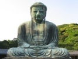

  
[Intangible Textual Heritage](../../index)  [Buddhism](../index.md) 
[Index](index)  [Previous](tbc09)  [Next](tbc11.md) 

------------------------------------------------------------------------

[Buy this Book at
Amazon.com](https://www.amazon.com/exec/obidos/ASIN/B002D48Q84/internetsacredte.md)

------------------------------------------------------------------------

  
*The Buddhist Catechism*, by Henry S. Olcott \[1908\], at Intangible
Textual Heritage

------------------------------------------------------------------------

p. 74 p. 75

### PART III.

### THE SANGHA.

256\. Q. *How do Buddhist Bhikkhus differ from the priests of other
religions?*

A. In other religions the priests claim to be intercessors between men
and God, to help to obtain, pardon of sins; the Buddhist Bhikkhus do not
acknowledge or expect anything from a divine power.

257\. Q. *But why then was it worth while to create this Order, or
Brotherhood, or Society, apart from the whole body of the people, if
they were not to do what other religious orders do?*

A. The object in view was to cause the most virtuous, intelligent,
unselfish and spiritual-minded persons in a country to withdraw from the
social surroundings where their sensual and other selfish desires were
naturally strengthened, devote their lives to the acquisition of the
highest wisdom, and fit themselves to teach and guide others out of the
pleasant path leading-towards misery, into the harder path that leads to
true happiness and final liberation.

p. 76

258\. Q. *Besides the Eight, what two additional observances are
obligatory upon the Bhikkhus?*

A. I observe the precept to abstain from dancing, singing and unbecoming
shows.

I observe the precept to abstain from receiving gold or silver.

The whole *Dasa*, or *Bhikkhu Sîla*, or Ten Precepts, are binding on
*all* Bhikkhus and Samaneras, or novices, but optional with lay
devotees.

The *Althanga Sîla* are for those who aspire to higher stages beyond the
heavenly regions, [\*](#fn_22.md) aspirants after
Nirvâṇa.

259\. Q. *Are there separate Rules and Precepts for the guidance and
discipline of the Order?*

A. Yes: there are 250, but all come under the following four heads

Principal Disciplinary Rules (*Pâtimokkha samvara sîla*).

Observances for the repression of the senses (*Indriya samvara sîla*).

Regulations for justly procuring and using food, diet, robes, &c.
(*Paccaya sannissita sîla*).

p. 77

Directions for leading an unblemished life (*Ajivapâri suddha sîla*).

260\. Q. *Enumerate some crimes and offences that Bhikkhus are
particularly prohibited from committing*.

A. Real Bhikkhus abstain from:

Destroying the life of beings;

Stealing;

False exhibition of "occult" powers to deceive anybody;

Sexual intercourse;

Falsehood;

The use of intoxicating liquors, and eating at unseasonable times;

Dancing, singing, and unbecoming shows; Using garlands, scents,
perfumes, etc.;

Using high and broad beds, couches or seats; receiving presents of gold,
silver, raw grain and meat, women and maidens, slaves, cattle,
elephants, etc.;

Defaming;

Using harsh and reproachful language; Idle talk;

Reading and hearing fabulous stories and tales Carrying messages to and
from laymen;

p. 78

Buying and selling;

Cheating, bribing, deception and fraud;

Imprisoning, plundering, and threatening others; and

The practice of certain specified magical arts and sciences, such as
fortune-telling, astrological predictions, palmistry, and other
sciences, that go under the name of magic. Either of these would retard
the progress of one who aimed at the attainment of Nirvâṇa.

261\. Q. *What are the ditties of Bhikkhus to the laity?*

A. Generally, to set them an example of the highest morality; to teach
and instruct them; to preach and expound the Law; to recite the
*Paritta* (comforting texts) to the sick, and publicly in times of
public calamity, when requested to do so; and unceasingly to exhort the
people to virtuous actions. They should dissuade them from vice; be
compassionate and tenderhearted, and seek to promote the welfare of all
beings.

262\. Q. *What are the rules for admission into the Order?*

A. The candidate is not often taken before his tenth

p. 79

year; he must have the consent of his parents; be free from leprosy,
boils, consumption and fits; be a free man; have no debts; and not be a
criminal or deformed or in the royal service.

263\. Q. *As a novice what is he called?*

A. *Samanera*, a pupil. [\*](#fn_23.md)

264\. Q. *At what age can a Samanera be ordained as Sranrana—monk?*

A. Not before his twentieth year.

265\. Q. When ready for ordination what happens?

A. At a meeting of Bhikkhus he is presented by a Bhikkhu as his
proposer, who reports that he is qualified, and the candidate says: "I
ask the Sangha, reverend Sirs, for the *Upasampada* (ordination)
ceremony, etc." His introducer then recommends that he be admitted. He
is then accepted.

266\. Q. *What then?*

A. He puts on the robes and repeats the Three Refuges (*Tisaraṇa*) and
Ten Precepts (*Dasa Sîla*).

267\. Q. *What are the two essentials to be observed?*

p. 80

A. Poverty and Chastity. A Bhikkhu before ordination must possess eight
things, *viz*., his robes, a girdle for his loins, a begging-bowl,
water-strainer, razor, needle, fan, sandals. Within limitations strictly
specified in the Vinâya, he may hold certain other-properties.

268\. Q. *What about the public confession of faults?*

A. Once every fortnight, a *Patimokka* (Disburdenment) ceremony is
performed, when every Bhikkhu confesses to the assembly such faults as
he has committed and takes such penances as may be prescribed.

269\. Q. *What daily routine must he follow?*

A. He rises before daylight, washes, sweeps the vihâra, sweeps around
the Bo-tree that grows near every vihâra, brings the drinking-water for
the day and filters it; retires for meditation, offers flowers before
the dagoba, or relic-mound, or before the Bo-tree; then takes his
begging-bowl and goes from house to house collecting food—which he must
not ask for, but receive in his bowl as given voluntarily by the
householders. He returns, bathes his feet and eats, after which he
resumes meditation.

270\. Q. *Must we believe that there is no merit in* 

p. 81

*the offering of flowers (mala pûja) as an act of worship?*

A. That act itself is without merit as a mere formality; but if one
offers a flower as the sweetest, purest expression of heartfelt
reverence for a holy being, then, indeed, is the offering an act of
ennobling worship.

271\. Q. *What next does the Bhikkhu do?*

A. He pursues his studies. At sunset he again sweeps the sacred places,
lights a lamp, listens to the instructions of his superior, and
confesses to him any fault he may have committed.

272\. Q. *Upon what are his four earnest meditations (Sati-patthânâ)
made?*

A. 1. On the body, *Kayânapassânâ*.

2\. On the feeling, *Vedanânupassanâ*.

3\. On the mind, *Chittânupassanâ*.

4\. On the doctrine, *Dhammânupassanâ*.

278\. Q. *What is the aim of the four Great Efforts (Samanappadhânâ)?*

A. To suppress one's animal desires and grow in goodness.

274\. Q. *For the perception by the Bhikkhu of the highest truth, is
reason said to be the best, or intuition?*

A. Intuition—a mental state in which any desired truth is
instantaneously grasped.

275\. Q. *And when can that development be reached?*

p. 82

A. When one, by the practice of Jñâna, comes to its fourth stage of
unfolding.

276\. Q. *Are we to believe that in the final stage of Jñâna, and in the
condition called Samâdhi, the mind is a blank and thought is arrested?*

A. Quite the contrary. It is then that one's consciousness is most
intensely active, and one's power to gain knowledge correspondingly
vast.

277\. Q. *Try to give me a simile*.

A. In the ordinary waking state one's view of knowledge is as limited as
the sight of a man who walks on a road between high hills; in the higher
consciousness of Jñâna and Samâdhi it is like the sight of the eagle
poised in the upper sky and overlooking a whole country.

278\. Q. *What do our books say about the Buddha's use of this faculty?*

A. They tell us that it was his custom, every morning, to glance over
the world and, by his divine (clairvoyant) sight, see where there were
persons ready to receive the truth. He would then contrive, if possible,
that it should reach them. When persons visited him he would look into
their minds, read their secret motives, and then preach to them
according to their needs.

------------------------------------------------------------------------

### Footnotes

[76:\*](tbc10.htm#fr_22.md) The Upûsakâ and Upâsika
observe these on the Buddhist Uposatha (Sabbath) days (In Sk.
*Upavasatha*). They are the 8th, 14th and 15th days of each half lunar
month.

[79:\*](tbc10.htm#fr_23.md) The relationship to his
Guru, or teacher, is almost like that of godson to godfather among
Christians, only more real, for the teacher becomes father, mother,
family and all to him.

------------------------------------------------------------------------

[Next: Part IV. The Rise and Spread of Buddhism](tbc11.md)

