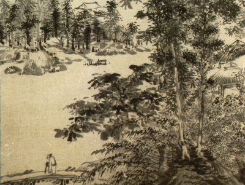

  
[Intangible Textual Heritage](../../index)  [Buddhism](../index.md) 
[Wisdom of the East](../../woe/index.md) 

------------------------------------------------------------------------

<table width="75%">
<colgroup>
<col style="width: 50%" />
<col style="width: 50%" />
</colgroup>
<tbody>
<tr class="odd">
<td width="50%" data-valign="TOP"></td>
<td width="50%" data-valign="CENTER"><h1 id="the-path-of-light" data-align="CENTER">The Path of Light</h1>
<h2 id="by-l.d.-barnett" data-align="CENTER">by L.D. Barnett</h2>
<h4 id="section" data-align="CENTER">[1909]</h4></td>
</tr>
</tbody>
</table>

------------------------------------------------------------------------

[Contents](#contents)    [Start Reading](tpol00.md)    [Page
Index](pageidx)    [Text \[Zipped\]](tpol.txt.gz.md)

------------------------------------------------------------------------

This is a translation of an important treatise of Mahayana Buddhism, the
Bodhicharyavatara of Santideva, part of the Wisdom of the East Series.
It includes a long introduction by the translator, Barnett, who
discusses the rise of Mahayana Buddhism, going into some depth about the
significance of these doctrines.

------------------------------------------------------------------------

 [Title Page](tpol00.md)  
[Contents](tpol01.md)  
[Editorial Note](tpol02.md)  
[Introduction](tpol03.md)  
[Chapter I. The Praise of the Thought of Enlightenment](tpol04.md)  
[Chapter II. The Confession of Sin](tpol05.md)  
[Chapter III. Taking the Thought of Enlightenment](tpol06.md)  
[Chapter IV. Heedfulness in the Thought of Enlightenment](tpol07.md)  
[Chapter V. Watchfulness](tpol08.md)  
[Chapter VI. The Perfect Long-Suffering](tpol09.md)  
[Chapter VII. The Perfect Strength](tpol10.md)  
[Chapter VIII. The Perfect Contemplation](tpol11.md)  
[Chapter IX. The Perfect Knowledge](tpol12.md)  
[Notes](tpol13.md)  
[Appendix](tpol14.md)  
