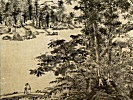
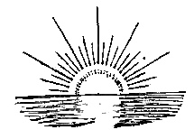

  
[Intangible Textual Heritage](../../index)  [Buddhism](../index.md) 
[Wisdom of the East](../../woe/index)  [Index](index)  [Next](tpol01.md) 

------------------------------------------------------------------------

  
*The Path of Light*, by L.D. Barnett, \[1909\], at Intangible Textual
Heritage

------------------------------------------------------------------------

The Wisdom of the East Series  
Edited by  
L. CRANMER-BYNG  
Dr. S. A. KAPADIA

THE PATH OF LIGHT

###### WISDOM OF THE EAST

# THE PATH OF LIGHT

##### RENDERED FOR THE FIRST TIME INTO ENGLISH FROM THE BODHICHARYĀVATĀRA OF ŚĀNTI-DEVA

##### A MANUAL OF MAHĀ-YĀNA BUDDHISM

## BY L. D. BARNETT, M.A., LITT. D.

 

#### NEW YORK

#### E. P. DUTTON AND COMPANY

#### \[1909\]

Scanned, proofed and formatted at Intangible Textual Heritage, February
2010, by John Bruno Hare. This text is in the public domain in the US
because it was published prior to 1923.

  [  
Click to enlarge](img/fcover.jpg.md)  
Front Cover  

  [  
Click to enlarge](img/title.jpg.md)  
Title Page  

PRINTED BY  
HAZELL, WATSON AND VINEY, LD.,  
LONDON AND AYLESBURY  
ENGLAND

------------------------------------------------------------------------

[Next: Contents](tpol01.md)

