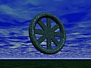

  
[Intangible Textual Heritage](../../index)  [Buddhism](../index.md) 
[Index](index)  [Previous](w2n08.md) 

------------------------------------------------------------------------

[Buy this Book at
Amazon.com](https://www.amazon.com/exec/obidos/ASIN/040460417X/internetsacredte.md)

------------------------------------------------------------------------

  
*The Way to Nirvana*, by L. de la Vallée Poussin, \[1917\], at
Intangible Textual Heritage

------------------------------------------------------------------------

p. 169

### INDEX

Aborigines [16](w2n03.htm#page_16.md)

*adhipatiphala* [100](w2n06.htm#page_100.md)

Agni [21](w2n03.htm#page_21), [23](w2n03.htm#page_23.md)

Agnosticism, [126](w2n07.htm#page_126), [130](w2n07.htm#page_130.md),
[133](w2n07.htm#page_133.md)

*ahiṃsā* [17](w2n03.htm#page_17.md)

Ajātaśatru [63](w2n05.htm#page_63.md)

Ajita kesakambali [62](w2n05.htm#page_62.md)

*amṛta* [9](w2n03.htm#page_9), [128](w2n07.htm#page_128.md)

*anāgāmin* [91](w2n06.htm#page_91.md)

Aṅgulimāla [90](w2n06.htm#page_90.md)

Animism [35](w2n04.htm#page_35.md)

Annihilation [45](w2n04.htm#page_45.md)

*antagrāhaparāmarśa* [131](w2n07.htm#page_131.md)

*antarābhava* [83](w2n06.htm#page_83.md)

Āryans [11](w2n03.htm#page_11), [16](w2n03.htm#page_16.md)

*asat* [21](w2n03.htm#page_21.md)

*aśubhabhāvanā* [156](w2n08.htm#page_156.md)

Asura [21](w2n03.htm#page_21.md)

*ātman* [26](w2n03.htm#page_26.md)

*avijñapti* [71](w2n05.htm#page_71.md)

 

Back (of the action) [72](w2n05.htm#page_72.md)

Barth (A.) [14](w2n03.htm#page_14), [15](w2n03.htm#page_15.md),
[28](w2n03.htm#page_28), [37](w2n04.htm#page_37.md),
[49](w2n04.htm#page_49), [50](w2n04.htm#page_50.md),
[161](w2n08.htm#page_161.md)

*bhājanaloka* [100](w2n06.htm#page_100.md)

*bhakti* [3](w2n03.htm#page_3), [59](w2n05.htm#page_59.md)

*bhāvanā* [156](w2n08.htm#page_156.md)

*bhavatṛṣṇā* [131](w2n07.htm#page_131.md)

*bhikṣutā* [74](w2n05.htm#page_74.md)

Birth (projection of a) [92](w2n06.htm#page_92.md); birth-consciousness
[54](w2n04.htm#page_54), [84](w2n06.htm#page_84.md),
[97](w2n06.htm#page_97.md)

Body [146](w2n08.htm#page_146.md)

Boyer (A. M.) [24](w2n03.htm#page_24.md)

Brahmā [104](w2n06.htm#page_104.md)

Brahmā's palace [104](w2n06.htm#page_104.md)

*brahmacarya* [141](w2n08.htm#page_141.md)

*brahman* [27](w2n03.htm#page_27.md)

Brahmans [18](w2n03.htm#page_18.md)

Brahmans and pravrajyā [150](w2n08.htm#page_150.md)

*buddha* [8](w2n03.htm#page_8.md)

Buddhism as a religion [30](w2n04.htm#page_30.md)

Butcher [71](w2n05.htm#page_71.md)

 

Cemeteries [158](w2n08.htm#page_158.md); men of cemeteries
[148](w2n08.htm#page_148), [158](w2n08.htm#page_158.md)

Child and girl [52](w2n04.htm#page_52.md)

Childers (R. C.) [123](w2n07.htm#page_123.md)

Compassion [99](w2n06.htm#page_99.md)

Confession [72](w2n05.htm#page_72.md)

Continuity [50](w2n04.htm#page_50.md)

Cosmogony [100](w2n06.htm#page_100.md)

Cow, cult of the [17](w2n03.htm#page_17.md); vow of
[147](w2n08.htm#page_147.md)

Creation [104](w2n06.htm#page_104.md)

Cultivation [156](w2n08.htm#page_156.md)

 

Davids (T. W. Rhys and Mrs) [8](w2n03.htm#page_8.md),
[9](w2n03.htm#page_9), [40](w2n04.htm#page_40), [44](w2n04.htm#page_44.md),
[48](w2n04.htm#page_48), [49](w2n04.htm#page_49.md),
[98](w2n06.htm#page_98), [104](w2n06.htm#page_104.md),
[118](w2n07.htm#page_118), [147](w2n08.htm#page_147.md),
[163](w2n08.htm#page_163.md)

Dead, cult of [11](w2n03.htm#page_11.md)

Death [83](w2n06.htm#page_83), [145](w2n08.htm#page_145.md)

Debts, four, [150](w2n08.htm#page_150.md); leaving one's debts behind
[91](w2n06.htm#page_91.md)

Dependent origination [81](w2n06.htm#page_81.md)

Desire and rebirth [64](w2n05.htm#page_64), [86](w2n06.htm#page_86.md)

Destiny [63](w2n05.htm#page_63), [94](w2n06.htm#page_94.md)

Devotee [74](w2n05.htm#page_74.md)

*dharma* [3](w2n03.htm#page_3.md)

*dhūtaguṇa* [148](w2n08.htm#page_148.md)

Dialectic [124](w2n07.htm#page_124.md)

Disciplines of salvation [1](w2n03.htm#page_1.md)

Doer [95](w2n06.htm#page_95), [97](w2n06.htm#page_97.md)

Duality [28](w2n03.htm#page_28.md)

*durgati* [77](w2n05.htm#page_77), [108](w2n07.htm#page_108.md)

Dying consciousness [86](w2n06.htm#page_86.md)

p. 170

Elements, four, [43](w2n04.htm#page_43), [62](w2n05.htm#page_62.md)

Emaciated Buddha [143](w2n08.htm#page_143.md)

Existence [51](w2n04.htm#page_51.md)

 

Faith [153](w2n08.htm#page_153.md)

Field (*kṣetra*) [78](w2n05.htm#page_78.md)

Fire-sermon [146](w2n08.htm#page_146.md)

Ford-makers [7](w2n03.htm#page_7), [140](w2n08.htm#page_140.md)

Four-branched dilemma [111](w2n07.htm#page_111.md)

Free will [96](w2n06.htm#page_96.md)

Fruit of ripening, fruit similar to action, fruit of mastery,
[92](w2n06.htm#page_92), [100](w2n06.htm#page_100.md)

 

*gandharva* [63](w2n05.htm#page_63),[85](w2n06.htm#page_85.md)

Ganges [62](w2n05.htm#page_62), [70](w2n05.htm#page_70.md)

Gift of *dharma* [99](w2n06.htm#page_99.md); gift of gold
[68](w2n05.htm#page_68); merit of gift [77](w2n05.htm#page_77.md)

Gods in Buddhism tot; Vedic [14](w2n03.htm#page_14.md)

*govrata* [147](w2n08.htm#page_147.md)

Gradual deliverance [123](w2n07.htm#page_123.md)

 

Henotheism [19](w2n03.htm#page_19.md)

Henry (V.) [22](w2n03.htm#page_22.md)

Heredity [88](w2n06.htm#page_88.md)

Hermits [148](w2n08.htm#page_148.md)

Hopkins (E. W.) [59](w2n05.htm#page_59.md)

Hypercosmical [7](w2n03.htm#page_7), [88](w2n06.htm#page_88.md),
[162](w2n08.htm#page_162.md)

 

Identity [50](w2n04.htm#page_50.md)

Immediate sins [90](w2n06.htm#page_90.md)

Immortality [9](w2n03.htm#page_9), [128](w2n07.htm#page_128.md)

Individual [41](w2n04.htm#page_41), [134](w2n07.htm#page_134.md)

Indo-Europeans [3](w2n03.htm#page_3), [11](w2n03.htm#page_11.md)

Indra [21](w2n03.htm#page_21), [73](w2n05.htm#page_73.md)

Insight [154](w2n08.htm#page_154.md)

Intermediary existence [54](w2n04.htm#page_54), [85](w2n06.htm#page_85.md)

Iranian gods [3](w2n03.htm#page_3.md)

Īśvara [103](w2n06.htm#page_103.md)

 

Jains [9](w2n03.htm#page_9), [67](w2n05.htm#page_67.md),
[147](w2n08.htm#page_147.md)

Jātakas [46](w2n04.htm#page_46.md)

Jaṭilas [65](w2n05.htm#page_65.md)

*jina* [98](w2n06.htm#page_98.md)

*jīva* [26](w2n03.htm#page_26), [126](w2n07.htm#page_126.md)

Jīvā [109](w2n07.htm#page_109.md)

*jīvanmukta* [28](w2n03.htm#page_28), [119](w2n07.htm#page_119.md)

 

Kāla [22](w2n03.htm#page_22.md)

Kāma [2](w2n03.htm#page_2.md)

Karman [57](w2n05.htm#page_57); migration of [49](w2n04.htm#page_49.md)

*kramamukti* [123](w2n07.htm#page_123.md)

*kṛtsnāyatana* [163](w2n08.htm#page_163.md)

*kuśala* [76](w2n05.htm#page_76.md)

 

Life [82](w2n06.htm#page_82.md)

Loathsomeness (meditation on) [156](w2n08.htm#page_156.md)

lokāyata [61](w2n05.htm#page_61.md)

lokottara [7](w2n03.htm#page_7), [88](w2n06.htm#page_88.md),
[162](w2n08.htm#page_162.md)

Mahākāśyapa [147](w2n08.htm#page_147.md)

Mahāyāna [6](w2n03.htm#page_6), [23](w2n03.htm#page_23.md),
[123](w2n07.htm#page_123.md)

Mallikā [75](w2n05.htm#page_75.md)

Māluṅkyāputta [128](w2n07.htm#page_128.md)

Māra [102](w2n06.htm#page_102.md)

mārga [4](w2n03.htm#page_4.md)

Materialists [61](w2n05.htm#page_61.md)

Mātṛceṭa [111](w2n07.htm#page_111.md)

Maudgalyāyana [9](w2n03.htm#page_9.md)

Mental organ [39](w2n04.htm#page_39.md)

Merit [72](w2n05.htm#page_72), [77](w2n05.htm#page_77.md),
[78](w2n05.htm#page_78.md)

Middle path [144](w2n08.htm#page_144.md)

Migration of *karman* [49](w2n04.htm#page_49.md)

Milinda [41](w2n04.htm#page_41), [146](w2n08.htm#page_146.md)

Milk and curds [51](w2n04.htm#page_51.md)

Milton [121](w2n07.htm#page_121.md)

Mistakes, the four [152](w2n08.htm#page_152.md)

*mithyādṛṣṭi* [46](w2n04.htm#page_46), [76](w2n05.htm#page_76.md)

Momentaneity [44](w2n04.htm#page_44), [51](w2n04.htm#page_51.md)

Moralism [100](w2n06.htm#page_100.md)

Morality [73](w2n05.htm#page_73), [99](w2n06.htm#page_99.md)

Müller (Max) [19](w2n03.htm#page_19), [124](w2n07.htm#page_124.md)

Muni [142](w2n08.htm#page_142), [143](w2n08.htm#page_143.md)

Murder [52](w2n04.htm#page_52), [71](w2n05.htm#page_71.md)

 

Nāgasena [41](w2n04.htm#page_41), [146](w2n08.htm#page_146.md)

*nairātmya* [34](w2n04.htm#page_34), [55](w2n04.htm#page_55.md)

Nanda [79](w2n05.htm#page_79.md)

nāstika [60](w2n05.htm#page_60.md)

p. 171

Nihilism [152](w2n08.htm#page_152.md)

 

Oldenberg (H.) [13](w2n03.htm#page_13), [16](w2n03.htm#page_16.md),
[75](w2n05.htm#page_75), [116](w2n07.htm#page_116.md),
[142](w2n08.htm#page_142), [155](w2n08.htm#page_155.md)

Oltramare (P.) [18](w2n03.htm#page_18.md)

Omniscience [127](w2n07.htm#page_127), [156](w2n08.htm#page_156.md)

Organs [39](w2n04.htm#page_39.md)

Origination of cognition [39](w2n04.htm#page_39.md)

 

Parents [61](w2n05.htm#page_61), [78](w2n05.htm#page_78.md)

Patience [99](w2n06.htm#page_99.md)

Penance [70](w2n05.htm#page_70), [142](w2n08.htm#page_142.md)

Personality of reward [47](w2n04.htm#page_47.md)

Pessimism [108](w2n07.htm#page_108), [121](w2n07.htm#page_121.md),
[132](w2n07.htm#page_132.md)

Philosophasters [61](w2n05.htm#page_61.md)

Pischel (R.) [75](w2n05.htm#page_75), [123](w2n07.htm#page_123.md)

Plato [43](w2n04.htm#page_43), [69](w2n05.htm#page_69.md)

Poor and sick [78](w2n05.htm#page_78.md)

Pragmatism [135](w2n07.htm#page_135.md)

Prajāpati [21](w2n03.htm#page_21), [142](w2n08.htm#page_142.md)

*prāṇa* [35](w2n04.htm#page_35.md)

Premeditation [72](w2n05.htm#page_72.md)

Preparation (of *karman*) [72](w2n05.htm#page_72.md)

Principal action [72](w2n05.htm#page_72.md)

Profound sleep [109](w2n07.htm#page_109.md)

*pudgalavāda* [134](w2n07.htm#page_134.md)

*pūjā* [3](w2n03.htm#page_3.md)

*punarmṛtyu* [25](w2n03.htm#page_25.md)

Puṇṇā [9](w2n03.htm#page_9.md)

Purāṇa kassapa [63](w2n05.htm#page_63.md)

Purifications [70](w2n05.htm#page_70), [73](w2n05.htm#page_73.md)

*puruṣa* [26](w2n03.htm#page_26), [37](w2n04.htm#page_37.md)

 

Rationalism [32](w2n04.htm#page_32), [139](w2n08.htm#page_139.md)

Receptacle world [101](w2n06.htm#page_101), [104](w2n06.htm#page_104.md)

Re-death [25](w2n03.htm#page_25.md)

Reincarnation [54](w2n04.htm#page_54), [84](w2n06.htm#page_84.md)

Ripening of action [88](w2n06.htm#page_88.md)

Rishi [71](w2n05.htm#page_71.md)

rūpa [40](w2n04.htm#page_40), [71](w2n05.htm#page_71.md)

 

Sacrifice [21](w2n03.htm#page_21), [22](w2n03.htm#page_22.md),
[73](w2n05.htm#page_73.md)

Saint [113](w2n07.htm#page_113), [153](w2n08.htm#page_153.md)

Śakuntalā [102](w2n06.htm#page_102.md)

Sāṃkhya [7](w2n03.htm#page_7), [37](w2n04.htm#page_37.md),
[116](w2n07.htm#page_116.md)

*saṃkrama* [48](w2n04.htm#page_48.md)

*saṃsāra* [25](w2n03.htm#page_25.md)

*saṃtāna* [51](w2n04.htm#page_51), [97](w2n06.htm#page_97.md)

*saṃvara* [94](w2n06.htm#page_94.md)

Śāriputra [9](w2n03.htm#page_9.md)

sat [21](w2n03.htm#page_21.md)

Śatakratu [73](w2n05.htm#page_73.md)

*satkāyadṛṣṭi* [46](w2n04.htm#page_46.md)

*sattvaloka* [101](w2n06.htm#page_101.md)

Self-love [75](w2n05.htm#page_75.md)

Series [51](w2n04.htm#page_51), [97](w2n06.htm#page_97.md)

*śīlavrataparāmarśa* [74](w2n05.htm#page_74), [145](w2n08.htm#page_145.md)

Similes:

Chariot [41](w2n04.htm#page_41.md)

Child and girl [52](w2n04.htm#page_52.md)

Fire [69](w2n05.htm#page_69.md)

Fire in a jungle [53](w2n04.htm#page_53.md)

Flavour of salt [110](w2n07.htm#page_110.md)

Leaves of the Siṃśapā grove [127](w2n07.htm#page_127.md)

Lump of salt [89](w2n06.htm#page_89.md)

Milk and curds [51](w2n04.htm#page_51.md)

Physician [136](w2n07.htm#page_136.md)

Poisoned arrow [129](w2n07.htm#page_129.md)

Potter's wheel [28](w2n03.htm#page_28.md)

Seed dyed a certain colour [87](w2n06.htm#page_87.md)

Shoes [151](w2n08.htm#page_151.md)

Telephone [49](w2n04.htm#page_49.md)

Tigress [137](w2n07.htm#page_137.md)

Sin [46](w2n04.htm#page_46), [69](w2n05.htm#page_69.md),
[74](w2n05.htm#page_74), [83](w2n06.htm#page_83.md),
[89](w2n06.htm#page_89.md)

*skandhas* [35](w2n04.htm#page_35), [40](w2n04.htm#page_40.md),
[44](w2n04.htm#page_44.md)

Soma (Haoma) [19](w2n03.htm#page_19), [22](w2n03.htm#page_22.md),
[23](w2n03.htm#page_23.md)

Spinoza [5](w2n03.htm#page_5.md)

Subtle body [35](w2n04.htm#page_35), [39](w2n04.htm#page_39.md)

Sūfi [5](w2n03.htm#page_5.md)

Suicide [147](w2n08.htm#page_147.md)

Sun and Sungod [101](w2n06.htm#page_101.md)

*śūnyāgāra* [152](w2n08.htm#page_152.md)

Superstition [74](w2n05.htm#page_74.md)

*svabhāva* [100](w2n06.htm#page_100.md)

Svayambhū [21](w2n03.htm#page_21.md)

 

Taine [38](w2n04.htm#page_38), [75](w2n05.htm#page_75.md)

*tapas* [70](w2n05.htm#page_70), [142](w2n08.htm#page_142.md)

Thomas (E. J.) [43](w2n04.htm#page_43), [106](w2n06.htm#page_106.md)

p. 172

*tīrtha* [7](w2n03.htm#page_7), [140](w2n08.htm#page_140.md)

Totemism [18](w2n03.htm#page_18.md)

Trance [160](w2n08.htm#page_160.md)

Transfer of merit [33](w2n04.htm#page_33.md)

Transitoriness [44](w2n04.htm#page_44.md)

Transmigration [6](w2n03.htm#page_6.md)

Truths, the four [152](w2n08.htm#page_152.md)

 

*ucchedadṛṣṭi* [45](w2n04.htm#page_45), [51](w2n04.htm#page_51.md),
[136](w2n07.htm#page_136.md)

Unbelievers [60](w2n05.htm#page_60.md)

Unintentional murderer [69](w2n05.htm#page_69.md)

Upaniṣads [7](w2n03.htm#page_7), [63](w2n05.htm#page_63.md),
[75](w2n05.htm#page_75), [140](w2n08.htm#page_140.md),
[156](w2n08.htm#page_156.md)

Upāsaka [74](w2n05.htm#page_74.md)

 

Vāc [24](w2n03.htm#page_24.md)

Varuṇa [13](w2n03.htm#page_13), [20](w2n03.htm#page_20.md)

*vāsanā* [71](w2n05.htm#page_71.md)

Vedānta [7](w2n03.htm#page_7), [37](w2n04.htm#page_37.md),
[116](w2n07.htm#page_116), [125](w2n07.htm#page_125.md)

Vedic gods [14](w2n03.htm#page_14.md)

*vibhavatṛṣṇā* [131](w2n07.htm#page_131.md)

Vinaya [148](w2n08.htm#page_148.md)

*visaṃyogaphala* [88](w2n06.htm#page_88.md)

Viśvakarman [21](w2n03.htm#page_21.md)

*vītarāga* [155](w2n08.htm#page_155.md)

Volition [68](w2n05.htm#page_68.md)

Vows of religion [71](w2n05.htm#page_71.md)

 

Warren (H. C.) [48](w2n04.htm#page_48.md)

Whole and parts [42](w2n04.htm#page_42.md)

Widows [59](w2n05.htm#page_59.md)

Wrong view [46](w2n04.htm#page_46), [76](w2n05.htm#page_76.md)

 

Yajña [3](w2n03.htm#page_3.md)

Yājñavalkya [64](w2n05.htm#page_64.md)

*yakṣa* [15](w2n03.htm#page_15.md)

Yama [13](w2n03.htm#page_13), [46](w2n04.htm#page_46.md)

*yāna* [4](w2n03.htm#page_4.md)

Yoga [7](w2n03.htm#page_7.md)

 

 

 
