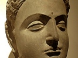

  
[Intangible Textual Heritage](../../index)  [Buddhism](../index.md) 
[Index](index)  [Previous](wov23)  [Next](wov25.md) 

------------------------------------------------------------------------

[Buy this Book at
Amazon.com](https://www.amazon.com/exec/obidos/ASIN/B0025VLT8O/internetsacredte.md)

------------------------------------------------------------------------

  
*The Buddha's Way of Virtue*, by W.D.C Wagiswara and K.J. Saunders,
\[1920\], at Intangible Textual Heritage

------------------------------------------------------------------------

p. 62

### § XX

#### THE PATH

Happiness is for Gautama, as for
Aristotle, "the bloom upon virtue." The path which leads to the Supreme
Bliss is the path of morality defined as the Noble Eightfold Path. If a
man follow this, he is happy here and hereafter.

It consists of:

Right Views,

Right Aspirations,

Right Speech,

Right Action,

Right Livelihood,

Right Effort,

Right Mindfulness,

Right Contemplation.

\[paragraph continues\] This is described
by Gautama as a Middle Path between the extreme of sensuality on the one
hand and asceticism on the other; or between superstitious credulity and
sceptical materialism. It is a truly noble ideal: yet one must never
forget that "Righteousness" throughout is Buddhistically defined: *e.g.*
"Right Views"

p. 63

means a correct grasp of the Buddhist teaching that all is transient,
all is sorrowful, all is unreal. Again, "Right Contemplation" is the
practice of Samādhi, concentration of the mind upon Buddhist ideas, such
as the above. The highest "Livelihood," again, is to live upon the alms
of the faithful.

273\. Best of paths is the Eightfold; the four truths are the best of
truths: purity is the best state; best of men is the seer.

274\. This is the way; there is none other that leads to the seeing of
Purity (Nirvāna.) Do you follow this path: that is to befool Mara.

275\. Travelling by this way you'll end your grief: it is the way I
preached when I learnt to throw off my bonds.

276\. ’Tis you who must strive: the Blessed Ones are only preachers.
They who strive and meditate are freed from Mara's bonds.

277\. "All is passing": when one sees and realises this, he sits loose
to this world of sorrow: this is the way of purity.

278\. "All is sorrow": when one sees and realises this, he sits loose to
this world of sorrow; this is the way of purity.

279\. "All is unreal": when one sees and realises this, he sits loose to
this world of sorrow this is the way of purity.

p. 64

280\. He who fails to strive when ’tis time to strive, young and strong
though he be, slothful and enmeshed in lust, the sluggard, never finds
the path to wisdom.

281\. Whoso guards his tongue and controls his mind and does nothing
wrong: keeping clear these three paths, he will achieve the way shown by
the wise.

282\. From meditation springs wisdom; from neglect of it the loss of
wisdom. Knowing this path of progress and decline, choose the way that
leads to growth of wisdom.

283\. Cut down the jungle (I do not mean with an axe!). For from the
jungle of lust springs fear, and if you cut it down, you will be
disentangled, O Bhikkhus!

284\. Whilst the entanglement of a man with a woman is not utterly cut
away, he is in bondage, running to her as a sucking calf to the cow.

285\. Pluck out the bond of self as one pulls up an autumn lotus. Forge
thy way along the path of safety, Nirvāna, shown by the Blessed.

286\. "Here will I pass the wet season; here the winter and summer,"
thinks the fool, unmindful of what may befall.

287\. Then comes Death and sweeps him away infatuated with children and
cattle, and entangled with this world's goods, as a flood carries off a
sleeping village.

288\. There is no safety in sons, or in father,

p. 65

or in kinsfolk when Death overshadows thee: amongst thine own kith and
kin is no refuge:

289\. Knowing this clearly, the wise and righteous man straightway
clears the road that leads to Nirvāna.

------------------------------------------------------------------------

[Next: § XXI: Miscellany](wov25.md)
