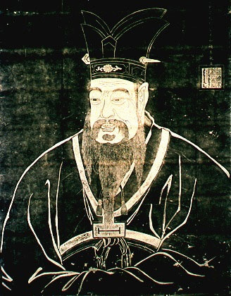

  
[Intangible Textual Heritage](../../index)  [Confucianism](../index.md) 

------------------------------------------------------------------------

[Buy this Book at
Amazon.com](https://www.amazon.com/exec/obidos/ASIN/1402152167/internetsacredte.md)

------------------------------------------------------------------------

<table width="75%">
<colgroup>
<col style="width: 50%" />
<col style="width: 50%" />
</colgroup>
<tbody>
<tr class="odd">
<td width="50%" data-valign="TOP"></td>
<td width="50%" data-valign="CENTER"><h1 id="the-book-of-filial-duty" data-align="CENTER">The Book of Filial Duty</h1>
<h2 id="by-ivan-chen" data-align="CENTER">by Ivan Chen</h2>
<h4 id="section" data-align="CENTER">[1908]</h4></td>
</tr>
</tbody>
</table>

------------------------------------------------------------------------

[Contents](#contents)    [Start Reading](bfd00.md)    [Page
Index](pageidx)    [Text \[Zipped\]](bfd.txt.gz.md)

------------------------------------------------------------------------

|                                                                                                                           |
|---------------------------------------------------------------------------------------------------------------------------|
|  |

This is a translation of the Hsio Ching, or the Book of Filial Duty. It
was written about 400 BCE, about a century following the death of
Confucius. The source edition of this etext was published in the [Wisdom
of the East](../../woe/index.md) series.

------------------------------------------------------------------------

 [Title Page](bfd00.md)  
[Table of Contents](bfd01.md)  
[Editorial Note](bfd02.md)  
[Introduction](bfd03.md)  
[The Doctrine of Filial Duty: Chapter I: The Meaning of Filial
Duty](bfd04.md)  
[Chapter II: The Filial Duty of an Emperor](bfd05.md)  
[Chapter III: The Filial Duty of Feudal Princes](bfd06.md)  
[Chapter IV: The Filial Duty of High Officers](bfd07.md)  
[Chapter V: The Filial Duty of the Literary Class](bfd08.md)  
[Chapter VI: The Filial Duty of Common People](bfd09.md)  
[Chapter VII: The Three Powers](bfd10.md)  
[Chapter VIII: Filial Duty in Government](bfd11.md)  
[Chapter IX: Government by the Sage](bfd12.md)  
[Chapter X: The Filial Duty of a Son](bfd13.md)  
[Chapter XI: The Five Punishments](bfd14.md)  
[Chapter XII: Amplification of the Important Doctrine](bfd15.md)  
[Chapter XIII: Amplification of the Highest Virtue](bfd16.md)  
[Chapter XIV: Amplification of Raising the Reputation](bfd17.md)  
[Chapter XV: The Question of Remonstrance in Connection With Filial
Duty](bfd18.md)  
[Chapter XVI: The Influence and Fruit of Filial Piety](bfd19.md)  
[Chapter XVII: Serving the Sovereign](bfd20.md)  
[Chapter XVIII: Mourning for One's Parents](bfd21.md)  
[The Twenty-Four Examples: No. I: The Filial Piety that influenced
Heaven](bfd22.md)  
[No. II: Affection shown in tasting Soups and Medicines](bfd23.md)  
[No. III: Gnawing her Finger pained his Heart](bfd24.md)  
[No. IV: Clad in a Single Garment, he was obedient to his
Mother](bfd25.md)  
[No. V: He carried Rice for his Parents](bfd26.md)  
[No. VI: With Sports and Embroidered Robes he amused his
Parents](bfd27.md)  
[No. VII: With Deer's Milk he supplied his Parents](bfd28.md)  
[No. VIII: He sold himself to bury his Father](bfd29.md)  
[No. IX: He hired himself out as a Labourer to support his
Mother](bfd30.md)  
[No. X: He fanned the Pillow and warmed the Bedclothes](bfd31.md)  
[No. XI: The Gushing Fountain and the Frisking Carp](bfd32.md)  
[No. XII: He carved Wood and served his Parents](bfd33.md)  
[No. XIII: For his Mother's Sake he would bury his Child](bfd34.md)  
[No. XIV: He seized the Tiger and saved his Father](bfd35.md)  
[No. XV: He collected Mulberries to support his Mother](bfd36.md)  
[No. XVI: He laid up the Oranges for his Mother](bfd37.md)  
[No. XVII: On hearing the Thunder he wept at the Tomb](bfd38.md)  
[No. XVIII: He wept to the Bamboos, and Shoots sprang up](bfd39.md)  
[No. XIX: He slept on Ice to procure Carp](bfd40.md)  
[No. XX: Wu Meng fed the Mosquitoes](bfd41.md)  
[No. XXI](bfd42.md)  
[No. XXII](bfd43.md)  
[No. XXIII: He resigned Office to seek his Mother](bfd44.md)  
[No. XXIV: He watched by his Mother's Bedside](bfd45.md)  
[Advertisements](bfd46.md)  
