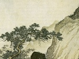

  
[Intangible Textual Heritage](../../index)  [Confucianism](../index) 
[Index](index)  [Previous](boo02)  [Next](boo04) 

------------------------------------------------------------------------

[Buy this Book at
Amazon.com](https://www.amazon.com/exec/obidos/ASIN/B002DEM9P0/internetsacredte)

------------------------------------------------------------------------

  
*The Book of Odes*, by L. Cranmer-Byng, \[1908\], at Intangible Textual
Heritage

------------------------------------------------------------------------

p. 5

### *INTRODUCTION*

"While reading the works of Confucius, I
have always fancied I could see the man as he was in life, and, when I
went to Shantung, I actually beheld his carriage, his robes, and the
material parts of his ceremonial usages. There were his descendants
practising the old rites in their ancestral home; and I lingered on,
unable to tear myself away. Many are the princes and prophets that the
world has seen in its time; glorious in life, forgotten in death. But
Confucius, though only a humble member of the cotton-clothed masses,
remains among us after many generations. He is the model for such as
would be wise. By all, from the Son of Heaven down to the meanest
student, the supremacy of his principles is fully and freely admitted.
He may, indeed, be pronounced the divinest of men." [\*](#fn_0)

This is the tribute of Ssŭ-Ma Ch’ien, the author of the first great
History of China, who lived in the first century before Christ. Many
centuries have gone since the old historian, out of the fulness of his
heart, sang the praises of the Master and the supremacy of his
principles. To-day, as a thousand years ago, the school children take
their first serious instruction from the five books, or *King* as they
are called in Chinese:—

p. 6

\[paragraph continues\] The Shu King, or
Book of History; The I King, or Book of Changes; The Shi King, or Book
of Poetry; The Li Chi, or Book of Rites; The Ch’un Ch’in, or Annals of
Spring and Autumn.

The Shi King, or Book of Poetry, from which these poems are rendered
through the prose translations of Professor Legge in his great series of
Chinese classics, was compiled by Confucius about 500 B.C. from earlier
collections which had been long existent, two of which, we know from an
ode written about 780 B.C., were called *Ya* and *Nan* respectively. The
oldest of these odes belong to the Shang dynasty, 1765-1122 B.C.; the
latest to the time of King Ting, 605-585 B.C. The odes may be roughly
divided into two classes:—(I) The Songs of the People; (2) The Official
Odes. Professor Giles, in his "History of Chinese Literature"
(Heinemann), divides the latter into three classes:—*(a)* Odes sung at
ordinary entertainments given by the suzerain; *(b)* Odes sung on grand
occasions when the feudal nobles were gathered together; *(c)*
Panegyrics and sacrificial odes.

The great importance that Confucius placed upon the Book of Poetry may
be gathered from the following anecdote:—One day his son Le was passing
hurriedly through the Court, when he met his father standing alone lost
in thought. Confucius, on seeing his son, addressed him thus—

"Have you read the Odes?"

He replied, "Not yet."

"Then," said Confucius, "if you do not learn the Odes, you will not be
fit to converse with." [\*](#fn_1)

p. 7

To understand this, we must know something of the character and
teachings of Confucius. William Morris was to some extent the Confucius
of his age. Both men dreamt of a golden past—a past brilliant with
heroic deeds, mellowed with peace, and serene beneath the first clear
dawn of ancient wisdom. Both drew inspiration from the unstained springs
of poetry. Morris went back to the sagas of the North and the tales and
tragedies of the early Greeks; Confucius to the odes and ballads of his
own country. For Morris, "the idle singer of an empty day," the world
had grown old and careworn and unheroic. Confucius, too, was born out of
his due time. The world—his world of petty princelings and court
intriguers and oppression—was not ripe for the great gospel of humanity
he had come to preach. Each failed lamentably in politics, and succeeded
elsewhere; Confucius as the transmitter of the wisdom of the ages, the
revealer of human goodness through conduct and knowledge; William Morris
as the inspired prophet of beauty, the teacher of good taste to the
hideous Victorian age in which he was born. When the dogmas and
economics of his socialism are forgotten, this influence will remain.

Lastly, and perhaps greatest parallel of all, both passionately loved
the people. Confucius, when asked how the superior man attained his
position, said: "He cultivates himself so as to bring rest unto the
people." Again he said: "To govern a country of a thousand chariots,
there must be reverent attention to business, and faithfulness,

p. 8

economy in expenditure, and *love for the people*." Both recognised, as
all great men must, that there is more to be learnt from the natural
man, the man who lives next to nature, and through his toil knows
something of her ways and moods, than the artificial mime of ancient
court or modern drawing-room. It was through the Odes that Confucius
taught his own generation to understand the manners and customs and the
simple feelings of the men of old. Here are no great poems written by
highly cultivated men, but songs that came naturally from the hearts of
all, concerning their little troubles, their hopes and fears, the
business in which they were engaged. The farmer sings of his husbandry.

He gives us this picture of the workers over the land coming to clear
the virgin soil of the grass and brushwood that cover it. "There they go
in thousands, two and two, side by side, tearing the roots out of the
soil; some to the marshlands, some where the dry paths wind through the
meadows, and some by the river banks. There is the master inspecting
all, with his sons ready at hand, followed by their households; there
also are the neighbours who have come to help; there the hired servants.
Now the feast has begun, sounds of revelry are heard; the husbands'
hearts are full of love as they sit with their wives by their side. Now,
they begin again patiently to prepare the southern lands, breaking the
soil with the ploughshare. Many kinds of grain they sow; soon strange
life will arise from every ear, when the young blades raise their heads
from the ground. See the young blades arise in long

p. 9

unbroken lines that day by day grow and spear before us. Fertile is the
swelling seed, and through it go the labourers who weed it over and over
again. A little while and the reapers have come; the golden grain is
stacked high, the straw innumerable is multiplied. There is sufficient
to make the spirits glad, to offer to the shades of our fathers, and
yield whatever the rites require; sufficiency for the kings and nobles
to give mighty banquets, when at the fragrant feast both host and guest
sit down together; there is enough when the feast is over to satisfy the
aged poor and cheer them with a never-ending abundance. Not now alone,
but from all time and in all lands, the earth repays a thousand-fold to
those who toil."

Such is the song of husbandry three thousand years ago. What joyousness
is here! What scenes of peace and simple festival of family love and
delight in the land!

Again some officer in the days of good King Wăn,  galloping along a
clear road on the king's service, hammers out the splendid galloping
song, called "King's Messenger," in the present book, to the beat of his
galloping horses' hoofs. No such poem was elaborated in garden or grove
where the poets clustered, and drank, and sang. It comes straight  from
the heart of this nameless envoy of old, fiercely exulting in his own
untiring energy and in the mettle of his splendid steeds. How many of
these poems declare the joys of work bravely attempted—bravely done!
These little sagas of blood and brain  can teach us more of life than
all the threadbare

p. 10

moralities which serve as poetry in the modern day. How modern they are!
Yes, indeed! as long as colour is colour, and life is life. As long as
youth with its sublime folly will wait all night for the tryst that is
never kept, these poems, the earliest collection of secular songs we
know, will remain fresh and charm us to the end. These old writers,
viewing nature at first hand and not through the medium of any books,
wrote faithfully of what they felt and saw.

"With what delight does the eye wander over the surrounding landscape!
Very gently the river glides along through the plain, which it makes
beautiful with the long canal formed by its waters. To the south rise
great mountains in the shape of an amphitheatre, while, on the further
bank, reeds and pines, covered with a never-fading verdure, invite the
fresh breath of the cooling winds. Happy places! those who dwell in you
live like brothers. Never is the voice of discord heard among you. What
glory shall be yours! The prince, whose heritage you are, hath chosen
you for his abode. Already is the plan of his palace formed; proud walls
arise, and grand terraces are building on the east and west. Haste to
come, great prince! O haste to come; sports and pleasure wait upon thy
coming. The solid foundations, which are now being laid with redoubled
strokes of the hammer, display thy wisdom. Neither rains nor storms
shall ever prevail against them. Never shall the insect which creeps or
walks penetrate thy habitation. The guard who watches is sometimes
surprised, the

p. 11

swiftest dart may err, the frightened pigeon forgets the use of its
wings, and the pheasant with difficulty flies before the eagle; but
before thee every obstacle vanishes. With what majesty do these
colonnades rear their fronts! How immense are those halls! Lofty columns
support the ceiling, the brightness of the day illuminates them and
penetrates them on all sides. It is here that my prince reposes; it is
here that he sleeps, upon long mats woven with great art."

Often the song is one that only a woman could have sung. Some lady of
the harem of King Wăn praises the queen, who is never jealous of the
inferior wives, but cherishes them as some great tree cherishes the
creepers that gather round it. Again, "the ripe plums are falling from
the bough; only seven-tenths of them remain! If any desire to marry me,
now has the fortunate time arrived!" In the second verse only
three-tenths are left; in the third she had gathered them all into her
basket: the lover has only to speak the word, and she will be his. Many
of these odes are undoubtedly the work of women. The European idea that
Chinese women are, and always have been, the closely prisoned slaves of
their husbands, idle and soulless and ignorant, has been dispelled by
Professor Giles in his interesting "Chinese Sketches" published by
Kegan, Paul & Co. "In novels, for instance," he writes, "the heroine is
always highly educated—*composes finished verses,* and quotes from
Confucius; and it is only fair to suppose that such characters are not
purely and wholly ideal. Besides, most

p. 12

young Chinese girls whose parents are well off are taught to read…"
According to Legge, there was more freedom of movement allowed to women
in the days when the odes were written and collected, before the custom
of cramping the feet was introduced; consequently their minds were more
able to expand from contact with the outer world, and better fitted for
literary tasks. The names of the ladies Pan-Chieh-Yu and Fang Wei-I are
well known to every student of Chinese literature.

Perhaps the great importance of the odes, first grasped by Confucius,
and afterwards by the whole of China, lies in the fact that they are no
mere abstract creations of an imaginative brain. Each one of these
nameless poets writes about himself or herself; their sorrows, their
aspirations, their outlook on their own times, contented or gloomy, are
all chronicled herein. In the official odes we see the feudal princes
coming to town to greet their sovereign lord. The state-carriages with
their four-horse teams have gone to greet them. What gifts has the king
to bestow on those he delights to honour? Bring forth the dark-coloured
robes embroidered with the dragon, and the silken skirts with the
hatchet design upon them. See, they are coming, you may tell by the
dragon flags that wave before them—coming, by the *hwuy-hwuy* sound of
the bells that reaches us. By the bright red buskins that cover the
knees we know them. These are the princes!

No great poetry to be sure! no monolith of inspired travail by a giant
race that may stand alone

p. 13

in the time-deserted regions of sand and silence! These are just the
natural songs that float upward from the happy valleys and down the
sedge-strewn banks of the wandering K’e. Above all, they are naive and
bright as on their birthday, with that most precious quality of truth
and unconscious art which never lets them tarnish or fade. The king is
very wicked! The poor groom of the Chamber to His Majesty gives vent to
his sorrow in song. He lets you know all about it. The royal naughtiness
stands clearly revealed, not by any calico-tearing epithets such as a
modern poet affrights the ears of a Sultan with, but just a gentle bland
admonishment, a little dirge of political desolation and the knell of a
falling dynasty.

I have put, or tried to put, these poems back into poetry. Four of these
pieces have been exquisitely rendered by my friend Mr. Allen Upward, and
speak for themselves. [\*](#fn_2) As regards my
own reasons for rendering Chinese poetry into English verse, I am
content to shelter myself behind the great authority and judgment of Sir
John Davis, who, in his "Poetry of the Chinese," contends that "verse
must be the shape into which Chinese, as well as other poetry, must be
converted, in order to do it mere justice." I will, however, take the
opportunity of saying, in conclusion, that the great literatures of the
world have been too long in the hands of mere scholars, to whom the
letter has been all-important and the spirit

p. 14

nothing. The time has come when the literary man should stand forth and
claim his share in the revelation of truth and beauty from other lands
and peoples whom our invincible European ignorance has taught us to
despise.

L. Cranmer-Byng.

------------------------------------------------------------------------

### Footnotes

[5:\*](boo03.htm#fr_0) "Gems of Chinese
Literature," by Herbert Giles (Quaritch).

[6:\*](boo03.htm#fr_1) "Confucianism and Taoism,"
by Sir Robert Douglas (S.K.C.K.)

[13:\*](boo03.htm#fr_2) Namely:—"The Prayer of
Ching," p. 25; "Through Eastern Gates," p. 30; "The Pear-Tree," p. 34;
"Blue Collar," p. 39.

------------------------------------------------------------------------

[Next: The Deserted Wife](boo04)
