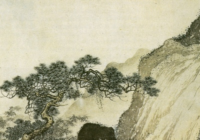

  
[Intangible Textual Heritage](../../index)  [Confucianism](../index.md) 

------------------------------------------------------------------------

[Buy this Book at
Amazon.com](https://www.amazon.com/exec/obidos/ASIN/B002DEM9P0/internetsacredte.md)

------------------------------------------------------------------------

<table width="75%">
<colgroup>
<col style="width: 50%" />
<col style="width: 50%" />
</colgroup>
<tbody>
<tr class="odd">
<td width="50%" data-valign="TOP"></td>
<td width="50%" data-valign="CENTER"><h1 id="the-book-of-odes" data-align="CENTER">The Book of Odes</h1>
<h2 id="by-l.-cranmer-byng" data-align="CENTER">by L. Cranmer-Byng</h2>
<h4 id="section" data-align="CENTER">[1908]</h4></td>
</tr>
</tbody>
</table>

------------------------------------------------------------------------

[Contents](#contents)    [Start Reading](boo00.md)    [Page
Index](pageidx)    [Text \[Zipped\]](boo.txt.gz.md)

------------------------------------------------------------------------

|                                                                                                                           |
|---------------------------------------------------------------------------------------------------------------------------|
|  |

This selection of poems from the Chinese Book of Odes appeared in the
[Wisdom of the East](../../woe/index.md) series. The Book of Odes, or Shih
Ching, is one of the Five Classics from ancient China. A complete
[translation by Legge](../bop/index.md) is also available at this site.

------------------------------------------------------------------------

 [Title Page](boo00.md)  
[Table of Contents](boo01.md)  
[Editorial Note](boo02.md)  
[Introduction](boo03.md)  
[The Deserted Wife](boo04.md)  
[King's Messenger](boo05.md)  
[Flight](boo06.md)  
[The Tower of Wan](boo07.md)  
[Drifting](boo08.md)  
[The Slanderers](boo09.md)  
[Love and the Magistrate](boo10.md)  
[City of Chow](boo11.md)  
[Prayer of Ching, I](boo12.md)  
[Prayer of Ching, II](boo13.md)  
[Maytime](boo14.md)  
[Lady of the Lagoon](boo15.md)  
[Through Eastern Gates](boo16.md)  
[The Straggler](boo17.md)  
[The Happy Man](boo18.md)  
[The Pear Tree](boo19.md)  
[Princely Visitors](boo20.md)  
[The Nightlong Tryst](boo21.md)  
[A Wife's Memories](boo22.md)  
[The Princes](boo23.md)  
[Blue Collar](boo24.md)  
[A Friend Forgotten](boo25.md)  
[The Ephemerae](boo26.md)  
[Happy in Haou](boo27.md)  
[Three Gifts](boo28.md)  
[Brave Thoughts](boo29.md)  
[On the Banks of Ho](boo30.md)  
[Sorrow](boo31.md)  
[Bulwarks of Empire](boo32.md)  
[The Bride Cometh](boo33.md)  
[Before the Ford](boo34.md)  
[Good King Wu](boo35.md)  
[Faint Heart](boo36.md)  
[Without Her](boo37.md)  
[The Forest Lover](boo38.md)  
[The Householders Lament](boo39.md)  
[Unavailing](boo40.md)  
[Grey Dawns and Red](boo41.md)  
[Advertisements](boo42.md)  
