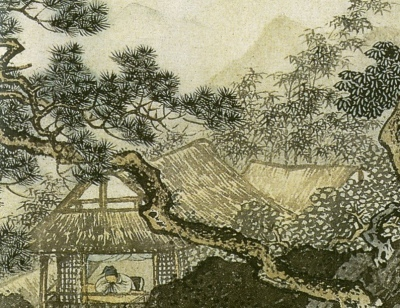

  
[Intangible Textual Heritage](../../index)  [Confucianism](../index) 

------------------------------------------------------------------------

[Buy this Book at
Amazon.com](https://www.amazon.com/exec/obidos/ASIN/B0026P3UA4/internetsacredte)

------------------------------------------------------------------------

<table width="75%">
<colgroup>
<col style="width: 50%" />
<col style="width: 50%" />
</colgroup>
<tbody>
<tr class="odd">
<td width="50%" data-valign="TOP"> 
Detail of 15th C.E. scroll by Chou Ch'en (Public Domain Image)</td>
<td width="50%" data-valign="CENTER"><h1 id="the-book-of-poetry" data-align="CENTER">The Book of Poetry</h1>
<h2 id="tr.-by-james-legge" data-align="CENTER">tr. by James Legge</h2>
<h4 id="section" data-align="CENTER">[1876]</h4></td>
</tr>
</tbody>
</table>

------------------------------------------------------------------------

[Contents](#contents)    [Start Reading](bop000)    [Page
Index](pageidx)    [Text \[Zipped\]](bop.txt.gz)

------------------------------------------------------------------------

|                                                                                                                           |
|---------------------------------------------------------------------------------------------------------------------------|
|  |

This is the unabridged translation of the Book of Odes (the Shih Ching)
by James Legge. Legge translated the Chinese Book of Odes, one of the
Five Chinese Classics, in 1876. This edition, scanned from a reprint
published in Shanghai in 1931, includes all of the English translations,
as well as some of the introductory matter from the 1876 edition. It
omits the Chinese text found in the original publications.

Legge also did all of the Chinese translations in the [Sacred Books of
the East](../../sbe/index) series, including an abridged version of the
Shih Ching in [SBE 3](../sbe03/index).

------------------------------------------------------------------------

 [Title Page](bop000)  
[Preface](bop001)  
[Introduction](bop002)  
[Contents](bop003)  

### Part I. Lessons from the States

### Book I. The Odes of Chou and the South

[I. Kuan Chü](bop004)  
[II. Ko T‘an](bop005)  
[III. Chüan Êrh](bop006)  
[IV. Chiu Mu](bop007)  
[V. Chung Ssŭ](bop008)  
[VI. T‘ao Yao](bop009)  
[VII. T‘u Chüeh](bop010)  
[VIII. Fou I](bop011)  
[IX. Han Kuang](bop012)  
[X. Ju Fên](bop013)  
[XI. Lin Chih Chih](bop014)  

### Book II. The Odes of Shao and the South

[I. Ch‘iao Ch‘ao](bop015)  
[II. Ts‘ai Fan](bop016)  
[III. Ts‘ao Ch‘ung](bop017)  
[IV. Ts‘ai Pin](bop018)  
[V. Kan T‘ang](bop019)  
[VI. Hsing Lu](bop020)  
[VII. Kao Yang](bop021)  
[VIII. Yin Ch‘i Lei](bop022)  
[IX. Piao Yu Mei](bop023)  
[X. Hsiao Hsing](bop024)  
[XI. Chiang Yu Ssŭ](bop025)  
[XII. Yeh Yu Ssŭ Chün](bop026)  
[XIII. Ho Pi Nung I](bop027)  
[XIV. Tsou Yü](bop028)  

### Book III. The Odes of P‘ei

[I. Pai Chou](bop029)  
[II. Lü I](bop030)  
[III. Yen Yen](bop031)  
[IV. Jih Yüeh](bop032)  
[V. Chung Fêng](bop033)  
[VI. Chi Ku](bop034)  
[VII. K‘ai Fêng](bop035)  
[VIII. Hsiung Chih](bop036)  
[IX. P‘ao Yu K‘u Yeh](bop037)  
[X. Ku Fêng](bop038)  
[XI. Shih Wei](bop039)  
[XII. Mao Ch‘iu](bop040)  
[XIII. Chien Hsi](bop041)  
[XIV. Ch‘üan Shui](bop042)  
[XV. Pei Mên](bop043)  
[XVI. Pei Fêng](bop044)  
[XVII. Ching Nü](bop045)  
[XVIII. Hsin T‘ai](bop046)  
[XIX. Erh Tsŭ Ch‘êng Chou](bop047)  

### Book IV. The Odes of Yung

[I. Po Chou](bop048)  
[II. Ch‘iang Yu T‘zŭ](bop049)  
[III. Chün Tzŭ Chieh Lao](bop050)  
[IV. Sang-chung](bop051)  
[V. Shun Chih Pên Pên](bop052)  
[VI. Ting Chih Fang Chung](bop053)  
[VII. Ti Tung](bop054)  
[VIII. Hsiang Shu](bop055)  
[IX. Kan Mao](bop056)  
[X. Tsai Ch‘ih](bop057)  

### Book V. The Odes of Wei

[I. Ch‘i Ao](bop058)  
[II. K‘ao P‘an](bop059)  
[III. Shih Jên](bop060)  
[IV. Mêng](bop061)  
[V. Chu Kan](bop062)  
[VI. Huan Lan](bop063)  
[VII. Ho Kuang](bop064)  
[VIII. Po Hsi](bop065)  
[IX. Yu Hu](bop066)  
[X. Mu Kua](bop067)  

### Book VI. The Odes of the Royal Domain

[I. Shu Li](bop068)  
[II. Chün Tzŭ Yü Yi](bop069)  
[II. Chün Tzŭ Yang Yang](bop070)  
[VI. Yang Chih Shui](bop071)  
[V. Chung Ku Yu T‘ui](bop072)  
[VI. T‘u Yüan](bop073)  
[VII. Ko Lei](bop074)  
[VIII. Ts‘ai Ko](bop075)  
[IX. Ta Ch‘ê](bop076)  
[X. Ch‘iu Chung Yu Ma](bop077)  

### Book VII. The Odes of Chêng

[I. Tzŭ I](bop078)  
[II. Chiang Chung Tzŭ](bop079)  
[III. Shu Yü T‘ien](bop080)  
[IV. Ta Shu Yü T‘ien](bop081)  
[V. Ch‘ing Jên](bop082)  
[VI. Kao Ch‘iu](bop083)  
[VII. Tsun Ta Lu](bop084)  
[VIII. Nü Yüeh Chi Ming](bop085)  
[IX. Yu Nü T‘ung Ch‘ê](bop086)  
[X. Shan Yu Fu Su](bop087)  
[XI. T‘o Hsi](bop088)  
[XII. Chiao T‘ung](bop089)  
[XIII. Ch‘ien Shang](bop090)  
[XIV. Fêng](bop091)  
[XV. Tung Mên Chih Shan](bop092)  
[XVI. Fêng Yü](bop093)  
[XVII. Tzŭ Chin](bop094)  
[XVIII. Yang Chih Shui](bop095)  
[XIX. Ch‘u Ch‘i Tung Mên](bop096)  
[XX. Yeh Yu Man Ts‘ao](bop097)  
[XXI. Chên Wei](bop098)  

### Book VIII. The Odes of Ch‘i

[I. Chi Ming](bop099)  
[II. Hsüan](bop100)  
[III. Chu](bop101)  
[IV. Tung Fang Chih Jih](bop102)  
[V. Tung Fang Wei Ming](bop103)  
[VI. Nan Shan](bop104)  
[VII. Fu T‘ien](bop105)  
[VIII. Lu Ling](bop106)  
[IX. Pi Kou](bop107)  
[X. Tsai Ch‘ü](bop108)  
[XI. I Chieh](bop109)  

### Book IX. The Odes of Wei

[I. Ko Chü](bop110)  
[II. Fên Chü Ju](bop111)  
[III. Yüan Yu T‘ao](bop112)  
[IV. Chih Hu](bop113)  
[V. Shih Mou Chih Chien](bop114)  
[VI. Fa T‘an](bop115)  
[VII. Shih Shu](bop116)  

### Book X. The Odes of T‘ang

[I. Hsi So](bop117)  
[II. Shan Yu Ch‘u](bop118)  
[III. Yang Chih Shui](bop119)  
[IV. Chiao Liao](bop120)  
[V. Ch‘ou Mou](bop121)  
[VI. Ti Tu](bop122)  
[VII. Kao Ch‘iu](bop123)  
[VIII. Pao Yü](bop124)  
[IX. Wu I](bop125)  
[X. Yu Ti Chih Tu](bop126)  
[XI. Ko Shêng](bop127)  
[XII. Ts‘ai Ling](bop128)  

### Book XI. The Odes of Ch‘in

[I. Ch‘ê Lin](bop129)  
[II. Ssŭ T‘ieh](bop130)  
[III. Hsiao Jung](bop131)  
[IV. Chien Chia](bop132)  
[V. Chung Nan](bop133)  
[VI. Huang Niao](bop134)  
[VII. Ch‘ên Fêng](bop135)  
[VIII. Wu I](bop136)  
[IX. Wei Yang](bop137)  
[X. Ch‘üan Yü](bop138)  

### Book XII. The Odes of Ch‘ên

[I. Yüan Ch‘iu](bop139)  
[II. Tung Mên Chih Fên](bop140)  
[III. Hêng Mên](bop141)  
[IV. Tung Mên Chih Ch‘ih](bop142)  
[V. Tung Mên Chih Yang](bop143)  
[VI. Mu Mên](bop144)  
[VII. Fang Yu Ch‘iao Ch‘ao](bop145)  
[VIII. Yüeh Ch‘u](bop146)  
[IX. Chu Lin](bop147)  
[X. Tsê P‘o](bop148)  

### Book XIII. The Odes of Kuei

[I. Kao Ch‘iu](bop149)  
[II. Su Kuan](bop150)  
[III. Shih Yu Ch‘ang Ts‘oo](bop151)  
[IV. Fei Fêng](bop152)  

### Book XIV. The Odes of Ts‘ao

[I. Fou Yu](bop153)  
[II. Hou Jên](bop154)  
[III. Shih Chiu](bop155)  
[IV. Hsia Ch‘üan](bop156)  

### Book XV. The Odes of Pin

[I. Ch‘i Yüeh](bop157)  
[II. Ch‘ih Hsiao](bop158)  
[III. Tung Shan](bop159)  
[IV. P‘o Fu](bop160)  
[V. Fa Ko](bop161)  
[VI. Chiu Yü](bop162)  
[VII. Lang Po](bop163)  

### Part II. Minor Odes of the Kingdom

### Book I. Decade of Lu Ming

[I. Lu Ming](bop164)  
[II. Ssŭ Mu](bop165)  
[III. Huang Huang Chê Hua](bop166)  
[IV. Chang Ti](bop167)  
[V. Fa Mu](bop168)  
[VI. T‘ien Pao](bop169)  
[VII. Ts‘ai Wei](bop170)  
[VIII. Ch‘u Ch‘ê](bop171)  
[IX. Ti Tu](bop172)  
[X. Nan Kai (lost)](bop173)  

### Book II. The Decade of Pai Hua

[I. Pai Hua (lost)](bop174)  
[II. Hua Shu (lost)](bop175)  
[III. Yü Li](bop176)  
[IV. Yu Kêng (lost)](bop177)  
[V. Nan Yu Chia Yü](bop178)  
[VI. Ch‘ung Ch‘iu (lost)](bop179)  
[VII. Nan Shan Yu T‘ai](bop180)  
[VIII. Yu I (lost)](bop181)  
[IX. Liao Hsiao](bop182)  
[X. Chan Lu](bop183)  

### Book III. The Decade of T‘ung Kung

[I. T‘ung Kung](bop184)  
[II. Ching Ching Chê O](bop185)  
[III. Lu Yüeh](bop186)  
[IV. Ts‘ai Ch‘i](bop187)  
[V. Ch‘ê Kung](bop188)  
[VI. Chi Jih](bop189)  
[VII. Hung Yen](bop190)  
[VIII. T‘ing Liao](bop191)  
[IX. Mien Shui](bop192)  
[X. Ho Ming](bop193)  

### Book IV. The Decade of Ch‘i Fu

[I. Ch‘i Fu](bop194)  
[II. Pai Chü](bop195)  
[III. Huang Niao](bop196)  
[IV. Wo Hsing Ch‘i Yeh](bop197)  
[V. Ssŭ Kan](bop198)  
[VI. Wu Yang](bop199)  
[VII. Chieh Nan Shan](bop200)  
[VIII. Chêng Yüeh](bop201)  
[IX. Shih Yüeh Chih Chiao](bop202)  
[X. Yü Wu Chêng](bop203)  

### Book V. The Decade of Hsiao Min

[I. Hsiao Min](bop204)  
[II. Hsiao Yüan](bop205)  
[III. Hsiao Pien](bop206)  
[IV. Ch‘iao Yen](bop207)  
[V. Ho Jên Ssŭ](bop208)  
[VI. Hsiang Pai](bop209)  
[VII. Ku Fêng](bop210)  
[VIII. Liao O](bop211)  
[IX. Ta Tung](bop212)  
[X. Ssŭ Yüeh](bop213)  

### Book VI. The Decade of Pei Shan

[I. Pei Shan](bop214)  
[II. Wu Chiang Ta Ch‘ê](bop215)  
[III. Hsiao Ming](bop216)  
[IV. Ku Chung](bop217)  
[V. Ch‘u Tz‘ŭ](bop218)  
[VI. Hsin Nan Shan](bop219)  
[VII. Fu T‘ien](bop220)  
[VIII. Ta Tien](bop221)  
[IX. Chan Pi Lo I](bop222)  
[X. Shang Shang Chê Hua](bop223)  

### Book VII. Decade of Sang Hu

[I. Sang Hu](bop224)  
[II. Yüan Yang](bop225)  
[III. Kuei Pien](bop226)  
[IV. Ch‘ê Hsia](bop227)  
[V. Ch‘ing Ying](bop228)  
[VI. Pin Chih Ch‘u Yen](bop229)  
[VII. Yü Tsao](bop230)  
[VIII. Ts’ai Shu](bop231)  
[IV. Chio Kung](bop232)  
[X. Yü Liu](bop233)  

### Book VIII. The Decade of Tu Jên Shih

[I. Tu Jên Shih](bop234)  
[II. Ts‘ai Lu](bop235)  
[III. Chu Miao](bop236)  
[IV. Hsi Sang](bop237)  
[V. Pai Hua](bop238)  
[VI. Mien Man](bop239)  
[VII. Hu Yeh](bop240)  
[VIII. Chien Chien Chih Shih](bop241)  
[IX. T‘iao Chih Hua](bop242)  
[X. Ho Ts‘ao Pu Huang](bop243)  

### Part III. Greater Odes of the Kingdom

### Book I. Decade of King Wên

[I. Wên Wang](bop244)  
[II. Ta Ming](bop245)  
[III. Mien](bop246)  
[IV. Yü Po](bop247)  
[V. Han Lu](bop248)  
[VI. Ssŭ Ch‘i](bop249)  
[VII. Huang I](bop250)  
[VIII. Ling T‘ai](bop251)  
[IX. Hsia Wu](bop252)  
[X. Wên Wang Yu Shêng](bop253)  

### Book II. Decade of Shêng Min

[I. Shêng Min](bop254)  
[II. Hsing Wei](bop255)  
[III. Chi Tsui](bop256)  
[IV. Fu I](bop257)  
[V. Chia Lo](bop258)  
[VI. Kung Liu](bop259)  
[VII. Chiung Cho](bop260)  
[VIII. Chüan O](bop261)  
[IX. Min Lao](bop262)  
[X. Pan](bop263)  

### Book III. Decade of Tang

[I. Tang](bop264)  
[II. I](bop265)  
[III. Sang Jou](bop266)  
[IV. Yün Han](bop267)  
[V. Sung Kao](bop268)  
[VI. Chêng Min](bop269)  
[VII. Han Yi](bop270)  
[VIII. Chiang Han](bop271)  
[IX. Chang Wu](bop272)  
[X. Chan Ang](bop273)  
[XI. Chao Min](bop274)  

### Part IV. Odes of the Temple and the Altar

### Book I. Sacrificial Odes of Chou

### Section I. Decade of Ch‘ing Miao

[I. Ch‘ing Miao](bop275)  
[II. Wei T‘ien Chih Ming](bop276)  
[III. Wei Ch‘ing](bop277)  
[IV. Lieh Wên](bop278)  
[T‘ien Tso](bop279)  
[VI. Hao T‘ien Yu Ch‘êng Ming](bop280)  
[VII. Wo Chiang](bop281)  
[VIII. Shih Mai](bop282)  
[IX. Chih Ching](bop283)  
[X. Ssŭ Wên](bop284)  

### Section II. The Decade of Ch‘ên Kung

[I. Ch‘ên Kung](bop285)  
[II. I Hsi](bop286)  
[III. Chên Lu](bop287)  
[IV. Fêng Nien](bop288)  
[V. Yu Ku](bop289)  
[VI. Ch‘ien](bop290)  
[VII. Yung](bop291)  
[VIII. Tsai Chien](bop292)  
[IX. Yu K‘o](bop293)  
[X. Wu](bop294)  

### Section III. The Decade of Min Yü Hsiao Tzŭ

[I. Min Yü Hsiao Tzŭ](bop295)  
[II. Fang Lo](bop296)  
[III. Ching Chih](bop297)  
[IV. Hsiao Pi](bop298)  
[V. Tsai Shan](bop299)  
[VI. Liang Ssŭ](bop300)  
[VII. Ssŭ I](bop301)  
[VIII. Cho](bop302)  
[IX. Huan](bop303)  
[X. Lai](bop304)  
[XI. Pan](bop305)  

### Book II. The Praise Odes of Lu

[I. Kung](bop306)  
[II. Yu Pi](bop307)  
[III. P‘an Shui](bop308)  
[IV. Pi Kung](bop309)  

### Book III. The Sacrificial Odes of Shang

[I. Na](bop310)  
[II. Lieh Tsu](bop311)  
[III. Hsüan Niao](bop312)  
[IV. Ch‘ang Fa](bop313)  
[V. Yin Wu](bop314)  
