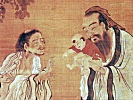

  
[Intangible Textual Heritage](../../index)  [Confucianism](../index) 
[Index](index)  [Next](cair01) 

------------------------------------------------------------------------

[Buy this Book at
Amazon.com](https://www.amazon.com/exec/obidos/ASIN/0404604161/internetsacredte)

------------------------------------------------------------------------

  
*Confucianism and Its Rivals*, by Herbert A. Giles, \[1915\], at
Intangible Textual Heritage

------------------------------------------------------------------------

##### THE HIBBERT LECTURES

###### SECOND SERIES

# CONFUCIANISM AND ITS RIVALS

## LECTURES

##### DELIVERED IN THE UNIVERSITY HALL OF DR WILLIAMS’S LIBRARY, LONDON OCTOBER-DECEMBER 1914

###### BY

### HERBERT A. GILES, LL.D.

##### PROFESSOR OF CHINESE IN THE UNIVERSITY OF CAMBRIDGE

 

#### LONDON

#### WILLIAMS AND NORGATE

#### 14 HENRIETTA STREET, COVENT GARDEN, W.C.

#### \[1915\]

#### (1914 Hibbert lectures, second series.)

  [  
Click to enlarge](img/title.jpg)  
Title Page  

------------------------------------------------------------------------

[Next: Preface](cair01)
