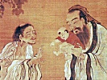

  
[Intangible Textual Heritage](../../index)  [Confucianism](../index.md) 
[Index](index)  [Previous](cair10.md) 

------------------------------------------------------------------------

[Buy this Book at
Amazon.com](https://www.amazon.com/exec/obidos/ASIN/0404604161/internetsacredte.md)

------------------------------------------------------------------------

  
*Confucianism and Its Rivals*, by Herbert A. Giles, \[1915\], at
Intangible Textual Heritage

------------------------------------------------------------------------

p. 266

### INDEX

Abraham, [243](cair10.htm#page_243.md).

Abu Giafar, [223](cair09.htm#page_223.md).

*Acta Archelai*, [191](cair08.htm#page_191.md).

Adam (substitute for), [243](cair10.htm#page_243.md).

Agriculture, [126](cair06.htm#page_126.md).

Alchemy, [144](cair07.htm#page_144.md).

Allegory, [140](cair07.htm#page_140.md).

Analects, or *Lun Yü*, [67](cair05.htm#page_67.md),
[135](cair07.htm#page_135), [184](cair08.htm#page_184.md).

Ancestral worship, [17](cair03.htm#page_17), [93](cair05.htm#page_93.md);
(R. Catholic disputes over), [247](cair10.htm#page_247); (K‘ang Hsi on.md),
[248](cair10.htm#page_248); (an obstacle to Christianity.md),
[262](cair10.htm#page_262.md).

Annals of Lu, [43](cair04.htm#page_43.md).

Answers to God Questions, [113](cair06.htm#page_113.md).

Anthropomorphism, [9](cair03.htm#page_9), [91](cair05.htm#page_91.md);
(rejected by Wang Ch‘ung), [159](cair07.htm#page_159.md).

Astrologers (Saracen and Christian), [197](cair09.htm#page_197.md).

Augurs and their responses, [26](cair03.htm#page_26.md) *seq*.,
[45](cair04.htm#page_45); (the Grand), [59](cair04.htm#page_59.md).

 

Balfour, A. J. (on God), [264](cair10.htm#page_264.md).

Banquets (after worship), [20](cair03.htm#page_20.md);

(spiritual and material), [40](cair04.htm#page_40.md).

Bible (poor translations of), [255](cair10.htm#page_255.md); (delegates’
version), [256](cair10.htm#page_256.md); (adequate translation still
wanting), [257](cair10.htm#page_257.md).

Birth (mankind good at), [83](cair05.htm#page_83.md); (a pre-Confucian
dogma), [83](cair05.htm#page_83); (denied by Kao.md),
[96](cair06.htm#page_96); (established by Mencius.md),
[97](cair06.htm#page_97)-[100](cair06.htm#page_100); (opposed by Hsün.md),
Too; (Yang Hsiung's view), [152](cair07.htm#page_152.md); (discussed by Chu
Fu Tzŭ), [236](cair10.htm#page_236.md).

Bôdhidharma (arrival of), [205](cair09.htm#page_205.md); (his supernatural
powers), [206](cair09.htm#page_206); (his teachings.md),
[206](cair09.htm#page_206.md).

Bowdlerism, [19](cair03.htm#page_19.md).

Buckle, H. T., [9](cair03.htm#page_9.md).

Buddhachinga arrives, [168](cair08.htm#page_168.md).

Buddhism (first appearance), [165](cair08.htm#page_165.md); (Chinese
mission to India), [167](cair08.htm#page_167); (gaining ground.md),
[168](cair08.htm#page_168), [173](cair08.htm#page_173.md); (rivalry with
Taoism), [173](cair08.htm#page_173); (creed of.md),
[174](cair08.htm#page_174); (in favour at Court.md),
[177](cair08.htm#page_177); (Emperor lectures on.md),
[205](cair09.htm#page_205); (attempt to combine with Taoism.md),
[207](cair09.htm#page_207); (prohibition of.md),
[208](cair09.htm#page_208); (a bone of Buddha.md),
[212](cair09.htm#page_212); (denounced by Han Wên-kung.md),
[212](cair09.htm#page_212); (suppression of monasteries.md),
[221](cair09.htm#page_221); (revival of the faith.md),
[221](cair09.htm#page_221); (its Trinity in Unity.md),
[238](cair10.htm#page_238); (borrowings from Taoist philosophers.md),
[238](cair10.htm#page_238.md).

Burials, [115](cair06.htm#page_115); (rites.md),
[118](cair06.htm#page_118.md).

"Burning of the Books," [119](cair06.htm#page_119.md),
[152](cair07.htm#page_152.md).

Burying alive, [119](cair06.htm#page_119); (how suppressed.md),
[50](cair04.htm#page_50), [51](cair04.htm#page_51.md).

 

Calendars, [78](cair05.htm#page_78.md).

Canon of Changes, [2](cair03.htm#page_2), [5](cair03.htm#page_5.md).

Canon of History, [11](cair03.htm#page_11), [14](cair03.htm#page_14.md).

Canon of Poetry. See Odes.

Canonization (liable to be cancelled), [230](cair10.htm#page_230.md).

Censor with Iron Face (his belief in God), [228](cair09.htm#page_228.md).

Chang Tao-ling (first Taoist Pope), [178](cair08.htm#page_178.md).

Changes. See Canon.

Chavannes, Professor E., [25](cair03.htm#page_25.md),
[120](cair06.htm#page_120.md).

*Chên Shên* (term for God), [256](cair10.htm#page_256.md).

Ch‘ên Tzû-ang (his objection to idols), [208](cair09.htm#page_208.md).

Ch‘êng Hao (his repression of superstition), [229](cair10.htm#page_229.md).

Ch‘êng T‘ang, [15](cair03.htm#page_15.md).

Chow, Duke of, [6](cair03.htm#page_6.md).

Chows, the, [11](cair03.htm#page_11), [23](cair03.htm#page_23.md),
[25](cair03.htm#page_25), [29](cair03.htm#page_29.md),
[33](cair04.htm#page_33.md).

Christ (letter from), [225](cair09.htm#page_225.md).

p. 267

Christianity (Manichæan), [190](cair08.htm#page_190); (Nestorian.md),
[196](cair09.htm#page_196); (flourishing), [204](cair09.htm#page_204.md);
(a heresy), [252](cair10.htm#page_252); (its growth disappointing.md),
[260](cair10.htm#page_260); (its obstacles in China.md),
[262](cair10.htm#page_262.md).

Chu Fu Tzŭ (= Chu Hsi), [184](cair08.htm#page_184.md); (his career and
death), [233](cair10.htm#page_233); (and Canon of Changes.md),
[234](cair10.htm#page_234); (his rejection of God.md),
[234](cair10.htm#page_234); (his cosmogony), [235](cair10.htm#page_235.md);
(on man's nature), [236](cair10.htm#page_236); (on Buddhism and Taoism.md),
[237](cair10.htm#page_237), [239](cair10.htm#page_239.md).

Ch‘ü P‘ing (his suicide), [107](cair06.htm#page_107.md); (allusions to
God), [108](cair06.htm#page_108); (search for Truth.md),
[109](cair06.htm#page_109); (God Questions), [110](cair06.htm#page_110.md);
(faith in divination), [113](cair06.htm#page_113.md).

Chuang Tzŭ, [38](cair04.htm#page_38); (apostle of Lao Tzŭ.md),
[130](cair07.htm#page_130); (opposed to Confucianism.md),
[131](cair07.htm#page_131); (on the soul), [132](cair07.htm#page_132.md);
(his Unity), [132](cair07.htm#page_132); (butterfly dream.md),
[133](cair07.htm#page_133); (God), [133](cair07.htm#page_133.md);
(heterodox), [137](cair07.htm#page_137.md).

*Chung Yung*, the, [87](cair05.htm#page_87), [88](cair05.htm#page_88.md),
[184](cair08.htm#page_184.md).

Comets, [53](cair04.htm#page_53.md).

Commentary, the, [43](cair04.htm#page_43.md).

Confucian Canon, [2](cair03.htm#page_2.md).

Confucianism (interpretation of term), [19](cair03.htm#page_19.md); (more
practical than Christianity), [85](cair05.htm#page_85.md); (denounced by
Wang Ch‘ung), [153](cair07.htm#page_153)-[155](cair07.htm#page_155.md) (its
first Temple), [181](cair08.htm#page_181), [183](cair08.htm#page_183.md);
(necessary to man), [209](cair09.htm#page_209); (based on revelation.md),
[258](cair10.htm#page_258); (re-establishment of.md),
[263](cair10.htm#page_263.md).

Confucius, [5](cair03.htm#page_5), [11](cair03.htm#page_11.md),
[19](cair03.htm#page_19), [43](cair04.htm#page_43.md),
[44](cair04.htm#page_44); (taken prisoner), [45](cair04.htm#page_45.md);
(no revelation granted to), [65](cair05.htm#page_65); (eulogy of.md),
[66](cair05.htm#page_66); (his belief in God and in a divine mission.md),
[67](cair05.htm#page_67), [68](cair05.htm#page_68); (known to God.md),
[68](cair05.htm#page_68); (knows the ford), [69](cair05.htm#page_69.md);
(subjects forbidden by), [69](cair05.htm#page_69); (his six ages.md),
[69](cair05.htm#page_69); (on the Golden Age), [71](cair05.htm#page_71.md);
(his love of truth), [72](cair05.htm#page_72); (on spirits.md),
[74](cair05.htm#page_74); (his earnestness in sacrificing.md),
[76](cair05.htm#page_76); (his rules as to presents.md),
[78](cair05.htm#page_78); (on militarism), [79](cair05.htm#page_79.md);
(fasting), [79](cair05.htm#page_79); (on prayer.md),
[80](cair05.htm#page_80); (his attitude to mourners and blind people.md),
[81](cair05.htm#page_81); (on length of mourning.md),
[82](cair05.htm#page_82); (disciples’ opinion of.md),
[87](cair05.htm#page_87); (birthplace of), [179](cair08.htm#page_179.md),
[227](cair09.htm#page_227); (regarded as a god.md),
[251](cair10.htm#page_251); (actually made a god.md),
[258](cair10.htm#page_258.md).

Contraries without antagonism, [133](cair07.htm#page_133.md).

Coral-branch of magician, [108](cair06.htm#page_108.md).

Creation not the work of God, [157](cair07.htm#page_157.md).

 

Dances (in Confucian Temple), [186](cair08.htm#page_186.md); (not mere
posturing), [188](cair08.htm#page_188.md)

Death (Confucius on), [74](cair05.htm#page_74.md).

Deluge (a Chinese), [7](cair03.htm#page_7), [112](cair06.htm#page_112.md).

Dharmadâtu, [211](cair09.htm#page_211.md).

Diagrams (Eight), [3](cair03.htm#page_3.md).

Diamond *Sûtra*, [169](cair08.htm#page_169) *seq*.; (and Manichæism.md),
[191](cair08.htm#page_191), [195](cair08.htm#page_195.md).

Diseases, [57](cair04.htm#page_57.md).

Divination, [25](cair03.htm#page_25); (an example of.md),
[26](cair03.htm#page_26); (not mentioned by Confucius.md),
[79](cair05.htm#page_79.md).

Divine right, [21](cair03.htm#page_21.md).

Divorce, [117](cair06.htm#page_117.md).

Doctrine of the Mean, [88](cair05.htm#page_88.md),
[184](cair08.htm#page_184.md).

Dominicans, [247](cair10.htm#page_247.md).

Douglas, R. K., [6](cair03.htm#page_6.md).

Dragon, [3](cair03.htm#page_3); (festival), [107](cair06.htm#page_107.md).

Drought, [53](cair04.htm#page_53.md).

Duality in Unity, [38](cair04.htm#page_38.md).

 

Ear-plugs, [108](cair06.htm#page_108.md).

Earthquakes, [55](cair04.htm#page_55.md).

East as source of life, [122](cair06.htm#page_122.md).

Eclipses, [31](cair03.htm#page_31); (are messages from God.md),
[52](cair04.htm#page_52), [180](cair08.htm#page_180.md).

Elixir of life, [144](cair07.htm#page_144); (ridiculed by Wang Ch‘ung.md),
[163](cair07.htm#page_163); (overdose of), [217](cair09.htm#page_217.md),
[221](cair09.htm#page_221.md).

Exorcism, futility of, [164](cair07.htm#page_164.md).

 

Fa Hsien travels to India, [172](cair08.htm#page_172.md).

Faith essential in worship, [58](cair04.htm#page_58.md).

Famine, [53](cair04.htm#page_53.md).

*Fêng* and *Shan* sacrifices, [124](cair06.htm#page_124.md).

Feudal Age, [25](cair03.htm#page_25), [63](cair04.htm#page_63.md); (end
of), [118](cair06.htm#page_118.md).

First Cause, [131](cair07.htm#page_131.md).

"First Emperor," [118](cair06.htm#page_118); (ascends Mt. T‘ai.md),
[120](cair06.htm#page_120.md).

Floods, [54](cair04.htm#page_54.md).

Forgeries (literary), [119](cair06.htm#page_119.md).

Four subjects on which Confucius would not speak,
[69](cair05.htm#page_69.md).

Franciscans, [247](cair10.htm#page_247.md).

Fu Hsi, [2](cair03.htm#page_2), [7](cair03.htm#page_7.md).

Fu I (denounces Buddhism), [207](cair09.htm#page_207.md),
[208](cair09.htm#page_208.md).

 

Genghis Khan, [197](cair09.htm#page_197.md).

Gobharana arrives, [167](cair08.htm#page_167.md).

p. 268

God, [1](cair03.htm#page_1); (unjust and unkind.md),
[22](cair03.htm#page_22); (speaks to King Wên.md),
[31](cair03.htm#page_31); (to rank before Hou Chi.md),
[35](cair04.htm#page_35) (angry and oppressive.md),
[42](cair04.htm#page_42); (fear of), [46](cair04.htm#page_46.md); (estimate
of by Confucius), [71](cair05.htm#page_71); (does not speak.md),
[73](cair05.htm#page_73), [225](cair09.htm#page_225); (is Truth.md),
[86](cair05.htm#page_86); (will of), [70](cair05.htm#page_70.md),
[90](cair05.htm#page_90); (how to serve), [95](cair05.htm#page_95.md);
(questions put to), I Io; (answers furnished),
[113](cair06.htm#page_113); (as conceived of by Chuang Tzŭ.md),
[133](cair07.htm#page_133); (not the Creator.md),
[157](cair07.htm#page_157); (as conceived of by Wang Ch‘ung.md),
[162](cair07.htm#page_162); (third Person in Taoist Trinity.md),
[176](cair08.htm#page_176); (name in Mazdaism.md),
[190](cair08.htm#page_190); (letter from), [225](cair09.htm#page_225.md);
(Su Tung-p‘o and), [230](cair10.htm#page_230); (waning belief in.md),
[233](cair10.htm#page_233); (becomes an abstraction.md),
[235](cair10.htm#page_235) (where to be found.md),
[240](cair10.htm#page_240); (reference to in Sacred Edict.md),
[251](cair10.htm#page_251); (a world without.md),
[264](cair10.htm#page_264.md).

Gods (the five family), [126](cair06.htm#page_126.md).

Golden Rule, [85](cair05.htm#page_85.md).

Good for evil (ordered by Lao Tzŭ), [148](cair07.htm#page_148.md);
(denounced by Confucius), [149](cair07.htm#page_149.md).

Grave-mounds, [115](cair06.htm#page_115.md).

Great Yü, the, [7](cair03.htm#page_7), [13](cair03.htm#page_13.md),
[112](cair06.htm#page_112.md).

 

Han Fei Tzŭ, [135](cair07.htm#page_135.md).

Han Wên-kung (denounces relic of Buddha), [212](cair09.htm#page_212.md);
(his belief in God), [214](cair09.htm#page_214.md),
[217](cair09.htm#page_217); (attitude to Taoism.md),
[218](cair09.htm#page_218), [219](cair09.htm#page_219.md). Harun-al-Raschid
(sent a mission), [224](cair09.htm#page_224.md).

Havret, Père, [201](cair09.htm#page_201), [203](cair09.htm#page_203.md).

Heart, man's (careful treatment of), [142](cair07.htm#page_142.md).

*Hînayâna*, [168](cair08.htm#page_168.md).

Hopkins, L. C., [10](cair03.htm#page_10.md).

Hou Chi, [33](cair04.htm#page_33); (his virgin birth.md),
[34](cair04.htm#page_34); (not to take precedence of God.md),
[35](cair04.htm#page_35.md).

Hoveden, Roger of, [225](cair09.htm#page_225.md).

Hsü Kuang-ch‘i (converted), [247](cair10.htm#page_247.md).

Hsüan Tsang (journey to India), [210](cair09.htm#page_210.md); (narrative
of his travels), [211](cair09.htm#page_211.md).

Hsün Tzŭ, [11](cair03.htm#page_11); (on the nature of man.md),
[100](cair06.htm#page_100); (his view of God's limitations.md),
[102](cair06.htm#page_102); (against superstition.md),
[102](cair06.htm#page_102.md).

Huai-nan, Prince of (on *Tao*), [142](cair07.htm#page_142.md); (records a
miracle), [144](cair07.htm#page_144.md).

Hui (the favourite disciple), [72](cair05.htm#page_72.md); (grief of
Confucius at death of), [72](cair05.htm#page_72); (his image in Temple.md),
[183](cair08.htm#page_183); (eulogy by Emperor.md),
[225](cair09.htm#page_225.md).

Huns, [15](cair03.htm#page_15.md).

 

Idols (foreign to Confucianism), [209](cair09.htm#page_209.md).

Impersonator of the dead, [39](cair04.htm#page_39.md).

Inaction (doctrine of), [141](cair07.htm#page_141.md),
[143](cair07.htm#page_143.md).

Incense, [16](cair03.htm#page_16.md).

Infinite Absolute=God, [133](cair07.htm#page_133); (= *Tao*.md),
[136](cair07.htm#page_136.md).

Inspiration (divine), [86](cair05.htm#page_86.md).

 

Jesuit Fathers (on music), [187](cair08.htm#page_187); (arrival of.md)
[247](cair10.htm#page_247); (on God), [247](cair10.htm#page_247.md); (on
ancestral worship), [248](cair10.htm#page_248.md); (to be made use of by
Chinese), [252](cair10.htm#page_252.md).

Jews (arrive in China), [241](cair10.htm#page_241); (inscribed tablet.md),
[243](cair10.htm#page_243); (borrow *Tao*), [244](cair10.htm#page_244.md);
(date of arrival certain), [244](cair10.htm#page_244.md).

Jonah and the whale, [66](cair05.htm#page_66.md).

Judaism (similarity to Confucianism), [245](cair10.htm#page_245.md).

Julien, St, [200](cair09.htm#page_200.md).

K‘ai-fêng Fu (Jewish colony), [241](cair10.htm#page_241.md); (portions of
the Old Testament found), [242](cair10.htm#page_242.md).

K‘ang Hsi, the Emperor (his Sacred Edict), [250](cair10.htm#page_250.md).

Kao, the philosopher (his view of man's nature),
[96](cair06.htm#page_96), [97](cair06.htm#page_97.md).

Kâshiapmâdanga arrives, [167](cair08.htm#page_167.md).

Ku-liang (his commentary), [54](cair04.htm#page_54); (prayer for.md),
[62](cair04.htm#page_62.md).

Kuan Yin (hearer of prayers), [173](cair08.htm#page_173.md); (as the
Madonna), [175](cair08.htm#page_175.md).

Kublai Khan, [245](cair10.htm#page_245.md).

Kumârajîva arrives, [168](cair08.htm#page_168.md); (success as preacher and
translator), [169](cair08.htm#page_169.md).

Kun (failed to abate the Flood), [111](cair06.htm#page_111.md).

K‘ung Chi, [88](cair05.htm#page_88.md).

 

Lacouperie, T. de, [6](cair03.htm#page_6.md).

Lan Lu-chou (on Roman Catholicism), [254](cair10.htm#page_254.md).

p. 269

Lao Tzŭ, [129](cair07.htm#page_129); (his virgin birth.md),
[129](cair07.htm#page_129); (not mentioned by Confucius.md),
[130](cair07.htm#page_130); (the *Tao* of), [135](cair07.htm#page_135.md);
(book attributed to him), [146](cair07.htm#page_146.md); (first Person of
Taoist Trinity), [176](cair08.htm#page_176.md).

Legge, Dr, [6](cair03.htm#page_6), [11](cair03.htm#page_11.md),
[24](cair03.htm#page_24); (Nestorian Tablet.md),
[203](cair09.htm#page_203.md).

*Lieh Tzû*, [165](cair08.htm#page_165.md).

Life everlasting, [40](cair04.htm#page_40.md).

*Lin*, the, [187](cair08.htm#page_187.md).

Liu Tsung-yüan (his God Answers), [113](cair06.htm#page_113.md);
(Buddhistic leanings), [215](cair09.htm#page_215.md).

Locusts, [54](cair04.htm#page_54.md).

Love one another, [85](cair05.htm#page_85.md).

Luminous Doctrine, [196](cair09.htm#page_196.md).

*Lun Hêng*, or Animadversions, [153](cair07.htm#page_153.md).

*Lun Yü*, or Analects, [67](cair05.htm#page_67.md),
[134](cair07.htm#page_134.md).

 

*Mahâyâna*, [168](cair08.htm#page_168.md); (its alleged borrowings from the
Gnostics), [169](cair08.htm#page_169), [174](cair08.htm#page_174.md).

Mahometanism (arrival of), [222](cair09.htm#page_222.md); (under Kublai
Khan), [245](cair10.htm#page_245); (exceptional treatment.md),
[259](cair10.htm#page_259.md).

Manchu dynasty, [247](cair10.htm#page_247); (Its attitude to religion.md),
[249](cair10.htm#page_249.md).

Manichæism, [190](cair08.htm#page_190); (its dualistic theology.md),
[190](cair08.htm#page_190); (opening words of treatise.md),
[191](cair08.htm#page_191); (part played by the Holy Ghost.md),
[192](cair08.htm#page_192); Diamond Sûtra, [195](cair08.htm#page_195.md).

Marco Polo, [197](cair09.htm#page_197); (Nestorian Christians.md),
[198](cair09.htm#page_198.md).

*Marga* = *Tao*, [135](cair07.htm#page_135.md).

Mazdaism, [190](cair08.htm#page_190.md).

Medium, spiritual, [109](cair06.htm#page_109.md).

Mencius, [13](cair03.htm#page_13); (on original goodness.md),
[83](cair05.htm#page_83), [96](cair06.htm#page_96.md),
[97](cair06.htm#page_97)-[100](cair06.htm#page_100.md); (the Second
Inspired One), [88](cair05.htm#page_88); (his teachings.md),
[89](cair05.htm#page_89); (his belief in God), [90](cair05.htm#page_90.md);
(denunciation of Yang Chu and Mo Ti), [104](cair06.htm#page_104.md).

Ming (= will of God), [70](cair05.htm#page_70.md),
[72](cair05.htm#page_72.md).

Ming dynasty (its fall), [247](cair10.htm#page_247.md).

Miracles (Taoist), [144](cair07.htm#page_144); (Buddhist.md),
[173](cair08.htm#page_173), [229](cair10.htm#page_229.md).

Mo Ti (his altruism), [104](cair06.htm#page_104.md),
[107](cair06.htm#page_107.md).

Mongol dynasty, [245](cair10.htm#page_245.md).

Morality more important than sacrifices, [164](cair07.htm#page_164.md).

Morrison, Dr, [12](cair03.htm#page_12.md).

Moses, [244](cair10.htm#page_244.md).

Mosques in Canton, [223](cair09.htm#page_223.md).

Mother-in-law insulted, [117](cair06.htm#page_117.md).

Moule, Mr A. C. (Nestorian Tablet), [201](cair09.htm#page_201.md),
[203](cair09.htm#page_203.md).

Mourning (sincerity in), [80](cair05.htm#page_80); (for parents.md),
[81](cair05.htm#page_81), [82](cair05.htm#page_82); (national.md),
[82](cair05.htm#page_82); (Confucius shocked by disregard of.md),
[82](cair05.htm#page_82); (exaggeration in), [115](cair06.htm#page_115.md).

Murmurings against God, [42](cair04.htm#page_42.md).

Music (from B.C. [126](cair06.htm#page_126).md),
[186](cair08.htm#page_186); (opinion of Jesuits.md),
[187](cair08.htm#page_187.md).

 

Nâgârjuna (founder of the *Mahâyâna* school),
[169](cair08.htm#page_169.md).

Natural phenomena, [31](cair03.htm#page_31.md).

Nature (man's). See Birth (personified).

Nature worship, [120](cair06.htm#page_120.md).

Nestorian Tablet (discovery of), [199](cair09.htm#page_199.md);
(inscription), [200](cair09.htm#page_200); (denounced as a forgery.md),
[200](cair09.htm#page_200); (its genuineness established.md),
[200](cair09.htm#page_200); (its purport and style.md),
[200](cair09.htm#page_200); (its disappearance.md),
[204](cair09.htm#page_204.md).

Nestorianism, [196](cair09.htm#page_196); (and Genghis Khan.md),
[197](cair09.htm#page_197); (its customs and churches.md),
[198](cair09.htm#page_198); (and Kublai Khan.md),
[199](cair09.htm#page_199); (Emperors who supported it.md),
[204](cair09.htm#page_204); (displaced by orthodox Christianity.md),
[246](cair10.htm#page_246.md).

Neumann, [200](cair09.htm#page_200.md).

Noah's Ark, [4](cair03.htm#page_4.md). See Deluge.

Nothing, efficacy of, [143](cair07.htm#page_143.md).

 

Oaths, [44](cair04.htm#page_44); (forced), [45](cair04.htm#page_45.md);
(used by Confucius), [71](cair05.htm#page_71.md).

Odes, the, [19](cair03.htm#page_19), [20](cair03.htm#page_20.md);
(mistranslated), [24](cair03.htm#page_24), [41](cair04.htm#page_41.md);
(Confucius on), [83](cair05.htm#page_83.md).

One = Infinite Absolute, [133](cair07.htm#page_133); (man and God are.md),
[135](cair07.htm#page_135); (how to be One with the Infinite.md),
[135](cair07.htm#page_135.md).

Original goodness, [83](cair05.htm#page_83.md).

Original sin, [84](cair05.htm#page_84.md).

 

Paley anticipated, [45](cair04.htm#page_45.md).

P‘an Ku (second Person of Taoist Trinity), [176](cair08.htm#page_176.md);
(as Adam), [243](cair10.htm#page_243.md).

Pao Yung (filial piety of), [117](cair06.htm#page_117.md).

Parthenogenesis, [34](cair04.htm#page_34); (of Lao Tzŭ.md),
[129](cair07.htm#page_129.md).

Pelliot, Professor, [190](cair08.htm#page_190.md).

People, the (importance of), [94](cair05.htm#page_94.md).

Phœnix, [65](cair05.htm#page_65.md).

Po-yu (spiritual appearance of), [61](cair04.htm#page_61.md).

p. 270

Pope (Taoist), [177](cair08.htm#page_177); (R. Catholic.md),
[247](cair10.htm#page_247); (raised to rank of Emperor.md),
[260](cair10.htm#page_260.md).

Prayers, [37](cair04.htm#page_37); (for rain), [53](cair04.htm#page_53.md);
(as understood by Confucius), [80](cair05.htm#page_80); (to Mt. T‘ai.md),
[120](cair06.htm#page_120), [227](cair09.htm#page_227); (no family.md),
[261](cair10.htm#page_261); (to spirits), [261](cair10.htm#page_261.md);
(for the Republic), [262](cair10.htm#page_262.md).

Prester John, [197](cair09.htm#page_197.md).

Prometheus (a Chinese), [2](cair03.htm#page_2.md).

Propriety, [46](cair04.htm#page_46.md).

Protestant missionaries (arrive), [255](cair10.htm#page_255.md); (attitude
on the Term Question), [255](cair10.htm#page_255.md); (less feared than R.
Catholics), [260](cair10.htm#page_260.md).

Proverbs, [13](cair03.htm#page_13.md).

 

Questioning God, [110](cair06.htm#page_110.md).

 

Rain (prayers for), [53](cair04.htm#page_53), [62](cair04.htm#page_62.md);
(of rice, etc.), [55](cair04.htm#page_55); (Arbour to.md),
[232](cair10.htm#page_232.md).

Rainbows, [56](cair04.htm#page_56.md)

Religious influences at the present day, [260](cair10.htm#page_260.md).

Renan, [200](cair09.htm#page_200.md).

Revelation, [3](cair03.htm#page_3), [65](cair05.htm#page_65.md):

Ricci (and Judaism), [241](cair10.htm#page_241); (arrival of.md),
[247](cair10.htm#page_247); (his attack on Buddhism.md),
[247](cair10.htm#page_247); (wrong attitude towards ancestral worship.md),
[247](cair10.htm#page_247.md).

River Plan, [8](cair03.htm#page_8.md).

Roman Catholicism, [252](cair10.htm#page_252.md).

Ruler (the good), [21](cair03.htm#page_21.md).

 

Sacred Edict, [250](cair10.htm#page_250); (God in the.md),
[251](cair10.htm#page_251.md); (Christianity, Buddhism, and Taoism
reprobated), [252](cair10.htm#page_252); (a blow to Christianity.md),
[254](cair10.htm#page_254.md).

Sacrifices, [14](cair03.htm#page_14), [16](cair03.htm#page_16.md),
[47](cair04.htm#page_47); (of grain), [35](cair04.htm#page_35); (human.md),
[48](cair04.htm#page_48); (meaning of the great.md),
[76](cair05.htm#page_76); (to the spirit of a foreigner.md),
[77](cair05.htm#page_77); (valued by Confucius.md),
[79](cair05.htm#page_79); (in the Confucian Temple.md),
[186](cair08.htm#page_186.md).

Sang Hu (death of), [138](cair07.htm#page_138.md).

*Shang Ti* (= *T‘ien*), [12](cair03.htm#page_12.md); (= God active and
personal), [37](cair04.htm#page_37); (subordinate to *T‘ien*.md),
[158](cair07.htm#page_158); (term favoured by Jesuits.md),
[248](cair10.htm#page_248); (also by some Protestants.md),
[256](cair10.htm#page_256.md).

Shao Yung (and Canon of Changes), [234](cair10.htm#page_234); (and God.md),
[240](cair10.htm#page_240.md).

*Shên* or *Shin* (a term for God), [12](cair03.htm#page_12.md).

Shih-li-fang (miraculous delivery of), [166](cair08.htm#page_166.md).

Shun, [16](cair03.htm#page_16.md).

*Shuo Wên*, [10](cair03.htm#page_10.md).

Sincerity, [16](cair03.htm#page_16); (in mourning.md),
[80](cair05.htm#page_80.md).

Sinew (removing the), [242](cair10.htm#page_242.md).

Sky, the, [1](cair03.htm#page_1.md).

Soil (god of the), [126](cair06.htm#page_126.md); (his altar may not be
covered), [127](cair06.htm#page_127.md).

Son of Heaven (= Son of God), [9](cair03.htm#page_9.md),
[21](cair03.htm#page_21), [44](cair04.htm#page_44.md).

Soul (supra- and sub-liminal), [61](cair04.htm#page_61.md); (suggested by
Chuang Tzŭ), [132](cair07.htm#page_132); (a vital fluid.md),
[160](cair07.htm#page_160.md).

Spencer, Herbert, [133](cair07.htm#page_133.md).

Spirits, [14](cair03.htm#page_14), [58](cair04.htm#page_58.md),
[73](cair05.htm#page_73), [74](cair05.htm#page_74.md); (of hills and
streams),[16](cair03.htm#page_16); (invisible.md),
[59](cair04.htm#page_59); (in human form have no shadow.md),
[59](cair04.htm#page_59); (manifested), [74](cair05.htm#page_74.md);
(present at sacrifices), [76](cair05.htm#page_76); (how defined.md),
[94](cair05.htm#page_94); (of land and grain), [94](cair05.htm#page_94.md);
(Wang Ch‘ung denies existence of), [161](cair07.htm#page_161.md).

Springs and Autumns, the, [43](cair04.htm#page_43.md),
[52](cair04.htm#page_52.md).

Ssŭ-ma Ch‘ien, [5](cair03.htm#page_5); (his eulogy of Confucius.md),
[66](cair05.htm#page_66); (on Lao Tzŭ), [146](cair07.htm#page_146.md).

Su Tung-p‘o (his expulsion from Temple), [230](cair10.htm#page_230.md);
(his allusions to God), [231](cair10.htm#page_231.md),
[232](cair10.htm#page_232.md).

Sun goes back in the sky, [144](cair07.htm#page_144.md).

*Suovetaurilia*, [189](cair08.htm#page_189.md).

*Sûtra* of Forty-two Sections, [167](cair08.htm#page_167.md).

 

T‘ai K‘ang, [39](cair04.htm#page_39.md).

T‘ai, Mt. (its divine character), [120](cair06.htm#page_120.md); (ascents
of), [120](cair06.htm#page_120), [123](cair06.htm#page_123.md),
[124](cair06.htm#page_124), [226](cair09.htm#page_226.md).

T‘an Kung (on mourning), [115](cair06.htm#page_115.md).

T'ang, or Ch'êng T'ang, [15](cair03.htm#page_15.md); (called the
Completer), [127](cair06.htm#page_127.md).

*Tao* (God dependent on),[135](cair07.htm#page_135); (= the Infinite.md),
[136](cair07.htm#page_136); (untranslatable.md),
[136](cair07.htm#page_136); (defined), [136](cair07.htm#page_136.md);
(cannot be taught), [136](cair07.htm#page_136); (how to be known.md),
[141](cair07.htm#page_141); (debased), [145](cair07.htm#page_145.md);
(cannot speak), [238](cair10.htm#page_238.md).

*Tao Tê Ching*, [147](cair07.htm#page_147.md); (rejected by native
critics), [147](cair07.htm#page_147); (ridiculed by Po Chü-i.md),
[148](cair07.htm#page_148); (good for evil), [148](cair07.htm#page_148.md);
(maxims in), [149](cair07.htm#page_149); (God in.md),
[149](cair07.htm#page_149.md).

Taoism, [38](cair04.htm#page_38), [151](cair07.htm#page_151.md);
(development of), [163](cair07.htm#page_163); (rivalry with Buddhism.md),
[173](cair08.htm#page_173); (copies Buddhist ceremonial.md),
[176](cair08.htm#page_176); (its Papacy), [177](cair08.htm#page_177.md);

p. 271

\[paragraph continues\] (its Trinity),
[176](cair08.htm#page_176); (of two forms), [178](cair08.htm#page_178.md);
(Emperor preaches on), [181](cair08.htm#page_181.md); (attempt to combine
with Buddhism), [207](cair09.htm#page_207); (prohibition of.md),
[208](cair09.htm#page_208.md).

Temple, Confucian, [181](cair08.htm#page_181); (described.md),
[183](cair08.htm#page_183); (admission to and dismissal from.md),
[184](cair08.htm#page_184), [185](cair08.htm#page_185.md); (symbolism of
ceremonial), [189](cair08.htm#page_189.md).

Temple of Heaven, [263](cair10.htm#page_263.md).

Term Question, [248](cair10.htm#page_248), [255](cair10.htm#page_255.md).

Three (things which inspire awe), [72](cair05.htm#page_72.md); (topics
cautiously treated by Confucius), [79](cair05.htm#page_79); (Pure Ones.md),
[238](cair10.htm#page_238), [239](cair10.htm#page_239); (religions.md),
[251](cair10.htm#page_251.md).

Thunder (god of), [81](cair05.htm#page_81); (no connexion with God.md),
[8](cair03.htm#page_8.md),.

*T‘ien* (= God), [9](cair03.htm#page_9), [22](cair03.htm#page_22.md); (God
passive and impersonal), [37](cair04.htm#page_37.md); has authority over
*Shang Ti*), [158](cair07.htm#page_158); (degraded to an abstraction.md),
[235](cair10.htm#page_235); (ranked below Taoist Trinity.md),
[239](cair10.htm#page_239); (term adopted by Jews.md),
[241](cair10.htm#page_241); (term favoured by Jesuits and by K‘ang Hsi.md),
[248](cair10.htm#page_248.md).

*T‘ien chu* (India), [242](cair10.htm#page_242.md).

*T‘ien Chu*, or Lord of Heaven, [242](cair10.htm#page_242.md); (Dominican
and Franciscan term for God), [249](cair10.htm#page_249.md); (Papal decree
in favour of), [249](cair10.htm#page_249.md).

Tortoise-shell, [3](cair03.htm#page_3), [25](cair03.htm#page_25.md).

Translations into Chinese (how made), [257](cair10.htm#page_257.md).

Trinity (of Buddhism), [174](cair08.htm#page_174.md),
[238](cair10.htm#page_238); (of Taoism), [176](cair08.htm#page_176.md),
[239](cair10.htm#page_239.md); (of Christianity not mentioned in the
Bible), [261](cair10.htm#page_261.md).

Tsêng Ts‘an, [184](cair08.htm#page_184.md).

Tso-ch‘iu Ming, [43](cair04.htm#page_43.md).

Tzŭ-ssŭ, [116](cair06.htm#page_116), [184](cair08.htm#page_184.md).

Tzŭ-yu, [115](cair06.htm#page_115.md).

 

Unitarian worship (should be restored), [264](cair10.htm#page_264.md).

Unity, Trinity in (of Buddhism), [175](cair08.htm#page_175.md).

Virgin and child, [175](cair08.htm#page_175.md).

Vissière, Professor A., [224](cair09.htm#page_224.md).

Voltaire, [200](cair09.htm#page_200.md).

 

Wahb-Abi-Kabcha, [222](cair09.htm#page_222.md).

Wang An-shih (his expulsion from Temple), [230](cair10.htm#page_230.md).

Wang Ch‘in-jo (letter from God), [225](cair09.htm#page_225.md).

Wang Ch‘ung, [152](cair07.htm#page_152); (opposes Confucianism.md),
[153](cair07.htm#page_153)-[155](cair07.htm#page_155); (on God.md),
[157](cair07.htm#page_157); (rejects divination and anthropomorphism.md),
[159](cair07.htm#page_159); (on spirits), [160](cair07.htm#page_160.md);
(futility of sacrifice and prayer), [163](cair07.htm#page_163.md); (elixir
of life), [163](cair07.htm#page_163); (wizards and priests.md),
[164](cair07.htm#page_164); (morality the essential.md),
[164](cair07.htm#page_164); (a materialist), [164](cair07.htm#page_164.md).

Waterland, Dr, [37](cair04.htm#page_37.md).

Wên, King, [4](cair03.htm#page_4), [23](cair03.htm#page_23.md); (addressed
by God), [31](cair03.htm#page_31.md).

Wendover, Roger of, [225](cair09.htm#page_225.md).

West (divine teacher in the), [165](cair08.htm#page_165.md).

Wisdom (defined), [74](cair05.htm#page_74.md).

Witches and wizards (burning), [53](cair04.htm#page_53.md); (have no real
power), [163](cair07.htm#page_163.md).

Women officials, [181](cair08.htm#page_181.md).

Wu, King, [24](cair03.htm#page_24), [25](cair03.htm#page_25.md),
[33](cair04.htm#page_33.md).

Wu Ti (his ascent of Mt. T‘ai), [123](cair06.htm#page_123.md).

Wylie, Mr A., [203](cair09.htm#page_203.md).

 

Yang Chu (his egoism), [104](cair06.htm#page_104.md).

Yang Hsiung (on man's nature), [152](cair07.htm#page_152.md).

Yao and Shun, [13](cair03.htm#page_13); (Yao inferior to God.md);
[71](cair05.htm#page_71.md).

Yao Ch‘a (devotion to Buddhism), [209](cair09.htm#page_209.md).

Yellow Emperor, [141](cair07.htm#page_141.md).

Yellow River (sacrifice to), [58](cair04.htm#page_58.md).

Yen Hui. See Hui.

*Yin* and *Yang* (diagram), [4](cair03.htm#page_4.md).

Yü, the Great, [7](cair03.htm#page_7.md).

 

Zoroaster, [189](cair08.htm#page_189.md).

 

 

 

 

 
