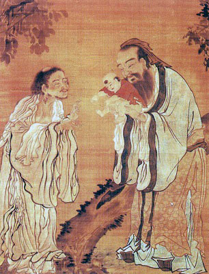

  
[Intangible Textual Heritage](../../index)  [Confucianism](../index) 

------------------------------------------------------------------------

[Buy this Book at
Amazon.com](https://www.amazon.com/exec/obidos/ASIN/0404604161/internetsacredte)

------------------------------------------------------------------------

<table width="75%">
<colgroup>
<col style="width: 50%" />
<col style="width: 50%" />
</colgroup>
<tbody>
<tr class="odd">
<td width="50%" data-valign="TOP"> 
The Baby Confucius is Presented to Lao Tsu (Public Domain Image)</td>
<td width="50%" data-valign="CENTER"><h1 id="confucianism-and-its-rivals" data-align="CENTER">Confucianism and Its Rivals</h1>
<h2 id="by-herbert-a.-giles" data-align="CENTER">by Herbert A. Giles</h2>
<h4 id="section" data-align="CENTER">[1915]</h4></td>
</tr>
</tbody>
</table>

------------------------------------------------------------------------

[Contents](#contents)    [Start Reading](cair00)    [Page
Index](pageidx)    [Text \[Zipped\]](cairtxt.zip)

------------------------------------------------------------------------

|                                                                                                                           |
|---------------------------------------------------------------------------------------------------------------------------|
|  |

China is home to two major world religions, Confiucianism and Taoism,
and also played an important role in the historical development of a
third, Northern Buddhism. Eventually, Confucianism became the state
religion, and, purged of metaphysical aspects, the dominant Chinese
religion until the 20th century. Other religions, including
Christianity, Judaism, and Islam, have all had indigenous expressions as
well.

Giles covers the entire history of Chinese religion in this book, which
was originally delivered as one of the Hibbert lectures in 1914. Herbert
Allen Giles (b. Dec. 8, 1845, d. Feb. 13, 1935), was a British diplomat
and an old China hand. He is best known for his role in developing the
Wade-Giles system of transliterating Chinese. Giles was the father of
Lionel Giles, who was also a distinguished orientalist, and translator
of [Sun Tzu's Art of War](../artwar.txt), among
[others](../../cat/srchauth.htm?search_str=lionel+giles).

------------------------------------------------------------------------

 [Title Page](cair00)  
[Preface](cair01)  
[Contents](cair02)  
[Lecture I. B.C. 3000-1200](cair03)  
[Lecture II. B.C. 1200-500](cair04)  
[Lecture III. B.C. 500-300](cair05)  
[Lecture IV. B.C. 300-200](cair06)  
[Lecture V. B.C. 200-A.D. 100](cair07)  
[Lecture VI. A.D. 100-600](cair08)  
[Lecture VII. A.D. 600-1000](cair09)  
[Lecture VIII. A.D. 1000-1915](cair10)  
[Index](cair11)  
