  
[Intangible Textual Heritage](../../index)  [Confucianism](../index) 
[Index](index)  [Previous](choc00)  [Next](choc02) 

------------------------------------------------------------------------

[Buy this Book at
Amazon.com](https://www.amazon.com/exec/obidos/ASIN/0875481558/internetsacredte)

------------------------------------------------------------------------

  
*Chinese Occultism*, by Paul Carus, \[1907\], at Intangible Textual
Heritage

------------------------------------------------------------------------

p. 25

### CHINESE OCCULTISM.

Belief in mysterious agencies
characterises a certain period in the religious development of every
nation. Even the Jews, distinguished among the Semites by their
soberness, consulted Yahveh through the Urim and Thummim, an oracle the
nature of which is no longer definitely known. Kindred institutions
among most nations are based upon primitive animism, or a belief in
spirits, but in China we have a very peculiar mixture of logical
clearness with fanciful superstitions. Chinese occultism is based upon a
rational, nay a philosophical, or even mathematical, conception of
existence. An original rationalism has here engendered a most luxurious
growth of mysticism, and so the influence of occultism upon the people
of the Middle Kingdom has been prolonged beyond measure.

### THE YIH SYSTEM.

Among the ancient traditions of China there is a unique system of
symbols called the *yih* (
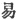), i.e., "permutations" or "changes,"

THE TWO PRIMARY FORMS [\*](#fn_0) (LIANG I).

|             |                                                 |                                                 |
|-------------|-------------------------------------------------|-------------------------------------------------|
|             | THE YANG                                        | THE YIH                                         |
| Old form    |   |   |
| Modern form |  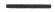 |   |

p. 26

which consists of all possible combinations of two elements, called
*liang i* ( 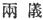), i.e., the
two elementary forms, which are the negative principle, *yin* ( 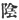), and the positive principle,
*yang* ( 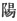). The four
possible configurations of yang and yin in groups of two are called ssu
shiang ( 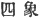), i.e., "the
four \[secondary\] figures"; all further combinations of the elementary
forms into groups of three or more are called *kwa* ( ). In English, groups of three
elementary forms are commonly called trigrams, and groups of six,
hexagrams.

The book in which the permutations of yang and yin are recorded, was
raised in ancient times to the dignity of a canonical writing, a class
of literature briefly called *king* in Chinese. Hence the book is known
under the title of *Yih King*.

The *Yih King* is one of the most ancient, most curious, and most
mysterious documents in the world. It is more mysterious than the
pyramids of Egypt, more ancient than the Vedas of India, more curious
than the cuneiform inscriptions of Babylon.

In the earliest writings, the yang is generally represented as a white
disk and the yin as a black one; but later on the former is replaced by
one long dash denoting strength, the latter by two short dashes
considered as a broken line to represent weakness. Disks are still used
for diagrams, as in the Map of Ho and the Table of Loh, but the later
method was usually employed, even before Confucius, for picturing kwa
combinations.

The trigrams are endowed with symbolical meaning according to the way in
which yin and yang lines are combined. They apply to all possible
relations of life and so their significance varies.

Since olden times, the yih system has been considered a philosophical
and religious panacea; it is believed to solve all problems, to answer
all questions, to heal all ills. He who understands the yih is supposed
to possess the key to the riddle of the universe.

The yih is capable of representing all combinations of existence. The
elements of the yih, yang the positive principle and yin the negative
principle, stand for the elements of being. Yang means "bright," and
yin, "dark." Yang is the principle of heaven; yin, the principle of the
earth. Yang is the sun, yin is the moon. Yang is masculine and active;
yin is feminine and passive. The

p. 27

THE FOUR FIGURES (SSU SHIANG).

<table data-border="1">
<colgroup>
<col style="width: 11%" />
<col style="width: 11%" />
<col style="width: 11%" />
<col style="width: 11%" />
<col style="width: 11%" />
<col style="width: 11%" />
<col style="width: 11%" />
<col style="width: 11%" />
<col style="width: 11%" />
</colgroup>
<tbody>
<tr class="odd">
<td data-valign="top">
SYMBOL
</td>
<td data-valign="top">
NAME
</td>
<td colspan="7" data-valign="top">
SIGNIFICANCE
</td>
</tr>
<tr class="even">
<td data-valign="top">
 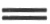
</td>
<td data-valign="top">
Yang 
Major
</td>
<td data-valign="top">
Sun
</td>
<td data-valign="top">
Heat
</td>
<td data-valign="top">
Mentality (or leadership)
</td>
<td data-valign="top">
Unity (or origin)
</td>
<td data-valign="top">
The nature of things (essence)
</td>
<td data-valign="top">
Eyes
</td>
<td data-valign="top">
Great Monarch <a href="#fn_3">3</a>
</td>
</tr>
<tr class="odd">
<td data-valign="top">
 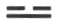
</td>
<td data-valign="top">
Yang 
Minor
</td>
<td data-valign="top">
Fixed Stars
</td>
<td data-valign="top">
Daylight
</td>
<td data-valign="top">
Corporality (bodily organism)
</td>
<td data-valign="top">
Rotation
</td>
<td data-valign="top">
Compound things <a href="#fn_1">1</a>
</td>
<td data-valign="top">
Nose
</td>
<td data-valign="top">
Prince
</td>
</tr>
<tr class="even">
<td data-valign="top">
 
</td>
<td data-valign="top">
Yin 
Minor
</td>
<td data-valign="top">
Planets
</td>
<td data-valign="top">
Night
</td>
<td data-valign="top">
Materiality (inertia; bodily substance)
</td>
<td data-valign="top">
Succession
</td>
<td data-valign="top">
Multiplicity <a href="#fn_2">2</a>
</td>
<td data-valign="top">
Mouth
</td>
<td data-valign="top">
Duke
</td>
</tr>
<tr class="odd">
<td data-valign="top">
 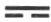
</td>
<td data-valign="top">
Yin 
Major
</td>
<td data-valign="top">
Moon
</td>
<td data-valign="top">
Cold
</td>
<td data-valign="top">
Sensuality; passion
</td>
<td data-valign="top">
Quality
</td>
<td data-valign="top">
Attributes of things
</td>
<td data-valign="top">
Ears
</td>
<td data-valign="top">
Emperor
</td>
</tr>
</tbody>
</table>

p. 28

former is motion; the latter is rest. Yang is strong, rigid, lordlike;
yin is mild, pliable, submissive, wifelike. The struggle between, and
the different mixture of, these two elementary contrasts, condition all
the differences that prevail, the state of the elements, the nature of
things, and also the character of the various personalities as well as
the destinies of human beings.

The Yih King ( 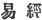) is very
old, for we find it mentioned as early as the year 1122 B.C., in the
official records of the Chou dynasty, where we read that three different
recensions of the work

THE EIGHT KWA FIGURES AND THE BINARY SYSTEM.

<table style="width:100%;" data-border="0">
<colgroup>
<col style="width: 16%" />
<col style="width: 16%" />
<col style="width: 16%" />
<col style="width: 16%" />
<col style="width: 16%" />
<col style="width: 16%" />
</colgroup>
<tbody>
<tr class="odd">
<td data-valign="top">
NAME
</td>
<td data-valign="top">
TRANSCRIPTION
</td>
<td data-valign="top">
MEANINGS OF THE CHINESE WORD <a href="#fn_4">*</a>
</td>
<td data-valign="top">
KWA
</td>
<td data-valign="top">
BINARY 
SYSTEM
</td>
<td data-valign="top">
ARABIC 
NUMERALS
</td>
</tr>
<tr class="even">
<td data-valign="top">
 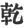
</td>
<td data-valign="top">
ch‘ien
</td>
<td data-valign="top">
to come out; to rise, sunrise; vigorous; (present meaning) dry.
</td>
<td data-valign="top">
 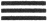
</td>
<td data-valign="top">
111
</td>
<td data-valign="top">
7
</td>
</tr>
<tr class="odd">
<td data-valign="top">
 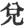
</td>
<td data-valign="top">
tui
</td>
<td data-valign="top">
to weigh; to barter; permeable.
</td>
<td data-valign="top">
 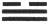
</td>
<td data-valign="top">
110
</td>
<td data-valign="top">
6
</td>
</tr>
<tr class="even">
<td data-valign="top">
 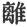
</td>
<td data-valign="top">
li
</td>
<td data-valign="top">
to separate
</td>
<td data-valign="top">
 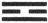
</td>
<td data-valign="top">
101
</td>
<td data-valign="top">
5
</td>
</tr>
<tr class="odd">
<td data-valign="top">
 
</td>
<td data-valign="top">
chan
</td>
<td data-valign="top">
to quake; to thunder
</td>
<td data-valign="top">
 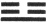
</td>
<td data-valign="top">
100
</td>
<td data-valign="top">
4
</td>
</tr>
<tr class="even">
<td data-valign="top">
 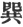
</td>
<td data-valign="top">
sun
</td>
<td data-valign="top">
peaceful; a stand or pedestal
</td>
<td data-valign="top">
 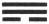
</td>
<td data-valign="top">
011
</td>
<td data-valign="top">
3
</td>
</tr>
<tr class="odd">
<td data-valign="top">
 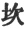
</td>
<td data-valign="top">
k‘an
</td>
<td data-valign="top">
a pit; to dig a pit.
</td>
<td data-valign="top">
 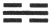
</td>
<td data-valign="top">
010
</td>
<td data-valign="top">
2
</td>
</tr>
<tr class="even">
<td data-valign="top">
 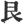
</td>
<td data-valign="top">
kan
</td>
<td data-valign="top">
a limit; to stop; perverse.
</td>
<td data-valign="top">
 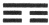
</td>
<td data-valign="top">
001
</td>
<td data-valign="top">
1
</td>
</tr>
<tr class="odd">
<td data-valign="top">
 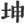
</td>
<td data-valign="top">
kw‘un
</td>
<td data-valign="top">
earth; to nourish; yielding.
</td>
<td data-valign="top">
 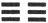
</td>
<td data-valign="top">
000
</td>
<td data-valign="top">
 0
</td>
</tr>
</tbody>
</table>

were extant, the *Lien Shan*, the *Kwei Ts‘ang* and the *Yih of
Chou*, [1](#fn_5) of which, however, the last one
alone has been preserved.

This *Yih of Chou*, our present *Yih King*, exhibits two arrangements of
the kwa figures, of which one is attributed to their originator,

p. 29

the legendary Fuh-Hi, [2](#fn_6) the other to Wen
Wang. [3](#fn_7) Fuh-Hi is also called
Feng, [4](#fn_8) "wind," and Tai Ho, [5](#fn_9) "the great celestial," and he lived,
according to Chinese records, from 2852 to 2738 B.C. It speaks well for
the mathematical genius of the ancient founders of Chinese civilisation
that the original order of the yih, attributed to Fuh-Hi, corresponds
closely to Leibnitz’ Binary System of arithmetic. If we let the yin
represent 0 and the yang, 1, it appears that the eight trigrams signify
the first eight figures from 0–7, arranged in their proper arithmetical
order, and read from below upward. Leibnitz knew the yih and speaks of
it in terms of high

 
[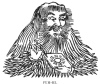  
Click to enlarge](img/02900.jpg)  
FUH-HI.  

appreciation. Indeed it is not impossible that it suggested to him his
idea of a binary system.

While Fuh-Hi's system exhibits a mathematical order, Wen Wang's is based
upon considerations of occultism. It stands to reason that Fuh-Hi (by
which name we understand that school, or founder of a school, that
invented the yih) may not have grasped the full significance of his
symbols in the line of abstract thought and especially in mathematics,
but we must grant that he was a

p. 30

mathematical genius, if not in fact, certainly potentially. As to
further details our information is limited to legends.

The case is different with Wen Wang, for his life is inscribed on the
pages of Chinese history and his character is well known.

The personal name of Wen Wang (i.e., the "scholar-king") is Hsi-Peh,
which means "Western Chief." He was the Duke of Chou, one of the great
vassals of the empire, and lived from 1231 to 1135 B.C. In his time the
emperor was Chou-Sin, a degenerate debauché and a tyrant, the last of
the Yin dynasty, who oppressed the people by reckless imposition and
provoked a just rebellion. Wen Wang offended him and was long kept in
prison, but his son

THE TRIGRAMS AS FAMILY RELATIONS.

<table style="width:100%;" data-border="1">
<colgroup>
<col style="width: 16%" />
<col style="width: 16%" />
<col style="width: 16%" />
<col style="width: 16%" />
<col style="width: 16%" />
<col style="width: 16%" />
</colgroup>
<tbody>
<tr class="odd">
<td colspan="3" data-valign="top">
FATHER 
 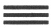
</td>
<td colspan="3" data-valign="top">
MOTHER 
 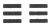
</td>
</tr>
<tr class="even">
<td data-valign="top">
Eldest Son 
 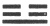
</td>
<td data-valign="top">
Second Son 
 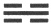
</td>
<td data-valign="top">
Youngest Son 
 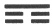
</td>
<td data-valign="top">
Eldest Daughter 
 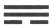
</td>
<td data-valign="top">
Second Daughter 
 
</td>
<td data-valign="top">
Youngest Daughter 
 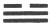
</td>
</tr>
<tr class="odd">
<td width="94"></td>
<td width="94"></td>
<td width="99"></td>
<td width="110"></td>
<td width="119"></td>
<td width="130"></td>
</tr>
</tbody>
</table>

\[paragraph continues\] Fa, surnamed Wu
Wang, being forced into a conflict with Chou-Sin, overthrew the imperial
forces. The tyrant died in the flames of his palace which had been
ignited by his own hands. Wu Wang [6](#fn_10)
assumed the government and became the founder of the Chou dynasty which
reigned from 1122 until 225 B.C.

Wen Wang was a man of earnest moral intentions, but with a hankering
after occultism. During his imprisonment he occupied himself in his
enforced leisure with the symbols of the yih, and found much comfort in
the divinations which he believed to discover in them. When he saw
better days he considered that the

p. 31

prophecies were fulfilled, and his faith in their occult meaning became
more and more firmly established. [7](#fn_11)

The eight permutations of the trigrams apparently form the oldest part
of the *Yih King*. They have been an object of contemplation since time
immemorial and their significance is set forth in various ways. The
trigrams consisting of three yang lines are called the unalloyed yang,
and of three yin lines, the unalloyed yin. In the mixed groups the place
of honor is at the bottom, and if they are conceived as family
relations, the unalloyed yang represents

  [  
Click to enlarge](img/03100.jpg)  
ARRANGEMENT OF TRIGRAMS ACCORDING TO FUH-HI.  

the father and the unalloyed yin, the mother. The three sons are
represented by the trigrams containing only one yang; the eldest son
having yang in the lowest place, the second in the middle, and the third
on top. The corresponding trigrams with only one yin line represent in
the same way the three daughters.

The trigrams are also arranged both by Fuh-Hi and Wen Wang in the form
of a mariner's compass. In the system of Fuh-Hi the

p. 32

unalloyed yin stands at the north, the unalloyed yang at the south. The
others are so arranged that those which correspond to 1, 2, 3, of
Leibnitz’ Binary System proceed from north through west to south in
regular order, while 4, 5, 6, start from south taking the corresponding
places in the east. In this mathematical arrangement we always have the
opposed configurations in opposite quarters, so as to have for each
place in every opposite kwa a yang line correspond with a yin line and
*vice versa;* while if they are expressed

  [  
Click to enlarge](img/03200.jpg)  
ARRANGEMENT OF TRIGRAMS ACCORDING TO WEN WANG.  

in numbers of the binary system, their sums are always equal to seven.

Wen Wang rearranged the trigrams and abandoned entirely the mathematical
order attributed to Fuh-Hi. The following quotation from the *Yih King*
evinces the occultism which influenced his thoughts:

"All things endowed with life have their origin in
chan, as chan corresponds to the east. They are in harmonious existence
in siuen because siuen corresponds to the southeast. Li is brightness
and renders all things visible

p. 33

to one another, being the kwa which represents the
south. Kw‘un is the earth from which all things endowed with life
receive food. Tui corresponds to mid-autumn. Ch‘ien is the kwa of the
northwest. Kan is water, the kwa [of](errata.htm#0) the exact north
representing distress, and unto it everything endowed with life reverts.
Kan is the kwa of the northeast where living things both rise and
terminate."

Since this new arrangement is absolutely dependent on occult
considerations, the grouping must appear quite arbitrary from the
standpoint of pure mathematics. It is natural that with the growth of
mysticism this arbitrariness increases and the original system is lost
sight of.

The yin and yang elements are supposed to be the product of a
differentiation from the *t‘ai chih*, "the grand limit," i.e., the
absolute or ultimate reality of all existence, which, containing both
yang and yin in potential efficiency, existed in the beginning. The
grand limit evolved the pure yang as ether or air, which precipitated
the Milky Way, shaping the visible heaven or firmament; while the yin
coagulated and sank down to form the earth. But the earth contained
enough of the yang to produce heat and life. Some unalloyed yang
particles rose to form the sun, while correspondingly other unalloyed
yin particles produced the moon, the two great luminaries, which in
their turn begot the fixed stars.

------------------------------------------------------------------------

### Footnotes

[25:\*](choc01.htm#fr_0) It is difficult to
translate the term *Liang I*. One might call the two I "elements," if
that word were not used in another sense. The two I are commonly
referred to as "Elementary Forms" or "Primary Forms." De Groot speaks of
them as "Regulators."

[27:1](choc01.htm#fr_2) Unity in multiplicity,
i.e., the Yang dominating over the Yin.

[27:2](choc01.htm#fr_3) Multiplicity in unity,
i.e., the Yin dominating over the Yang.

[27:3](choc01.htm#fr_1) While the Yin major
denotes dominion in the concrete world of material existence, the Yang
major symbolises the superhuman and supernatural, the divine, the
extraordinary, such as would be a genius on a throne, a great man in the
highest sense of the word.

[28:\*](choc01.htm#fr_4) A native student of the
Yih system does not connect the usual meaning of the word with the names
of the eight Kwas, and we insert here a translation of the character
only for the sake of completeness.

[28:1](choc01.htm#fr_5) Lien Shan means "mountain
range" and by some is supposed to be a *nom de plume* of Shen Nung (i.e.
"divine husbandman"), the mythical ruler of ancient China (2737–2697
B.C.), successor to Fuh-Hi. Others identify Lien Shan with Fuh-Hi. Kwei
Ts’ang means "reverted hoard" and may have been simply an inversion of
the Lien Shan arrangement. Its invention is assigned to the reign of
Hwang Ti, "the Yellow Emperor," the third of the three rulers,
(2697–2597 B.C.), a kind of a Chinese Numa Pompilius. The Chou redaction
of the Yih, which is the latest one, is named after the Chou dynasty.

[29:2](choc01.htm#fr_6)  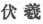.

[29:3](choc01.htm#fr_7)  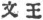.

[29:4](choc01.htm#fr_8)  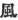.

[29:5](choc01.htm#fr_9)  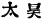.

[30:6](choc01.htm#fr_10) Wu Wang was born 1169
B.C.; he became emperor in 1122 B.C. and died 1116 B.C.

[31:7](choc01.htm#fr_11) Mayers, *Chinese
Reader's Manual*, p. 177.

------------------------------------------------------------------------

[Next: The Tablet of Destiny](choc02)
