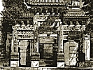

  
[Intangible Textual Heritage](../../index)  [Confucianism](../index.md) 
[Index](index)  [Previous](choc01)  [Next](choc03.md) 

------------------------------------------------------------------------

[Buy this Book at
Amazon.com](https://www.amazon.com/exec/obidos/ASIN/0875481558/internetsacredte.md)

------------------------------------------------------------------------

  
*Chinese Occultism*, by Paul Carus, \[1907\], at Intangible Textual
Heritage

------------------------------------------------------------------------

#### THE TABLET OF DESTINY.

At the beginning of Chinese history stands a tablet which in some
mysterious way is supposed to be connected with an explanation of the
universe. It has been reconstructed by later Chinese thinkers and is
pictured in the hands of Fuh-Hi as an arrangement of the kwa figures
preserved in the *Yih King*. Considering the several traces of
Babylonian traditions in ancient Chinese literature and folklore, would
it not be justifiable to identify the tablet of Fuh-Hi with the ancient
Babylonian "Tablet of Destiny" mentioned in the Enmeduranki Text, a copy
of which was discovered in the archives of Asurbanipal [20](#fn_12.md) and was said to contain the "Mystery of
Heaven and Earth?"

p. 34

Enmeduranki, king of Sippar, is the seventh of the aboriginal kings, and
he declares that he received the divine tablet "from Anu, \[Bel, and
Ea\]." [21](choc03.htm#fn_13.md)

Chinese sages have their own interpretation of the phrase "the mystery
of heaven and earth." They would at once associate the words "heaven"
and "earth" with the two opposing principles yang and yin, and the
question is whether among the ancient Sumerians there was not a similar
tendency prevalent. It seems to be not impossible that the Chinese
tablet in the hands of Fuh-Hi is the same as the "Tablet of Destiny" of
the Sumerians, and when some Assyriologist has informed himself of the
primitive Chinese conception of this mysterious tablet, he may be able
to throw some additional light on the subject.

------------------------------------------------------------------------

### Footnotes

[33:20](choc02.htm#fr_12.md) K2486 and K4364; cf.
Zimmern, KAT3 533.

------------------------------------------------------------------------

[Next: Divination](choc03.md)
