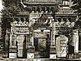
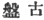

  
[Intangible Textual Heritage](../../index)  [Confucianism](../index.md) 
[Index](index)  [Previous](choc04)  [Next](choc06.md) 

------------------------------------------------------------------------

[Buy this Book at
Amazon.com](https://www.amazon.com/exec/obidos/ASIN/0875481558/internetsacredte.md)

------------------------------------------------------------------------

  
*Chinese Occultism*, by Paul Carus, \[1907\], at Intangible Textual
Heritage

------------------------------------------------------------------------

#### P‘AN-KU.

The basic idea of the yih philosophy was so convincing that it almost
obliterated the Taoist cosmogony of P‘an-Ku who is said to have chiseled
the world out of the rocks of eternity. Though the legend is not held in
high honor by the *literati*, it contains some features of interest
which have not as yet been pointed out and deserve at least an
incidental comment.

P‘an-Ku is written in two ways: one [8](#fn_18.md)
means in literal translations, "basin ancient," the other "basin
solid." [9](#fn_19.md) Both are homophones, i.e.,
they are pronounced the same way; and the former may be preferred as the
original and correct spelling. Obviously the name means "aboriginal
abyss," or in the terser German, *Urgrund*, and we have reason to
believe it to be a translation of the Babylonian *Tiamat*, "the Deep."

The Chinese legend tells us that P‘an-Ku's bones changed to rocks; his
flesh to earth; his marrow, teeth and nails to metals; his hair to herbs
and trees; his veins to rivers; his breath to wind; and his four limbs
became pillars marking the four corners of the world,—which is a Chinese
version not only of the Norse myth of the Giant Ymir, but also of the
Babylonian story of Tiamat.

p. 41

Illustrations of P‘an-Ku represent him in the company of supernatural
animals that symbolise old age or immortality, viz., the tortoise and
the crane; sometimes also the dragon, the emblem of power, and the
phenix, the emblem of bliss.

\*    \*    \*

When the earth had thus been shaped from the body of P‘an-Ku, we are
told that three great rulers successively governed the world: first the
celestial, then the terrestrial, and finally the human sovereign. They
were followed by Yung-Ch‘eng and Sui-Jen (i.e., fire-man) the latter
being the Chinese Prometheus, who brought the fire down from heaven and
taught man its various uses.

The Prometheus myth is not indigenous to Greece, where it received the
artistically classical form under which it is best known to us. The
name, which by an ingenious afterthought is explained as "the fore
thinker," is originally the Sanskrit *pramantha* [10](choc06.htm#fn_20.md) and means "twirler" or
"fire-stick," being the rod of hard wood which produced fire by rapid
rotation in a piece of soft wood.

We cannot deny that the myth must have been known also in Mesopotamia,
the main center of civilisation between India and Greece, and it becomes
probable that the figure Sui-Jen has been derived from the same
prototype as the Greek Prometheus.

------------------------------------------------------------------------

### Footnotes

[40:8](choc05.htm#fr_18.md)  

[40:9](choc05.htm#fr_19.md)  

------------------------------------------------------------------------

[Next: The Five Elements](choc06.md)
