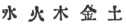

  
[Intangible Textual Heritage](../../index)  [Confucianism](../index) 
[Index](index)  [Previous](choc05)  [Next](choc07) 

------------------------------------------------------------------------

[Buy this Book at
Amazon.com](https://www.amazon.com/exec/obidos/ASIN/0875481558/internetsacredte)

------------------------------------------------------------------------

  
*Chinese Occultism*, by Paul Carus, \[1907\], at Intangible Textual
Heritage

------------------------------------------------------------------------

#### THE FIVE ELEMENTS.

Occultism dominated the development of thought during the Middle Ages of
China not less than in Europe, and here again in the conception of the
elements we find traces of a common origin in both the East and West.

The Chinese speak of five elements: water, fire, wood, metal, and earth;
while, according to the ancient sages of Hellas and India, there are but
four: water, fire, earth, and air. This latter view also

p. 42

\[paragraph continues\] (although in a
later age) has migrated to China, where it is commonly accepted among
the Buddhists, but has been modified in so far as ether has been
superadded so as to make the elements of the Buddhist-Chinese conception
equal in number to the older enumeration which we may call the Taoist
view.

  [  
Click to enlarge](img/04200.jpg)  
DIFFERENT REPRESENTATIONS OF THE ELEMENTS.  

\[The proportions of the several heights are deemed
important, and are as follows: the square, to; the circle, 9; the
triangle, 7; the crescent, 2; the gem, 6. When built in the form of a
*stupa*, the square changes into a cube, the circle into a globe, the
triangle into a four-sided pyramid, and the crescent and gem also into
solid bodies. The globe retains its proper dimensions but is, as it
were, pressed into the cube and the pyramid; the pyramid is frequently
changed into an artistically carved roof. The Mediæval European
conception is obviously not original.\]

That the Buddhist conception of the five elements has been imported to
China from India, is proved beyond question by the fact

p. 43

  [  
Click to enlarge](img/04300.jpg)  
TIBETAN STUPA.  

\[This illustration is reproduced from *The East of Asia*, (June 1905),
an illustrated magazine printed in Shanghai, China.

The monument represents the five elements, but its shape is no longer
exact. The upper part of the cube shows a formation of steps, not unlike
the Babylonian zikkurat or staged tower. The globe is no longer a true
sphere, and the pyramid has been changed into a pointed cone, so slender
as to be almost a pole. The monument is probably used as a mausoleum\]

p. 44

that the Chinese diagrams are frequently marked with their Sanskrit
terms. It is strange that the symbolic diagrams are more nearly
identical than their interpretations. Earth is represented by a square,
water by a sphere, fire by a triangle, air by a crescent.

  [  
Click to enlarge](img/04400.jpg)  
GATEWAY TO BUDDHIST MONASTERY, PEKIN.  

A further development of the Stupa of the five elements.

\[The cube has been changed into a roofed house; the sphere has assumed
the shape of a Chinese cap, the pyramid is adorned with a peculiar
ornament imitative of a cover, and the crescent has been changed into a
flower-like knob, as has also the gem which surmounts the whole.\]

p. 45

and ether by a gem surmounting the whole. The two upper symbols are
conceived as one in the treatises of the mediæval alchemy of Europe, and
serve there as the common symbol of air. The symbol ether is commonly
called by its Sanskrit term *mani*, which literally means "gem," and in
popular imagination is endowed with magic power.

The five elements are also represented by memorial poles which on the
Chinese All Souls' Day are erected at the tombs of the dead, on which
occasion the grave is ornamented with lanterns, and a torch is lit at
evening.

All over the interior of Asia so far as it is dominated by Chinese
civilisation, we find *stupas* built in the shape of the symbols of the
five elements, and their meaning is interpreted in the sense that the
body of the dead has been reduced to its original elements. We must not,
however, interpret this idea in a materialistic sense, for it is meant
to denote an absorption into the All and a return to the origin and
source of life.

It is noticeable that this reverence of the elements as divine is a
well-known feature of ancient Mazdaism, the faith of the Persians. and
is frequently alluded to by Herodotus in his description of Persian
customs. The desire not to desecrate the elements causes the Persians to
regard burial and cremation as offensive. They deposit their dead in the
Tower of Silence, leaving them there to the vultures, whereby the
pollution by the corpse either of earth or of fire is avoided.

The Taoist view of the elements is different from the Buddhist
conception, and we may regard it as originally and typically Chinese. At
any rate it is full of occultism and constitutes an important chapter in
the mystic lore of China. According to this view, the five elements are
water, fire, wood, metal, and earth. [\*](#fn_21) The knowledge of these elements, legend
tells us, is somehow connected with the marks on the shell of the sacred
tortoise which, having risen from the river Loh, appeared to Ts‘ang-Hieh
(Mayers, *Ch. R. M.*, I, 756). Tsou-Yen, a philosopher who lived in the
fourth century B.C.,

p. 46

wrote a treatise on cosmogony in which the five elements play an
important part (Mayers, *Ch. R. M.*, I, 746).

The five elements also figure prominently in "The Great Plan," [11](#fn_22) which is an ancient imperial manifesto on
the art of good government. There it is stated that like everything else
they are produced by the yang and yin, being the natural results of that
twofold breath which will operate favorably or unfavorably upon the
living or the dead according to the combination in which they are mixed.
All misfortunes are said to arise from a disturbance of the five
elements in a given situation, and thus the Chinese are very careful not
to interfere with nature or cause any disturbance of natural conditions.
We are told in "The Great Plan" [12](#fn_23)
that "in olden times K‘wan dammed up the inundating waters and so
disarranged the five elements. The Emperor of Heaven was aroused to
anger and would not give him the nine divisions of the Great Plan. In
this way the several relations of society were disturbed, and \[for
punishment\] he was kept in prison until he died." K‘wan’s misfortune
has remained a warning example to the Chinese. In their anxiety not to
disturb the proper mixture in which the five elements should be combined
they pay great attention to those pseudo-scientific professors who
determine the prevalence of the several elements, not by studying facts
but by interpreting some of the most unessential features, for instance,
the external shape of rocks and plants. Pointed crags mean "fire";
gently rounded mountains, "metal"; cones and sugar-loaf rocks represent
trees, and mean "wood"; and square plateaus denote "earth"; but if the
plateau be irregular in shape so as to remind one of the outlines of a
lake, it stands for "water." It would lead us too far to enter into
further details; at the same time it would be difficult to lay down
definite rules, as there is much scope left to the play of the
imagination, and it is certain that, while doctors may disagree in the
Western world, the geomancers of China have still more opportunity for a
great divergence of opinion.

The elements are supposed to conquer one another according

p. 47

to a definite law. We are told that wood conquers earth, earth conquers
water, water conquers fire, fire conquers metal, and metal conquers
wood. This rule which is preserved by Liu An of the second century B.C.
is justified by Pan Ku, a historian of the second century A. D.,
compiler of the books of the era of the Han dynasty, as follows:

"By wood can be produced fire, by fire can be
produced earth \[in other words, wood through fire is changed to
ashes\]; from earth can be produced metal \[i.e., by mining\]; from
metal can be produced water \[they can be changed through heat to a
liquid state\]; from water can be produced wood \[plants\]. When fire
heats metal, it makes it liquid \[i.e., it changes it into

THE FIVE ELEMENTS AND THEIR INTERRELATION.

|          |        |       |       |        |         |
|----------|--------|-------|-------|--------|---------|
| ELEMENTS | PARENT | CHILD | ENEMY | FRIEND | PLANET  |
| water's  | metal  | wood  | earth | fire   | Mercury |
| fire's   | wood   | earth | water | metal  | Mars    |
| wood's   | water  | fire  | metal | earth  | Jupiter |
| metal's  | earth  | water | fire  | wood   | Venus   |
| earth's  | fire   | metal | wood  | water  | Saturn  |

the state of the element water\]. When water
destroys fire it operates adversely upon the very element by which it is
produced. Fire produces earth, yet earth counteracts water. No one can
do anything against these phenomena, for the power which causes the five
elements to counteract each other is according to the natural
dispensation of heaven and earth. Large quantities prevail over small
quantities, hence water conquers fire. Spirituality prevails over
materiality, the non-substance over substance, thus fire conquers metal;
hardness conquers softness, hence metal conquers wood; density is
superior to incoherence, therefore, wood conquers earth; solidity
conquers insolidity, therefore earth conquers water."

Besides being interrelated as parent and offspring, or as friend and
enemy, the five elements are represented by the five planets, so that
water corresponds to Mercury, fire to Mars, wood to Jupiter, metal to
Venus, and earth to Saturn.

p. 48

The yih system being cosmic in its nature, has been used by the Chinese
sages to represent the universe. The first attempt in this direction is
Fuh-Hi's diagram in compass form representing the four quarters and four
intermediary directions.

The system was changed by Wen Wang who rearranged the eight trigrams but
retained the fundamental idea. It was supposed to have been revealed to
Fuh-Hi on the back of a tortoise, but later sages superadded to the
fundamental idea further characteristics

  [  
Click to enlarge](img/04800.jpg)  
The Mystic Tablet  

THE MYSTIC TABLET. [13](#fn_24)

of the universe, according to their more complicated knowledge of
science and occultism.

We reproduce here a mystic tablet of Tibetan workmanship, which,
however, reflects the notions prevailing over the whole Chinese empire.
The kwa tablet lies on the back of the tortoise, presumably the same as
was supposed to have been present when P‘an-Ku chiseled the world from
out of the rocks of eternity—and

p. 49

certainly the same tortoise which made its appearance in the Loh river
to reveal the secret of the kwa to Fuh-Hi.

In the center of our kwa tablet is the magic square written in Tibetan
characters, which is the same as that represented in dots in the
so-called "Writing of Loh." [14](#fn_25) It is
also depicted as resting in its turn on the carapace of a smaller
tortoise.

This magic square is surrounded by the twelve animals of the duodenary
cycle, representing both the twelve double-hours of the day, and the
twelve months of the year. In the left lower center is represented the
rat which, in passing around to the left, is followed in order by the
ox, tiger, hare, dragon, serpent, horse, goat, monkey,

  [  
Click to enlarge](img/04900.jpg)  
A TYPICAL CHINESE GRAVE.  

\[The dead are protected against the evil influence
of unfavorably mixed elements in the surroundings of the grave by a
horseshoe-shaped wall. Cf. pp.
[56](choc08.htm#page_56)–[57](choc08.htm#page_57).\]

cock, dog, and boar. The symbols of the days are: a sun for Sunday, a
crescent for Monday; a red eye for Tuesday (red light of the planet
Mars); a hand holding a coin for Wednesday (indicating the function of
the god Mercury); a thunderbolt for Thursday (sacred to Marduk, Jupiter,
Thor, the thunder-god); a buckle for Friday (day of Frigga or Venus);
and a bundle for Saturday.

The duodenary cycle of animals is surrounded by various emblems
indicating lucky and unlucky days. Among these we can discover gems,
buckles, thunderbolts, various limbs of the body, triangles, five-spots,
links of a chain, luck symbols, and swastikas.

p. 50

\[paragraph continues\] They surround the
eight trigrams which are placed according to the arrangement of Wen
Wang. The kwa in the lower part represents north and winter; in the
upper part, the south and summer; toward the right, west and autumn; and
toward the left, east and spring. The kwa in the lower right hand corner
represents heaven; in the lower left, mountain; the upper left, air or
wind; and in the right upper corner, earth.

------------------------------------------------------------------------

### Footnotes

[41:10](choc05.htm#fr_20) See Steinthal's "The
original Form of the Legend of Prometheus" which forms and appendix to
Goldziher's *Mythology Among the Hebrews*, translated by Russell
Martineau, London. 1877.

*Mantha* is derived from the same root as the German word *mangeln*, "to
torture," and one who forces (viz. Agni, the god of fire) is called
*prama-thyu-s* "the fire-robber." The Sanskrit name in its Greek form is
Prometheus, whose nature of fire-god is still recognisable in the
legend.

[45:\*](choc06.htm#fr_21)  

[46:11](choc06.htm#fr_22) A chapter in the *Shu
King*, translated into English by James Legge. *S.B.E.*, vol. III, 137.

[46:12](choc06.htm#fr_23) See *S.B.E.*, III,
139.

[48:13](choc06.htm#fr_24) The table has been
reproduced from Waddell's Buddhism of Tibet, p. 453. Students who take
the trouble to enter into further details are warned that in Waddell's
table, by some strange mistake, the position of the trigrams tui and
chan, in the east and in the west, has been reversed, a mistake which we
have corrected in our reproduction.

[49:14](choc06.htm#fr_25) See the author's
pamphlet, Chinese Philosophy, p. 19.

------------------------------------------------------------------------

[Next: Systems of Enumeration](choc07)
