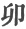
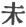

  
[Intangible Textual Heritage](../../index)  [Confucianism](../index) 
[Index](index)  [Previous](choc06)  [Next](choc08) 

------------------------------------------------------------------------

[Buy this Book at
Amazon.com](https://www.amazon.com/exec/obidos/ASIN/0875481558/internetsacredte)

------------------------------------------------------------------------

  
*Chinese Occultism*, by Paul Carus, \[1907\], at Intangible Textual
Heritage

------------------------------------------------------------------------

#### SYSTEMS OF ENUMERATION.

The twelve animals which are pictured on our Tibetan tablet are a
curious relic of prehistoric civilisation. They represent at once the
twelve months, the twelve divisions of the zodiac, and the twelve double
hours of the day. Kindred systems of designating duodecimal divisions of
the cosmos, both in time and space, by a cycle of animals can be traced
in Babylon, Egypt, primitive America, and modern Europe, where to the
present day the constellations along the ecliptic are divided into
twelve groups, called the Zodiac, or *Thierkreis*, i.e., the animal
cycle.

The duodenary cycle is an ancient method of counting, expressed by
animal names, a custom which has only been abolished in Japan since the
Great Reform under the influence of Western civilisation. Up to that
time people spoke there of "the rat hour," "the ox hour," "the tiger
hour," etc., and these terms had no other significance than in Western
countries, one o'clock, two o'clock, or three o'clock.

The twelve animals are affiliated with the twelve branches, so-called,
which practically possess the same significance, being also a duodenary
cycle. The twelve branches may be summarily characterised as the twelve
months, beginning with the eleventh in which the yang principle begins
to prepare for its appearance in the new year, and ending in the tenth
month of the ensuing year. The twelve branches are correlated not only
to the twelve animals, but also to the five elements as indicated in our
diagram. The fifth element "earth" is missing because it represents the
center around which the twelve branches are grouped.

p. 51

### THE DUODENARY CYCLE.

|                                |                                                 |                                                 |                                                  |                                                                |                                   |                                                     |                                                 |                                    |
|--------------------------------|-------------------------------------------------|-------------------------------------------------|--------------------------------------------------|----------------------------------------------------------------|-----------------------------------|-----------------------------------------------------|-------------------------------------------------|------------------------------------|
| THE TWELVE BRANCHES            |                                                 |                                                 |                                                  |                                                                |                                   |                                                     | THE TWELVE ANIMALS                              |                                    |
| NO. | NAME                 | TRANSCRIPTION        | USUAL MEANING         | SIGNIFICANCE IN THE DUODENARY CYCLE | SYMBOL | ELEMENT TO WHICH RELATED | NAME                 | MEANING |
| 1                              |   | tze                                             | child                                            | Regeneration of vegetation                                     | Yang stirring underground         | water                                               |   | rat                                |
| 2                              |                                                 |   | chu                                              | cord                                                           | Relaxation; untying a knot        | Hand half-opened                                    |   | ox                                 |
| 3                              |   | yin                                             | to revere                                        | Awakening of life.                                             | Wriggling earthworm               | wood                                                |   | tiger                              |
| 4                              |                                                 |   | mao                                              | a period of time                                               | Plants breaking through the soil  | Opening a gate                                      |   | hare                               |
| 5                              |                                                 |   | chen                                             | vibration                                                      | First vegetation; seed-time       | Thunderstorm                                        |   | dragon                             |
| 6                              |   | ssu                                             | end                                              | Supremacy of Yang                                              | Snake                             | fire                                                |   | serpent                            |
| 7                              |                                                 |   | wu                                               | to oppose                                                      | Yin reasserting itself            | Female principle in hidden growth                   |   | horse                              |
| 8                              |                                                 |   | wei                                              | not yet                                                        | Taste of fruit                    | Tree in full bloom                                  |   | goat                               |
| 9                              |   | shen                                            | to expand                                        | Yin growing strong                                             | Clasped hands                     | metal                                               |   | monkey                             |
| 10                             |                                                 |   | yu                                               | ripe                                                           | Completion                        | Cider or wine-press                                 |   | cock                               |
| 11                             |                                                 |   | shu                                              | guard                                                          | Exhaustion                        | Yang withdrawing underground                        |   | dog                                |
| 12                             |   | hai                                             | \[Kernel\] [\*](#fn_26). | Kernel or root                                                 | Yang in touch with Yin            | water                                               |   | boar                               |

p. 52

There is another system of counting, which however is decimal, and is
called "the ten stems"; and it appears that it is simply an older method
of counting the months of the year. In their original here also the
explanation of the several symbols has reference to the progress of the
year.

It is not impossible that the decimal system was the original and
indigenous Chinese method of counting, while the duodecimal system

THE TEN STEMS.

|                                |                                                 |                                                 |                                               |                                                        |                  |
|--------------------------------|-------------------------------------------------|-------------------------------------------------|-----------------------------------------------|--------------------------------------------------------|------------------|
| NO. | NAME                 | TRANSCRIPTION        | SIGNIFICANCE       | ELEMENT TO WHICH RELATED    |                  |
| 1                              |   | chia                                            | Yang moving in the East sprouting.            | fir tree                                               | wood             |
| 2                              |                                                 |   | yi                                            | Plant growing in a crooked bamboo way; tendril; twig.  | bamboo           |
| 3                              |   | ping                                            | Growth in southern heat; bloom.               | torch-flame                                            | fire             |
| 4                              |                                                 |   | ting                                          | Vegetation in warm season; summer.                     | lamp-light       |
| 5                              |   | wu                                              | Exuberance; surcease of life.                 | mountains                                              | earth            |
| 6                              |                                                 |   | ki                                            | Wintry sleep; hibernation.                             | level ground     |
| 7                              |   | keng                                            | Fullness of crops; the West; autumn fruit.    | weapon                                                 | metal            |
| 8                              |                                                 |   | sin                                           | Ripened fruit and its flavor; supposed to be metallic. | cauldron         |
| 9                              |   | jen                                             | Yin at the height of its function; pregnancy. | billow                                                 | water            |
| 10                             |                                                 |   | kwei                                          | Water absorbed by earth; Yang preparing for spring.    | unruffled stream |

was imported at a very early date from Accad or Sumer, the country of
the founders of Babylonian civilisation.

The existence of these two systems suggests the occurrence of a calendar
reform such as was introduced in Rome under Numa Pompilius, and we are
confronted with the strange coincidence that in China as well as in Rome
the two additional months (January

p. 53

and February) were inserted at the beginning as a result of which we
call even to-day the last month of the year December, i.e., "the tenth."
We must leave the question as to the plausibility of a historical
connection to specialists familiar with the influence of Babylonian
thought on the rest of the world. It is not impossible that a Babylonian
(perhaps Sumerian) calendar reform traveled in both directions, rapidly
toward the more civilised East, and very slowly toward the West.
producing in these remote countries and at different times this
startling coincidence of a similar calendar reform.

We might parenthetically state that the original meaning of the ten
stems and twelve branches has practically been lost sight of, and both
systems have become simply series of figures, the former from one to
ten, the latter from one to twelve; while their symbolical relations,
the former with the elements, the latter with the twelve animals, are of
importance merely to occultists.

The ten stems are also called "the ten mothers," and the twelve
branches, "the twelve children." That the former is the older
arrangement appears from another name which is "the ten hoary
characters.

By a combination of the ten stems with the twelve branches in groups of
two in which the former are repeated six times and the latter five
times, a series of sixty is produced which is commonly called by
sinologists the sexagenary cycle, and is used for naming years as well
as days. The invention of the sexagenary cycle and its application to
the calendar is attributed to Nao the Great, one of the prime ministers
of Hwang Ti, the Yellow Emperor, [15](#fn_27)
who had solicited this work in the sixtieth year of his reign. Nao the
Great, having accomplished .the task, set the beginning of the new era
in the succeeding year, 2637 B.C. Accordingly we live now in the
seventy-sixth cycle which began in 1863 and will end in 1922.

A convenient method of translating the properly Chinese names of the
sexagenary cycle would be to render the two characters by their
equivalent relations to the twelve animals and the five elements,

p. 54

  [  
Click to enlarge](img/05400.jpg)  
The Sexagenary Cycle  

p. 55

so as to speak of the "fir-rat" year, the "bamboo-ox" year, the
"torch-tiger" year, etc.

------------------------------------------------------------------------

### Footnotes

[51:\*](choc07.htm#fr_26) This character has now
no meaning except in its relation to the duodenary cycle. Formerly it
denoted kernel, but now the character for tree is added to give that
meaning.

[53:15](choc07.htm#fr_27) According to
traditional chronology, Hwang Ti reigned from 2697 to 2597 B.C.

------------------------------------------------------------------------

[Next: Feng-shui](choc08)
