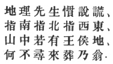
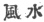
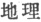
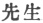

  
[Intangible Textual Heritage](../../index)  [Confucianism](../index.md) 
[Index](index)  [Previous](choc07)  [Next](choc09.md) 

------------------------------------------------------------------------

[Buy this Book at
Amazon.com](https://www.amazon.com/exec/obidos/ASIN/0875481558/internetsacredte.md)

------------------------------------------------------------------------

  
*Chinese Occultism*, by Paul Carus, \[1907\], at Intangible Textual
Heritage

------------------------------------------------------------------------

#### FENG-SHUI. [\*](#fn_28.md)

Chinese occultism has been reduced to a system in an occult science (or
better, pseudo-science) called *feng-shui* which, literally translated,
means "wind and water," and the two words combined denote atmospheric
influence, or climate. As a science feng-shui means a study of
conditions, spiritual as well as physical, and the average Chinese is
very anxious to locate the site of graves, temples, public and private
edifices so as to insure the auspicious influence of their surroundings.
Belief in the efficiency of feng-shui is very strong, and consequently
its scholars play an important part in public and private life.

The science of feng-shui is fantastical, but its advocates claim the
authority of the ancient *Yih King*, which in chapter XIII, 1 to 12,
reads as follows:

"By looking up in order to contemplate the heavenly
bodies, and by looking down to examine into the natural influences of
the earth, man may acquire a knowledge of the cause of darkness and
light."

\[paragraph continues\] Feng-shui is also
called *ti-li* [†](#fn_29.md) and *k‘an-yü*. [‡](#fn_30.md) *Ti-li* may fitly be translated by
"geomancy." *Li*, frequently translated by "reason" or "rational
principle," means a system of the dominant maxims which govern nature.
*Ti* means "the earth" and so the two together signify "the divining art
as to terrestrial conditions." *K‘an-yü*, translated literally, means
"canopy chariot," but *k‘an* (canopy) refers to the sky and *yü*
(chariot) refers to the earth as the vehicle in which all living beings
are carried. The term "canopy chariot" then means the art which is
occupied with the conditions of man's habitation.

The professional diviners who practise *feng-shui* are called
*sien-sheng*, [§](#fn_31.md) "the elder born,"
which is a title of respect and has been translated by "professor." They
are called either *feng-shui sien-sheng*, "professors of divination," or
*ti-li sien-sheng*, "geomancers," or *k‘an-yü sien-sheng*, "masters of
the canopied chariot."

p. 56

The application of the feng-shui is naturally very loose, and two
different professors may easily come to opposite results according to
their individual interpretation of the correct balance of the mixture of
the elements and the several spiritual influences that may be discovered
in special localities. Diviners use for their geomantic investigations a
peculiar instrument with a mariner's compass in the center the purpose
of which De Groot explains as follows:

"The chief use of the geomantic compass is to find
the line in which, according to the almanac, a grave ought to be made,
or a house or temple built. Indeed, in this most useful of all books it
is every year decided between which two points of the compass the lucky
line for that year lies, and which point is absolutely inauspicious.
This circumstance not only entails a postponement of many burials,
seeing it is not always possible to find a grave, answering to all the
geomantic requirements, in the lucky line of the year; but it regularly
compels the owners of houses and temples to postpone repairs or the
rebuilding of the same until a year in which the line wherein their
properties are situate is declared to be lucky. Many buildings for this
reason alone are allowed to fall to ruin for years, and it is no rare
thing to see whole streets simultaneously demolished and rebuilt in
years auspicious to the direction in which they were placed." [16](#fn_32.md)

Considering the sacrifices which are expected of a good son in the
selection of the site and the general equipment of the parental graves,
we can easily understand that the burden of ancestral worship is very
heavy. While we must admire the filial piety of the Chinese, we regret
to see the uselessness of their devotion and the waste to which it
leads. It is refreshing, however, to observe that the general rule is
not without exceptions and we find that there are sensible men who raise
their voices in protest.

Ts‘ui Yuen of the second century, a mandarin of high position, died at
Loh-Yang, the imperial metropolis. According to the customary ritual,
his son should have transported his remains to his place of birth for
burial in the family cemetery, but Ts‘ui Yuen left these instructions
with his son Shih, which we quote from De Groot (*loc. cit.*, pp.
837–8):

p. 57

"Human beings borrow from heaven and earth the
breath upon which they live, and at the end of their terrestrial career
they restitute the etherial parts of that breath to heaven, giving their
bones back to earth; consequently, what part of the earth can be
unsuitable for concealing their skeletons? You must not take me back to
my place of birth, nor may you accept any funeral presents, neither
offerings of mutton or pork."

The Chinese authority from which Professor De Groot quotes, adds: [17](#fn_33.md)

"Respectfully receiving these his last orders, Shih
kept the corpse in Loh-Yang and there buried it."

The spirit of Ts‘ui Yuen has not died out, as is attested by a satirical
poem which is current to-day, and which humorously points out the
inconsistency of those mantics or soothsayers who know all the
conditions of the four quarters and promise their patrons to show them
(for a due consideration) a spot so auspicious for a grave that the
spirit of their ancestor will bestow upon members of the family the
dignity of kings. If that were true, why have they not buried their own
parents there? The poem in the original Chinese is as follows:

 

ti li hsien sheng kwan shuo huang  
chih nan chih pei chih hsi tung  
shan chung je yu wang hou ti  
he pu hsin lai tsang nai weng. [18](#fn_34.md)

This translation imitates the original as closely as possible in metre
and meaning:

Trash these mantics manifest,  
Point out south, north, east and west;  
Know graves royalty bestowing  
Yet their own sires there not rest.

------------------------------------------------------------------------

### Footnotes

[55:\*](choc08.htm#fr_28.md)  

[55:†](choc08.htm#fr_29.md)  

[55:‡](choc08.htm#fr_30.md)  

[55:§](choc08.htm#fr_31.md)  

[56:16](choc08.htm#fr_32.md) In his voluminous work
*The Religious System of China*, Vol. III, Bk. s. "Disposal of the
Dead." Part 3. "The Grave," p. 974.

[57:17](choc08.htm#fr_33.md) *Books of the Later
Han Dynasty*, Chap. 82 line 15.

[57:18](choc08.htm#fr_34.md) In the early Chinese
form, the final words of the first, second, and fourth lines were all
pronounced as if ending in ong. Consequently, although the individual
words have changed their form, the series is considered as containing
one rhyme and, according to Chinese rules of rhyming, is still so used
in verse.

------------------------------------------------------------------------

[Next: Lo-pan](choc09.md)
