  
[Intangible Textual Heritage](../../index)  [Confucianism](../index.md) 
[Index](index)  [Previous](choc08)  [Next](choc10.md) 

------------------------------------------------------------------------

[Buy this Book at
Amazon.com](https://www.amazon.com/exec/obidos/ASIN/0875481558/internetsacredte.md)

------------------------------------------------------------------------

[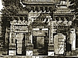](index.md)  
*Chinese Occultism*, by Paul Carus, \[1907\], at Intangible Textual
Heritage

------------------------------------------------------------------------

p. 58

#### LO-PAN.

Collectors of curios may have seen in Chinese stores the instrument
called *lo-pan* [\*](#fn_35) (net-tablet.md), or
*lo-king* [†](#fn_36) (net-standard.md), or
pan-shih [‡](#fn_37) (disk-norm.md). This is the
geomancer's compass which incorporates

  [  
Click to enlarge](img/05800.jpg.md)  
LO-PAN OR NET TABLET.  

\[The original is in the possession of Prof.
Friedrich Hirth.\]

the sum-total of feng-shui. The Chinese salesman who showed the
instrument at my request, a man who must have lived half his life or
more in the United States, expressed great respect for it and tried to
impress me with the fact that it contained the deepest wisdom of the
ages.

The *lo-pan* is a disk of lacquered wood, mostly of yellow color,

p. 59

carrying in its center under glass, a small mariner's compass. Some of
the characters written in the surrounding circles are red, and some are
black. Different copies differ in details, but all are practically the
same in their general and most characteristic features. The concentric
circles of the net tablet are called *ts‘eng*, [\*](#fn_38.md) i.e., "tiers," "stories," or "strata."

The mariner's compass in the center represents *t‘ai chih*, [†](#fn_39.md) "the great origin." The first circle
contains the eight trigrams in the arrangement of Fuh-Hi, which denote
the eight directions of the compass and the virtues and properties
attributed to them.

The second circle contains the numerals from one to nine in the
arrangement of the magic square, the five being omitted as it belongs in
the center. Accordingly the sum of each two opposite figures always
makes ten.

The third row represents twenty-four celestial constellations, each
expressed in two characters, so that three names are registered in each
octant.

The fourth circle represents in occult terms twenty-four divisions of
the compass. Southeast, southwest, northeast, and northwest are written
in their kwa names, while the rest are designated alternately by the ten
stems and twelve branches; two of the stems are omitted, however,
because referring to the element earth, they are supposed to belong in
the center. If we write the ten stems as numerals from one to ten, the
twelve branches in italic letters from a to m, and the four kwa names in
Roman capitals A to D, we have the following arrangement, beginning in
the southeast: A *f* 3 *g* 4 *h* B *i* 7 *k* 8 *l* C *m* 9 *a* 10 *b* D
*c* 1 *d* 2 *e*. This arrangement is ancient for it is quoted as an
established part of the divining method by Sze-Ma Ch‘ien in the
twenty-fifth chapter of his *Historical Records*, which is devoted to
the art of divination.

The fifth circle is divided into seventy-two parts each containing two
characters of the sexagenary cycle, written one above the other, and
arranged in groups of five divided by blank spaces. If we again express
the ten stems in figures and the twelve branches

p. 60

in italics, the scheme (starting with the first branch *a* standing in
the north) reads as follows:

|             |     |             |     |             |     |             |     |             |     |             |
|-------------|-----|-------------|-----|-------------|-----|-------------|-----|-------------|-----|-------------|
| 1 3 5 7 9   |     | 2 4 6 8 1 0 |     | 3 5 7 9 1   |     | 4 6 8 1 0 2 |     | 5 7 9 1 3   |     | 6 8 1 0 2 4 |
| *a a a a a* | * * | *b b b b b* | * * | *c c c c c* | * * | *d d d d d* | * * | *e e e e e* | * * | *f f f f f* |
|             |     |             |     |             |     |             |     |             |     |             |
| 7 9 1 3 5 8 |     | 10 2 4 6    |     | 9 1 3 5 7   |     | 10 2 4 6 8  |     | 1 3 5 7 9   |     | 2 4 6 8 10  |
| *g g g g g* | * * | *h h h h h* | * * | *i i i i i* | * * | *k k k k k* | * * | *l l l l l* | * * | *m m m m m* |

In the sixth row each octant is divided into three sections, each having
five compartments in the second and fourth of which appear two
characters of the sexagenary cycle. Accordingly they are arranged in the
following order, the blanks being expressed by zeros:

|               |     |               |     |               |     |               |     |               |     |               |
|---------------|-----|---------------|-----|---------------|-----|---------------|-----|---------------|-----|---------------|
| 0 3 0 7 0     |     | 0 3 0 7 0     |     | 0 4 0 8 0     |     | 0 4 0 8 0     |     | 0 3 0 7 0     |     | 0 3 0 7 0     |
| 0 *a* 0 *a* 0 |     | 0 *a* 0 *a* 0 |     | 0 *b* 0 *b* 0 |     | 0 *b* 0 *b* 0 |     | 0 *c* 0 *c* 0 |     | 0 *c* 0 *c* 0 |
|               |     |               |     |               |     |               |     |               |     |               |
| 0 4 0 8 0     |     | 0 4 0 8 0     |     | 0 3 0 7 0     |     | 0 3 0 7 0     |     | 0 4 0 8 0     |     | 0 4 0 8 0     |
| 0 *d* 0 *d* 0 |     | 0 *d* 0 *d* 0 |     | 0 *e* 0 *e* 0 |     | 0 *e* 0 *e* 0 |     | 0 *f* 0 *f* 0 |     | 0 *f* 0 *f* 0 |
|               |     |               |     |               |     |               |     |               |     |               |
| 0 3 0 7 0     |     | 0 3 0 7 0     |     | 0 4 0 8 0     |     | 0 4 0 8 0     |     | 0 3 0 7 0     |     | 0 3 0 7 0     |
| 0 *g* 0 *g* 0 |     | 0 *g* 0 *g* 0 |     | 0 *h* 0 *h* 0 |     | 0 *h* 0 *h* 0 |     | 0 *i* 0 *i* 0 |     | 0 *i* 0 *i* 0 |
|               |     |               |     |               |     |               |     |               |     |               |
| 0 4 0 8 0     |     | 0 4 0 8 0     |     | 0 3 0 7 0     |     | 0 3 0 7 0     |     | 0 4 0 8 0     |     | 0 4 0 8 0     |
| 0 *k* 0 *k* 0 |     | 0 *k* 0 *k* 0 |     | 0 1 0 1 0     |     | 0 1 0 1 0     |     | 0 *m* 0 *m* 0 |     | 0 *m* 0 *m* 0 |

\[paragraph continues\] The third and
fourth stems refer to fire and the seventh and eighth to metal.

The seventh row is devoted to the eight stars of the Dipper, which in
Chinese folklore is regarded with much awe, because this most
conspicuous constellation revolves around the polar star and seems to
resemble the hand of a watch on the great celestial dial of the
universe. We must remember that the seventh star is double, its luminous
satellite being visible even without the assistance of a telescope. If
we represent the names of the eight stars by numbers from one to eight,
their arrangement beginning with the southwest is as follows: 1 8 5 7 4
4 6 2 3 1 5 7 8 1 3 2 6 6 4 7 5 8 3 2.

Beyond the seventh circle we have a double line which divides the seven
inner rows from the nine outer ones. The first of these, the eighth
circle, is divided into twelve sections each having three characters,
the central ones written in red being the sun and moon

p. 61

together with the five elements twice repeated. Beginning in the south
with the character sun, and turning toward the left, they read as
follows: sun, moon, water, metal, fire, wood, earth, earth, wood, fire,
metal, water.

The ninth row, consisting of twelve sections, represents the twelve
branches in regular succession, beginning in the north with the first
and turning toward the right. They coincide in position with the twelve
branches as they appear in the fourth row.

The tenth row is a repetition of the fifth, with the exception that here
the characters are distributed evenly over the whole circle.

The eleventh row consists of numerals only. The circle is divided into
twelve sections, each being subdivided into five compartments which
contain the following scheme repeated twelve times:
\| 37 \| 1 \| 1 \| 5 \| 1 \| 1 \| 73 \|.

The twelfth row is inscribed with the names of the sub-divisions of the
four seasons, beginning with early spring above the unalloyed yin and
turning toward the right.

|                                                 |                                      |     |                                                 |                                    |
|-------------------------------------------------|--------------------------------------|-----|-------------------------------------------------|------------------------------------|
|                                                 | SPRING.   |     |                                                 | AUTUMN. |
|  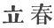 | Beginning of Spring.                 |     |  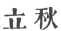 | Beginning of Autumn.               |
|  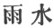 | Rain Water.                          |     |  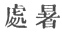 | Limit of Heat.                     |
|  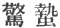 | Resurrection of hibernating Insects. |     |  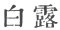 | White Dew.                         |
|  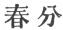 | Vernal Equinox.                      |     |  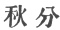 | Autumnal Equinox.                  |
|  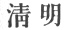 | Pure Brightness.                     |     |  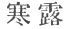 | Cold Dew.                          |
|  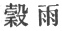 | Rains over the Grain.                |     |  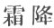 | Descent of Hoar Frost.             |
|                                                 |                                      |     |                                                 |                                    |
|                                                 | SUMMER.   |     |                                                 | WINTER.                            |
|  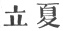 | Beginning of Summer.                 |     |  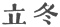 | Beginning of Winter.               |
|  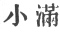 | Grain filling a little.              |     |  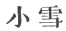 | Little Snow.                       |
|   | Grain in Ear.                        |     |  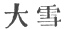 | Heavy Snow.                        |
|  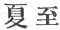 | Summer Solstice.                     |     |  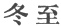 | Winter Solstice.                   |
|  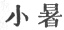 | Slight Heat.                         |     |  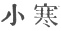 | Little Cold.                       |
|  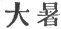 | Great Heat.                          |     |  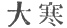 | Severe Cold.                       |

p. 62

The thirteenth row is divided into seventy-two equal parts, which are
left blank.

The fifteenth row is divided into three hundred and sixty equal blanks
representing the degrees of a circle which method of division the
Chinese as well as we of the Occident have inherited from the
Babylonians.

The sixteenth row contains the names of the twenty-eight constellations
together with the number of degrees which each covers. These degrees are
specifically marked in the fourteenth circle in which the odd numbers
only are expressed. The series starting in the southeast and turning
toward the right, is as follows:

1\. The horn, 11°; in Virgo.

2\. The neck, 11°; in Virgo.

3\. The bottom, 18°; in Libra.

4\. The room, 5°; in Scorpio.

5\. The heart, 8°; in Scorpio.

6\. The tail, 15°; in Scorpio.

7\. The sieve, 9°; in Sagittarius.

8\. The measure, 24°; in Sagittarius.

9\. The ox, 8°; in Aries and Sagittarius.

10\. The damsel, 11°; in Aquarius.

11\. The void, 10°; in Aquarius and Equuleus.

12\. Danger, 20°; in Aquarius and Pegasus.

13\. The house, 16°; in Pegasus.

14\. The wall, 13°; in Pegasus and Andromeda.

15\. Astride, 11°; in Andromeda and Pisces.

16\. The hump, 13°; in Aries.

17\. The stomach, 12°; in Musca Borealis.

18\. The Pleiades, 9°. (In Chinese *mao*.) [19](#fn_40.md)

19\. The end, 15°; in Hyades and Taurus.

20\. The bill or beak, 1°; in Orion.

21\. Crossing, or mixture, 11°; in Orion.

22\. The well or pond, 31°; in Gemini.

23\. The ghost, 5°; in Cancer.

24\. The willow, 17°; in Hydra.

p. 63

25\. The star, 8°; in Hydra.

26\. The drawn bow, 18°; in Hydra.

27\. The wing, 17°; in Crater and Hydra.

28\. The back of a carriage seat, 13°; in Corvus.

------------------------------------------------------------------------

### Footnotes

[58:\*](choc09.htm#fr_35.md)  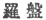

[58:†](choc09.htm#fr_36.md)  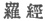

[58:‡](choc09.htm#fr_37.md)  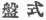

[59:\*](choc09.htm#fr_38.md)  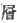

[59:†](choc09.htm#fr_39.md)  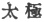

[62:19](choc09.htm#fr_40.md) The Chinese term *mao*
does not possess any other significance except the name of this
constellation. This character is unfortunately misprinted in Mayers,
*Chinese Reader's Manual*. It is correct in the enumeration of Professor
De Groot, *loc. cit.*, p. 972.

------------------------------------------------------------------------

[Next: The Mariner's Compass a Chinese Invention](choc10.md)
