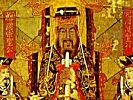

  
[Intangible Textual Heritage](../../index)  [Confucianism](../index) 
[Index](index)  [Next](eoc01) 

------------------------------------------------------------------------

[Buy this Book at
Amazon.com](https://www.amazon.com/exec/obidos/ASIN/1410203565/internetsacredte)

------------------------------------------------------------------------

  
*The Ethics of Confucius*, by Miles Menander Dawson, \[1915\], at
Intangible Textual Heritage

------------------------------------------------------------------------

# THE ETHICS OF CONFUCIUS

##### The Sayings of the Master And His Disciples Upon the Conduct of the "Superior Man."

###### By

##### MILES MENANDER DAWSON

#### NEW YORK, LONDON: G.P. PUTNAM'S SONS

#### \[1915\]

Scanned, proofed and formatted at Intangible Textual Heritage,
October-November 2007 by John Bruno Hare. This text is in the public
domain in the US because it was published prior to 1923. These files may
be used for any purpose.

**To**  
MISS JESSIE B. RITTENHOUSE,  
DISCRIMINATING CRITIC AND UNFAILING FRIEND,  
TO WHOSE APPRECIATION  
THE AUTHOR'S PERSEVERANCE IN THE ARDUOUS LABOR  
OF COLLECTING AND COLLATING THE TEXT FOR THIS BOOS  
AND PREPARING IT FOR ITS READERS IS CHIEFLY DUE,

This Volume is Gratefully Inscribed.

------------------------------------------------------------------------

[Next: Foreword](eoc01)
