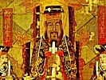

  
[Intangible Textual Heritage](../../index)  [Confucianism](../index) 
[Index](index)  [Previous](eoc02)  [Next](eoc04) 

------------------------------------------------------------------------

[Buy this Book at
Amazon.com](https://www.amazon.com/exec/obidos/ASIN/1410203565/internetsacredte)

------------------------------------------------------------------------

  
*The Ethics of Confucius*, by Miles Menander Dawson, \[1915\], at
Intangible Textual Heritage

------------------------------------------------------------------------

#### THE WORKS OF CONFUCIUS, HIS DISCIPLES, AND MOST IMPORTANT FOLLOWERS

Including Ancient Books Edited by Him, Books of His Sayings, and
Accounts of His Teachings by His Disciples and by Early Apostles and
Commentators.

Confucius was born in 552 B.C. and died in 479 B.C. His name was Kung
Ch‘in Chung-ni, of which K‘ung was the family name, Ch‘in the personal
(*i.e.*, what we call Christian) name, and Chung-ni the special name
given upon reaching full age. He was called K‘ung Fu Tse later, the
appellation Fu Tse meaning "Master"; and this has been Latinized into
Confucius.

1\. The actual authorship of but one book is

p. xiv

ascribed to him, viz: Ch‘un Ch‘in, "Spring and Autumn" (English Edition,
vol. v., "Chinese Classics").

This book is said to have been written by Confucius himself, in his
seventy-second year, and to have been designed by him to serve as an
epitome of his teachings upon all ethical, social, and religious
subjects. At least, Mencius so speaks of it. The book, in a different
form and known as "The Annals of Lu," was in existence before Confucius,
and his task seems, after all, to have been to edit and amplify it. The
work as it has come down to us, however, undoubtedly unchanged since the
Han dynasty, is a bare record of events, almost utterly devoid of
instruction and even of interest.

2\. A collection of conversations with Confucius, containing many of his
most important sayings, was made by his disciples after his death. It is
known as:

Lun Yü, "The Analects," translated by James Legge, and published in "The
Sacred Books of the East."

Several important books or collections of books, already ancient when
Confucius was born and regarded as classics, were edited by Confucius
and further edited by his early disciples. These are:

3\. Yi King, the "Book of Changes."

4\. Hsiâo King, the "Book of Filial Piety."

5\. Shu King, the "Book of History."

6\. Shi King, the "Book of Poetry," also called "The Odes."

p. xv

7\. Li Ki, the "Book of Ceremonies."

All of these were translated by James Legge and published in "The Sacred
Books of the East."

The last mentioned is also often called "Younger Tai's Record of Rites,"
and it is affirmed that the "Li-Ching," said to be an older and greatly
variant edition, should be accepted instead. In this book or collection
of books are comprised two of very special importance:

8\. "The Great Learning," said to have been committed to writing by
Tse-Tse, the grandson of Confucius, from his recollections of the
teachings of his grandfather and from reports of the same by his father
and other disciples of Confucius. His text is elucidated by commentaries
in the "Li Ki." This book has also come down separately.

9\. "The Doctrine of the Mean," also the work of disciples of Confucius
and their early successors. This has also come down separately.

There is also the very valuable volume of the sayings of Meng Tse, the
great apostle of Confucianism in the second century later—whose name is
Latinized into:

10\. Mencius.

This Book of Mencius was also translated by James Legge and is published
in "The Sacred Books of the East."

"The Four Books," meaning thereby the elements and very core of
Confucian doctrine, is the

p. xvi

name given to "The Analects," "The Great Learning," "The Doctrine of the
Mean," and "Mencius."

"The Five Classics" or "The Five Canons" is the name applied to the "Yi
King," "Hsiâo King," "Shu King," "Shi King," and "Ch‘un" (or "Ch‘in
King"), collectively. The word "King" means "classic" or "canon."

Other works of Confucian commentators and scholars which are
occasionally quoted from, are:

11\. Shuo Yuan ("Park of Narratives").

12\. Hsun Tze.

13\. Ku-hang Chuan ("Ku-liang's Commentary").

14\. "Many Dewdrops of the Spring and Autumn."

15\. Pan-Ku.

16\. "History of Han Dynasty."

17\. "History of Latter Han Dynasty."

18\. "Narratives of Nations."

19\. Kung-Yang Chuan ("Kung-Yang's Commentary").

The citations of this book are for the most part given by the name of
the work, the name or number of the chapter and other grand division of
the work and the verse, to the end that any edition in Chinese or any
translation into English or into another language may be conveniently
referred to.

M. M. D.

------------------------------------------------------------------------

[Next: Confucius](eoc04)
