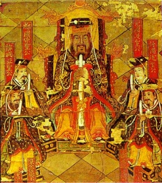

  
[Intangible Textual Heritage](../../index)  [Confucianism](../index) 

------------------------------------------------------------------------

[Buy this Book at
Amazon.com](https://www.amazon.com/exec/obidos/ASIN/1410203565/internetsacredte)

------------------------------------------------------------------------

<table width="75%">
<colgroup>
<col style="width: 50%" />
<col style="width: 50%" />
</colgroup>
<tbody>
<tr class="odd">
<td width="50%" data-valign="TOP"></td>
<td width="50%" data-valign="CENTER"><h1 id="the-ethics-of-confucius" data-align="CENTER">The Ethics of Confucius</h1>
<h2 id="by-miles-menander-dawson" data-align="CENTER">by Miles Menander Dawson</h2>
<h4 id="section" data-align="CENTER">[1915]</h4></td>
</tr>
</tbody>
</table>

------------------------------------------------------------------------

[Contents](#contents)    [Start Reading](eoc00)    [Page
Index](pageidx)    [Text (Zipped)](eoctxt.zip)

------------------------------------------------------------------------

|                                                                                                                           |
|---------------------------------------------------------------------------------------------------------------------------|
|  |

This is a study of the ethical system presented in the Confucian texts,
organized by topic. This book was reprinted in 1939 under the title 'The
Basic Thoughts of Confucius,' and in 1942 as 'The Basic Teachings of
Confucius.'

------------------------------------------------------------------------

 [Title Page](eoc00)  
[Foreword](eoc01)  
[Introduction](eoc02)  
[The Works of Confucius, His Disciples, and Most Important
Followers](eoc03)  
[Confucius](eoc04)  
[Contents](eoc05)  
[Chapter I. What Constitutes the Superior Man](eoc06)  
[Chapter II. Self-Development](eoc07)  
[Chapter III. General Human Relations](eoc08)  
[Chapter IV. The Family](eoc09)  
[Chapter V. The State](eoc10)  
[Chapter VI. Cultivation of the Fine Arts](eoc11)  
[Chapter VII. Universal Relations](eoc12)  
[Appendix: The “Great Principle” of Confucius](eoc13)  
[Index](eoc14)  
