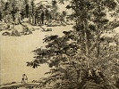

  
[Intangible Textual Heritage](../../index)  [Confucianism](../index.md) 
[Index](index)  [Previous](fol15)  [Next](fol17.md) 

------------------------------------------------------------------------

[Buy this Book on
Kindle](https://www.amazon.com/exec/obidos/ASIN/B002HRFBOE/internetsacredte.md)

------------------------------------------------------------------------

  
*A Feast of Lanterns*, by L. Cranmer-Byng, \[1916\], at Intangible
Textual Heritage

------------------------------------------------------------------------

### ALONG THE STREAM

The rustling nightfall strews my gown with roses,  
And wine-flushed petals bring forgetfulness  
Of shadow after shadow striding past.  
I arise with the stars exultantly and follow  
The sweep of the moon along the hushing stream,  
Where no birds wake; only the far-drawn sigh  
Of wary voices whispering farewell.

------------------------------------------------------------------------

[Next: The Palace of Chao-Yang](fol17.md)
