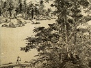

  
[Intangible Textual Heritage](../../index)  [Confucianism](../index.md) 
[Index](index)  [Previous](fol20)  [Next](fol22.md) 

------------------------------------------------------------------------

[Buy this Book on
Kindle](https://www.amazon.com/exec/obidos/ASIN/B002HRFBOE/internetsacredte.md)

------------------------------------------------------------------------

  
*A Feast of Lanterns*, by L. Cranmer-Byng, \[1916\], at Intangible
Textual Heritage

------------------------------------------------------------------------

p. 52

### *III. Sorrow*

Dawn reddens in the wake of night; but the days  
      of our life return not.  
Sweet-scented orchids blot out the path; but  
      they die in the drift of waters and their  
      flowers are blotted out.  
The Yang-tse-Kiang splashes through shelving  
      maple-woods.  
The eye contains a far horizon, but the wound of  
      spring lies deep in the heart.  
O Poet! turn thee to the Capital—to the men  
      who shall make thee forget.  
Surely, the Earth-sorrow for the passing of spring  
      from her quiet places is overwhelming.

------------------------------------------------------------------------

[Next: Bright Autumntide](fol22.md)
