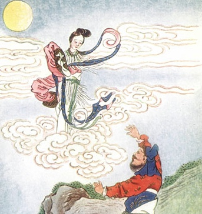

  
[Intangible Textual Heritage](../../index)  [Confucianism](../index) 

------------------------------------------------------------------------

[Buy this Book at
Amazon.com](https://www.amazon.com/exec/obidos/ASIN/0486280926/internetsacredte)

------------------------------------------------------------------------

[Buy this Book on
Kindle](https://www.amazon.com/exec/obidos/ASIN/B0037Z6FKE/internetsacredte)

------------------------------------------------------------------------

<table width="75%">
<colgroup>
<col style="width: 50%" />
<col style="width: 50%" />
</colgroup>
<tbody>
<tr class="odd">
<td width="50%" data-valign="TOP"> 
Heng-o flies to the Moon</td>
<td width="50%" data-valign="CENTER"><h1 id="myths-and-legends-of-china" data-align="CENTER">Myths and Legends of China</h1>
<h2 id="by-edward-t.c.-werner" data-align="CENTER">by Edward T.C. Werner</h2>
<h4 id="section" data-align="CENTER">[1922]</h4></td>
</tr>
</tbody>
</table>

------------------------------------------------------------------------

[Contents](#contents)    [Start Reading](mlc00)    [Page
Index](pageidx)    [Text \[Zipped\]](mlc.txt.gz)

------------------------------------------------------------------------

|                                                                                                                           |
|---------------------------------------------------------------------------------------------------------------------------|
|  |

This is the Chinese volume in the always reliable Myths and Legends
series, e.g. [Babylonia](../../ane/mba/index),
[British](../../neu/eng/hml/index), and
[Celtic](../../neu/celt/mlcr/index). The author consulted mostly Chinese
sources to splice together this broad look at Chinese traditional
folklore, related to all three of the main Chinese religions, Buddhism,
Confucianism and Taoism. Werner covers such topics as the evolution of
Chinese cosmology, and the enormous pantheon of native Chinese Gods,
Goddesses, and Immortals. This makes a great read for folklore fans and
lovers of Chinese lore.

------------------------------------------------------------------------

 [Title Page](mlc00)  
[Preface](mlc01)  
[Contents](mlc02)  
[Chapter I. Racial Origin](mlc03)  
[Chapter II. Mythology and Intellectual Progress](mlc04)  
[Chapter III. The Fashioner of the Universe](mlc05)  
[Chapter IV. The Birth of the Soul](mlc06)  
[Chapter V. Myths of the Stars](mlc07)  
[Chapter VI. Myths of Thunder, Lightning, Wind, and Rain](mlc08)  
[Chapter VII. Myths of the Waters](mlc09)  
[Chapter VIII. Myths of Fire](mlc10)  
[Chapter IX. Myths of Epidemics, Medicine, Exorcism, Etc.](mlc11)  
[Chapter X. The Goddess of Mercy](mlc12)  
[Chapter XI. The Eight Immortals](mlc13)  
[Chapter XII. The Guardian of the Gate of Heaven](mlc14)  
[Chapter XIII. A Battle of the Gods](mlc15)  
[Chapter XIV. How the Monkey Became a God](mlc16)  
[Chapter XV. Fox Legends](mlc17)  
[Chapter XVI. Miscellaneous Legends](mlc18)  
[Glossary and Index](mlc19)  
[Advertisements](mlc20)  
