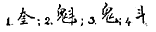

  
[Intangible Textual Heritage](../../index)  [Confucianism](../index.md) 
[Index](index)  [Previous](mlc05)  [Next](mlc07.md) 

------------------------------------------------------------------------

[Buy this Book at
Amazon.com](https://www.amazon.com/exec/obidos/ASIN/0486280926/internetsacredte.md)

------------------------------------------------------------------------

[Buy this Book on
Kindle](https://www.amazon.com/exec/obidos/ASIN/B0037Z6FKE/internetsacredte.md)

------------------------------------------------------------------------

  
*Myths and Legends of China*, by Edward T.C. Werner, \[1922\], at
Intangible Textual Heritage

------------------------------------------------------------------------

## Chapter IV

# The Gods of China

## The Birth of the Soul

The dualism noted in the last chapter is well illustrated by the Chinese
pantheon. Whether as the result of the co-operation of the *yin* and the
*yang* or of the final dissolution of P’an Ku, human beings came into
existence. To the primitive mind the body and its shadow, an object and
its reflection in water, real life and dream life, sensibility and
insensibility (as in fainting, etc.), suggest the idea of another life
parallel with this life and of the doings of the ‘other self’ in it.
This ‘other self,’ this spirit, which leaves the body for longer or
shorter intervals in dreams, swoons, death, may return or be brought
back, and the body revive. Spirits which do not return or are not
brought back may cause mischief, either alone, or by entry into another
human or animal body or even an inanimate object, and should therefore
be propitiated. Hence worship and deification.

## The Populous Otherworld

The Chinese pantheon has gradually become so multitudinous that there is
scarcely a being or thing which is not, or has not been at some time or
other, propitiated or worshipped. As there are good and evil people in
this world, so there are gods and demons in the Otherworld: we find a
polytheism limited only by a polydemonism. The dualistic hierarchy is
almost all-embracing. To get a clear idea of this populous Otherworld,
of the supernal and infernal hosts and their organizations, it needs but
to imagine the social structure in its main features as it existed p. 94 throughout the greater part of Chinese
history, and to make certain additions. The social structure consisted
of the ruler, his court, his civil, military, and ecclesiastical
officials, and his subjects (classed as Scholars—officials and
gentry—Agriculturists, Artisans, and Merchants, in that order).

## Worship of Shang Ti

When these died, their other selves continued to exist and to hold the
same rank in the spirit world as they did in this one. The *ti*,
emperor, became the *Shang Ti*, Emperor on High, who dwelt in *T’ien*,
Heaven (originally the great dome).  [1](#fn_10.md)
And Shang Ti, the Emperor on High, was worshipped by *ti*, the emperor
here below, in order to pacify or please him—to ensure a continuance of
his benevolence on his behalf in the world of spirits. Confusion of
ideas and paucity of primitive language lead to personification and
worship of a thing or being in which a spirit has taken up its abode in
place of or in addition to worship of the spirit itself. Thus Heaven
(T’ien) itself came to be personified and worshipped in addition to
Shang Ti, the Emperor who had gone to Heaven, and who was considered as
the chief ruler in the spiritual world. The worship of Shang Ti was in
existence before that of T’ien was introduced. Shang Ti was worshipped
by the emperor and his family as their ancestor, or the head of the
hierarchy of their ancestors. The people could not worship Shang Ti, for
to do so would imply a familiarity or a claim of relationship punishable
with death. The emperor worshipped his ancestors, the officials theirs,
the people theirs. But, in the same way and sense that the people
worshipped the emperor on earth, as the ‘father’ of the nation, namely,
by adoration and p. 95 obeisance, so also
could they in this way and this sense worship Shang Ti. An Englishman
may take off his hat as the king passes in the street to his coronation
without taking any part in the official service in Westminster Abbey. So
the ‘worship’ of Shang Ti by the people was not done officially or with
any special ceremonial or on fixed State occasions, as in the case of
the worship of Shang Ti by the emperor. This, subject to a qualification
to be mentioned later, is really all that is meant (or should be meant)
when it is said that the Chinese worship Shang Ti.

As regards sacrifices to Shang Ti, these could be offered officially
only by the emperor, as High Priest on earth, who was attended or
assisted in the ceremonies by members of his own family or clan or the
proper State officials (often, even in comparatively modern times,
members of the imperial family or clan). In these official sacrifices,
which formed part of the State worship, the people could not take part;
nor did they at first offer sacrifices to Shang Ti in their own homes or
elsewhere. In what way and to what extent they did so later will be
shown presently.

## Worship of T’ien

Owing to T’ien, Heaven, the abode of the spirits, becoming personified,
it came to be worshipped not only by the emperor, but by the people
also. But there was a difference between these two worships, because the
emperor performed his worship of Heaven officially at the great altar of
the Temple of Heaven at Peking (in early times at the altar in the
suburb of the capital), whereas the people (continuing always to worship
their ancestors) worshipped Heaven, when they did so at all—the custom
being observed by some and not by others, just as in Western countries
some people go to church, while others p.
96 stay away—usually at the time of the New Year, in a simple,
unceremonious way, by lighting some incense-sticks and waving them
toward the sky in the courtyards of their own houses or in the street
just outside their doors.

## Confusion of Shang Ti and T’ien

The qualification necessary to the above description is that, as time
went on and especially since the Sung dynasty (A.D. 960–1280), much
confusion arose regarding Shang Ti and T’ien, and thus it came about
that the terms became mixed and their definitions obscure. This
confusion of ideas has prevailed down to the present time. One result of
this is that the people may sometimes state, when they wave their
incense-sticks or light their candles, that their humble sacrifice is
made to Shang Ti, whom in reality they have no right either to worship
or to offer sacrifice to, but whom they may unofficially pay respect and
make obeisance to, as they might and did to the emperor behind the high
boards on the roadsides which shielded him from their view as he was
borne along in his elaborate procession on the few occasions when he
came forth from the imperial city.

Thus we find that, while only the emperor could worship and sacrifice to
Shang Ti, and only he could officially worship and sacrifice to T’ien,
the people who early personified and worshipped T’ien, as already shown,
came, owing to confusion of the meanings of Shang Ti and T’ien,
unofficially to ‘worship’ both, but only in the sense and to the extent
indicated, and to offer ‘sacrifices’ to both, also only in the sense and
to the extent indicated. But for these qualifications, the statement
that the Chinese worship and sacrifice to Shang Ti and T’ien would be
apt to convey an incorrect idea. p. 97

From this it will be apparent that Shang Ti, the Supreme Ruler on High,
and T’ien, Heaven (later personified), do not mean ‘God’ in the sense
that the word is used in the Christian religion. To state that they do,
as so many writers on China have done, without pointing out the
essential differences, is misleading. That Chinese religion was or is “a
monotheistic worship of God” is further disproved by the fact that Shang
Ti and T’ien do not appear in the list of the popular pantheon at all,
though all the other gods are there represented. Neither Shang Ti nor
T’ien mean the God of Abraham, Isaac, and Jacob, or the Father, Son, and
Holy Ghost of the New Testament. Did they mean this, the efforts of the
Christian missionaries to convert the Chinese would be largely
superfluous. The Christian religion, even the Holy Trinity, is a
monotheism. That the Chinese religion (even though a summary of extracts
from the majority of foreign books on China might point to its being so)
is not a monotheism, but a polytheism or even a pantheism (as long as
that term is taken in the sense of universal deification and not in that
of one spiritual being immanent in all things), the rest of this chapter
will abundantly prove.

There have been three periods in which gods have been created in
unusually large numbers: that of the mythical emperor Hsien Yüan
(2698–2598 B.C.), that of Chiang Tzŭ-ya (in the twelfth century B.C.),
and that of the first emperor of the Ming dynasty (in the fourteenth
century A.D.).

## The Otherworld Similar to this World

The similarity of the Otherworld to this world above alluded to is well
shown by Du Bose in his *Dragon, Image, and, Demon*, from which I quote
the following passages: p. 98

“The world of spirits is an exact counterpart of the Chinese Empire, or,
as has been remarked, it is ‘China ploughed under’; this is the world of
light; put out the lights and you have Tartarus. China has eighteen
\[now twenty-two\] provinces, so has Hades; each province has eight or
nine prefects, or departments; so each province in Hades has eight or
nine departments; every prefect or department averages ten counties, so
every department in Hades has ten counties. In Soochow the Governor, the
provincial Treasurer, the Criminal Judge, the Intendant of Circuit, the
Prefect or Departmental Governor, and the three District Magistrates or
County Governors each have temples with their apotheoses in the other
world. Not only these, but every *yamên* secretary, runner, executioner,
policeman, and constable has his counterpart in the land of darkness.
The market-towns have also mandarins of lesser rank in charge, besides a
host of revenue collectors, the bureau of government works and other
departments, with several hundred thousand officials, who all rank as
gods beyond the grave. These deities are civilians; the military having
a similar gradation for the armies of Hades, whose captains are gods,
and whose battalions are devils.

“The framers of this wonderful scheme for the spirits of the dead,
having no higher standard, transferred to the authorities of that world
the etiquette, tastes, and venality of their correlate officials in the
Chinese Government, thus making it necessary to use similar means to
appease the one which are found necessary to move the other. All the
State gods have their assistants, attendants, door-keepers, runners,
horses, horsemen, detectives, and executioners, corresponding in every
particular to those of Chinese officials of the same rank.” (Pp.
358–359.) p. 99

This likeness explains also why the hierarchy of beings in the
Otherworld concerns itself not only with the affairs of the Otherworld,
but with those of this world as well. So faithful is the likeness that
we find the gods (the term is used in this chapter to include goddesses,
who are, however, relatively few) subjected to many of the rules and
conditions existing on this earth. Not only do they, as already shown,
differ in rank, but they hold *levées* and audiences and may be promoted
for distinguished services, just as the Chinese officials are. They “may
rise from an humble position to one near the Pearly Emperor, who gives
them the reward of merit for ruling well the affairs of men. The
correlative deities of the mandarins are only of equal rank, yet the
fact that they have been apotheosized makes them their superiors and fit
objects of worship. Chinese mandarins rotate in office, generally every
three years, and then there is a corresponding change in Hades. The
image in the temple remains the same, but the spirit which dwells in the
clay tabernacle changes, so the idol has a different name, birthday, and
tenant. The priests are informed by the Great Wizard of the Dragon Tiger
Mountain, but how can the people know gods which are not the same to-day
as yesterday?” (Pp. 360–361.)

The gods also indulge in amusements, marry, sin, are punished, die, are
resurrected, or die and are transformed, or die finally.  [2](#fn_11.md)

## The Three Religions

We have in China the universal worship of ancestors, which constitutes
(or did until A.D. 1912) the State p.
100 religion, usually known as Confucianism, and in addition we
have the gods of the specific religions (which also originally took
their rise in ancestor-worship), namely, Buddhism and Taoism. (Other
religions, though tolerated, are not recognized as Chinese religions.)
It is with a brief account of this great hierarchy and its mythology
that we will now concern ourselves.

Besides the ordinary ancestor-worship (as distinct from the State
worship) the people took to Buddhism and Taoism, which became the
popular religions, and the *literati* also honoured the gods of these
two sects. Buddhist deities gradually became installed in Taoist
temples, and the Taoist immortals were given seats beside the Buddhas in
their sanctuaries. Every one patronized the god who seemed to him the
most popular and the most lucrative. There even came to be united in the
same temple and worshipped at the same altar the three religious
founders or figure-heads, Confucius, Buddha, and Lao Tzŭ. The three
religions were even regarded as forming one whole, or at least, though
different, as having one and the same object: *san êrh i yeh*, or *han
san wei i*, “the three are one,” or “the three unite to form one” (a
quotation from the phrase *T’ai chi han san wei i* of Fang Yü-lu: “When
they reach the extreme the three are seen to be one”). In the popular
pictorial representations of the pantheon this impartiality is clearly
shown.

## The Super-triad

The toleration, fraternity, or co-mixture of the three
religions—ancestor-worship or Confucianism, Chinese Buddhism, and
Taoism—explains the compound nature of the triune head of the Chinese
pantheon. The p. 101 numerous deities of
Buddhism and Taoism culminate each in a triad of gods (the Three
Precious Ones and the Three Pure Ones respectively), but the three
religions jointly have also a triad compounded of one representative
member of each. This general or super-triad is, of course, composed of
Confucius, Lao Tzŭ, and Buddha. This is the officially decreed order,
though it is varied occasionally by Buddha being placed in the centre
(the place of honour) as an act of ceremonial deference shown to a
‘stranger’ or ‘guest’ from another country.

## Worship of the Living

Before proceeding to consider the gods of China in detail, it is
necessary to note that ancestor-worship, which, as before stated, is
worship of the ghosts of deceased persons, who are usually but not
invariably relatives of the worshipper, has at times a sort of
preliminary stage in this world consisting of the worship of living
beings. Emperors, viceroys, popular officials, or people beloved for
their good deeds have had altars, temples, and images erected to them,
where they are worshipped in the same way as those who have already
“shuffled off this mortal coil.” The most usual cases are perhaps those
of the worship of living emperors and those in which some high official
who has gained the gratitude of the people is transferred to another
post. The explanation is simple. The second self which exists after
death is identical with the second self inhabiting the body during life.
Therefore it may be propitiated or gratified by sacrifices of food,
drink, etc., or theatricals performed in its honour, and continue its
protection and good offices even though now far away. p. 102

## Confucianism

Confucianism (*Ju Chiao*) is said to be the religion of the learned, and
the learned were the officials and the *literati* or lettered class,
which includes scholars waiting for posts, those who have failed to get
posts (or, though qualified, prefer to live in retirement), and those
who have retired from posts. Of this ‘religion’ it has been said:

“The name embraces education, letters, ethics, and political philosophy.
Its head was not a religious man, practised few religious rites, and
taught nothing about religion. In its usual acceptation the term
Confucianist means ‘a gentleman and a scholar’; he may worship only once
a year, yet he belongs to the Church. Unlike its two sisters, it has no
priesthood, and fundamentally is not a religion at all; yet with the
many rites grafted on the original tree it becomes a religion, and the
one most difficult to deal with. Considered as a Church, the classics
are its scriptures, the schools its churches, the teachers its priests,
ethics its theology, and the written character, so sacred, its
symbol.”  [3](#fn_12.md)

## Confucius not a God

It should be noted that Confucius himself is not a god, though he has
been and is worshipped (66,000 animals used to be offered to him every
year; probably the number is about the same now). Suggestions have been
made to make him the God of China and Confucianism the religion of
China, so that he and his religion would hold the same relative
positions that Christ and Christianity do in the West. I was present at
the lengthy debate which took place on this subject in the Chinese p. 103 Parliament in February 1917, but in spite of
many long, learned, and eloquent speeches, chiefly by scholars of the
old school, the motion was not carried. Nevertheless, the worship
accorded to Confucius was and is (except by ‘new’ or ‘young’ China) of
so extreme a nature that he may almost be described as the great
unapotheosized god of China.  [4](#fn_13.md) Some
of his portraits even ascribe to him superhuman attributes. But in spite
of all this the fact remains that Confucius has not been appointed a god
and holds no *exequatur* entitling him to that rank.

If we inquire into the reason of this we find that, astonishing though
it may seem, Confucius is classed by the Chinese not as a god (*shên*),
but as a demon (*kuei*). A short historical statement will make the
matter clear.

In the classical *Li chi, Book of Ceremonial*, we find the categorical
assignment of the worship of certain objects to certain subjective
beings: the emperor worshipped Heaven and earth, the feudal princes the
mountains and rivers, the officials the hearth, and the *literati* their
ancestors. Heaven, earth, mountains, rivers, and hearth were called
*shên* (gods), and ancestors *kuei* (demons). This distinction is due to
Heaven being regarded as the god and the people as demons—the upper is
the god, the lower the evil spirit or demon. Though *kuei* were usually
bad, the term in Chinese includes both good and evil spirits. In ancient
times those who had by their meritorious virtue while in the world
averted calamities from the people were posthumously worshipped and
called gods, but those who were worshipped by their descendants only
were called spirits or demons.

In the worship of Confucius by emperors of various p. 104 dynasties (details of which need not be
given here) the highest titles conferred on him were *Hsien Shêng*,
‘Former or Ancestral Saint,’ and even *Win Hsüan Wang*, ‘Accomplished
and Illustrious Prince,’ and others containing like epithets. When for
his image or idol there was (in the eleventh year—A.D. 1307—of the
reign-period Ta Tê of the Emperor Ch’êng Tsung of the Yüan dynasty)
substituted the tablet now seen in the Confucian temples, these were the
inscriptions engraved on it. In the inscriptions authoritatively placed
on the tablets the word *shên* does not occur; in those cases where it
does occur it has been placed there (as by the Taoists) illegally and
without authority by too ardent devotees. Confucius may not be called a
*shên*, since there is no record showing that the great ethical teacher
was ever apotheosized, or that any order was given that the character
*shên* was to be applied to him.

## The God of Literature

In addition to the ancestors of whose worship it really consists,
Confucianism has in its pantheon the specialized gods worshipped by the
*literati*. Naturally the chief of these is Wên Ch’ang, the God of
Literature. The account of him (which varies in several particulars in
different Chinese works) relates that he was a man of the name of Chang
Ya, who was born during the T’ang dynasty in the kingdom of Yüeh (modern
Chêkiang), and went to live at Tzŭ T’ung in Ssŭch’uan, where his
intelligence raised him to the position of President of the Board of
Ceremonies. Another account refers to him as Chang Ya Tzŭ, the Soul or
Spirit of Tzŭ T’ung, and states that he held office in the Chin dynasty
(A.D. 265–316), and was killed in a fight. Another again states that
under the Sung dynasty (A.D. p.
105 960–1280), in the third year (A.D. 1000) of the reign-period
Hsien P’ing of the Emperor Chên Tsung, he repressed the revolt of Wang
Chün at Ch’êng Tu in Ssŭch’uan. General Lei Yu-chung caused to be shot
into the besieged town arrows to which notices were attached inviting
the inhabitants to surrender. Suddenly a man mounted a ladder, and
pointing to the rebels cried in a loud voice: “The Spirit of Tzŭ T’ung
has sent me to inform you that the town will fall into the hands of the
enemy on the twentieth day of the ninth moon, and not a single person
will escape death.” Attempts to strike down this prophet of evil were in
vain, for he had already disappeared. The town was captured on the day
indicated. The general, as a reward, caused the temple of Tzŭ T’ung’s
Spirit to be repaired, and sacrifices offered to it.

The object of worship nowadays in the temples dedicated to Wên Ch’ang is
Tzŭ T’ung Ti Chün, the God of Tzŭ T’ung. The convenient elasticity of
dualism enabled Chang to have as many as seventeen reincarnations, which
ranged over a period of some three thousand years.

Various emperors at various times bestowed upon Wên Ch’ang honorific
titles, until ultimately, in the Yüan, or Mongol, dynasty, in the reign
Yen Yu, in A.D. 1314, the title was conferred on him of Supporter of the
Yüan Dynasty, Diffuser of Renovating Influences, Ssŭ-lu of Wên Ch’ang,
God and Lord. He was thus apotheosized, and took his place among the
gods of China. By steps few or many a man in China has often become a
god.

## Wên Ch’ang and the Great Bear

Thus we have the God of Literature, Wên Ch’ang Ti Chün, duly installed
in the Chinese pantheon, and sacrifices were offered to him in the
schools. p. 106

But scholars, especially those about to enter for the public competitive
examinations, worshipped as the God of Literature, or as his palace or
abode (Wên Ch’ang), the star K’uei in the Great Bear, or Dipper, or
Bushel—the latter name derived from its resemblance in shape to the
measure used by the Chinese and called *tou*. The term K’uei was more
generally applied to the four stars forming the body or square part of
the Dipper, the three forming the tail or handle being called Shao or
Piao. How all this came about is another story.

A scholar, as famous for his literary skill as his facial deformities,
had been admitted as first academician at the metropolitan examinations.
It was the custom that the Emperor should give with his own hand a rose
of gold to the fortunate candidate. This scholar, whose name was Chung
K’uei, presented himself according to custom to receive the reward which
by right was due to him. At the sight of his repulsive face the Emperor
refused the golden rose. In despair the miserable rejected one went and
threw himself into the sea. At the moment when he was being choked by
the waters a mysterious fish or monster called *ao* raised him on its
back and brought him to the surface. K’uei ascended to Heaven and became
arbiter of the destinies of men of letters. His abode was said to be the
star K’uei, a name given by the Chinese to the sixteen stars of the
constellation or ‘mansion’ of Andromeda and Pisces. The scholars quite
soon began to worship K’uei as the God of Literature, and to represent
it on a column in the temples. Then sacrifices were offered to it. This
star or constellation was regarded as the palace of the god. The legend
gave rise to an expression frequently used in Chinese of one who comes
out first in an examination, namely, *tu chan ao p.
107 t’ou*, “to stand alone on the sea-monster’s head.” It is
especially to be noted that though the two K’ueis have the same sound
they are represented by different characters, and that the two
constellations are not the same, but are situated in widely different
parts of the heavens.

How then did it come about that scholars worshipped the K’uei in the
Great Bear as the abode of the God of Literature? (It may be remarked in
passing that a literary people could not have chosen a more appropriate
palace for this god, since the Great Bear, the ‘Chariot of Heaven,’ is
regarded as the centre and governor of the whole universe.) The worship,
we saw, was at first that of the star K’uei, the apotheosized ‘homely,’
successful, but rejected candidate. As time went on, there was a general
demand for a sensible, concrete representation of this star-god: a
simple character did not satisfy the popular taste. But it was no easy
matter to comply with the demand. Eventually, guided doubtless by the
community of pronunciation, they substituted for the star or group of
stars K’uei (1),  [5](#fn_14.md) venerated in
ancient times, a new star or group of stars K’uei (2), forming the
square part of the Bushel, Dipper, or Great Bear. But for this again no
bodily image could be found, so the form of the written character itself
was taken, and so drawn as to represent a *kuei* (3) (disembodied
spirit, or ghost) with its foot raised, and bearing aloft a *tou* (4)
(bushel-measure). The adoration was thus misplaced, for the
constellation K’uei (2) was mistaken for K’uei (1), p. 108 the proper object of worship. It was due to
this confusion by the scholars that the Northern Bushel came to be
worshipped as the God of Literature.

## Wên Ch’ang and Tzŭ T’ung

This worship had nothing whatever to do with the Spirit of Tzŭ T’ung,
but the Taoists have connected Chang Ya with the constellation in
another way by saying that Shang Ti, the Supreme Ruler, entrusted Chang
Ya’s son with the management of the palace of Wên Ch’ang. And scholars
gradually acquired the habit of saying that they owed their success to
the Spirit of Tzŭ T’ung, which they falsely represented as being an
incarnation of the star Wên Ch’ang. This is how Chang Ya came to have
the honorific title of Wên Ch’ang, but, as a Chinese author points out,
Chang belonged properly to Ssŭch’uan, and his worship should be confined
to that province. The *literati* there venerated him as their master,
and as a mark of affection and gratitude built a temple to him; but in
doing so they had no intention of making him the God of Literature.
“There being no real connexion between Chang Ya and K’uei, the worship
should be stopped.” The device of combining the personality of the
patron of literature enthroned among the stars with that of the deified
mortal canonized as the Spirit of Tzŭ T’ung was essentially a Taoist
trick. “The thaumaturgic reputation assigned to the Spirit of Chang Ya
Tzŭ was confined for centuries to the valleys of Ssŭch’uan, until at
some period antecedent to the reign Yen Yu, in A.D. 1314, a combination
was arranged between the functions of the local god and those of the
stellar patron of literature. Imperial sanction was obtained for this
stroke of priestly cunning; and p.
109 notwithstanding protests continually repeated by orthodox
sticklers for accuracy in the religious canon, the composite deity has
maintained his claims intact, and an inseparable connexion between the
God of Literature created by imperial patent and the spirit lodged among
the stars of Ursa Major is fully recognized in the State ceremonial of
the present day.” A temple dedicated to this divinity by the State
exists in every city of China, besides others erected as private
benefactions or speculations.

Wherever Wên Ch’ang is worshipped there will also be found a separate
representation of K’uei Hsing, showing that while the official deity has
been allowed to ‘borrow glory’ from the popular god, and even to assume
his personality, the independent existence of the stellar spirit is
nevertheless sedulously maintained. The place of the latter in the
heavens above is invariably symbolized by the lodgment of his idol in an
upper storey or tower, known as the K’uei Hsing Ko or K’uei Hsing Lou.
Here students worship the patron of their profession with incense and
prayers. Thus the ancient stellar divinity still largely monopolizes the
popular idea of a guardian of literature and study, notwithstanding that
the deified recluse of Tzŭ T’ung has been added in this capacity to the
State pantheon for more than five hundred years.

## Heaven-deaf and Earth-dumb

The popular representations of Wên Ch’ang depict the god himself and
four other figures. The central and largest is the demure portrait of
the god, clothed in blue and holding a sceptre in his left hand. Behind
him stand two youthful attendants. They are the servant and groom who
always accompany him on his journeys (on which he rides a white horse).
Their names are p. 110 respectively Hsüan
T’ung-tzŭ and Ti-mu, ‘Sombre Youth’ and ‘Earth-mother’; more commonly
they are called T’ien-lung, ‘Deaf Celestial,‘ and Ti-ya, ‘Mute
Terrestrial,’ or ‘Deaf as Heaven’ and ‘Mute as Earth.’ Thus they cannot
divulge the secrets of their master’s administration as he distributes
intellectual gifts, literary skill, etc. Their cosmogonical connexion
has already been referred to in a previous chapter.

## Image of K’uei Hsing

In front of Wên Ch’ang, on his left, stands K’uei Hsing. He is
represented as of diminutive stature, with the visage of a demon,
holding a writing-brush in his right hand and a *tou* in his left, one
of his legs kicking up behind—the figure being obviously intended as an
impersonation of the character *k’uei* (2).  [6](#fn_15.md) He is regarded as the distributor of
literary degrees, and was invoked above all in order to obtain success
at the competitive examinations. His images and temples are found in all
towns. In the temples dedicated to Wên Ch’ang there are always two
secondary altars, one of which is consecrated to his worship.

## Mr Redcoat

The other is dedicated to Chu I, ‘Mr Redcoat.’ He and K’uei Hsing are
represented as the two inseparable companions of the God of Literature.
The legend related of Chu I is as follows:

During the T’ang dynasty, in the reign-period Chien Chung (A.D. 780–4)
of the Emperor Tê Tsung, the Princess T’ai Yin noticed that Lu Ch’i, a
native of Hua Chou, had the bones of an Immortal, and wished to marry
him.

  [  
Click to enlarge](img/p110.jpg.md)  
Wên Ch’ang, K’uei Hsing, and Chu I.  

p. 111

Ma P’o, her neighbour, introduced him one day into the Crystal Palace
for an interview with his future wife. The Princess gave him the choice
of three careers: to live in the Dragon Prince’s Palace, with the
guarantee of immortal life, to enjoy immortality among the people on the
earth, or to have the honour of becoming a minister of the Empire. Lu
Ch’i first answered that he would like to live in the Crystal Palace.
The young lady, overjoyed, said to him: “I am Princess T’ai Yin. I will
at once inform Shang Ti, the Supreme Ruler.” A moment later the arrival
of a celestial messenger was announced. Two officers bearing flags
preceded him and conducted him to the foot of the flight of steps. He
then presented himself as Chu I, the envoy of Shang Ti.

Addressing himself to Lu Ch’i, he asked: “Do you wish to live in the
Crystal Palace?” The latter did not reply. T’ai Yin urged him to give
his answer, but he persisted in keeping silent. The Princess in despair
retired to her apartment, and brought out five pieces of precious cloth,
which she presented to the divine envoy, begging him to have patience a
little longer and wait for the answer. After some time, Chu I repeated
his question. Then Lu Ch’i in a firm voice answered: “I have consecrated
my life to the hard labour of study, and wish to attain to the dignity
of minister on this earth.”

T’ai Yin ordered Ma P’o to conduct Lu Ch’i from the palace. From that
day his face became transformed: he acquired the lips of a dragon, the
head of a panther, the green face of an Immortal, etc. He took his
degree, and was promoted to be Director of the Censorate. The Emperor,
appreciating the good sense shown in his advice, appointed him a
minister of the Empire.

From this legend it would seem that Chu I is the p.
112 purveyor of official posts; however, in practice, he is more
generally regarded as the protector of weak candidates, as the God of
Good Luck for those who present themselves at the examinations with a
somewhat light equipment of literary knowledge. The special legend
relating to this *rôle* is known everywhere in China. It is as follows:

## Mr Redcoat nods his Head

An examiner, engaged in correcting the essays of the candidates, after a
superficial scrutiny of one of the essays, put it on one side as
manifestly inferior, being quite determined not to pass the candidate
who had composed it. The essay, moved by some mysterious power, was
replaced in front of his eyes, as if to invite him to examine it more
attentively. At the same time a reverend old man, clothed in a red
garment, suddenly appeared before him, and by a nod of his head gave him
to understand that he should pass the essay. The examiner, surprised at
the novelty of the incident, and fortified by the approval of his
supernatural visitor, admitted the author of the essay to the literary
degree.

Chu I, like K’uei Hsing, is invoked by the *literati* as a powerful
protector and aid to success. When anyone with but a poor chance of
passing presents himself at an examination, his friends encourage him by
the popular saying: “Who knows but that Mr Redcoat will nod his head?”

## Mr Golden Cuirass

Chu I is sometimes accompanied by another personage, named Chin Chia,
‘Mr Golden Cuirass.’ Like K’uei Hsing and Chu I he has charge of the
interests of scholars, but differs from them in that he holds a flag,
which he has p. 113 only to wave in front of
a house for the family inhabiting it to be assured that among their
descendants will be some who will win literary honours and be promoted
to high offices under the State.

Though Chin Chia is the protector of scholars, he is also the
redoubtable avenger of their evil actions: his flag is saluted as a good
omen, but his sword is the terror of the wicked.

## The God of War

Still another patron deity of literature is the God of War. “How,” it
may be asked, “can so peaceful a people as the Chinese put so peaceful
an occupation as literature under the patronage of so warlike a deity as
the God of War?” But that question betrays ignorance of the character of
the Chinese Kuan Ti. He is not a cruel tyrant delighting in battle and
the slaying of enemies: he is the god who can *avert war and protect the
people from its horrors*.

A youth, whose name was originally Chang-shêng, afterward changed to
Shou-chang, and then to Yün-chang, who was born near Chieh Liang, in Ho
Tung (now the town of Chieh Chou in Shansi), and was of an intractable
nature, having exasperated his parents, was shut up in a room from which
he escaped by breaking through the window. In one of the neighbouring
houses he heard a young lady and an old man weeping and lamenting.
Running to the foot of the wall of the compound, he inquired the reason
of their grief. The old man replied that though his daughter was already
engaged, the uncle of the local official, smitten by her beauty, wished
to make her his concubine. His petitions to the official had only been
rejected with curses. p. 114

Beside himself with rage, the youth seized a sword and went and killed
both the official and his uncle. He escaped through the T’ung Kuan, the
pass to Shensi. Having with difficulty avoided capture by the barrier
officials, he knelt down at the side of a brook to wash his face; when
lo! his appearance was completely transformed. His complexion had become
reddish-grey, and he was absolutely unrecognizable. He then presented
himself with assurance before the officers, who asked him his name. “My
name is Kuan,” he replied. It was by that name that he was thereafter
known.

## The Meat-seller’s Challenge

One day he arrived at Chu-chou, a dependent sub-prefecture of Peking, in
Chihli. There Chang Fei, a butcher, who had been selling his meat all
the morning, at noon lowered what remained into a well, placed over the
mouth of the well a stone weighing twenty-five pounds, and said with a
sneer: “If anyone can lift that stone and take my meat, I will make him
a present of it!” Kuan Yü, going up to the edge of the well, lifted the
stone with the same ease as he would a tile, took the meat, and made
off. Chang Fei pursued him, and eventually the two came to blows, but no
one dared to separate them. Just then Liu Pei, a hawker of straw shoes,
arrived, interposed, and put a stop to the fight. The community of ideas
which they found they possessed soon gave rise to a firm friendship
between the three men.

## The Oath in the Peach-orchard

Another account represents Liu Pei and Chang Fei as having entered a
village inn to drink wine, when a man of gigantic stature pushing a
wheelbarrow stopped at p. 115 the door to
rest. As he seated himself, he hailed the waiter, saying: “Bring me some
wine quickly, because I have to hasten to reach the town to enlist in
the army.”

Liu Pei looked at this man, nine feet in height, with a beard two feet
long. His face was the colour of the fruit of the jujube-tree, and his
lips carmine. Eyebrows like sleeping silkworms shaded his phoenix eyes,
which were a scarlet red. Terrible indeed was his bearing.

“What is your name?” asked Liu Pei. “My family name is Kuan, my own name
is Yü, my surname Yün Chang,” he replied. “I am from the Ho Tung
country. For the last five or six years I have been wandering about the
world as a fugitive, to escape from my pursuers, because I killed a
powerful man of my country who was oppressing the poor people. I hear
that they are collecting a body of troops to crush the brigands, and I
should like to join the expedition.”

Chang Fêi, also named Chang I Tê, is described as eight feet in height,
with round shining eyes in a panther’s head, and a pointed chin
bristling with a tiger’s beard. His voice resembled the rumbling of
thunder. His ardour was like that of a fiery steed. He was a native of
Cho Chün, where he possessed some fertile farms, and was a butcher and
wine-merchant.

Liu Pei, surnamed Hsüan Tê, otherwise Hsien Chu, was the third member of
the group.

The three men went to Chang Fei’s farm, and on the morrow met together
in his peach-orchard, and sealed their friendship with an oath. Having
procured a black ox and a white horse, with the various accessories to a
sacrifice, they immolated the victims, burnt the incense p. 116 of friendship, and after twice prostrating
themselves took this oath:

“We three, Liu Pei, Kuan Yû, and Chang Fei, already united by mutual
friendship, although belonging to different clans, now bind ourselves by
the union of our hearts, and join our forces in order to help each other
in times of danger.

“We wish to pay to the State our debt of loyal citizens and give peace
to our black-haired compatriots. We do not inquire if we were born in
the same year, the same month, or on the same day, but we desire only
that the same year, the same month, and the same day may find us united
in death. May Heaven our King and Earth our Queen see clearly our
hearts! If any one of us violate justice or forget benefits, may Heaven
and Man unite to punish him!”

The oath having been formally taken, Liu Pei was saluted as elder
brother, Kuan Yü as the second, and Chang Fei as the youngest. Their
sacrifice to Heaven and earth ended, they killed an ox and served a
feast, to which the soldiers of the district were invited to the number
of three hundred or more. They all drank copiously until they were
intoxicated. Liu Pei enrolled the peasants; Chang Fei procured for them
horses and arms; and then they set out to make war on the Yellow Turbans
(Huang Chin Tsei). Kuan Yü proved himself worthy of the affection which
Liu Pei showed him; brave and generous, he never turned aside from
danger. His fidelity was shown especially on one occasion when, having
been taken prisoner by Ts’ao Ts’ao, together with two of Liu Pei’s
wives, and having been allotted a common sleeping-apartment with his
fellow-captives, he preserved the ladies’ reputation and his own
trustworthiness p. 117 by standing all night
at the door of the room with a lighted lantern in his hand.

Into details of the various exploits of the three Brothers of the
Peach-orchard we need not enter here. They are written in full in the
book of the *Story of the Three Kingdoms*, a romance in which every
Chinese who can read takes keen delight. Kuan Yü remained faithful to
his oath, even though tempted with a marquisate by the great Ts’ao
Ts’ao, but he was at length captured by Sun Ch’üan and put to death
(A.D. 219). Long celebrated as the most renowned of China’s military
heroes, he was ennobled in A.D. 1120 as Faithful and Loyal Duke. Eight
years later he had conferred on him by letters patent the still more
glorious title of Magnificent Prince and Pacificator. The Emperor Wên
(A.D. 1330–3) of the Yüan dynasty added the appellation Warrior Prince
and Civilizer, and, finally, the Emperor Wan Li of the Ming dynasty, in
1594, conferred on him the title of Faithful and Loyal Great *Ti*,
Supporter of Heaven and Protector of the Kingdom. He thus became a god,
a *ti*, and has ever since received worship as Kuan Ti or Wu Ti, the God
of War. Temples (1600 State temples and thousands of smaller ones)
erected in his honour are to be seen in all parts of the country. He is
one of the most popular gods of China. During the last half-century of
the Manchu Period his fame greatly increased. In 1856 he is said to have
appeared in the heavens and successfully turned the tide of battle in
favour of the Imperialists. His portrait hangs in every tent, but his
worship is not confined to the officials and the army, for many trades
and professions have elected him as a patron saint. The sword of the
public executioner used to be kept within the precincts of his p. 118 temple, and after an execution the presiding
magistrate would stop there to worship for fear the ghost of the
criminal might follow him home. He knew that the spirit would not dare
to enter Kuan Ti’s presence.

Thus the Chinese have no fewer than three gods of literature—perhaps not
too many for so literary a people. A fourth, a Taoist god, will be
mentioned later.

## Buddhism in China

Buddhism and its mythology have formed an important part of Chinese
thought for nearly two thousand years. The religion was brought to China
about A.D. 65, ready-made in its Mahayanistic form, in consequence of a
dream of the Emperor Ming Ti (A.D. 58–76) of the Eastern Han dynasty in
or about the year 63; though some knowledge of Buddha and his doctrines
existed as early as 217 B.C. As Buddha, the chief deity of Buddhism, was
a man and became a god, the religion originated, like the others, in
ancestor-worship. When a man dies, says this religion, his other self
reappears in one form or another, “from a clod to a divinity.” The way
for Buddhism in China was paved by Taoism, and Buddhism reciprocally
affected Taoism by helpful development of its doctrines of sanctity and
immortalization. Buddhism also, as it has been well put by Dr De
Groot,  [7](#fn_16.md) “contributed much to the
ceremonial adornment of ancestor-worship. Its salvation work on behalf
of the dead saved its place in Confucian China; for of Confucianism
itself, piety and devotion towards parents and ancestors, and the
promotion of their happiness, were the core, and, consequently, their
worship with sacrifices and ceremonies was always a sacred duty.” p. 119 It was thus that it was possible for the
gods of Buddhism to be introduced into China and to maintain their
special characters and fulfil their special functions without being
absorbed into or submerged by the existing native religions. The result
was, as we have seen, in the end a partnership rather than a relation of
master and servant; and I say ‘in the end’ because, contrary to popular
belief, the Chinese have not been tolerant of foreign religious faiths,
and at various times have persecuted Buddhism as relentlessly as they
have other rivals to orthodox Confucianism.

## Buddha, the Law, and the Priesthood

At the head of the Buddhist gods in China we find the triad known as
Buddha, the Law, and the Church, or Priesthood, which are personified as
Shih-chia Fo (Shâkya), O-mi-t’o Fo (Amita), and Ju-lai Fo (Tathagata);
otherwise Fo Pao, Fa Pao, and Sêng Pao (the *San Pao*, ‘Three Precious
Ones’)—that is, Buddha, the prophet who came into the world to teach the
Law, Dharma, the Law Everlasting, and Samgha, its mystical body,
Priesthood, or Church. Dharma is an entity underived, containing the
spiritual elements and material constituents of the universe. From it
the other two evolve: Buddha (Shâkyamuni), the creative energy, Samgha,
the totality of existence and of life. To the people these are three
personal Buddhas, whom they worship without concerning themselves about
their origin. To the priests they are simply the Buddha, past, present,
or future. There are also several other of these groups or triads, ten
or more, composed of different deities, or sometimes containing one or
two of the triad already named. Shâkyamuni heads the list, having a
place in at least six. p. 120

The legend of the Buddha belongs rather to Indian than to Chinese
mythology, and is too long to be reproduced here.  [8](#fn_17.md)

The principal gods of Buddhism are Jan-têng Fo, the Light-lamp Buddha,
Mi-lo Fo (Maitrêya), the expected Messiah of the Buddhists, O-mi-t’o Fo
(Amitabha or Amita), the guide who conducts his devotees to the Western
Paradise, Yüeh-shih Fo, the Master-physician Buddha, Ta-shih-chih P’u-sa
(Mahastama), companion of Amitabha, P’i-lu Fo (Vairotchana), the highest
of the Threefold Embodiments, Kuan Yin, the Goddess of Mercy, Ti-tsang
Wang, the God of Hades, Wei-t’o (Vihârapâla), the Dêva protector of the
Law of Buddha and Buddhist temples, the Four Diamond Kings of Heaven,
and Bodhidharma, the first of the six Patriarchs of Eastern or Chinese
Buddhism.

  [  
Click to enlarge](img/p120.jpg.md)  
The Buddhist Triad  

## Diamond Kings of Heaven

On the right and left sides of the entrance hall of Buddhist temples,
two on each side, are the gigantic figures of the four great *Ssŭ Ta
Chin-kang* or *T’ien-wang*, the Diamond Kings of Heaven, protectors or
governors of the continents lying in the direction of the four cardinal
points from Mount Sumêru, the centre of the world. They are four
brothers named respectively Mo-li Ch’ing (Pure), or Tsêng Chang, Mo-li
Hung (Vast), or Kuang Mu, Mo-li Hai (Sea), or To Wên, and Mo-li Shou
(Age), or Ch’ih Kuo. The *Chin kuang ming* states that they bestow all
kinds of happiness on those who honour the Three Treasures, Buddha, the
Law, and the Priesthood. p. 121 Kings and
nations who neglect the Law lose their protection. They are described
and represented as follows:

Mo-li Ch’ing, the eldest, is twenty-four feet in height, with a beard
the hairs of which are like copper wire. He carries a magnificent jade
ring and a spear, and always fights on foot. He has also a magic sword,
‘Blue Cloud,’ on the blade of which are engraved the characters *Ti,
Shui, Huo, Fêng* (Earth, Water, Fire, Wind). When brandished, it causes
a black wind, which produces tens of thousands of spears, which pierce
the bodies of men and turn them to dust. The wind is followed by a fire,
which fills the air with tens of thousands of golden fiery serpents. A
thick smoke also rises out of the ground, which blinds and burns men,
none being able to escape.

Mo-li Hung carries in his hand an umbrella, called the Umbrella of
Chaos, formed of pearls possessed of spiritual properties. Opening this
marvellous implement causes the heavens and earth to be covered with
thick darkness, and turning it upside down produces violent storms of
wind and thunder and universal earthquakes.

Mo-li Hai holds a four-stringed guitar, the twanging of which
supernaturally affects the earth, water, fire, or wind. When it is
played all the world listens, and the camps of the enemy take fire.

Mo-li Shou has two whips and a panther-skin bag, the home of a creature
resembling a white rat, known as Hua-hu Tiao. When at large this
creature assumes the form of a white winged elephant, which devours men.
He sometimes has also a snake or other man-eating creature, always ready
to obey his behests. p. 122

## Legend of the Diamond Kings

The legend of the Four Diamond Kings given in the *Fêng shên yen i* is
as follows: At the time of the consolidation of the Chou dynasty in the
twelfth and eleventh centuries B.C., Chiang Tzŭ-ya, chief counsellor to
Wên Wang, and General Huang Fei-hu were defending the town and mountain
of Hsi-ch’i. The supporters of the house of Shang appealed to the four
genii Mo, who lived at Chia-mêng Kuan, praying them to come to their
aid. They agreed, raised an army of 100,000 celestial soldiers, and
traversing towns, fields, and mountains arrived in less than a day at
the north gate of Hsi-ch’i, where Mo-li Ch’ing pitched his camp and
entrenched his soldiers.

Hearing of this, Huang Fei-hu hastened to warn Chiang Tzŭ-ya of the
danger which threatened him. “The four great generals who have just
arrived at the north gate,” he said, “are marvellously powerful genii,
experts in all the mysteries of magic and use of wonderful charms. It is
much to be feared that we shall not be able to resist them.”

Many fierce battles ensued. At first these went in favour of the
*Chin-kang*, thanks to their magical weapons and especially to Mo-li
Shou’s Hua-hu Tiao, who terrorized the enemy by devouring their bravest
warriors.

## Hua-hu Tiao devours Yang Chien

Unfortunately for the *Chin-kang*, the brute attacked and swallowed Yang
Chien, the nephew of Yü Huang. This genie, on entering the body of the
monster, rent his heart asunder and cut him in two. As he could
transform himself at will, he assumed the shape of Hua-hu Tiao, and went
off to Mo-li Shou, who unsuspectingly put him back into his bag. p. 123

The Four Kings held a festival to celebrate their triumph, and having
drunk copiously gave themselves over to sleep. During the night Yang
Chien came out of the bag, with the intention of possessing himself of
the three magical weapons of the *Chin-kang*. But he succeeded only in
carrying off the umbrella of Mo-li Hung. In a subsequent engagement
No-cha, the son of Vadjrâ-pani, the God of Thunder, broke the jade ring
of Mo-li Ch’ing. Misfortune followed misfortune. The *Chin-kang*,
deprived of their magical weapons, began to lose heart. To complete
their discomfiture, Huang T’ien Hua brought to the attack a matchless
magical weapon. This was a spike 7½ inches long, enclosed in a silk
sheath, and called ‘Heart-piercer.’ It projected so strong a ray of
light that eyes were blinded by it.

Huang T’ien Hua, hard pressed by Mo-li Ch’ing, drew the mysterious spike
from its sheath, and hurled it at his adversary. It entered his neck,
and with a deep groan the giant fell dead.

Mo-li Hung and Mo-li Hai hastened to avenge their brother, but ere they
could come within striking distance of Huang Ti’en Hua his redoubtable
spike reached their hearts, and they lay prone at his feet.

The one remaining hope for the sole survivor was in Hua-hu Tiao. Mo-li
Shou, not knowing that the creature had been slain, put his hand into
the bag to pull him out, whereupon Yang Chien, who had re-entered the
bag, bit his hand off at the wrist, so that there remained nothing but a
stump of bone.

In this moment of intense agony Mo-li Shou fell an easy prey to Huang
T’ien Hua, the magical spike pierced his heart, and he fell bathed in
his blood. Thus perished the last of the *Chin-kang*. p. 124

## The Three Pure Ones

Turning to the gods of Taoism, we find that the triad or trinity,
already noted as forming the head of that hierarchy, consists of three
Supreme Gods, each in his own Heaven. These three Heavens, the *San
Ch’ing*, ‘Three Pure Ones’ (this name being also applied to the
sovereigns ruling in them), were formed from the three airs, which are
subdivisions of the one primordial air.

The first Heaven is Yü Ch’ing. In it reigns the first member of the
Taoist triad. He inhabits the Jade Mountain. The entrance to his palace
is named the Golden Door. He is the source of all truth, as the sun is
the source of all light.

Various authorities give his name differently—Yüan-shih T’ien-tsun, or
Lo Ching Hsin, and call him T’ien Pao, ‘the Treasure of Heaven,’ Some
state that the name of the ruler of this first Heaven is Yü Huang, and
in the popular mind he it is who occupies this supreme position. The
Three Pure Ones are above him in rank, but to him, the Pearly Emperor,
is entrusted the superintendence of the world. He has all the power of
Heaven and earth in his hands. He is the correlative of Heaven, or
rather Heaven itself.

The second Heaven, Shang Ch’ing, is ruled by the second person of the
triad, named Ling-pao T’ien-tsun, or Tao Chün. No information is given
as to his origin. He is the custodian of the sacred books. He has
existed from the beginning of the world. He calculates time, dividing it
into different epochs. He occupies the upper pole of the world, and
determines the movements and interaction, or regulates the relations of
the *yin* and the *yang*, the two great principles of nature.

  [  
Click to enlarge](img/p124.jpg.md)  
The Taoist Triad  

In the third Heaven, T’ai Ch’ing, the Taoists place Lao p. 125 Tzŭ, the promulgator of the true doctrine
drawn up by Ling-pao T’ien-tsun. He is alternatively called Shên Pao,
‘the Treasure of the Spirits,’ and T’ai-shang Lao-chûn, ‘the Most
Eminent Aged Ruler.’ Under various assumed names he has appeared as the
teacher of kings and emperors, the reformer of successive generations.

This three-storied Taoist Heaven, or three Heavens, is the result of the
wish of the Taoists not to be out-rivalled by the Buddhists. For Buddha,
the Law, and the Priesthood they substitute the *Tao*, or Reason, the
Classics, and the Priesthood.

As regards the organization of the Taoist Heavens, Yü Huang has on his
register the name of eight hundred Taoist divinities and a multitude of
Immortals. These are all divided into three categories: Saints
(*Shêng-jên*), Heroes (*Chên-jên*), and Immortals (*Hsien-jên*),
occupying the three Heavens respectively in that order.

## The Three Causes

Connected with Taoism, but not exclusively associated with that
religion, is the worship of the Three Causes, the deities presiding over
three departments of physical nature, Heaven, earth, and water. They are
known by various designations: *San Kuan*, ‘the Three Agents’; *San
Yüan*, ‘the Three Origins’; *San Kuan Ta Ti*, ‘the Three Great Emperor
Agents’; and *T’ai Shang San Kuan*, ‘the Three Supreme Agents.’ This
worship has passed through four chief phases, as follows:

The first comprises Heaven, earth, and water, *T’ien, Ti, Shui*, the
sources of happiness, forgiveness of sins, and deliverance from evil
respectively. Each of these is called King-emperor. Their names, written
on labels and offered to Heaven (on a mountain), earth (by burial), and
p. 126 water (by immersion), are supposed to
cure sickness. This idea dates from the Han dynasty, being first noted
about A.D. 172.

The second, *San Yüan* dating from A.D. 407 under the Wei dynasty,
identified the Three Agents with three dates of which they were
respectively made the patrons. The year was divided into three unequal
parts: the first to the seventh moon; the seventh to the tenth; and the
tenth to the twelfth. Of these, the fifteenth day of the first, seventh,
and tenth moons respectively became the three principal dates of these
periods. Thus the Agent of Heaven became the principal patron of the
first division, honoured on the fifteenth day of the first moon, and so
on.

The third phase, *San Kuan*, resulted from the first two being found too
complicated for popular favour. The *San Kuan* were the three sons of a
man, Ch’ên Tzŭ-ch’un, who was so handsome and intelligent that the three
daughters of Lung Wang, the Dragon-king, fell in love with him and went
to live with him. The eldest girl was the mother of the Superior Cause,
the second of the Medium Cause, and the third of the Inferior Cause. All
these were gifted with supernatural powers. Yüan-shih T’ien-tsun
canonized them as the Three Great Emperor Agents of Heaven, earth, and
water, governors of all beings, devils or gods, in the three regions of
the universe. As in the first phase, the *T’ien Kuan* confers happiness,
the *Ti Kuan* grants remission of sins, and the *Shui Kuan* delivers
from evil or misfortune.

The fourth phase consisted simply in the substitution by the priests for
the abstract or time-principles of the three great sovereigns of ancient
times, Yao, Shun, and Yü. The *literati*, proud of the apotheosis of
their ancient p. 127 rulers, hastened to
offer incense to them, and temples, *San Yüan Kung*, arose in very many
parts of the Empire.

A variation of this phase is the canonization, with the title of *San
Yüan* or Three Causes, of *Wu-k’o San Chên Chün*, ‘the Three True
Sovereigns, Guests of the Kingdom of Wu.’ They were three Censors who
lived in the reign of King Li (Li Wang, 878–841 B.C.) of the Chou
dynasty. Leaving the service of the Chou on account of Li’s dissolute
living, they went to live in Wu, and brought victory to that state in
its war with the Ch’u State, then returned to their own country, and
became pillars of the Chou State under Li’s successor. They appeared to
protect the Emperor Chên Tsung when he was offering the *Fêng-shan*
sacrifices on T’ai Shan in A.D. 1008, on which occasion they were
canonized with the titles of Superior, Medium, and Inferior Causes, as
before, conferring upon them the regencies of Heaven, earth, and water
respectively.

## Yüan-shih T’ien-tsun

Yüan-shih T’ien-tsun, or the First Cause, the Highest in Heaven,
generally placed at the head of the Taoist triad, is said never to have
existed but in the fertile imagination of the Lao Tzŭist sectarians.
According to them Yüan-shih T’ien-tsun had neither origin nor master,
but is himself the cause of all beings, which is why he is called the
First Cause.

As first member of the triad, and sovereign ruler of the First Heaven,
Yü Ch’ing, where reign the saints, he is raised in rank above all the
other gods. The name assigned to him is Lo Ching Hsin. He was born
before all beginnings; his substance is imperishable; it is formed
essentially of uncreated air, air *a se*, invisible and without p. 128 perceptible limits. No one has been able to
penetrate to the beginnings of his existence. The source of all truth,
he at each renovation of the worlds—that is, at each new *kalpa*—gives
out the mysterious doctrine which confers immortality. All who reach
this knowledge attain by degrees to life eternal, become refined like
the spirits, or instantly become Immortals, even while upon earth.

Originally, Yüan-shih T’ien-tsun was not a member of the Taoist triad.
He resided above the Three Heavens, above the Three Pure Ones, surviving
the destructions and renovations of the universe, as an immovable rock
in the midst of a stormy sea. He set the stars in motion, and caused the
planets to revolve. The chief of his secret police was Tsao Chün, the
Kitchen-god, who rendered to him an account of the good and evil deeds
of each family. His executive agent was Lei Tsu, the God of Thunder, and
his subordinates. The seven stars of the North Pole were the palace of
his ministers, whose offices were on the various sacred mountains.
Nowadays, however, Yüan-shih T’ien-tsun is generally neglected for Yü
Huang.

## An Avatar of P’an Ku

According to the tradition of Chin Hung, the God of T’ai Shan of the
fifth generation from P’an Ku, this being, then called Yüan-shih
T’ien-wang, was an avatar of P’an Ku. It came about in this wise. In
remote ages there lived on the mountains an old man, Yüan-shih
T’ien-wang, who used to sit on a rock and preach to the multitude. He
spoke of the highest antiquity as if from personal experience. When Chin
Hung asked him where he lived, he just raised his hand toward Heaven,
iridescent clouds enveloped his body, and he replied: “Whoso wishes to
know where I dwell must p. 129 rise to
impenetrable heights.” “But how,” said Chin Hung, “was he to be found in
this immense emptiness?” Two genii, Ch’ih Ching-tzŭ and Huang Lao, then
descended on the summit of T’ai Shan and said: “Let us go and visit this
Yüan-shih. To do so, we must cross the boundaries of the universe and
pass beyond the farthest stars.” Chin Hung begged them to give him their
instructions, to which he listened attentively. They then ascended the
highest of the sacred peaks, and thence mounted into the heavens,
calling to him from the misty heights: “If you wish to know the origin
of Yüan-shih, you must pass beyond the confines of Heaven and earth,
because he lives beyond the limits of the worlds. You must ascend and
ascend until you reach the sphere of nothingness and of being, in the
plains of the luminous shadows.”

Having reached these ethereal heights, the two genii saw a bright light,
and Hsüan-hsüan Shang-jên appeared before them. The two genii bowed to
do him homage and to express their gratitude. “You cannot better show
your gratitude,” he replied, “than by making my doctrine known among
men. You desire,” he added, “to know the history of Yüan-shih. I will
tell it you. When P’an Ku had completed his work in the primitive Chaos,
his spirit left its mortal envelope and found itself tossed about in
empty space without any fixed support. ‘I must,’ it said, ‘get reborn in
visible form; until I can go through a new birth I shall remain empty
and unsettled,’ His soul, carried on the wings of the wind, reached
Fu-yü T’ai. There it saw a saintly lady named T’ai Yüan, forty years of
age, still a virgin, and living alone on Mount Ts’u-o. Air and
variegated clouds were the sole nourishment of her vital spirits. An
hermaphrodite, p. 130 at once both the active
and the passive principle, she daily scaled the highest peak of the
mountain to gather there the flowery quintessence of the sun and the
moon. P’an Ku, captivated by her virgin purity, took advantage of a
moment when she was breathing to enter her mouth in the form of a ray of
light. She was *enceinte* for twelve years, at the end of which period
the fruit of her womb came out through her spinal column. From its first
moment the child could walk and speak, and its body was surrounded by a
five-coloured cloud. The newly-born took the name of Yüan-shih
T’ien-wang, and his mother was generally known as T’ai-yüan Shêng-mu,
‘the Holy Mother of the First Cause.’”

## Yü Huang

Yü Huang means ‘the Jade Emperor,’ or ‘the Pure August One,’ jade
symbolizing purity. He is also known by the name Yü-huang Shang-ti, ‘the
Pure August Emperor on High.’

The history of this deity, who later received many honorific titles and
became the most popular god, a very Chinese Jupiter, seems to be
somewhat as follows: The Emperor Ch’êng Tsung of the Sung dynasty having
been obliged in A.D. 1005 to sign a disgraceful peace with the Tunguses
or Kitans, the dynasty was in danger of losing the support of the
nation. In order to hoodwink the people the Emperor constituted himself
a seer, and announced with great pomp that he was in direct
communication with the gods of Heaven. In doing this he was following
the advice of his crafty and unreliable minister Wang Ch’in-jo, who had
often tried to persuade him that the pretended revelations attributed to
Fu Hsi, Yü Wang, and others were only pure inventions p. 131 to induce obedience. The Emperor, having
studied his part well, assembled his ministers in the tenth moon of the
year 1012, and made to them the following declaration: “In a dream I had
a visit from an Immortal, who brought me a letter from Yü Huang, the
purport of which was as follows: ‘I have already sent you by your
ancestor Chao \[T’ai Tsu\] two celestial missives. Now I am going to
send him in person to visit you.’” A little while after his ancestor
T’ai Tsu, the founder of the dynasty, came according to Yü Huang’s
promise, and Ch’êng Tsung hastened to inform his ministers of it. This
is the origin of Yü Huang. He was born of a fraud, and came ready-made
from the brain of an emperor.

## The Cask of Pearls

Fearing to be admonished for the fraud by another of his ministers, the
scholar Wang Tan, the Emperor resolved to put a golden gag in his mouth.
So one day, having invited him to a banquet, he overwhelmed him with
flattery and made him drunk with good wine. “I would like the members of
your family also to taste this wine,” he added, “so I am making you a
present of a cask of it.” When Wang Tan returned home, he found the cask
filled with precious pearls. Out of gratitude to the Emperor he kept
silent as to the fraud, and made no further opposition to his plans, but
when on his death-bed he asked that his head be shaved like a priest’s
and that he be clothed in priestly robes so that he might expiate his
crime of feebleness before the Emperor.

K’ang Hsi, the great Emperor of the Ch’ing dynasty, who had already
declared that if it is wrong to impute deceit to a man it is still more
reprehensible to impute a fraud to Heaven, stigmatized him as follows:
“Wang p. 132 Tan committed two faults: the
first was in showing himself a vile flatterer of his Prince during his
life; the second was in becoming a worshipper of Buddha at his death.”

## The Legend of Yü Huang

So much for historical record. The legend of Yü Huang relates that in
ancient times there existed a kingdom named Kuang Yen Miao Lo Kuo, whose
king was Ching Tê, his queen being called Pao Yüeh. Though getting on in
years, the latter had no son. The Taoist priests were summoned by edict
to the palace to perform their rites. They recited prayers with the
object of obtaining an heir to the throne. During the ensuing night the
Queen had a vision. Lao Chün appeared to her, riding a dragon, and
carrying a male child in his arms. He floated down through the air in
her direction. The Queen begged him to give her the child as an heir to
the throne. “I am quite willing,” he said. “Here it is.” She fell on her
knees and thanked him. On waking she found herself *enceinte*. At the
end of a year the Prince was born. From an early age he showed himself
compassionate and generous to the poor. On the death of his father he
ascended the throne, but after reigning only a few days abdicated in
favour of his chief minister, and became a hermit at P’u-ming, in
Shensi, and also on Mount Hsiu Yen, in Yünnan. Having attained to
perfection, he passed the rest of his days in curing sickness and saving
life; and it was in the exercise of these charitable deeds that he died.
The emperors Ch’êng Tsung and Hui Tsung, of the Sung dynasty, loaded him
with all the various titles associated with his name at the present day.

Both Buddhists and Taoists claim him as their own, p. 133 the former identifying him with Indra, in
which case Yü Huang is a Buddhist deity incorporated into the Taoist
pantheon. He has also been taken to be the subject of a ‘nature myth.’
The Emperor Ching Tê, his father, is the sun, the Queen Pao Yüeh the
moon, and the marriage symbolizes the rebirth of the vivifying power
which clothes nature with green plants and beautiful flowers.

## T’ung-t’ien Chiao-chu

In modern Taoism T’ung-t’ien Chiao-chu is regarded as the first of the
Patriarchs and one of the most powerful genii of the sect. His master
was Hung-chün Lao-tsu. He wore a red robe embroidered with white cranes,
and rode a *k’uei niu*, a monster resembling a buffalo, with one long
horn like a unicorn. His palace, the Pi Yu Kung, was situated on Mount
Tzŭ Chih Yai.

This genie took the part of Chou Wang and helped him to resist Wu Wang’s
armies. First, he sent his disciple To-pao Tao-jên to Chieh-p’ai Kuan.
He gave him four precious swords and the plan of a fort which he was to
construct and to name Chu-hsien Chên, ‘the Citadel of all the
Immortals.’

To-pao Tao-jên carried out his orders, but he had to fight a battle with
Kuang Ch’êng-tzŭ, and the latter, armed with a celestial seal, struck
his adversary so hard that he fell to the ground and had to take refuge
in flight.

T’ung-t’ien Chiao-chu came to the defence of his disciple and to restore
the morale of his forces. Unfortunately, a posse of gods arrived to aid
Wu Wang’s powerful general, Chiang Tzŭ-ya. The first who attacked
T’ung-t’ien Chiao-chu was Lao Tzŭ, who struck him several times with his
stick. Then came Chun T’i, armed with his cane. The buffalo of
T’ung-t’ien Chiao-chu p. 134 stamped him
under foot, and Chun T’i was thrown to the earth, and only just had time
to rise quickly and mount into the air amid a great cloud of dust.

There could be no doubt that the fight was going against T’ung-t’ien
Chiao-chu; to complete his discomfiture Jan-têng Tao-jên cleft the air
and fell upon him unexpectedly. With a violent blow of his ‘Fix-sea’
staff he cast him down and compelled him to give up the struggle.

T’ung-t’ien Chiao-chu then prepared plans for a new fortified camp
beyond T’ung Kuan, and tried to take the offensive again, but again Lao
Tzŭ stopped him with a blow of his stick. Yüan-shih T’ien-tsun wounded
his shoulder with his precious stone Ju-i, and Chun-t’i Tao-jên waved
his ‘Branch of the Seven Virtues.’ Immediately the magic sword of
T’ung-t’ien Chiao-chu was reduced to splinters, and he saved himself
only by flight.

Hung-chün Lao-tsu, the master of these three genii, seeing his three
beloved disciples in the *mêlée*, resolved to make peace between them.
He assembled all three in a tent in Chiang Tzŭ-ya’s camp, made them
kneel before him, then reproached T’ung-t’ien Chiao-chu at length for
having taken the part of the tyrant Chou, and recommended them in future
to live in harmony. After finishing his speech, he produced three pills,
and ordered each of the genii to swallow one. When they had done so,
Hung-chün Lao-tsu said to them: “I have given you these pills to ensure
an inviolable truce among you. Know that the first who entertains a
thought of discord in his heart will find that the pill will explode in
his stomach and cause his instant death.”

Hung-chün Lao-tsu then took T’ung-t’ien Chiao-chu away with him on his
cloud to Heaven. p. 135

## Immortals, Heroes, Saints

An Immortal, according to Taoist lore, is a solitary man of the
mountains. He appears to die, but does not. After ‘death’ his body
retains all the qualities of the living. The body or corpse is for him
only a means of transition, a phase of metamorphosis—a cocoon or
chrysalis, the temporary abode of the butterfly.

To reach this state a hygienic regimen both of the body and mind must be
observed. All luxury, greed, and ambition must be avoided. But negation
is not enough. In the system of nourishment all the elements which
strengthen the essence of the constituent *yin* and *yang* principles
must be found by means of medicine, chemistry, gymnastic exercises, etc.
When the maximum vital force has been acquired the means of preserving
it and keeping it from the attacks of death and disease must be
discovered; in a word, he must spiritualize himself—render himself
completely independent of matter. All the experiments have for their
object the storing in the pills of immortality the elements necessary
for the development of the vital force and for the constitution of a new
spiritual and super-humanized being. In this ascending perfection there
are several grades:

\(1\) The Immortal (*Hsien*). The first stage consists in bringing about
the birth of the superhuman in the ascetic’s person, which reaching
perfection leaves the earthly body, like the grasshopper its sheath.
This first stage attained, the Immortal travels at will throughout the
universe, enjoys all the advantages of perfect health without dreading
disease or death, eats and drinks copiously—nothing is wanting to
complete his happiness.

\(2\) The Perfect Man, or Hero (*Chên-jên*). The second stage is a
higher one. The whole body is spiritualized. p.
136 It has become so subtile, so spiritual, that it can fly in
the air. Borne on the wings of the wind, seated on the clouds of Heaven,
it travels from one world to another and fixes its habitation in the
stars. It is freed from all laws of matter, but is, however, not
completely changed into pure spirit.

\(3\) The Saint (*Shêng-jên*). The third stage is that of the superhuman
beings or saints. They are those who have attained to extraordinary
intelligence and virtue.

## The God of the Immortals

Mu Kung or Tung Wang Kung, the God of the Immortals, was also called I
Chün Ming and Yü Huang Chün, the Prince Yü Huang.

The primitive vapour congealed, remained inactive for a time, and then
produced living beings, beginning with the formation of Mu Kung, the
purest substance of the Eastern Air, and sovereign of the active male
principle *yang* and of all the countries of the East. His palace is in
the misty heavens, violet clouds form its dome, blue clouds its walls.
Hsien T’ung, ‘the Immortal Youth,’ and Yü Nü, ‘the Jade Maiden,’ are his
servants. He keeps the register of all the Immortals, male and female.

## Hsi Wang Mu

Hsi Wang Mu was formed of the pure quintessence of the Western Air, in
the legendary continent of Shên Chou. She is often called the Golden
Mother of the Tortoise.

Her family name is variously given as Hou, Yang, and Ho. Her own name
was Hui, and first name Wan-chin. She had nine sons and twenty-four
daughters.

  [  
Click to enlarge](img/p136.jpg.md)  
Hsi Wang Mu  

As Mu Kung, formed of the Eastern Air, is the active p. 137 principle of the male air and sovereign of
the Eastern Air, so Hsi Wang Mu, born of the Western Air, is the passive
or female principle (*yin*) and sovereign of the Western Air. These two
principles, co-operating, engender Heaven and earth and all the beings
of the universe, and thus become the two principles of life and of the
subsistence of all that exists. She is the head of the troop of genii
dwelling on the K’un-lun Mountains (the Taoist equivalent of the
Buddhist Sumêru), and from time to time holds intercourse with favoured
imperial votaries.

## The Feast of Peaches

Hsi Wang Mu’s palace is situated in the high mountains of the snowy
K’un-lun. It is 1000 *li* (about 333 miles) in circuit; a rampart of
massive gold surrounds its battlements of precious stones. Its right
wing rises on the edge of the Kingfishers’ River. It is the usual abode
of the Immortals, who are divided into seven special categories
according to the colour of their garments—red, blue, black, violet,
yellow, green, and ‘nature-colour.’ There is a marvellous fountain built
of precious stones, where the periodical banquet of the Immortals is
held. This feast is called P’an-t’ao Hui, ‘the Feast of Peaches.’ It
takes place on the borders of the Yao Ch’ih, Lake of Gems, and is
attended by both male and female Immortals. Besides several superfine
meats, they are served with bears’ paws, monkeys’ lips, dragons’ liver,
phoenix marrow, and peaches gathered in the orchard, endowed with the
mystic virtue of conferring longevity on all who have the good luck to
taste them. It was by these peaches that the date of the banquet was
fixed. The tree put forth leaves once every three p.
138 thousand years, and it required three thousand years after
that for the fruit to ripen. These were Hsi Wang Mu’s birthdays, when
all the Immortals assembled for the great feast, “the occasion being
more festive than solemn, for there was music on invisible instruments,
and songs not from mortal tongues.”

## The First Taoist Pope

Chang Tao-ling, the first Taoist pope, was born in A.D. 35, in the reign
of the Emperor Kuang Wu Ti of the Han dynasty. His birthplace is
variously given as the T’ien-mu Shan, ‘Eye of Heaven Mountain,’ in
Lin-an Hsien, in Chekiang, and Fêng-yang Fu, in Anhui. He devoted
himself wholly to study and meditation, declining all offers to enter
the service of the State. He preferred to take up his abode in the
mountains of Western China, where he persevered in the study of alchemy
and in cultivating the virtues of purity and mental abstraction. From
the hands of Lao Tzŭ he received supernaturally a mystic treatise, by
following the instructions in which he was successful in his search for
the elixir of life.

One day when he was engaged in experimenting with the ‘Dragon-tiger
elixir’ a spiritual being appeared to him and said: “On Po-sung Mountain
is a stone house in which are concealed the writings of the Three
Emperors of antiquity and a canonical work. By obtaining these you may
ascend to Heaven, if you undergo the course of discipline they
prescribe.”

  [  
Click to enlarge](img/p138.jpg.md)  
Chang Tao-ling  

Chang Tao-ling found these works, and by means of them obtained the
power of flying, of hearing distant sounds, and of leaving his body.
After going through a thousand days of discipline, and receiving
instruction from a goddess, who taught him to walk about among p. 139 the stars, he proceeded to fight with the
king of the demons, to divide mountains and seas, and to command the
wind and thunder. All the demons fled before him. On account of the
prodigious slaughter of demons by this hero the wind and thunder were
reduced to subjection, and various divinities came with eager haste to
acknowledge their faults. In nine years he gained the power to ascend to
Heaven.

## The Founder of Modern Taoism

Chang Tao-ling may rightly be considered as the true founder of modern
Taoism. The recipes for the pills of immortality contained in the
mysterious books, and the invention of talismans for the cure of all
sorts of maladies, not only exalted him to the high position he has
since occupied in the minds of his numerous disciples, but enabled them
in turn to exploit successfully this new source of power and wealth.
From that time the Taoist sect began to specialize in the art of
healing. Protecting or curing talismans bearing the Master’s seal were
purchased for enormous sums. It is thus seen that he was after all a
deceiver of the people, and unbelievers or rival partisans of other
sects have dubbed him a ‘rice-thief’—which perhaps he was.

He is generally represented as clothed in richly decorated garments,
brandishing with his right hand his magic sword, holding in his left a
cup containing the draught of immortality, and riding a tiger which in
one paw grasps his magic seal and with the others tramples down the five
venomous creatures: lizard, snake, spider, toad, and centipede. Pictures
of him with these accessories are pasted up in houses on the fifth day
of the fifth moon to forfend calamity and sickness. p. 140

## The Peach-gathering

It is related of him that, not wishing to ascend to Heaven too soon, he
partook of only half of the pill of immortality, dividing the other half
among several of his admirers, and that he had at least two selves or
personalities, one of which used to disport itself in a boat on a small
lake in front of his house. The other self would receive his visitors,
entertaining them with food and drink and instructive conversation. On
one occasion this self said to them: “You are unable to quit the world
altogether as I can, but by imitating my example in the matter of family
relations you could procure a medicine which would prolong your lives by
several centuries. I have given the crucible in which Huang Ti prepared
the draught of immortality to my disciple Wang Ch’ang. Later on, a man
will come from the East, who also will make use of it. He will arrive on
the seventh day of the first moon.”

Exactly on that day there arrived from the East a man named Chao Shêng,
who was the person indicated by Chang Tao-ling. He was recognized by a
manifestation of himself he had caused to appear in advance of his
coming. Chang then led all his disciples, to the number of three
hundred, to the highest peak of the Yün-t’ai. Below them they saw a
peach-tree growing near a pointed rock, stretching out its branches like
arms above a fathomless abyss. It was a large tree, covered with ripe
fruit. Chang said to his disciples: “I will communicate a spiritual
formula to the one among you who will dare to gather the fruit of that
tree.” They all leaned over to look, but each declared the feat to be
impossible. Chao Shêng alone had the courage to rush out to the point of
the rock and up the tree stretching p.
141 out into space. With firm foot he stood and gathered the
peaches, placing them in the folds of his cloak, as many as it would
hold, but when he wished to climb back up the precipitous slope, his
hands slipped on the smooth rock, and all his attempts were in vain.
Accordingly, he threw the peaches, three hundred and two in all, one by
one up to Chang Tao-ling, who distributed them. Each disciple ate one,
as also did Chang, who reserved the remaining one for Chao Shêng, whom
he helped to climb up again. To do this Chang extended his arm to a
length of thirty feet, all present marvelling at the miracle. After Chao
had eaten his peach Chang stood on the edge of the precipice, and said
with a laugh: “Chao Shêng was brave enough to climb out to that tree and
his foot never tripped. I too will make the attempt. If I succeed I will
have a big peach as a reward.” Having spoken thus, he leapt into space,
and alighted in the branches of the peach-tree. Wang Ch’ang and Chao
Shêng also jumped into the tree and stood one on each side of him. There
Chang communicated to them the mysterious formula. Three days later they
returned to their homes; then, having made final arrangements, they
repaired once more to the mountain peak, whence, in the presence of the
other disciples, who followed them with their eyes until they had
completely disappeared from view, all three ascended to Heaven in broad
daylight.

## Chang Tao-ling’s Great Power

The name of Chang Tao-ling, the Heavenly Teacher, is a household word in
China. He is on earth the Vicegerent of the Pearly Emperor in Heaven,
and the Commander-in-Chief of the hosts of Taoism. He, the chief of the
wizards, the ‘true \[*i.e.* ideal\] man,’ as he is called, p. 142 wields an immense spiritual power throughout
the land. The present pope boasts of an unbroken line for three-score
generations. His family obtained possession of the Dragon-tiger Mountain
in Kiangsi about A.D. 1000. “This personage,” says a pre-Republican
writer, “assumes a state which mimics the imperial. He confers buttons
like an emperor. Priests come to him from various cities and temples to
receive promotion, whom he invests with titles and presents with seals
of office.”

## Kings of Heaven

The Four Kings of Heaven, Ssŭ Ta T’ien-wang, reside on Mount Sumêru
(Hsü-mi Shan), the centre of the universe. It is 3,360,000 *li*—that is,
about a million miles—high.  [9](#fn_18.md) Its
eastern slope is of gold, its western of silver, its south-eastern of
crystal, and its north-eastern of agate. The Four Kings appear to be the
Taoist reflection of the four *Chin-kang* of Buddhism already noticed.
Their names are Li, Ma, Chao, and Wên. They are represented as holding a
pagoda, sword, two swords, and spiked club respectively. Their worship
appears to be due to their auspicious appearance and aid on various
critical occasions in the dynastic history of the T’ang and Sung
Periods.

## T’ai I

Temples are found in various parts dedicated to T’ai I, the Great One,
or Great Unity. When Emperor Wu Ti (140–86 B.C.) of the Han dynasty was
in search of the secret of immortality, and various suggestions had
proved unsatisfactory, a Taoist priest, Miao Chi, told the Emperor that
his want of success was due to his omission to sacrifice p. 143 to T’ai I, the first of the celestial
spirits, quoting the classical precedent of antiquity found in the *Book
of History*. The Emperor, believing his word, ordered the Grand Master
of Sacrifices to re-establish this worship at the capital. He followed
carefully the prescriptions of Miao Chi. This enraged the *literati*,
who resolved to ruin him. One day, when the Emperor was about to drink
one of his potions, one of the chief courtiers seized the cup and drank
the contents himself. The Emperor was about to have him slain, when he
said: “Your Majesty’s order is unnecessary; if the potion confers
immortality, I cannot be killed; if, on the other hand, it does not,
your Majesty should recompense me for disproving the pretensions of the
Taoist priest.” The Emperor, however, was not convinced.

One account represents T’ai I as having lived in the time of Shên Nung,
the Divine Husbandman, who visited him to consult with him on the
subjects of diseases and fortune. He was Hsien Yüan’s medical preceptor.
His medical knowledge was handed down to future generations. He was one
of those who, with the Immortals, was invited to the great Peach
Assembly of the Western Royal Mother.

As the spirit of the star T’ai I he resides in the Eastern Palace,
listening for the cries of sufferers in order to save them. For this
purpose he assumes numberless forms in various regions. With a boat of
lotus-flowers of nine colours he ferries men over to the shore of
salvation. Holding in his hand a willow-branch, he scatters from it the
dew of the doctrine.

T’ai I is variously represented as the Ruler of the Five Celestial
Sovereigns, Cosmic Matter before it congealed into concrete shapes, the
Triune Spirit of Heaven, earth, p. 144 and
T’ai I as three separate entities, an unknown Spirit, the Spirit of the
Pole Star, etc., but practically the Taoists confine their T’ai I to
T’ai-i Chên-jên, in which Perfect Man they personify the abstract
philosophical notions.  [10](#fn_19.md)

## Goddess of the North Star

Tou Mu, the Bushel Mother, or Goddess of the North Star, worshipped by
both Buddhists and Taoists, is the Indian Maritchi, and was made a
stellar divinity by the Taoists. She is said to have been the mother of
the nine Jên Huang or Human Sovereigns of fabulous antiquity, who
succeeded the lines of Celestial and Terrestrial Sovereigns. She
occupies in the Taoist religion the same relative position as Kuan Yin,
who may be said to be the heart of Buddhism. Having attained to a
profound knowledge of celestial mysteries, she shone with heavenly
light, could cross the seas, and pass from the sun to the moon. She also
had a kind heart for the sufferings of humanity. The King of Chou Yü, in
the north, married her on hearing of her many virtues. They had nine
sons. Yüan-shih T’ien-tsun came to earth to invite her, her husband, and
nine sons to enjoy the delights of Heaven. He placed her in the palace
Tou Shu, the Pivot of the Pole, because all the other stars revolve
round it, and gave her the title of Queen of the Doctrine of Primitive
Heaven. Her nine sons have their palaces in the neighbouring stars.

  [  
Click to enlarge](img/p144.jpg.md)  
Tou Mu, Goddess of the North Star  

Tou Mu wears the Buddhist crown, is seated on a lotus throne, has three
eyes, eighteen arms, and holds various precious objects in her numerous
hands, such as a bow, p. 145 spear, sword,
flag, dragon’s head, pagoda, five chariots, sun’s disk, moon’s disk,
etc. She has control of the books of life and death, and all who wish to
prolong their days worship at her shrine. Her devotees abstain from
animal food on the third and twenty-seventh day of every month.

Of her sons, two are the Northern and Southern Bushels; the latter,
dressed in red, rules birth; the former, in white, rules death. “A young
Esau once found them on the South Mountain, under a tree, playing chess,
and by an offer of venison his lease of life was extended from nineteen
to ninety-nine years.”

## Snorter and Blower

At the time of the overthrow of the Shang and establishment of the Chou
dynasty in 1122 B.C. there lived two marshals, Chêng Lung and Ch’ên
Ch’i. These were Hêng and Ha, the Snorter and Blower respectively.

The former was the chief superintendent of supplies for the armies of
the tyrant emperor Chou, the Nero of China. The latter was in charge of
the victualling department of the same army.

From his master, Tu O, the celebrated Taoist magician of the K’un-lun
Mountains, Hêng acquired a marvellous power. When he snorted, his
nostrils, with a sound like that of a bell, emitted two white columns of
light, which destroyed his enemies, body and soul. Thus through him the
Chou gained numerous victories. But one day he was captured, bound, and
taken to the general of Chou. His life was spared, and he was made
general superintendent of army stores as well as generalissimo of five
army corps. Later on he found himself face to face with the Blower. The
latter had learnt from the magician p.
146 how to store in his chest a supply of yellow gas which, when
he blew it out, annihilated anyone whom it struck. By this means he
caused large gaps to be made in the ranks of the enemy.

Being opposed to each other, the one snorting out great streaks of white
light, the other blowing streams of yellow gas, the combat continued
until the Blower was wounded in the shoulder by No-cha, of the army of
Chou, and pierced in the stomach with a spear by Huang Fei-hu, Yellow
Flying Tiger.

The Snorter in turn was slain in this fight by Marshal Chin Ta-shêng,
‘Golden Big Pint,’ who was an ox-spirit and endowed with the mysterious
power of producing in his entrails the celebrated *niu huang*,
ox-yellow, or bezoar. Facing the Snorter, he spat in his face, with a
noise like thunder, a piece of bezoar as large as a rice-bowl. It struck
him on the nose and split his nostrils. He fell to the earth, and was
immediately cut in two by a blow from his victor’s sword.

After the Chou dynasty had been definitely established Chiang Tzŭ-ya
canonized the two marshals Hêng and Ha, and conferred on them the
offices of guardians of the Buddhist temple gates, where their gigantic
images may be seen.

## Blue Dragon and White Tiger

The functions discharged by Hêng and Ha at the gates of Buddhist temples
are in Taoist temples discharged by Blue Dragon and White Tiger.

The former, the Spirit of the Blue Dragon Star, was Têng Chiu-kung, one
of the chief generals of the last emperor of the Yin dynasty. He had a
son named Têng Hsiu, and a daughter named Ch’an-yü. p. 147

The army of Têng Chiu-kung was camped at San-shan Kuan, when he received
orders to proceed to the battle then taking place at Hsi Ch’i. There, in
standing up to No-cha and Huang Fei-hu, he had his left arm broken by
the former’s magic bracelet, but, fortunately for him, his subordinate,
T’u Hsing-sun, a renowned magician, gave him a remedy which quickly
healed the fracture.

His daughter then came on the scene to avenge her father. She had a
magic weapon, the Five-fire Stone, which she hurled full in the face of
Yang Chien. But the Immortal was not wounded; on the other hand, his
celestial dog jumped at Ch’an-yü and bit her neck, so that she was
obliged to flee. T’u Hsing-sun, however, healed the wound.

After a banquet, Têng Chiu-kung promised his daughter in marriage to T’u
Hsing-sun if he would gain him the victory at Hsi Ch’i. Chiang Tzŭ-ya
then persuaded T’u’s magic master, Chü Liu-sun, to call his disciple
over to his camp, where he asked him why he was fighting against the new
dynasty. “Because,” he replied, “Chiu-kung has promised me his daughter
in marriage as a reward of success.” Chiang Tzŭ-ya thereupon promised to
obtain the bride, and sent a force to seize her. As a result of the
fighting that ensued, Chiu-kung was beaten, and retreated in confusion,
leaving Ch’an-yü in the hands of the victors. During the next few days
the marriage was celebrated with great ceremony in the victor’s camp.
According to custom, the bride returned for some days to her father’s
house, and while there she earnestly exhorted Chiu-kung to submit.
Following her advice, he went over to Chiang Tzŭ-ya’s party.

In the ensuing battles he fought valiantly on the side of his former
enemy, and killed many famous warriors, p.
148 but he was eventually attacked by the Blower, from whose
mouth a column of yellow gas struck him, throwing him from his steed. He
was made prisoner, and executed by order of General Ch’iu Yin. Chiang
Tzŭ-ya conferred on him the kingdom of the Blue Dragon Star.

The Spirit of the White Tiger Star is Yin Ch’êng-hsiu. His father, Yin
P’o-pai, a high courtier of the tyrant Chou Wang, was sent to negotiate
peace with Chiang Tzŭ-ya, but was seized and put to death by Marquis
Chiang Wên-huan. His son, attempting to avenge his father’s murder, was
pierced by a spear, and his head was cut off and carried in triumph to
Chiang Tzŭ-ya.

As compensation he was, though somewhat tardily, canonized as the Spirit
of the White Tiger Star.

## Apotheosized Philosophers

The philosophers Lieh Tzŭ, Huai-nan Tzŭ, Chuang Tzŭ, Mo Tzŭ, etc., have
also been apotheosized. Nothing very remarkable is related of them. Most
of them had several reincarnations and possessed supernatural powers.
The second, who was a king, when taken by the Eight Immortals to the
genii’s Heaven forgot now and then to address them as superiors, and but
for their intercession with Yü Ti, the Pearly Emperor, would have been
reincarnated. In order to humiliate himself, he thereafter called
himself Huai-nan Tzŭ, ‘the Sage of the South of the Huai.’ The third,
Chuang Tzŭ, Chuang Shêng, or Chuang Chou, was a disciple of Lao Tzŭ.
Chuang Tzŭ was in the habit of sleeping during the day, and at night
would transform himself into a butterfly, which fluttered gaily over the
flowers in the garden. On waking, he would still feel the sensation of
flying in his shoulders. p. 149 On asking Lao
Tzŭ the reason for this, he was told: “Formerly you were a white
butterfly which, having partaken of the quintessence of flowers and of
the *yin* and the *yang*, should have been immortalized; but one day you
stole some peaches and flowers in Wang Mu Niang-niang’s garden. The
guardian of the garden slew you, and that is how you came to be
reincarnated.” At this time he was fifty years of age.

## Fanning the Grave

One of the tales associated with him describes how he saw a young woman
in mourning vigorously fanning a newly made grave. On his asking her the
reason of this strange conduct, she replied: “I am doing this because my
husband begged me to wait until the earth on his tomb was dry before I
remarried!” Chuang Tzŭ offered to help her, and as soon as he waved the
fan once the earth was dry. The young widow thanked him and departed.

On his return home, Chuang Shêng related this incident to his wife. She
expressed astonishment at such conduct on the part of a wife. “There’s
nothing to be surprised at,” rejoined the husband; “that’s how things go
in this world.” Seeing that he was poking fun at her, she protested
angrily. Some little time after this Chuang Shêng died. His wife, much
grieved, buried him.

## Husband and Wife

A few days later a young man named Ch’u Wang-sun arrived with the
intention, as he said, of placing himself under the instruction of
Chuang Shêng. When he heard that he was dead he went and performed
prostrations before his tomb, and afterward took up his abode in an
p. 150 empty room, saying that he wished to
study. After half a month had elapsed, the widow asked an old servant
who had accompanied Wang-sun if the young man was married. On his
replying in the negative, she requested the old servant to propose a
match between them. Wang-sun made some objections, saying that people
would criticize their conduct. “Since my husband is dead, what can they
say?” replied the widow. She then put off her mourning-garments and
prepared for the wedding.

Wang-sun took her to the grave of her husband, and said to her: “The
gentleman has returned to life!” She looked at Wang-sun and recognized
the features of her husband. She was so overwhelmed with shame that she
hanged herself. Chuang Shêng buried her in an empty tomb, and then began
to sing.

He burnt his house, went away to P’u-shui, in Hupei, and occupied
himself in fishing. From there he went on to Chung-t’iao Shan, where he
met Fêng Hou and her teacher Hsüan Nü, the Mother of Heaven. In their
company he visited the palaces of the stars. One day, when he was
attending a banquet at the palace of Wang-mu, Shang Ti gave him as his
kingdom the planet Jupiter, and assigned to him as his palace the
ancient abode of Mao Mêng, the stellar god reincarnated during the Chou
dynasty. He had not yet returned, and had left his palace empty. Shang
Ti had cautioned him never to absent himself without his permission.

## Canonized Generalissimos

A large number of military men also have been canonized as celestial
generalissimos. A few will serve as examples of the rest. p. 151

## The Three Musical Brothers

There were three brothers: T’ien Yüan-shuai, the eldest; T’ien Hung-i,
the second; and T’ien Chih-piao, the youngest. They were all musicians
of unsurpassed talent.

In the K’ai-yüan Period (A.D. 713–42) the Emperor Hsüan Tsung, of the
T’ang dynasty, appointed them his music masters. At the sound of their
wonderful flute the clouds in the sky stopped in their courses; the
harmony of their songs caused the odoriferous *la mei* flower to open in
winter. They excelled also in songs and dances.

The Emperor fell sick. He saw in a dream the three brothers accompanying
their singing on a mandolin and violin. The harmony of their songs
charmed his ear, and on waking he found himself well again. Out of
gratitude for this benefit he conferred on each the title of marquis.

The Grand Master of the Taoists was trying to stay the ravages of a
pestilence, but he could not conquer the devils which caused it. Under
these circumstances he appealed to the three brothers and asked their
advice as to what course to adopt. T’ien Yüan-shuai had a large boat
built, called ‘Spirit-boat.’ He assembled in it a million spirits, and
ordered them to beat drums. On hearing this tumult all the demons of the
town came out to listen. T’ien Yüan-shuai, seizing the opportunity,
captured them all and, with the help of the Grand Master, expelled them
from the town.

Besides the canonization of the three T’ien brothers, all the members of
their families received posthumous titles. p.
152

## The Dragon-boat Festival

This is said to be the origin of the dragon-boats which are to be seen
on all the waterways of China on the fifth day of the fifth moon.  [11](#fn_20.md) The Festival of the Dragon-boats, held on
that day, was instituted in memory of the statesman-poet Ch’ü Yüan
(332–296 B.C.), who drowned himself in the Mi-lo River, an affluent of
the Tung-t’ing Lake, after having been falsely accused by one of the
petty princes of the State. The people, out of pity for the unfortunate
courtier, sent out these boats in search of his body.

## Chiang Tzŭ-ya

In the wars which resulted in the overthrow of the tyrant Chou Wang and
his dynasty and the establishment of the great Chou dynasty, the most
influential generalissimo was Chiang Tzŭ-ya. His family name was Chiang,
and his own name Shang, but owing to his descent from one of the
ministers of the ancient King Yao, whose heirs owned the fief of Lü, the
family came to be called by that name, and he himself was known as Lü
Shang. His honorific title was T’ai Kung Wang, ‘Hope of T’ai Kung,’
given him by Wên Wang, who recognized in the person of Chiang Tzŭ-ya the
wise minister whom his father T’ai Kung had caused him to expect before
his death.

## The Battle of Mu Yeh

Chiang Tzŭ-ya was originally in the service of the tyrant Chou Wang, but
transferred his services to the Chou cause, and by his wonderful skill
enabled that house finally to gain the victory. The decisive battle
p. 153 took place at Mu Yeh, situated to the
south of Wei-hui Fu, in 1122 B.C. The soldiers of Yin, 700,000 in
number, were defeated, and Chou, the tyrant, shut himself up in his
magnificent palace, set it alight, and was burned alive with all his
possessions. For this achievement Chiang Tzŭ-ya was granted by Wu Wang
the title of Father and Counsellor, and was appointed Prince of Ch’i,
with perpetual succession to his descendants.

## A Legend of Chiang Tzŭ-ya

The *Feng shên yen i* contains many chapters describing in detail the
various battles which resulted in the overthrow of the last tyrant of
the Shang dynasty and the establishment of the illustrious Chou dynasty
on the throne of China. This legend and the following one are epitomized
from that work.

## No-cha defeats Chang Kuei-fang

The redoubtable No-cha having, by means of his Heaven-and-earth
Bracelet, vanquished Fêng Lin, a star-god and subordinate officer of
Chang Kuei-fang, in spite of the black smoke-clouds which he blew out of
his nostrils, the defeated warrior fled and sought the aid of his chief,
who fought No-cha in some thirty to forty encounters without succeeding
in dislodging him from his Wind-fire Wheel, which enabled him to move
about rapidly and to perform prodigious feats, such as causing hosts of
silver flying dragons like clouds of snow to descend upon his enemy.
During one of these fights No-cha heard his name called three times, but
paid no heed. Finally, with his Heaven-and-earth Bracelet he broke Chang
Kuei-fang’s left arm, following this up by shooting out some dazzling
rays of light which knocked him off his horse. p.
154

When he returned to the city to report his victory to Tzŭ-ya, the latter
asked him if during the battle Kuei-fang had called his name. “Yes,”
replied No-cha, “he called, but I took no heed of him.” “When Kuei-fang
calls,” said Tzŭ-ya, “the *hun* and the *p’o* \[*anima* and *umbra*\]
become separated, and so the body falls apart.” “But,” replied No-cha,
“I had changed myself into a lotus-flower, which has neither *hun* nor
*p’o*, so he could not succeed in getting me off my magic wheel.”

## Tzŭ-ya goes to K’un-lun

Tzŭ-ya, however, still uncertain in mind about the finality of No-cha’s
victories, went to consult Wu Wang (whose death had not yet taken place
at this time). After the interview Tzŭ-ya informed Wu Wang of his wish
to visit K’un-lun Mountain. Wu Wang warned him of the danger of leaving
the kingdom with the enemy so near the capital; but Tzŭ-ya obtained his
consent by saying he would be absent only three days at most. So he gave
instructions regarding the defence to No-cha, and went off in his spirit
chariot to K’un-lun. On his arrival at the Unicorn Precipice he was much
enraptured with the beautiful scenery, the colours, flowers, trees,
bridges, birds, deer, apes, blue lions, white elephants, etc., all of
which seemed to make earth surpass Heaven in loveliness.

## He receives the List of Immortals

From the Unicorn Precipice he went on to the Jade Palace of Abstraction.
Here he was presented to Yüan-shih. From him he received the List of
Promotions to Immortals, which Nan-chi Hsien-wêng, ‘Ancient Immortal of
the South Pole,’ had brought, and was told to go and erect a Fêng Shên
T’ai (Spirits’ Promotion Terrace) p. 155 on
which to exhibit it. Yüan-shih also warned him that if anyone called him
while he was on the way he was to be most careful not to answer. On
reaching the Unicorn Precipice on his way back, he heard some one call:
“Chiang Tzŭ-ya!” This happened three times without his paying any heed.
Then the voice was heard to say: “Now that you are Prime Minister, how
devoid of feeling and forgetful of bygone benefits you must be not to
remember one who studied with you in the Jade Palace of Abstraction!”
Tzŭ-ya could not but turn his head and look. He then saw that it was
Shên Kung-pao. He said: “Brother, I did not know it was you who were
calling me, and I did not heed you as Shih-tsun told me on no account to
reply.” Shên Kung-pao said: “What is that you hold in your hand?” He
told him it was the List of Promotions to Immortals. Shên Kung-pao then
tried to entice Tzŭ-ya from his allegiance to Chou. Among Shên’s tactics
was that of convincing Tzŭ-ya of the superiority of the magical arts at
the disposal of the supporters of Chou Wang. “You,” he said, “can drain
the sea, change the hills, and suchlike things, but what are those
compared with my powers, who can take off my head, make it mount into
space, travel 10,000,000 *li*, and return to my neck just as complete as
before and able to speak? Burn your List of Promotions to Immortals and
come with me.” Tzŭ-ya, thinking that a head which could travel
10,000,000 *li* and be the same as before was exceedingly rare, said:
“Brother, you take your head off, and if in reality it can do as you
say, rise into space and return and be as before, I shall be willing to
burn the List of Promotions to Immortals and return with you to Chao
Ko.” Shên Kung-pao said: “You will not go back on your word?” p. 156 Tzŭ-ya said: “When your elder brother has
spoken his word is as unchangeable as Mount T’ai, How can there be any
going back on my word?”

## The Soaring Head

Shên Kung-pao then doffed his Taoist cap, seized his sword, with his
left hand firmly grasped the blue thread binding his hair, and with his
right cut off his head. His body did not fall down. He then took his
head and threw it up into space. Tzŭ-ya gazed with upturned face as it
continued to rise, and was sorely puzzled. But the Ancient Immortal of
the South Pole had kept a watch on the proceedings. He said: “Tzŭ-ya is
a loyal and honest man; it looks as if he has been deceived by this
charlatan.” He ordered White Crane Youth to assume quickly the form of a
crane and fetch Shên Kung-pao’s head.

## The Ancient Immortal saves the Situation

Tzŭ-ya was still gazing upward when he felt a slap on his back and,
turning round, saw that it was the Ancient Immortal of the South Pole.
Tzŭ-ya quickly asked: “My elder brother, why have you returned?”
Hsien-wêng said: “You are a fool. Shên Kung-pao is a man of unholy
practices. These few small tricks of his you take as realities. But if
the head does not return to the neck within an hour and three-quarters
the blood will coagulate and he will die. Shih-tsun ordered you not to
reply to anyone; why did you not hearken to his words? From the Jade
Palace of Abstraction I saw you speaking together, and knew you had
promised to burn the List of Promotions to Immortals. So I ordered White
Crane Youth to bring me the head. After an hour and three-quarters Shên
Kung-pao will be recompensed.”

  [  
Click to enlarge](img/p156.jpg.md)  
Chiang Tzŭ-ya at K’un-lun  

p. 157

Tzŭ-ya said: “My elder brother, since you know all you can pardon him.
In the Taoist heart there is no place where mercy cannot be exercised.
Remember the many years during which he has faithfully followed the
Path.”

Eventually the Ancient Immortal was persuaded, but in the meantime Shên
Kung-pao, finding that his head did not return, became very much
troubled in mind. In an hour and three-quarters the blood would stop
flowing and he would die. However, Tzŭ-ya having succeeded in his
intercession with the Ancient Immortal, the latter signed to White Crane
Youth, who was flying in space with the head in his beak, to let it
drop. He did so, but when it reached the neck it was facing backward.
Shên Kung-pao quickly put up his hand, took hold of an ear, and turned
his head the right way round. He was then able to open his eyes, when he
saw the Ancient Immortal of the South Pole. The latter arraigned him in
a loud voice saying: “You as-good-as-dead charlatan, who by means of
corrupt tricks try to deceive Tzŭ-ya and make him burn the List of
Immortals and help Chou Wang against Chou, what do you mean by all this?
You should be taken to the Jade Palace of Abstraction to be punished!”

Shên Kung-pao, ashamed, could not reply; mounting his tiger, he made
off; but as he left he hurled back a threat that the Chou would yet have
their white bones piled mountains high at Hsi Ch’i. Subsequently Tzŭ-ya,
carefully preserving the precious List, after many adventures succeeded
in building the Fêng Shên T’ai, and posted the List up on it. Having
accomplished his mission, he returned in time to resist the capture of
Hsi Ch’i by Chang Kuei-fang, whose troops were defeated with great
slaughter. p. 158

## Ch’iung Hsiao’s Magic Scissors

In another of the many conflicts between the two rival states Lao Tzŭ
entered the battle, whereupon Ch’iung Hsiao, a goddess who fought for
the house of Shang (Chou), hurled into the air her gold scaly-dragon
scissors. As these slowly descended, opening and closing in a most
ominous manner, Lao Tzŭ waved the sleeve of his jacket and they fell
into the sea and became absolutely motionless. Many similar tricks were
used by the various contestants. The Gold Bushel of Chaotic Origin
succumbed to the Wind-fire Sphere, and so on. Ch’iung Hsiao resumed the
attack with some magic two-edged swords, but was killed by a blow from
White Crane Youth’s Three-precious Jade Sceptre, hurled at her by Lao
Tzŭ’s orders. Pi Hsiao, her sister, attempted to avenge her death, but
Yüan-shih, producing from his sleeve a magical box, threw it into the
air and caught Pi Hsiao in it. When it was opened it was found that she
had melted into blood and water.

## Chiang Tzŭ-ya defeats Wên Chung

After this Lao Tzŭ rallied many of the skilful spirits to help Chiang
Tzŭ-ya in his battle with Wên Chung, providing them with the Ancient
Immortal of the South Pole’s Sand-blaster and an earth-conquering light
which enabled them to travel a thousand *li* in a day. From the hot sand
used the contest became known as the Red Sand Battle. Jan Têng, on
P’êng-lai Mountain, in consultation with Tzŭ-ya, also arranged the plan
of battle.

## The Red Sand Battle

The fight began with a challenge from the Ancient Immortal of the South
Pole to Chang Shao. The latter, p. 159 riding
his deer, dashed into the fray, and aimed a terrific blow with his sword
at Hsien-wêng’s head, but White Crane Youth warded it off with his
Three-precious Jade Sceptre. Chang then produced a two-edged sword and
renewed the attack, but, being disarmed, dismounted from his deer and
threw several handfuls of hot sand at Hsien-wêng. The latter, however,
easily fanned them away with his Five-fire Seven-feathers Fan, rendering
them harmless. Chang then fetched a whole bushel of the hot sand and
scattered it over the enemy, but Hsien-wêng counteracted the menace by
merely waving his fan. White Crane Youth struck Chang Shao with his jade
sceptre, knocking him off his horse, and then dispatched him with his
two-edged sword.

After this battle Wu Wang was found to be already dead. Jan Têng on
learning this ordered Lei Chên-tzŭ to take the corpse to Mount P’êng and
wash it. He then dissolved a pill in water and poured the solution into
Wu Wang’s mouth, whereupon he revived and was escorted back to his
palace.

## Further Fighting

Preparations were then made for resuming the attack on Wên Chung. While
the latter was consulting with Ts’ai-yün Hsien-tzŭ and Han Chih-hsien,
he heard the sound of the Chou guns and the thunder of their troops. Wên
Chung, mounting his black unicorn, galloped like a whiff of smoke to
meet Tzŭ-ya, but was stopped by blows from two silver hammers wielded by
Huang T’ien-hua. Han Chih-hsien came to Wên’s aid, but was opposed by Pi
Hsiang-yang. Ts’ai-yün Hsien-tzŭ dashed into the fray, but No-cha
stepped on to his Wind-fire Wheel and opposed him. From all sides other
Immortals joined in p. 160 the terrific
battle, which was a turmoil of longbows and crossbows, iron armour and
brass mail, striking whips and falling hammers, weapons cleaving mail
and mail resisting weapons. In this fierce contest, while Tzŭ-ya was
fighting Wên Chung, Han Chih-hsien released a black wind from his magic
wind-bag, but he did not know that the Taoist Barge of Mercy (which
transports departed souls to the land of bliss), sent by Kuan Yin, the
Goddess of Mercy, had on board the Stop-wind Pearl, by which the black
storm was immediately quelled. Thereupon Tzŭ-ya quickly seized his
Vanquish-spirits Whip and struck Han Chih-hsien in the middle of the
skull, so that the brain-fluid gushed forth and he died. No-cha then
slew Ts’ai-yün Hsien-tzŭ with a spear-thrust.

Thus the stern fight went on, until finally Tzŭ-ya, under cover of
night, attacked Wên Chung’s troops simultaneously on all four sides. The
noise of slaughter filled the air. Generals and rank and file, lanterns,
torches, swords, spears, guns, and daggers were one confused *mêlée*;
Heaven could scarcely be distinguished from earth, and corpses were
piled mountains high.

  [  
Click to enlarge](img/p160.jpg.md)  
Chiang Tzŭ-ya Defeats Wên Chung  

Tzŭ-ya, having broken through seven lines of the enemy’s ranks, forced
his way into Wên Chung’s camp. The latter mounted his unicorn, and
brandishing his magic whip dashed to meet him. Tzŭ-ya drew his sword and
stopped his onrush, being aided by Lung Hsü-hu, who repeatedly cast a
rain of hot stones on to the troops. In the midst of the fight Tzŭ-ya
brought out his great magic whip, and in spite of Wên Chung’s efforts to
avoid it succeeded in wounding him in the left arm. The Chou troops were
fighting like dragons lashing their tails and pythons curling their
bodies. To add to their p. 161 disasters, the
Chou now saw flames rising behind the camp, and knew that their
provisions were being burned by Yang Chien.

The Chou armies, with gongs beating and drums rolling, advanced for a
final effort, the slaughter being so great that even the devils wept and
the spirits wailed. Wên Chung was eventually driven back seventy *li* to
Ch’i Hill. His troops could do nothing but sigh and stumble along. He
made for Peach-blossom Range, but as he approached it he saw a yellow
banner hoisted, and under it was Kuang Ch’êng-tzŭ. Being prevented from
escaping in that direction he joined battle, but by use of red-hot sand,
his two-edged sword, and his Turn-heaven Seal Kuang Ch’êng-tzŭ put him
to flight. He then made off toward the west, followed by Têng Chung. His
design was to make for Swallow Hill, which he reached after several days
of weary marching. Here he saw another yellow banner flying, and Ch’ih
Ching-tzŭ informed him that Jan Têng had forbidden him to stop at
Swallow Hill or to go through the Five Passes. This led to another
pitched battle, Wên Chung using his magic whip and Ch’ih his spiritual
two-edged sword. After several bouts Ch’ih brought out his *yin-yang*
mirror, by use of which irresistible weapon Wên was driven to Yellow
Flower Hill and Blue Dragon Pass, and so on from battle to battle, until
he was drawn up to Heaven from the top of Dead-dragon Mountain.

## Thousand-li Eye and Favourable-wind Ear

Ch’ien-li Yen, ‘Thousand-*li* Eye,’ and Shun-fêng Êrh, ‘Favourable-wind
Ear,’ were two brothers named Kao Ming and Kao Chio. On account of their
martial bearing they found favour with the tyrant emperor Chou Wang,
p. 162 who appointed them generals, and sent
them to serve with Generalissimo Yüan Hung (who was a monkey which had
taken human form) at Mêng-ching.

Kao Ming was very tall, with a blue face, flaming eyes, a large mouth,
and prominent teeth like those of a rhinoceros.

Kao Chio had a greenish face and skin, two horns on his head, a red
beard, and a large mouth with teeth shaped like swords.

One of their first encounters was with No-cha, who hurled at them his
mystic bracelet, which struck Kao Chio on the head, but did not leave
even a scratch. When, however, he seized his fire-globe the brothers
thought it wiser to retreat.

Finding no means of conquering them, Yang Chien, Chiang Tzŭ-ya, and Li
Ching took counsel together and decided to have recourse to Fu Hsi’s
trigrams, and by smearing them with the blood of a fowl and a dog to
destroy their spiritual power.

But the two brothers were fully informed of what was designed.
Thousand-*li* Eye had seen and Favourable-wind Ear had heard everything,
so that all their preparations proved unavailing.

Yang Chien then went to Chiang Tzŭ-ya and said to him: “These two
brothers are powerful devils; I must take more effectual measures.”
“Where will you go for aid?” asked Chiang Tzŭ-ya. “I cannot tell you,
for they would hear,” replied Yang. He then left. Favourable-wind Ear
heard this dialogue, and Thousand-*li* Eye saw him leave. “He did not
say where he was going,” they said to each other, “but we fear him not.”
Yang Chien went to Yü-ch’üan Shan, where lived Yü-ting Chên-jên, ‘Hero
Jade-tripod.’ He told him about their two adversaries, and asked him how
they were to conquer p. 163 them. “These two
genii,” replied the Chên-jên, “are from Ch’i-p’an Shan, Chessboard
Mountain. One is a spiritual peach-tree, the other a spiritual
pomegranate-tree. Their roots cover an area of thirty square *li* of
ground. On that mountain there is a temple dedicated to Huang-ti, in
which are clay images of two devils called Ch’ien-li Yen and Shun-fêng
Êrh. The peach-tree and pomegranate-tree, having become spiritual
beings, have taken up their abode in these images. One has eyes which
can see objects distinctly at a distance of a thousand *li*, the other
ears that can hear sounds at a like distance. But beyond that distance
they can neither see nor hear. Return and tell Chiang Tzŭ-ya to have the
roots of those trees torn up and burned, and the images destroyed; then
the two genii will be easily vanquished. In order that they may neither
see nor hear you during your conversation with Chiang Tzŭ-ya, wave flags
about the camp and order the soldiers to beat tom-toms and drums.”

## How the Brothers were Defeated

Yang Chien returned to Chiang Tzŭ-ya. “What have you been doing?” asked
the latter. Before replying Yang Chien went to the camp and ordered
soldiers to wave large red flags and a thousand others to beat the
tom-toms and drums. The air was so filled with the flags and the noise
that nothing else could be either seen or heard. Under cover of this
device Yang Chien then communicated to Chiang Tzŭ-ya the course advised
by the Chên-jên.

Accordingly Li Ching at the head of three thousand soldiers proceeded to
Ch’i-p’an Shan, pulled up and burned the roots of the two trees, and
broke the images to p. 164 pieces. At the
same time Lei Chên-tzŭ was ordered to attack the two genii.

Thousand-*li* Eye and Favourable-wind Ear could neither see nor hear:
the flags effectually screened the horizon and the infernal noise of the
drums and gongs deadened all other sound. They did not know how to stop
them.

The following night Yüan Hung decided to take the camp of Chiang Tzŭ-ya
by assault, and sent the brothers in advance. They were, however,
themselves surprised by Wu Wang’s officers, who surrounded them. Chiang
Tzŭ-ya then threw into the air his ‘devil-chaser’ whip, which fell on
the two scouts and cleft their skulls in twain.

## Celestial Ministries

The dualistic idea, already referred to, of the Otherworld being a
replica of this one is nowhere more clearly illustrated than in the
celestial Ministries or official Bureaux or Boards, with their chiefs
and staffs functioning over the spiritual hierarchies. The Nine
Ministries up aloft doubtless had their origin in imitation of the Six,
Eight, or Nine Ministries or Boards which at various periods of history
have formed the executive part of the official hierarchy in China. But
their names are different and their functions do not coincide.

Generally, the functions of the officers of the celestial Boards are to
protect mankind from the evils represented in the title of the Board,
as, for example, thunder, smallpox, fire, etc. In all cases the duties
seem to be remedial. As the God of War was, as we saw, the god who
protects people from the evils of war, so the vast hierarchy of these
various divinities is conceived as functioning for the good of mankind.
Being too numerous for inclusion p. 165 here,
an account of them is given under various headings in some of the
following chapters.

## Protectors of the People

Besides the gods who hold definite official posts in these various
Ministries, there are a very large number who are also protecting
patrons of the people; and, though *ex officio*, in many cases quite as
popular and powerful, if not more so. Among the most important are the
following: Shê-chi, Gods of the Soil and Crops; Shên Nung, God of
Agriculture; Hou-t’u, Earth-mother; Ch’êng-huang, City-god; T’u-ti,
Local Gods; Tsao Chün, Kitchen-god; T’ien-hou and An-kung, Goddess and
God of Sailors; Ts’an Nü, Goddess of Silkworms; Pa-ch’a, God of
Grasshoppers; Fu Shên, Ts’ai Shên, and Shou Hsing, Gods of Happiness,
Wealth, and Longevity; Mên Shên, Door-gods; and Shê-mo Wang, etc., the
Gods of Serpents.

## The Ch’êng-huang

Ch’êng-huang is the Celestial Mandarin or City-god. Every fortified city
or town in China is surrounded by a wall, *ch’êng*, composed usually of
two battlemented walls, the space between which is filled with earth.
This earth is dug from the ground outside, making a ditch, or *huang*,
running parallel with the *ch’êng*. The Ch’êng-huang is the spiritual
official of the city or town. All the numerous Ch’êng-huang constitute a
celestial Ministry of Justice, presided over by a Ch’êng-huang-in-chief.

The origin of the worship of the Ch’êng-huang dates back to the time of
the great Emperor Yao (2357 B.C.), who instituted a sacrifice called Pa
Cha in honour of eight spirits, of whom the seventh, Shui Yung, had the
p. 166 meaning of, or corresponded to, the
dyke and rampart known later as Ch’êng-huang. Since the Sung dynasty
sacrifices have been offered to the Ch’êng-huang all over the country,
though now and then some towns have adopted another or special god as
their Ch’êng-huang, such as Chou Hsin, adopted as the Ch’êng-huang of
Hangchou, the capital of Chekiang Province. Concerning Chou Hsin, who
had a “face of ice and iron,” and was so much dreaded for his severity
that old and young fled at his approach, it is related that once when he
was trying a case a storm blew some leaves on to his table. In spite of
diligent search the tree to which this kind of leaf belonged could not
be found anywhere in the neighbourhood, but was eventually discovered in
a Buddhist temple a long way off. The judge declared that the priests of
this temple must be guilty of murder. By his order the tree was felled,
and in its trunk was found the body of a woman who had been
assassinated, and the priests were convicted of the murder.

## The Kitchen-god

Tsao Chün is a Taoist invention, but is universally worshipped by all
families in China—about sixty millions of pictures of him are regularly
worshipped twice a month—at new and full moon. “His temple is a little
niche in the brick cooking-range; his palace is often filled with smoke;
and his Majesty sells for one farthing.” He is also called ‘the God of
the Stove.’ The origin of his worship, according to the legend, is that
a Taoist priest, Li Shao-chün by name, of the Ch’i State, obtained from
the Kitchen-god the double favour of exemption from growing old and of
being able to live without eating. He then went to the Emperor Hsiao
Wu-ti (140–86 B.C.) p. 167 of the Han
dynasty, and promised that credulous monarch that he should benefit by
the powers of the god provided that he would consent to patronize and
encourage his religion. It was by this means, he added, that the Emperor
Huang Ti obtained his knowledge of alchemy, which enabled him to make
gold.

  [  
Click to enlarge](img/p166.jpg.md)  
The Kitchen-god  

The Emperor asked the priest to bring him his divine patron, and one
night the image of Tsao Chün appeared to him.

Deceived by this trick, dazzled by the ingots of gold which he too
should obtain, and determined to risk everything for the pill of
immortality which was among the benefits promised, the Emperor made a
solemn sacrifice to the God of the Kitchen.

This was the first time that a sacrifice had been officially offered to
this new deity.

Li Shao-chün gradually lost the confidence of the Emperor and, at his
wits’ end, conceived the plan of writing some phrases on a piece of silk
and then causing them to be swallowed by an ox. This done, he announced
that a wonderful script would be found in the animal’s stomach. The ox
being killed, the script was found there as predicted, but Li’s unlucky
star decreed that the Emperor should recognize his handwriting, and he
was forthwith put to death. Nevertheless, the worship of the Kitchen-god
continued and increased, and exists in full vigour down to the present
day.

This deity has power over the lives of the members of each family under
his supervision, distributes riches and poverty at will, and makes an
annual report to the Supreme Being on the conduct of the family during
the year, for which purpose he is usually absent for from four to seven
days. Some hold that he also makes p.
168 these reports once or twice or several times each month.
Various ceremonies are performed on seeing him off to Heaven and
welcoming him back. One of the former, as we saw, is to regale him with
honey, so that only sweet words, if any, may be spoken by him while up
aloft!

## Ts’an Nü

In the kingdom of Shu (modern Ssŭch’uan), in the time of Kao Hsing Ti, a
band of robbers kidnapped the father of Ts’an Nü. A whole year elapsed,
and the father’s horse still remained in the stable as he had left it.
The thought of not seeing her father again caused Ts’an Nü such grief
that she would take no nourishment. Her mother did what she could to
console her, and further promised her in marriage to anyone who would
bring back her father. But no one was found who could do this. Hearing
the offer, the horse stamped with impatience, and struggled so much that
at length he broke the halter by which he was tied up. He then galloped
away and disappeared. Several days later, his owner returned riding the
horse. From that time the horse neighed incessantly, and refused all
food. This caused the mother to make known to her husband the promise
she had made concerning her daughter. “An oath made to men,” he replied,
“does not hold good for a horse. Is a human being meant to live in
marital relations with a horse?” Nevertheless, however good and abundant
food they offered him, the horse would not eat. When he saw the young
lady he plunged and kicked furiously. Losing his temper, the father
discharged an arrow and killed him on the spot; then he skinned him and
spread the skin on the ground outside the house to dry. As the young
lady was passing the p. 169 spot the skin
suddenly moved, rose up, enveloped her, and disappeared into space. Ten
days later it was found at the foot of a mulberry-tree; Ts’an Nü changed
into a silkworm, was eating the mulberry-leaves, and spinning for
herself a silken garment.

The parents of course were in despair. But one day, while they were
overwhelmed with sad thoughts, they saw on a cloud Ts’an Nü riding the
horse and attended by several dozens of servants. She descended toward
her parents, and said to them: “The Supreme Being, as a reward for my
martyrdom in the cause of filial piety and my love of virtue, has
conferred on me the dignity of Concubine of the Nine Palaces. Be
reassured as to my fate, for in Heaven I shall live for ever.” Having
said this she disappeared into space.

In the temples her image is to be seen covered with a horse’s skin. She
is called Ma-t’ou Niang, ‘the Lady with the Horse’s Head,’ and is prayed
to for the prosperity of mulberry-trees and silkworms. The worship
continues even in modern times. The goddess is also represented as a
stellar divinity, the star T’ien Ssŭ; as the first man who reared
silkworms, in this character bearing the same name as the God of
Agriculture, Pasture, and Fire; and as the wife of the Emperor Huang Ti.

## The God of Happiness

The God of Happiness, Fu Shên, owes his origin to the predilection of
the Emperor Wu Ti (A.D. 502–50) of the Liang dynasty for dwarfs as
servants and comedians in his palace. The number levied from the Tao
Chou district in Hunan became greater and greater, until it seriously
prejudiced the ties of family relations. When Yang Ch’êng, *alias* Yang
Hsi-chi, was Criminal Judge of p. 170 Tao
Chou he represented to the Emperor that, according to law, the dwarfs
were his subjects but not his slaves. Being touched by this remark, the
Emperor ordered the levy to be stopped.

Overjoyed at their liberation from this hardship, the people of that
district set up images of Yang and offered sacrifices to him. Everywhere
he was venerated as the Spirit of Happiness. It was in this simple way
that there came into being a god whose portraits and images abound
everywhere throughout the country, and who is worshipped almost as
universally as the God of Riches himself.

Another person who attained to the dignity of God of Happiness (known as
Tsêng-fu Hsiang-kung, ‘the Young Gentleman who Increases Happiness’) was
Li Kuei-tsu, the minister of Emperor Wên Ti of the Wei dynasty, the son
of the famous Ts’ao Ts’ao, but in modern times the honour seems to have
passed to Kuo Tzŭ-i. He was the saviour of the T’ang dynasty from the
depredations of the Turfans in the reign of the Emperor Hsüan Tsung. He
lived A.D. 697–781, was a native of Hua Chou, in Shensi, and one of the
most illustrious of Chinese generals. He is very often represented in
pictures clothed in blue official robes, leading his small son Kuo Ai to
Court.

## The God of Wealth

As with many other Chinese gods, the proto-being of the God of Wealth,
Ts’ai Shên, has been ascribed to several persons. The original and best
known until later times was Chao Kung-ming. The accounts of him differ
also, but the following is the most popular.

  [  
Click to enlarge](img/p170.jpg.md)  
The Gods of Happiness, Office, and Longevity  

When Chiang Tzŭ-ya was fighting for Wu Wang of the Chou dynasty against
the last of the Shang emperors, p. 171 Chao
Kung-ming, then a hermit on Mount Ô-mei, took the part of the latter. He
performed many wonderful feats. He could ride a black tiger and hurl
pearls which burst like bombshells. But he was eventually overcome by
the form of witchcraft known in Wales as *Ciurp Creadh*. Chiang Tzŭ-ya
made a straw image of him, wrote his name on it, burned incense and
worshipped before it for twenty days, and on the twenty-first shot
arrows made of peach-wood into its eyes and heart. At that same moment
Kung-ming, then in the enemy’s camp, felt ill and fainted, and uttering
a cry gave up the ghost.

Later on Chiang Tzŭ-ya persuaded Yüan-shih T’ien-tsun to release from
the Otherworld the spirits of the heroes who had died in battle, and
when Chao Kung-ming was led into his presence he praised his bravery,
deplored the circumstances of his death, and canonized him as President
of the Ministry of Riches and Prosperity.

The God of Riches is universally worshipped in China; images and
portraits of him are to be seen everywhere. Talismans, trees of which
the branches are strings of cash, and the fruits ingots of gold, to be
obtained merely by shaking them down, a magic inexhaustible casket full
of gold and silver—these and other spiritual sources of wealth are
associated with this much-adored deity. He himself is represented in the
guise of a visitor accompanied by a crowd of attendants laden with all
the treasures that the hearts of men, women, and children could desire.

## The God of Longevity

The God of Longevity, Shou Hsing, was first a stellar deity, later on
represented in human form. It was a constellation formed of the two
star-groups Chio and K’ang, the first two on the list of twenty-eight
p. 172 constellations. Hence, say the Chinese
writers, because of this precedence, it was called the Star of
Longevity. When it appears the nation enjoys peace, when it disappears
there will be war. Ch’in Shih Huang-ti, the First Emperor, was the first
to offer sacrifices to this star, the Old Man of the South Pole, at Shê
Po, in 246 B.C. Since then the worship has been continued pretty
regularly until modern times.

But desire for something more concrete, or at least more personal, than
a star led to the god’s being represented as an old man. Connected with
this is a long legend which turns on the point that after the father of
Chao Yen had been told by the celebrated physiognomist Kuan Lo that his
son would not live beyond the age of nineteen, the transposition from
*shih-chiu*, nineteen, to *chiu-shih*, ninety, was made by one of two
gamblers, who turned out to be the Spirit of the North Pole, who fixes
the time of decease, as the Spirit of the South Pole does that of birth.

The deity is a domestic god, of happy mien, with a very high forehead,
usually spoken of as Shou Hsing Lao T’ou Tzŭ, ‘Longevity Star Old-pate,’
and is represented as riding a stag, with a flying bat above his head.
He holds in his hand a large peach, and attached to his long staff are a
gourd and a scroll. The stag and the bat both indicate *fu*, happiness.
The peach, gourd, and scroll are symbols of longevity.

## The Door-gods

An old legend relates that in the earliest times there grew on Mount Tu
Shuo, in the Eastern Sea, a peach-tree of fabulous size whose branches
covered an area of several thousand square *li*. The lowest branches,
which inclined p. 173 toward the north-east,
formed the Door of the Devils (*kuei*), through which millions of them
passed in and out. Two spirits, named Shên Shu (or Shu Yü) and Yü Lü,
had been instructed to guard this passage. Those who had done wrong to
mankind were immediately bound by them and given over to be devoured by
tigers. When Huang Ti heard of this he had the portraits of the two
spirits painted on peach-wood tablets and hung above the doors to keep
off evil spirits. This led to the suspension of the small figures or
plaques on the doors of the people generally. Gradually they were
supplanted by paintings on paper pasted on the doors, showing the two
spirits armed with bows, arrows, spears, etc., Shên Shu on the left, Yü
Lü on the right.

  [  
Click to enlarge](img/p172.jpg.md)  
The Money-tree  

In later times, however, these Door-gods were supplanted in popular
favour by two ministers of the Emperor T’ai Tsung of the T’ang dynasty,
by name Ch’in Shu-pao and Hu Ching-tê. T’ai Tsung had fallen sick, and
imagined that he heard demons rampaging in his bedroom. The ministers of
State, on inquiring as to the nature of the malady, were informed by the
physician that his Majesty’s pulse was feverish, that he seemed nervous
and saw visions, and that his life was in danger.

The ministers were in great fear. The Empress summoned other physicians
to a consultation, and after the sick Emperor had informed them that,
though all was quiet during the daytime, he was sure he saw and heard
demons during the night, Ch’in Shu-pao and Hu Ching-tê stated that they
would sit up all night and watch outside his door.

Accordingly they posted themselves, fully armed, outside the palace gate
all night, and the Emperor slept in peace. Next day the Emperor thanked
them heartily, p. 174 and from that time his
sickness diminished. The two ministers, however, continued their vigils
until the Emperor informed them that he would no longer impose upon
their readiness to sacrifice themselves. He ordered them to paint their
portraits in full martial array and paste these on the palace doors to
see if that would not have the same effect. For some nights all was
peace; then the same commotion was heard at the back gates of the
palace. The minister Wei Chêng offered to stand guard at the back gates
in the same way that his colleagues had done at the front gates. The
result was that in a few days the Emperor’s health was entirely
restored.

Thus it is that Wei Chêng is often associated with the other two
Door-gods, sometimes with them, sometimes in place of them. Pictures of
these *mên shên*, elaborately coloured, and renewed at the New Year, are
to be seen on almost every door in China.

  [  
Click to enlarge](img/p174-1.jpg.md)  
The Door-gods, Civil and Military  

  [  
Click to enlarge](img/p174-2.jpg.md)  
The Door-gods, Civil and Military  

## Chinese Polytheism

That the names of the gods of China are legion will be readily conceded
when it is said that, besides those already described, those still to be
mentioned, and many others to whom space will not permit us to refer,
there are also gods, goddesses, patrons, etc., of wind, rain, snow,
frost, rivers, tides, caves, trees, flowers, theatres, horses, oxen,
cows, sheep, goats, dogs, pigs, scorpions, locusts, gold, tea, salt,
compass, archery, bridges, lamps, gems, wells, carpenters, masons,
barbers, tailors, jugglers, nets, wine, bean-curd, jade, paper-clothing,
eye, ear, nose, tongue, teeth, heart, liver, throat, hands, feet, skin,
architecture, rain-clothes, monkeys, lice, Punch and Judy,
fire-crackers, cruelty, revenge, manure, fornication, shadows, corners,
p. 175 gamblers, oculists, smallpox, liver
complaint, stomach-ache, measles, luck, womb, midwives, hasteners of
child-birth, brigands, butchers, furnishers, centipedes, frogs, stones,
beds, candle-merchants, fishermen, millers, wig-merchants,
incense-merchants, spectacle-makers, cobblers, harness-makers, seedsmen,
innkeepers, basket-makers, chemists, painters, perfumers, jewellers,
brush-makers, dyers, fortune-tellers, strolling singers, brothels,
varnishers, combs, etc., etc. There is a god of the light of the eye as
well as of the eye itself, of smallpox-marks as well as of smallpox, of
‘benign’ measles as well as of measles. After reading a full list of the
gods of China, those who insist that the religion of China was or is a
monotheism may be disposed to revise their belief.

------------------------------------------------------------------------

### Footnotes

[175:1](mlc06.htm#fr_10.md) See the present
writer’s *China of the Chinese*, chapter viii.

[175:2](mlc06.htm#fr_11.md) See Du Bose, pp. 282,
286, 361, 409, 410, and *Journal of the North China Branch of the Royal
Asiatic Society*, xxxiv, 110–111.

[175:3](mlc06.htm#fr_12.md) Du Bose, p. 38.

[175:4](mlc06.htm#fr_13.md) He is sometimes
represented as a reincarnation of Wên Chung; see
[198](mlc07.htm#page_198.md).

[175:5](mlc06.htm#fr_14.md) It is necessary to
reproduce the written characters concerned with these stars, namely:
 .

[175:6](mlc06.htm#fr_15.md) See footnote, [p.
107](#page_107.md).

[175:7](mlc06.htm#fr_16.md) *Religion*, p. 177.

[175:8](mlc06.htm#fr_17.md) See *Myths of the
Hindus and Buddhists*, by Sister Nivedita and Ananda Coomaraswamy.

[175:9](mlc06.htm#fr_18.md) The native accounts
differ on this point. *Cf.* [p. 16](mlc03.htm#page_16.md).

[175:10](mlc06.htm#fr_19.md) For further details
concerning T’ai I see *Babylonian and Oriental Record*, vi, 145–150.

[175:11](mlc06.htm#fr_20.md) *Cf.* Chapter I.

------------------------------------------------------------------------

[Next: Chapter V. Myths of the Stars](mlc07.md)

