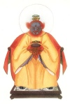

  
[Intangible Textual Heritage](../../index)  [Confucianism](../index.md) 
[Index](index)  [Previous](mlc07)  [Next](mlc09.md) 

------------------------------------------------------------------------

[Buy this Book at
Amazon.com](https://www.amazon.com/exec/obidos/ASIN/0486280926/internetsacredte.md)

------------------------------------------------------------------------

[Buy this Book on
Kindle](https://www.amazon.com/exec/obidos/ASIN/B0037Z6FKE/internetsacredte.md)

------------------------------------------------------------------------

  
*Myths and Legends of China*, by Edward T.C. Werner, \[1922\], at
Intangible Textual Heritage

------------------------------------------------------------------------

## Chapter VI

# Myths of Thunder, Lightning, Wind, and Rain

## The Ministry of Thunder and Storms

As already noted, affairs in the Otherworld are managed by official
Bureaux or Ministries very similar to those on earth. The *Fêng shên yen
i* mentions several of these, and gives full details of their
constitution. The first is the Ministry of Thunder and Storms. This is
composed of a large number of officials. The principal ones are Lei Tsu,
the Ancestor of Thunder, Lei Kung, the Duke of Thunder, Tien Mu, the
Mother of Lightning, Feng Po, the Count of Wind, and Y\[’u\] Shih, the
Master of Rain. These correspond to the Buddhist Asuras, the “fourth
class of sentient beings, the mightiest of all demons, titanic enemies
of the Dêvas,” and the Vedic Maruta, storm-demons. In the temples Lei
Tsu is placed in the centre with the other four to right and left. There
are also sometimes represented other gods of rain, or attendants. These
are Hsing T’ien Chün and T’ao T’ien Chün, both officers of Wen Chung, or
Lei Tsu, Ma Yüan-shuai, Generalissimo Ma, whose exploits are referred to
later, and others.

## The President of the Ministry of Thunder

This divinity has three eyes, one in the middle of his forehead, from
which, when open, a ray of white light proceeds to a distance of more
than two feet. Mounted on a black unicorn, he traverses millions of
miles in the twinkling of an eye.

  [  
Click to enlarge](img/p198.jpg.md)  
Wên Chung, Minister of Thunder

His origin is ascribed to a man named Wên Chung, generally known as Wên
Chung T’ai-shih, ‘the Great p. 199 Teacher
Wên Chung,’ He was a minister of the tyrant king Chou (1154–1122 B.C.),
and fought against the armies of the Chou dynasty. Being defeated, he
fled to the mountains of Yen, Yen Shan, where he met Ch’ih Ching-tzu,
one of the alleged discoverers of fire, and joined battle with him; the
latter, however, flashed his *yin-yang* mirror at the unicorn, and put
it out of action. Lei Chên-tzu, one of Wu Wang’s marshals, then struck
the animal with his staff, and severed it in twain.

Wên Chung escaped in the direction of the mountains of Chüeh-lung Ling,
where another marshal, Yün Chung-tzu, barred his way. Yün’s hands had
the power of producing lightning, and eight columns of mysterious fire
suddenly came out of the earth, completely enveloping Wên Chung. They
were thirty feet high and ten feet in circumference. Ninety fiery
dragons came out of each and flew away up into the air. The sky was like
a furnace, and the earth shook with the awful claps of thunder. In this
fiery prison Wên Chung died.

When the new dynasty finally proved victorious, Chiang Tzu-ya, by order
of Yüan-shih T’ien-tsun, conferred on Wên Chung the supreme direction of
the Ministry of Thunder, appointing him celestial prince and
plenipotentiary defender of the laws governing the distribution of
clouds and rain. His full title was Celestial and Highly-honoured Head
of the Nine Orbits of the Heavens, Voice of the Thunder, and Regulator
of the Universe. His birthday is celebrated on the twenty-fourth day of
the sixth moon.

## The Duke of Thunder

The Spirit of Thunder, for whom Lei Tsu is often mistaken, is
represented as an ugly, black, bat-winged p.
200 demon, with clawed feet, monkey’s head, and eagle’s beak, who
holds in one hand a steel chisel, and in the other a spiritual hammer,
with which he beats numerous drums strung about him, thus producing the
terrific noise of thunder. According to Chinese reasoning it is the
sound of these drums, and not the lightning, which causes death.

A. Gruenwedel, in his *Guide to the Lamaist Collection of Prince
Uchtomsky,* p. 161, states that the Chino-Japanese God of Thunder, Lei
Kung, has the shape of the Indian divine bird Garuda. Are we to suppose,
then, that the Chinese Lei Kung is of Indian origin? In modern pictures
the God of Thunder is depicted with a cock’s head and claws, carrying in
one hand the hammer, in the other the chisel. We learn, however, from
Wang Ch’ung’s *Lun Hêng* that in the first century B.C., when Buddhism
was not yet introduced into China, the ‘Thunderer’ was represented as a
strong man, not as a bird, with one hand dragging a cluster of drums,
and with the other brandishing a hammer. Thus Lei Kung existed already
in China when the latter received her first knowledge of India. Yet his
modern image may well owe its wings to the Indian rain-god Vajrapani,
who in one form appears with Garuda wings.

Lei Kung P’u-sa, the avatar of Lei Kung (whose existence as the Spirit
of Thunder is denied by at least one Chinese writer), has made various
appearances on the earth. One of these is described below.

## Lei Kung in the Tree

A certain Yeh Ch’ien-chao of Hsin Chou, when a youth, used to climb the
mountain Chien-ch’ang Shan for the purpose of cutting firewood and
collecting medicinal p. 201 herbs. One day
when he had taken refuge under a tree during a rain-storm there was a
loud clap of thunder, and he saw a winged being, with a blue face, large
mouth, and bird’s claws, caught in a cleft of the tree. This being
addressed Yeh, saying: “I am Lei Kung. In splitting this tree I got
caught in it; if you will free me I will reward you handsomely.” The
woodcutter opened the cleft wider by driving in some stones as wedges,
and liberated the prisoner. “Return to this spot to-morrow,” said the
latter, “and I will reward you.” The next day the woodcutter kept the
appointment, and received from Lei Kung a book. “If you consult this
work,” he explained, “you will be able at will to bring thunder or rain,
cure sickness, or assuage sorrow. We are five brothers, of whom I am the
youngest. When you want to bring rain call one or other of my brothers;
but call me only in case of pressing necessity, because I have a bad
character; but I will come if it is really necessary.” Having said these
words, he disappeared.

Yeh Ch’ien-chao, by means of the prescriptions contained in the
mysterious book, could cure illnesses as easily as the sun dissipates
the morning mist. One day, when he was intoxicated and had gone to bed
in the temple of Chi-chou Ssŭ, the magistrate wished to arrest and
punish him. But when he reached the steps of the *yamên*, Ch’ien-chao
called Lei Kung to his aid. A terrible clap of thunder immediately
resounded throughout the district. The magistrate, nearly dead with
fright, at once dismissed the case without punishing the culprit. The
four brothers never failed to come to his aid.

By the use of his power Ch’ien-chao saved many regions from famine by
bringing timely rain. p. 202

## The Mysterious Bottle

Another legend relates that an old woman living in Kiangsi had her arm
broken through being struck by lightning, when a voice from above was
heard saying: “I have made a mistake.” A bottle fell out of space, and
the voice again said: “Apply the contents and you will be healed at
once.” This being done, the old woman’s arm was promptly mended. The
villagers, regarding the contents of the bottle as divine medicine,
wished to take it away and hide it for future use, but several of them
together could not lift it from the ground. Suddenly, however, it rose
up and disappeared into space. Other persons in Kiangsi were also
struck, and the same voice was heard to say: ” Apply some grubs to the
throat and they will recover.“After this had been done the victims
returned to consciousness none the worse for their experience.

The worship of Lei Kung seems to have been carried on regularly from
about the time of the Christian era.

## Lei Chên-tzŭ

Another Son of Thunder is Lei Chên-tzŭ, mentioned above, whose name when
a child was Wên Yü, who was hatched from an egg after a clap of thunder
and found by the soldiers of Wên Wang in some brushwood near an old
tomb. The infant’s chief characteristic was its brilliant eyes. Wên
Wang, who already had ninety-nine children, adopted it as his hundredth,
but gave it to a hermit named Yün Chung-tzŭ to rear as his disciple. The
hermit showed him the way to rescue his adopted father from the tyrant
who held him prisoner. In seeking for some powerful weapon the child
found on p. 203 the hillside two apricots,
and ate them both. He then noticed that wings had grown on his
shoulders, and was too much ashamed to return home.

But the hermit, who knew intuitively what had taken place, sent a
servant to seek him. When they met the servant said: “Do you know that
your face is completely altered?” The mysterious fruit had not only
caused Lei Chên-tzŭ to grow wings, known as Wings of the Wind and
Thunder, but his face had become green, his nose long and pointed, and
two tusks protruded horizontally from each side of his mouth, while his
eyes shone like mirrors.

Lei Chên-tzŭ now went and rescued Wên Wang, dispersing his enemies by
means of his mystical power and bringing the old man back on his
shoulders. Having placed him in safety he returned to the hermit.

## The Mother of Lightning

This divinity is represented as a female figure, gorgeously apparelled
in blue, green, red, and white, holding in either hand a mirror from
which proceed two broad streams or flashes of light. Lightning, say the
Chinese, is caused by the rubbing together of the *yin* and the *yang*,
just as sparks of fire may be produced by the friction of two
substances.

## The Origin of the Spirit of Lightning

Tung Wang Kung, the King of the Immortals, was playing at
pitch-pot  [1](#fn_22.md) with Yü Nü. He lost;
whereupon Heaven smiled, and from its half-open mouth a ray of light
came out. This was lightning; it is regarded as p.
204 feminine because it is supposed to come from the earth, which
is of the *yin*, or female, principle.

## The God of the Wind

Fêng Po, the God of the Wind, is represented as an old man with a white
beard, yellow cloak, and blue and red cap. He holds a large sack, and
directs the wind which comes from its mouth in any direction he pleases.

There are various ideas regarding the nature of this deity. He is
regarded as a stellar divinity under the control of the star
Ch’i,  [2](#fn_23.md) because the wind blows at the
time when the moon leaves that celestial mansion. He is also said to be
a dragon called Fei Lien, at first one of the supporters of the rebel
Ch’ih Yu, who was defeated by Huang Ti. Having been transformed into a
spiritual monster, he stirred up tremendous winds in the southern
regions. The Emperor Yao sent Shên I with three hundred soldiers to
quiet the storms and appease Ch’ih Yu’s relatives, who were wreaking
their vengeance on the people. Shên I ordered the people to spread a
long cloth in front of their houses, fixing it with stones. The wind,
blowing against this, had to change its direction. Shên I then flew on
the wind to the top of a high mountain, whence he saw a monster at the
base. It had the shape of a huge yellow and white sack, and kept
inhaling and exhaling in great gusts. Shên I, concluding that this was
the cause of all these storms, shot an arrow and hit the monster,
whereupon it took refuge in a deep cave. Here it turned on Shên I and,
drawing a sword, dared him to attack the Mother of the Winds. Shên I,
however, bravely faced the monster and discharged another arrow, this
time p. 205 hitting it in the knee. The
monster immediately threw down its sword and begged that its life might
be spared.

Fei Lien is elsewhere described as a dragon who was originally one of
the wicked ministers of the tyrant Chou, and could walk with unheard-of
swiftness. Both he and his son Ô Lai, who was so strong that he could
tear a tiger or rhinoceros to pieces with his hands, were killed when in
the service of Chou Wang. Fei Lien is also said to have the body of a
stag, about the size of a leopard, with a bird’s head, horns, and a
serpent’s tail, and to be able to make the wind blow whenever he wishes.

## The Master of Rain

Yü Shih, the Master of Rain, clad in yellow scale-armour, with a blue
hat and yellow busby, stands on a cloud and from a watering-can pours
rain upon the earth. Like many other gods, however, he is represented in
various forms. Sometimes he holds a plate, on which is a small dragon,
in his left hand, while with his right he pours down the rain. He is
obviously the Parjanya of Vedism.

According to a native account, the God of Rain is one Ch’ih Sung-tzŭ,
who appeared during a terrible drought in the reign of Shên Nung
(2838–2698 B.C.), and owing to his reputed magical power was requested
by the latter to bring rain from the sky. “Nothing is easier,” he
replied; “pour a bottleful of water into an earthen bowl and give it to
me.” This being done, he plucked from a neighbouring mountain a branch
of a tree, soaked it in the water, and with it sprinkled the earth.
Immediately clouds gathered and rain fell in torrents, filling the
rivers to overflowing. Ch’ih Sung-tzŭ was then honoured as the God of
Rain, and his images show him holding the p.
206 mystic bowl. He resides in the K’un-lun Mountains, and has
many extraordinary peculiarities, such as the power to go through water
without getting wet, to pass through fire without being burned, and to
float in space.

This Rain-god also assumes the form of a silkworm chrysalis in another
account. He is there believed to possess a concubine who has a black
face, holds a serpent in each hand, and has other serpents, red and
green, reposing on her right and left ears respectively; also a
mysterious bird, with only one leg, the *shang yang*, which can change
its height at will and drink the seas dry. The following legend is
related of this bird.

## The One-legged Bird

At the time when Hsüan-ming Ta-jên instructed Fei Lien in the secrets of
magic, the latter saw a wonderful bird which drew in water with its beak
and blew it out again in the shape of rain. Fei lien tamed it, and would
take it about in his sleeve.

Later on a one-legged bird was seen in the palace of the Prince of Ch’i
walking up and down and hopping in front of the throne. Being much
puzzled, the Prince sent a messenger to Lu to inquire of Confucius
concerning this strange behaviour. “This bird is a *shang yang*” said
Confucius; “its appearance is a sign of rain. In former times the
children used to amuse themselves by hopping on one foot, knitting their
eyebrows, and saying: ‘It will rain, because the *shang yang* is
disporting himself.’ Since this bird has gone to Ch’i, heavy rain will
fall, and the people should be told to dig channels and repair the
dykes, for the whole country will be inundated.” Not only Ch’i, but all
the adjacent kingdoms were flooded; all sustained grievous damage except
Ch’i, where the p. 207 necessary precautions
had been taken. This caused Duke Ching to exclaim: “Alas! how few listen
to the words of the sages!”

## Ma Yüan-shuai

Ma Yüan-shuai is a three-eyed monster condemned by Ju Lai to
reincarnation for excessive cruelty in the extermination of evil
spirits. In order to obey this command he entered the womb of Ma Chin-mu
in the form of five globes of fire. Being a precocious youth, he could
fight when only three days old, and killed the Dragon-king of the
Eastern Sea. From his instructor he received a spiritual work dealing
with wind, thunder, snakes, etc., and a triangular piece of stone which
he could at will change into anything he liked. By order of Yü Ti he
subdued the Spirits of the Wind and Fire, the Blue Dragon, the King of
the Five Dragons, and the Spirit of the Five Hundred Fire Ducks, all
without injury to himself. For these and many other enterprises he was
rewarded by Yü Ti with various magic articles and with the title of
Generalissimo of the West, and is regarded as so successful an
interceder with Yü Ti that he is prayed to for all sorts of benefits.
p. 208

------------------------------------------------------------------------

### Footnotes

[208:1](mlc08.htm#fr_22.md) See
[45](mlc03.htm#page_45.md).

[208:2](mlc08.htm#fr_23.md) In Sagittarius, or the
Sieve; Chinese constellation of the Leopard.

------------------------------------------------------------------------

[Next: Chapter VII. Myths of the Waters](mlc09.md)

