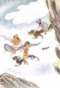
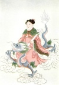

  
[Intangible Textual Heritage](../../index)  [Confucianism](../index) 
[Index](index)  [Previous](mlc08)  [Next](mlc10) 

------------------------------------------------------------------------

[Buy this Book at
Amazon.com](https://www.amazon.com/exec/obidos/ASIN/0486280926/internetsacredte)

------------------------------------------------------------------------

[Buy this Book on
Kindle](https://www.amazon.com/exec/obidos/ASIN/B0037Z6FKE/internetsacredte)

------------------------------------------------------------------------

  
*Myths and Legends of China*, by Edward T.C. Werner, \[1922\], at
Intangible Textual Heritage

------------------------------------------------------------------------

## Chapter VII

# Myths of the Waters

## The Dragons

The dragons are spirits of the waters. “The dragon is a kind of being
whose miraculous changes are inscrutable.” In a sense the dragon is the
type of a man, self-controlled, and with powers that verge upon the
supernatural. In China the dragon, except as noted below, is not a power
for evil, but a beneficent being producing rain and representing the
fecundating principle in nature. He is the essence of the *yang*, or
male, principle. “He controls the rain, and so holds in his power
prosperity and peace.” The evil dragons are those introduced by the
Buddhists, who applied the current dragon legends to the *nagas*
inhabiting the mountains. These mountain *nagas*, or dragons (perhaps
originally dreaded mountain tribes), are harmful, those inhabiting lakes
and rivers friendly and helpful. The dragon, the “chief of the three
hundred and sixty scaly reptiles,” is most generally represented as
having the head of a horse and the tail of a snake, with wings on its
sides. It has four legs. The imperial dragon has five claws on each
foot, other dragons only four. The dragon is also said to have nine
‘resemblances’: “its horns resemble those of a deer, its head that of a
camel, its eyes those of a devil, its neck that of a snake, its abdomen
that of a large cockle, its scales those of a carp, its claws those of
an eagle, the soles of its feet those of a tiger, its ears those of an
ox;” but some have no ears, the organ of hearing being said to be in the
horns, or the creature “hears through its horns.” These various
properties are supposed to indicate the “fossil remnants of primitive
p. 209 worship of many animals.” The small
dragon is like the silk caterpillar. The large dragon fills the Heaven
and the earth. Before the dragon, sometimes suspended from his neck, is
a pearl. This represents the sun. There are azure, scaly, horned,
hornless, winged, etc., dragons, which apparently evolve one out of the
other: “a horned dragon,” for example, “in a thousand years changes to a
flying dragon.”

  [  
Click to enlarge](img/p208.jpg)  
Dragon-gods

The dragon is also represented as the father of the great emperors of
ancient times. His bones, teeth, and saliva are employed as a medicine.
He has the power of transformation and of rendering himself visible or
invisible at pleasure. In the spring he ascends to the skies, and in the
autumn buries himself in the watery depths. Some are wingless, and rise
into the air by their own inherent power. There is the celestial dragon,
who guards the mansions of the gods and supports them so that they do
not fall; the divine dragon, who causes the winds to blow and produces
rain for the benefit of mankind; the earth-dragon, who marks out the
courses of rivers and streams; and the dragon of the hidden treasures,
who watches over the wealth concealed from mortals.

The Buddhists count their dragons in number equal to the fish of the
great deep, which defies arithmetical computation, and can be expressed
only by their sacred numerals. The people have a more certain faith in
them than in most of their divinities, because they see them so often;
every cloud with a curious configuration or serpentine tail is a dragon.
“We see him,” they say. The scattering of the cloud is his
disappearance. He rules the hills, is connected with *fêng-shui*
(geomancy), dwells round the graves, is associated with the Confucian
p. 210 worship, is the Neptune of the sea,
and appears on dry land.

## The Dragon-kings

The Sea-dragon Kings live in gorgeous palaces in the depths of the sea,
where they feed on pearls and opals. There are five of these divinities,
the chief being in the centre, and the other four occupying the north,
the west, the south, and the east. Each is a league in length, and so
bulky that in shifting its posture it tosses one mountain against
another. It has five feet, one of them being in the middle of its belly,
and each foot is armed with five sharp claws. It can reach into the
heavens, and stretch itself into all quarters of the sea. It has a
glowing armour of yellow scales, a beard under its long snout, a hairy
tail, and shaggy legs. Its forehead projects over its blazing eyes, its
ears are small and thick, its mouth gaping, its tongue long, and its
teeth sharp. Fish are boiled by the blast of its breath, and roasted by
the fiery exhalations of its body. When it rises to the surface the
whole ocean surges, waterspouts foam, and typhoons rage. When it flies,
wingless, through the air, the winds howl, torrents of rain descend,
houses are unroofed, the firmament is filled with a din, and whatever
lies along its route is swept away with a roar in the hurricane created
by the speed of its passage.

The five Sea-dragon Kings are all immortal. They know each other’s
thoughts, plans, and wishes without intercommunication. Like all the
other gods they go once a year to the superior Heavens, to make an
annual report to the Supreme Ruler; but they go in the third month, at
which time none of the other gods dare appear, and their stay above is
but brief. They generally remain in p.
211 the depths of the ocean, where their courts are filled with
their progeny, their dependents, and their attendants, and where the
gods and genii sometimes visit them. Their palaces, of divers coloured
transparent stones, with crystal doors, are said to have been seen in
the early morning by persons gazing into the deep waters.

## The Foolish Dragon

The part of the great Buddha legend referring to the dragon is as
follows:

In years gone by, a dragon living in the great sea saw that his wife’s
health was not good. He, seeing her colour fade away, said: “My dear,
what shall I get you to eat?” Mrs Dragon was silent. Just tell me and I
will get it,” pleaded the affectionate husband. “You cannot do it; why
trouble?” quoth she. “Trust me, and you shall have your heart’s desire,”
said the dragon. “Well, I want a monkey’s heart to eat.” “Why, Mrs
Dragon, the monkeys live in the mountain forests! How can I get one of
their hearts?” “Well, I am going to die; I know I am.”

Forthwith the dragon went on shore, and, spying a monkey on the top of a
tree, said: “Hail, shining one, are you not afraid you will fall?” “No,
I have no such fear.” “Why eat of one tree? Cross the sea, and you will
find forests of fruit and flowers.” “How can I cross?” “Get on my back.”
The dragon with his tiny load went seaward, and then suddenly dived
down. “Where are you going?” said the monkey, with the salt water in his
eyes and mouth. “Oh! my dear sir! my wife is very sad and ill, and has
taken a fancy to your heart.” “What shall I do?” thought the monkey. He
then spoke, “Illustrious friend, why p.
212 did not you tell me? I left my heart on the top of the tree;
take me back, and I will get it for Mrs Dragon.” The dragon returned to
the shore. As the monkey was tardy in coming down from the tree, the
dragon said: “Hurry up, little friend, I am waiting.” Then the monkey
thought within himself, “What a fool this dragon is!”

Then Buddha said to his followers: “At this time I was the monkey.”

## The Ministry of Waters

In the spirit-world there is a Ministry which controls all things
connected with the waters on earth, salt or fresh. Its main divisions
are the Department of Salt Waters, presided over by four
Dragon-kings—those of the East, South, West, and North—and the
Department of Sweet Waters, presided over by the Four Kings (*Ssŭ Tu*)
of the four great rivers—the Blue (Chiang), Yellow (Ho), Huai, and
Ch’i—and the Dragon-spirits who control the Secondary Waters, the
rivers, springs, lakes, pools, rapids. Into the names and functions of
the very large number of officials connected with these departments it
is unnecessary to enter. It will be sufficient here to refer only to
those whose names are connected with myth or legend.

## An Unauthorized Portrait

One of these legends relates to the visit of Ch’in Shih Huang-ti, the
First Emperor, to the Spirit of the Sea, Yang Hou, originally a marquis
(*bou*) of the State Yang, who became a god through being drowned in the
sea.

Po Shih, a Taoist priest, told the Emperor that an enormous oyster
vomited from the sea a mysterious p.
213 substance which accumulated in the form of a tower, and was
known as ‘the market of the sea’ (Chinese for ‘mirage’). Every year, at
a certain period, the breath from his mouth was like the rays of the
sun. The Emperor expressed a wish to see it, and Po Shih said he would
write a letter to the God of the Sea, and the next day the Emperor could
behold the wonderful sight.

The Emperor then remembered a dream he had had the year before in which
he saw two men fighting for the sun. The one killed the other, and
carried it off. He therefore wished to visit the country where the sun
rose. Po Shih said that all that was necessary was to throw rocks into
the sea and build a bridge across them. Thereupon he rang his magic
bell, the earth shook, and rocks began to rise up; but as they moved too
slowly he struck them with his whip, and blood came from them which left
red marks in many places. The row of rocks extended as far as the shore
of the sun-country, but to build the bridge across them was found to be
beyond the reach of human skill.

So Po Shih sent another messenger to the God of the Sea, requesting him
to raise a pillar and place a beam across it which could be used as a
bridge. The submarine spirits came and placed themselves at the service
of the Emperor, who asked for an interview with the god. To this the
latter agreed on condition that no one should make a portrait of him, he
being very ugly. Instantly a stone gangway 100,000 feet long rose out of
the sea, and the Emperor, mounting his horse, went with his courtiers to
the palace of the god. Among his followers was one Lu Tung-shih, who
tried to draw a portrait of the god by using his foot under the surface
of the water. Detecting this manoeuvre, the god was incensed, and p. 214 said to the Emperor: “You have broken your
word; did you bring Lu here to insult me? Retire at once, or evil will
befall you.” The Emperor, seeing that the situation was precarious,
mounted his horse and galloped off. As soon as he reached the beach, the
stone cause-way sank, and all his suite perished in the waves. One of
the Court magicians said to the Emperor: “This god ought to be feared as
much as the God of Thunder; then he could be made to help us. To-day a
grave mistake has been made.” For several days after this incident the
waves beat upon the beach with increasing fury. The Emperor then built a
temple and a pagoda to the god on Chih-fu Shan and Wên-têng Shan
respectively; by which act of propitiation he was apparently appeased.

## The Shipwrecked Servant

Once the Eight Immortals (see Chapter XI) were on their way to Ch’ang-li
Shan to celebrate the birthday anniversary of Hsien Wêng, the God of
Longevity. They had with them a servant who bore the presents they
intended to offer to the god. When they reached the seashore the
Immortals walked on the waves without any difficulty, but Lan Ts’ai-ho
remarked that the servant was unable to follow them, and said that a
means of transport must be found for him. So Ts’ao Kuo-chiu took a plank
of cypress-wood and made a raft. But when they were in mid-ocean a
typhoon arose and upset the raft, and servant and presents sank to the
bottom of the sea.

Regarding this as the hostile act of a water-devil, the Immortals said
they must demand an explanation from the Dragon-king, Ao Ch’in. Li
T’ieh-kuai took his gourd, and, directing the mouth toward the bottom of
p. 215 the sea, created so brilliant a light
that it illuminated the whole palace of the Sea-king. Ao Ch’in,
surprised, asked where this powerful light originated, and deputed a
courier to ascertain its cause.

To this messenger the Immortals made their complaint. “All we want,”
they added, “is that the Dragon-king shall restore to us our servant and
the presents.” On this being reported to Ao Ch’in he suspected his son
of being the cause, and, having established his guilt, severely
reprimanded him. The young Prince took his sword, and, followed by an
escort, went to find those who had made the complaint to his father. As
soon as he caught sight of the Immortals he began to inveigh against
them.

## A Battle and its Results

Han Hsiang Tzŭ, not liking this undeserved abuse, changed his flute into
a fishing-line, and as soon as the Dragon-prince was within reach caught
him on the hook, with intent to retain him as a hostage. The Prince’s
escort returned in great haste and informed Ao Ch’in of what had
occurred. The latter declared that his son was in the wrong, and
proposed to restore the shipwrecked servant and the presents. The Court
officers, however, held a different opinion. “These Immortals,” they
said, “dare to hold captive your Majesty’s son merely on account of a
few lost presents and a shipwrecked servant. This is a great insult,
which we ask permission to avenge.” Eventually they won over Ao Ch’in,
and the armies of the deep gathered for the fray. The Immortals called
to their aid the other Taoist Immortals and Heroes, and thus two
formidable armies found themselves face to face.

Several attempts were made by other divinities to p.
216 avert the conflict, but without success. The battle was a
strenuous one. Ao Ch’in received a ball of fire full on his head, and
his army was threatened with disaster when Tz’ŭ-hang Ta-shih appeared
with his bottle of lustral water. He sprinkled the combatants with this
magic fluid, using a willow-branch for the purpose, thus causing all
their magic powers to disappear.

Shui Kuan, the Ruler of the Watery Elements, then arrived, and
reproached Ao Ch’in; he assured him that if the matter were to come to
the knowledge of Shang Ti, the Supreme Ruler, he would not only be
severely punished, but would risk losing his post. Ao Ch’in expressed
penitence, restored the servant and the presents, and made full apology
to the Eight Immortals.

## The Dragon in the Pond

One day Chang Tao-ling, the ‘father of modern Taoism,’ was on Ho-ming
Shan with his disciple Wang Ch’ang. “See,” he said, “that shaft of white
light on Yang Shan yonder! There are undoubtedly some bad spirits there.
Let us go and bring them to reason.” When they reached the foot of the
mountain they met twelve women who had the appearance of evil spirits.
Chang Tao-ling asked them whence came the shaft of white light. They
answered that it was the *yin*, or female, principle of the earth.
“Where is the source of the salt water?” he asked again. “That pond in
front of you,” they replied, “in which lives a very wicked dragon.”
Chang Tao-ling tried to force the dragon to come out, but without
success. Then he drew a phœnix with golden wings on a charm and hurled
it into the air over the pond. Thereupon the dragon took fright and
fled, the pond immediately drying up. After that Chang p. 217 Tao-ling took his sword and stuck it in the
ground, whereupon a well full of salt water appeared on the spot.

  [  
Click to enlarge](img/p216.jpg)  
Spirit of the Well

## The Spirits of the Well

The twelve women each offered Chang Tao-ling a jade ring, and asked that
they might become his wives. He took the rings, and pressing them
together in his hands made of them one large single ring. “I will throw
this ring into the well,” he said, “and the one of you who recovers it
shall be my wife.” All the twelve women jumped into the well to get the
ring; whereupon Chang Tao-ling put a cover over it and fastened it down,
telling them that henceforth they should be the spirits of the well and
would never be allowed to come out.

Shortly after this Chang Tao-ling met a hunter. He exhorted him not to
kill living beings, but to change his occupation to that of a
salt-burner, instructing him how to draw out the salt from salt-water
wells. Thus the people of that district were advantaged both by being
able to obtain the salt and by being no longer molested by the twelve
female spirits. A temple, called Temple of the Prince of Ch’ing Ho, was
built by them, and the territory of Ling Chou was given to Chang
Tao-ling in recognition of the benefits he had conferred upon the
people.

## The Dragon-king’s Daughter

A graduate named Liu I, in the reign-period I Fêng (A.D. 676–679) of the
Emperor Kao Tsung of the T’ang dynasty, having failed in his examination
for his licentiate’s degree, when passing through Ching-yang Hsien, in
Ch’ang-an, Shensi, on his way home, saw a young woman tending goats by
the roadside. She said p. 218 to him: “I am
the youngest daughter of the Dragonking of the Tung-t’ing Lake. My
parents married me to the son of the God of the River Ching, but my
husband, misled by the slanders of the servants, repudiated me. I have
heard that you are returning to the Kingdom of Wu, which is quite close
to my native district, so I want to ask you to take this letter to my
father. To the north of the Tung-t’ing Lake you will find a large
orange-tree, called by the natives Protector of the Soil. Strike it
three times with your girdle and some one will appear.”

Some months later the graduate went to the spot, found the orange-tree,
and struck it three times, whereupon a warrior arose from the lake and,
saluting him, asked what he wanted. “I wish to see your great King,” the
graduate replied. The warrior struck the waters, opening a passage for
Liu I, and led him to a palace. “This,” he said, “is the palace of Ling
Hsü.” In a few minutes there appeared a person dressed in
violet-coloured clothes and holding in his hand a piece of jade. “This
is our King,” said the warrior. “I am your Majesty’s neighbour,” replied
Liu I. “I spent my youth in Ch’u and studied in Ch’in. I have just
failed in my licentiate examination. On my way home I saw your daughter
tending some goats; she was all dishevelled, and in so pitiable a
condition that it hurt me to see her, She has sent you this letter.”

## Golden Dragon Great Prince

On reading the letter the King wept, and all the courtiers followed his
example. “Stop wailing,” said the King, “lest Ch’ien-t’ang hear.” “Who
is Ch’ien-t’ang?” asked Liu I. “He is my dear brother,” replied the
King; “formerly he was one of the chief administrators p. 219 of the Ch’ien-t’ang River; now he is the
chief God of Rivers.” “Why are you so afraid that he might hear what I
have just told you?” “Because he has a terrible temper. It was he who,
in the reign of Yao, caused a nine-years flood.”

Before he had finished speaking, a red dragon, a thousand feet long,
with red scales, mane of fire, bloody tongue, and eyes blazing like
lightning, passed through the air with rapid flight and disappeared.
Barely a few moments had elapsed when it returned with a young woman
whom Liu I recognized as the one who had entrusted him with the letter.
The Dragon-king, overjoyed, said to him: “This is my daughter; her
husband is no more, and she offers you her hand.” Liu did not dare to
accept, since it appeared that they had just killed her husband. He took
his departure, and married a woman named Chang, who soon died. He then
married another named Han, who also died. He then went to live at
Nanking, and, his solitude preying upon his spirits, he decided to marry
yet again. A middleman spoke to him of a girl of Fang Yang, in Chihli,
whose father, Hao, had been Magistrate of Ch’ing Liu, in Anhui. This man
was always absent on his travels, no one knew whither. The girl’s
mother, Cheng, had married her two years before to a man named Chang of
Ch’ing Ho, in Chihli, who had just died. Distressed at her daughter
being left a widow so young, the mother wished to find another husband
for her.

Liu I agreed to marry this young woman, and at the end of a year they
had a son. She then said to her husband: “I am the daughter of the King
of the Tung-t’ing Lake. It was you who saved me from my miserable plight
on the bank of the Ching, and I swore I would p.
220 reward you. Formerly you refused to accept my hand, and my
parents decided to marry me to the son of a silk-merchant. I cut my
hair, and never ceased to hope that I might some time or other be united
to you in order that I might show you my gratitude.”

In A.D. 712, in the reign-period K’ai-yüan of the Emperor Hsüan Tsung of
the T’ang dynasty, they both returned to the Tung-t’ing Lake; but the
legend says nothing further with regard to them.

Shang Ti, the Supreme Ruler, conferred on Liu I the title of Chin Lung
Ta Wang, ‘Golden Dragon Great Prince.’

## The Old Mother of the Waters

The Old Mother of the Waters, Shul-mu Niang-niang, is the legendary
spirit of Ssŭ-chou, in Anhui. To her is popularly ascribed the
destruction of the ancient city of Ssŭ-chou, which was completely
submerged by the waters of the Hung-tsê Lake in A.D. 1574.

One author states that this Goddess of the Waters is the younger sister
of the White Spiritual Elephant, a guardian of the Door of Buddha. This
elephant is the “subtle principle of metamorphosed water.”

In his *Recherches sur Us Superstitions en Chine*, Père Henri Doré,
S.J., relates the legends he had heard with regard to this deity. One of
these is as follows:

Shui-mu Niang-niang inundated the town of Ssŭ-chou almost every year. A
report was presented to Yu Huang, Lord of the Skies, begging him to put
an end to the scourge which devastated the country and cost so many
lives. The Lord of the Skies commanded the Great Kings of the Skies and
their generals to raise troops and take the field in order to capture
this goddess and deprive p. 221 her of the
power of doing further mischief. But her tricks triumphed over force,
and the city continued to be periodically devastated by inundations.

One day Shui-mu Niang-niang was seen near the city gate carrying two
buckets of water. Li Lao-chün suspected some plot, but, an open attack
being too risky, he preferred to adopt a ruse. He went and bought a
donkey, led it to the buckets of water, and let it drink their contents.
Unfortunately the animal could not drink all the water, so that a little
remained at the bottom of the buckets. Now these magical buckets
contained the sources of the five great lakes, which held enough water
to inundate the whole of China. Shui-mu Niang-niang with her foot
overturned one of the buckets, and the water that had remained in it was
enough to cause a formidable flood, which submerged the unfortunate
town, and buried it for ever under the immense sheet of water called the
Lake of Hung-tsê.

So great a crime deserved an exemplary punishment, and accordingly Yü
Huang sent reinforcements to his armies, and a pursuit of the goddess
was methodically organized.

## The Magic Vermicelli

Sun Hou-tzŭ, the Monkey Sun,  [1](#fn_24) the
rapid courier, who in a single skip could traverse 108,000 *li* (36,000
miles), started in pursuit and caught her up, but the astute goddess was
clever enough to slip through his fingers. Sun Hou-tzŭ, furious at this
setback, went to ask Kuan-yin P’u-sa to come to his aid. She promised to
do so. As one may imagine, the furious p.
222 race she had had to escape from her enemy had given Shui-mu
Niang-niang a good appetite. Exhausted with fatigue, and with an empty
stomach, she caught sight of a woman selling vermicelli, who had just
prepared two bowls of it and was awaiting customers. Shui-mu Niang-niang
went up to her and began to eat the strength-giving food with avidity.
No sooner had she eaten half of the vermicelli than it changed in her
stomach into iron chains, which wound round her intestines. The end of
the chain protruded from her mouth, and the contents of the bowl became
another long chain which welded itself to the end which stuck out beyond
her lips. The vermicelli-seller was no other than Kuan-yin P’u-sa
herself, who had conceived this stratagem as a means of ridding herself
of this evil-working goddess. She ordered Sun Hou-tzŭ to take her down a
deep well at the foot of a mountain in Hsü-i Hsien and to fasten her
securely there. It is there that Shui-mu Niang-niang remains in her
liquid prison. The end of the chain is to be seen when the water is low.

## Hsü, the Dragon-slayer

Hsü Chên-chün was a native either of Ju-ning Fu in Honan, or of
Nan-ch’ang Fu in Kiangsi. His father was Hsü Su. His personal name was
Ching-chih, and his ordinary name Sun.

At forty-one years of age, when he was Magistrate of Ching-yang, near
the modern Chih-chiang Hsien, in Hupei, during times of drought he had
only to touch a piece of tile to turn it into gold, and thus relieve the
people of their distress. He also saved many lives by curing sickness
through the use of talismans and magic formulæ.

During the period of the dynastic troubles he resigned p. 223 and joined the famous magician Kuo P’o.
Together they proceeded to the minister Wang Tun, who had risen against
the Eastern Chin dynasty. Kuo P’o’s remonstrances only irritated the
minister, who cut off his head.

Hsü Sun then threw his chalice on the ridgepole of the room, causing it
to be whirled into the air. As Wang Tun was watching the career of the
chalice, Hsü disappeared and escaped. When he reached Lu-chiang K’ou, in
Anhui, he boarded a boat, which two dragons towed into the offing and
then raised into the air. In an instant they had borne it to the Lü Shan
Mountains, to the south of Kiukiang, in Kiangsi. The perplexed boatman
opened the window of his boat and took a furtive look out. Thereupon the
dragons, finding themselves discovered by an infidel, set the boat down
on the top of the mountain and fled.

## The Spiritual Alligator

In this country was a dragon, or spiritual alligator, which transformed
itself into a young man named Shên Lang, and married Chia Yü, daughter
of the Chief Judge of T’an Chou (Ch’ang-sha Fu, capital of Hunan). The
young people lived in rooms below the official apartments. During spring
and summer Shên Lang, as dragons are wont to do, roamed in the rivers
and lakes. One day Hsü Chên-chün met him, recognized him as a dragon,
and knew that he was the cause of the numerous floods which were
devastating Kiangsi Province. He determined to find a means of getting
rid of him.

Shên Lang, aware of the steps being taken against him, changed himself
into a yellow ox and fled. Hsü Chên-chün at once transformed himself
into a black ox and p. 224 started in
pursuit. The yellow ox jumped down a well to hide, but the black ox
followed suit. The yellow ox then jumped out again, and escaped to
Ch’ang-sha, where he reassumed a human form and lived with Ms wife in
the home of his father-in-law, Hsü Sun, returning to the town, hastened
to the *yamên,* and called to Shên Lang to come out and show himself,
addressing him in a severe tone of voice as follows: “Dragon, how dare
you hide yourself there under a borrowed form?” Shên Lang then reassumed
the form of a spiritual alligator, and Hsü Sun ordered the spiritual
soldiers to kill him. He then commanded his two sons to come out of
their abode. By merely spurting a mouthful of water on them he
transformed them into young dragons. Chia Yü was told to vacate the
rooms with all speed, and in the twinkling of an eye the whole *yamên*
sank beneath the earth, and there remained nothing but a lake where it
had been.

Hsü Chên-chün, after his victory over the dragon, assembled the members
of his family, to the number of forty-two, on Hsi Shan, outside the city
of Nan-ch’ang Fu, and all ascended to Heaven in full daylight, taking
with them even the dogs and chickens. He was then 133 years old. This
took place on the first day of the eighth moon of the second year (A.D.
374) of the reign-period Ning-K’ang of the reign of the Emperor Hsiao Wu
Ti of the Eastern Chin dynasty.

Subsequently a temple was erected to him, and in A.D. 1111 he was
canonized as Just Prince, Admirable and Beneficent.

## The Great Flood

The repairing of the heavens by Nü Kua, elsewhere alluded to, is also
attributed to the following incident. p. 225

Before the Chinese Empire was founded a noble and wonderful queen fought
with the chief of the tribes who inhabited the country round about Ô-mei
Shan. In a fierce battle the chief and his followers met defeat; raging
with anger at being beaten by a woman, he rushed up the mountain-side;
the Queen pursued him with her army, and overtook him at the summit;
finding no place to hide himself, he attempted in desperation both to
wreak vengeance upon his enemies and to end his own life by beating his
head violently against the cane of the Heavenly Bamboo which grew there.
By his mad battering he at last succeeded in knocking down the towering
trunk of the tree, and as he did so its top tore great rents in the
canopy of the sky, through which poured great floods of water,
inundating the whole earth and drowning all the inhabitants except the
victorious Queen and her soldiers. The floods had no power to harm her
or her followers, because she herself was an all-powerful divinity and
was known as the ‘Mother of the Gods,’ and the ‘Defender of the Gods.’
From the mountain-side she gathered together stones of a kind having
five colours, and ground them into powder; of this she made a plaster or
mortar, with which she repaired the tears in the heavens, and the floods
immediately ceased.

## The Marriage of the River-god

In Yeh Hsien there was a witch and some official attendants who
collected money from the people yearly for the marriage of the
River-god.

The witch would select a pretty girl of low birth, and say that she
should be the Queen of the River-god. The girl was bathed, and clothed
in a beautiful dress of gay and costly silk. She was then taken to the
bank of the p. 226 river, to a monastery
which was beautifully decorated with scrolls and banners. A feast was
held, and the girl was placed on a bed which was floated out upon the
tide till it disappeared under the waters.

Many families having beautiful daughters moved to distant places, and
gradually the city became deserted. The common belief in Yeh was that if
no queen was offered to the River-god a flood would come and drown the
people.

One day Hsi-mên Pao, Magistrate of Yeh Hsien, said to his attendants:
“When the marriage of the River-god takes place I wish to say farewell
to the chosen girl.”

Accordingly Hsi-mên Pao was present to witness the ceremony. About three
thousand people had come together. Standing beside the old witch were
ten of her female disciples, “Call the girl out,” said Hsi-mên Pao.
After seeing her, Hsi-mên Pao said to the witch: “She is not fair. Go
you to the River-god and tell him that we will find a fairer maid and
present her to him later on.” His attendants then seized the witch and
threw her into the river.

After a little while Hsi-mên Pao said: “Why does she stay so long? Send
a disciple to call her back.” One of the disciples was thrown into the
river. Another and yet another followed. The magistrate then said:” The
witches are females and therefore cannot bring me a reply.” So one of
the official attendants of the witch was thrown into the river.

Hsi-mên Pao stood on the bank for a long time, apparently awaiting a
reply. The spectators were alarmed. Hsi-mên Pao then bade his attendants
send the remaining disciples of the witch and the other official
attendants to recall their mistress. The wretches threw p. 227 themselves on their knees and knocked their
heads on the ground, which was stained with the blood from their
foreheads, and with tears confessed their sin.

“The River-god detains his guest too long,” said Hsi-mên Pao at length.
“Let us adjourn.”

Thereafter none dared to celebrate the marriage of the River-god.

## Legend of the Building of Peking

When the Mongol Yüan dynasty had been destroyed, and the Emperor Hung Wu
had succeeded in firmly establishing that of the Great Ming, Ta Ming, he
made Chin-ling, the present Nanking, his capital, and held his Court
there with great splendour, envoys from every province within the ‘Four
Seas’ (the Chinese Empire) assembling there to witness his greatness and
to prostrate themselves before the Dragon Throne.

The Emperor had many sons and daughters by his different consorts and
concubines, each mother, in her inmost heart, fondly hoping that her own
son would be selected by his father to succeed him.

Although the Empress had a son, who was the heir-apparent, yet she felt
envious of those ladies who had likewise been blessed with children, for
fear one of the princes should supplant her son in the affection of the
Emperor and in the succession. This envy displayed itself on every
occasion; she was greatly beloved by the Emperor, and exerted all her
influence with him, as the other young princes grew up, to get them
removed from Court. Through her means most of them were sent to the
different provinces as governors; those provinces under their government
being so many principalities or kingdoms. p.
228

## Chu-ti

One of the consorts of Hung Wu, the Lady Wêng, had a son named Chu-ti.
This young prince was very handsome and graceful in his deportment; he
was, moreover, of an amiable disposition. He was the fourth son of the
Emperor, and his pleasing manner and address had made him a great
favourite, not only with his father, but with every one about the Court.
The Empress noticed the evident affection the Emperor evinced for this
prince, and determined to get him removed from the Court as soon as
possible. By a judicious use of flattery and cajolery, she ultimately
persuaded the Emperor to appoint the prince governor of the Yen country,
and thenceforth he was styled Yen Wang, Prince of Yen.

## The Sealed Packet

The young Prince, shortly after, taking an affectionate leave of the
Emperor, left Chin-ling to proceed to his post. Ere he departed,
however, a Taoist priest, called Liu Po-wên, who had a great affection
for the Prince, put a sealed packet into his hand, and told him to open
it when he found himself in difficulty, distress, or danger; the perusal
of the first portion that came to his hand would invariably suggest some
remedy for the evil, whatever it was. After doing so, he was again to
seal the packet, without further looking into its contents, till some
other emergency arose necessitating advice or assistance, when he would
again find it. The Prince departed on his journey, and in the course of
time, without meeting with any adventures worth recording, arrived
safely at his destination. p. 229

## A Desolate Region

The place where Peking now stands was originally called Yu Chou; in the
T’ang dynasty it was called Pei-p’ing Fu; and afterward became known as
Shun-t’ien Fu—but that was after the city now called Peking was built.
The name of the country in which this place was situated was Yen. It was
a mere barren wilderness, with very few inhabitants; these lived in huts
and scattered hamlets, and there was no city to afford protection to the
people and to check the depredations of robbers.

When the Prince saw what a desolate-looking place he had been appointed
to, and thought of the long years he was probably destined to spend
there, he grew very melancholy, and nothing his attendants essayed to do
in hope of alleviating his sorrow succeeded.

## The Prince opens the Sealed Packet

All at once the Prince bethought himself of the packet which the old
Taoist priest had given him; he forthwith proceeded to make search for
it—for in the bustle and excitement of travelling he had forgotten all
about it—in hope that it might suggest something to better the prospects
before him. Having found the packet, he hastily broke it open to see
what instructions it contained; taking out the first paper which came to
hand, he read the following:

“When you reach Pei-p’ing Fu you must build a city there and name it
No-cha Ch’êng, the City of No-cha.  [2](#fn_25)
But, as the work will be costly, you must issue a proclamation inviting
the wealthy to subscribe the necessary p.
230 funds for building it. At the back of this paper is a plan of
the city; you must be careful to act according to the instructions
accompanying it.”

The Prince inspected the plan, carefully read the instructions, and
found even the minutest details fully explained. He was struck with the
grandeur of the design of the proposed city, and at once acted on the
instructions contained in the packet; proclamations were posted up, and
large sums were speedily subscribed, ten of the wealthiest families who
had accompanied him from Chin-ling being the largest contributors,
supporting the plan not only with their purses, by giving immense sums,
but by their influence among their less wealthy neighbours.

## The City is Founded

When sufficient money had been subscribed, a propitious day was chosen
on which to commence the undertaking. Trenches where the foundations of
the walls were to be were first dug out, according to the plan found in
the packet. The foundations themselves consisted of layers of stone
quarried from the western hills; bricks of an immense size were made and
burnt in the neighbourhood; the moat was dug out, and the earth from it
used to fill in the centre of the walls, which, when complete, were
forty-eight *li* in circumference, fifty cubits in height, and fifty in
breadth; the whole circuit of the walls having battlements and
embrasures. Above each of the nine gates of the city immense
three-storied towers were built, each tower being ninety-nine cubits in
height.

Near the front entrance of the city, facing each other, were built the
Temples of Heaven and of Earth. In p.
231 rear of it the beautiful ‘Coal Hill’ (better known as
‘Prospect Hill’) was raised; while in the square in front of the Great
Gate of the palace was buried an immense quantity of charcoal (that and
the coal being stored as a precaution in case of siege).

The palace, containing many superb buildings, was built in a style of
exceeding splendour; in the various enclosures were beautiful gardens
and lakes; in the different courtyards, too, seventy-two wells were dug
and thirty-six golden tanks placed. The whole of the buildings and
grounds was surrounded by a lofty wall and a stone-paved moat, in which
the lotus and other flowers bloomed in great beauty and profusion, and
in the clear waters of which myriads of gold and silver fish disported
themselves.

The geomancy of the city was similar to that of Chin-ling, When
everything was completed the Prince compared it with the plan and found
that the city tallied with it in every respect. He was much delighted,
and called for the ten wealthy persons who had been the chief
contributors, and gave each of them a pair of ‘couchant dragon’ silk- or
satin-embroidered cuffs, and allowed them great privileges. Up to the
present time there is the common saying: “Since then the ‘dragon-cuffed’
gentlefolks have flourished.”

## General Prosperity

All the people were loud in praise of the beauty and strength of the
newly built city. Merchants from every province hastened to Peking,
attracted by the news they heard of its magnificence and the prospect
there was of profitably disposing of their wares. In short, the people
were prosperous and happy, food was plentiful, p.
232 the troops brave, the monarch just, his ministers virtuous,
and all enjoyed the blessings of peace.

## A Drought and its Cause

While everything was thus tranquil, a sudden and untoward event occurred
which spread dismay and consternation on all sides. One day when the
Prince went into the hall of audience one of his ministers reported that
“the wells are thirsty and the rivers dried up”—there was no water, and
the people were all in the greatest alarm. The Prince at once called his
counsellors together to devise some means of remedying this disaster and
causing the water to return to the wells and springs, but no one could
suggest a suitable plan.

It is necessary to explain the cause of this scarcity of water. There
was a dragon’s cave outside the east gate of the city at a place called
Lei-chên K’ou, ‘Thunder-clap Mouth’ or ‘Pass’ (the name of a village).
The dragon had not been seen for myriads of years, yet it was well known
that he lived there.

In digging out the earth to build the wall the workmen had broken into
this dragon’s cave, little thinking of the consequences which would
result. The dragon was exceedingly wroth and determined to shift his
abode, but the she-dragon said: “We have lived here thousands of years,
and shall we suffer the Prince of Yen to drive us forth thus? If we *do*
go we will collect all the water, place it in our *yin-yang* baskets
\[used for drawing water\], and at midnight we will appear in a dream to
the Prince, requesting permission to retire. If he gives us permission
to do so, and allows us also to take our baskets of water with us, he
will fall into our trap, for we shall take the waler with his own
consent,” p. 233

## The Prince’s Dream

The two dragons then transformed themselves into an old man and an old
woman, went to the chamber of the Prince, who was asleep, and appeared
to him in a dream. Kneeling before him, they cried: “O Lord of a
Thousand Years, we have come before you to beg leave to retire from this
place, and to beseech you out of your great bounty to give us permission
to take these two baskets of water with us.”

The Prince readily assented, little dreaming of the danger he was
incurring. The dragons were highly delighted, and hastened out of his
presence; they filled the baskets with all the water there was in
Peking, and carried them off with them.

When the Prince awoke he paid no attention to his dream till he heard
the report of the scarcity of water, when, reflecting on the singularity
of his dream, he thought there might be some hidden meaning in it. He
therefore had recourse to the packet again, and discovered that his
dream-visitors had been dragons, who had taken the waters of Peking away
with them in their magic baskets; the packet, however, contained
directions for the recovery of the water, and he at once prepared to
follow them.

## The Pursuit of the Dragons

In haste the Prince donned his armour, mounted his black steed, and,
spear in hand, dashed out of the west gate of the city. He pressed on
his horse, which went swift as the wind, nor did he slacken speed till
he came up with the water-stealing dragons, who still retained the forms
in which they had appeared to him in his p.
234 dream. On a cart were the two identical baskets he had seen;
in front of the cart, dragging it, was the old woman, while behind,
pushing it, was the old man.

## An Unexpected Flood

When the Prince saw them he galloped up to the cart, and, without
pausing, thrust his spear into one of the baskets, making a great hole,
out of which the water rushed so rapidly that the Prince was much
frightened. He dashed off at full speed to save himself from being
swallowed up by the waters, which in a very short time had risen more
than thirty feet and had flooded the surrounding country. On galloped
the Prince, followed by the roaring water, till he reached a hill, up
which he urged his startled horse. When he gained the top he found that
it stood out of the water like an island, completely surrounded; the
water was seething and swirling round the hill in a frightful manner,
but no vestige could he see of either of the dragons.

## The Waters Subside

The Prince was very much alarmed at his perilous position, when suddenly
a Buddhist priest appeared before him, with clasped hands and bent head,
who bade him not be alarmed, as with Heaven’s assistance he would soon
disperse the water. Hereupon the priest recited a short prayer or spell,
and the waters receded as rapidly as they had risen, and finally
returned to their proper channels.

## The Origin of Chên-shui T’a

The broken basket became a large deep hole, some three *mu* (about half
an English acre) in extent, in the p.
235 centre of which was a fountain which threw up a vast body of
clear water. From the midst of this there arose a pagoda, which rose and
fell with the water, floating on the top like a vessel; the spire
thrusting itself far up into the sky, and swaying about like the mast of
a ship in a storm.

The Prince returned to the city filled with wonder at what he had seen,
and with joy at having so successfully carried out the directions
contained in the packet. On all sides he was greeted by the acclamations
of the people, who hailed him as the saviour of Peking. Since that time
Peking has never had the misfortune to be without water.

The pagoda is called the Pagoda on the Hill of the Imperial Spring (Yü
Ch’üan Shan T’a; more commonly Chên-shui T’a, ‘Water-repressing
Pagoda’).  [3](#fn_26) The spring is still
there, and day and night, unceasingly, its clear waters bubble up and
flow eastward to Peking, which would now be a barren wilderness but for
Yen Wang’s pursuit of the water. p. 236

------------------------------------------------------------------------

### Footnotes

[236:1](mlc09.htm#fr_24) See Chapter XIV.

[236:2](mlc09.htm#fr_25) See Chapter XII.

[236:3](mlc09.htm#fr_26) This pagoda is distant
about twenty *li* (seven miles) from Peking. It is on the top of the
hill, while the spring is at the foot, half a *li* distant. The imperial
family used the water from this spring, whence it was carried to Peking
in carts.

------------------------------------------------------------------------

[Next: Chapter VIII. Myths of Fire](mlc10)

