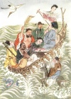

  
[Intangible Textual Heritage](../../index)  [Confucianism](../index) 
[Index](index)  [Previous](mlc12)  [Next](mlc14) 

------------------------------------------------------------------------

[Buy this Book at
Amazon.com](https://www.amazon.com/exec/obidos/ASIN/0486280926/internetsacredte)

------------------------------------------------------------------------

[Buy this Book on
Kindle](https://www.amazon.com/exec/obidos/ASIN/B0037Z6FKE/internetsacredte)

------------------------------------------------------------------------

  
*Myths and Legends of China*, by Edward T.C. Werner, \[1922\], at
Intangible Textual Heritage

------------------------------------------------------------------------

## Chapter XI

# The Eight Immortals

## Pa Hsien

Either singly or in groups the Eight Immortals, Pa Hsien, of the Taoist
religion are one of the most popular subjects of representation in
China; their portraits are to be seen everywhere—on porcelain vases,
teapots, teacups, fans, scrolls, embroidery, etc. Images of them are
made in porcelain, earthenware, roots, wood, metals. The term ‘Eight
Immortals’ is figuratively used for happiness. The number eight has
become lucky in association with this tradition, and persons or things
eight in number are graced accordingly. Thus we read of reverence shown
to the ‘Eight Genii Table’ (*Pa Hsien Cho*), the ‘Eight Genii Bridge’
(*Pa Hsien Ch’iao*), ‘Eight Genii Vermicelli’ (*Pa Hsien Mien*), the
‘Eight Genii of the Wine-cup’ (*Tin Chung Pa Hsien*)—wine-bibbers of the
T’ang dynasty celebrated by Tu Fu, the poet. They are favourite subjects
of romance, and special objects of adoration. In them we see “the
embodiment of the ideas of perfect but imaginary happiness which possess
the minds of the Chinese people.” Three of them (Chung-li Ch’üan, Chang
Kuo, and Lü Yen) were historical personages; the others are mentioned
only in fables or romances. They represent all kinds of people—old,
young, male, female, civil, military, rich, poor, afflicted, cultured,
noble. They are also representative of early, middle, and later
historical periods.

The legend of the Eight Immortals is certainly not older than the time
of the Sung dynasty (A.D. 960–1280), and is probably to be assigned to
that of the Yüan dynasty (1280–1368). But some, if not all, of the group
seem to p. 289 have been previously
celebrated as Immortals in the Taoist legends. Their biographies are
usually arranged in the order of their official eminence or seniority in
age. Here I follow that adopted in *Hsiu hsiang Pa Hsien tung yu
chi*  [1](#fn_31) in which they are described in
the order in which they became Immortals.

## Li T’ieh-kuai

Li T’ieh-kuai, depicted always with his crutch and gourd full of magic
medicines, was of the family name of Li, his own name being Li Yüan
(Hs’üan, now read Yüan). He is also known as K’ung-mu. Hsi Wang Mu cured
him of an ulcer on the leg and taught him the art of becoming immortal.
He was canonized as Rector of the East. He is said to have been of
commanding stature and dignified mien, devoting himself solely to the
study of Taoist lore. Hsi Wang Mu made him a present of an iron crutch,
and sent him to the capital to teach the doctrine of immortality to Han
Chung-li.

He is also identified with Li Ning-yang, to whom Lao Tzŭ descended from
Heaven in order to instruct him in the wisdom of the gods. Soon after he
had completed his course of instruction his soul left his body to go on
a visit to Hua Shan. Some say he was summoned by Lao Tzŭ, others that
Lao Tzŭ engaged him as escort to the countries of Hsi Yü. He left his
disciple Lang Ling in charge of his body, saying that if he did not
return within seven days he was to have the body cremated.
Unfortunately, when only six days had elapsed the disciple was called
away to the death-bed of his mother. In order to be able to leave at
once he cremated the body forthwith, and when the soul returned it found
only a heap of ashes. p. 290 Some say the
body was not cremated, but only became devitalized through neglect or
through being uninhabited for so long a time. The object of the setting
of the watch was not only to prevent injury to or theft of the body, but
also to prevent any other soul from taking up its abode in it.

In a forest near by a beggar had just died of hunger. Finding this
corpse untenanted, the wandering spirit entered it through the temples,
and made off. When he found that his head was long and pointed, his face
black, his beard and hair woolly and dishevelled, his eyes of gigantic
size, and one of his legs lame, he wished to get out of this vile body;
but Lao Tzŭ advised him not to make the attempt and gave him a gold band
to keep his hair in order, and an iron crutch to help his lame leg. On
lifting his hand to his eyes, he found they were as large as buckles.
That is why he was called Li K’ung-mu, ‘Li Hollow Eyes.’ Popularly he is
known as Li T’ieh-kuai, ‘Li with the Iron Crutch.’ No precise period
seems to be assigned to his career on earth, though one tradition places
him in the Yüan dynasty. Another account says that he was changed into a
dragon, and in that form ascended to Heaven.

Elsewhere it is related that T’ieh-kuai, after entering the body of the
lame beggar, benevolently proceeded to revive the mother of Yang, his
negligent disciple. Leaning on his iron staff and carrying a gourd of
medicines on his back he went to Yang’s house, where preparations were
being made for the funeral. The contents of the gourd, poured into the
mouth, revived the dead woman. He then made himself known, and, giving
Yang another pill, vanished in a gust of wind. Two hundred years later
he effected the immortalization of his disciple. p.
291

During his peregrinations on earth he would hang a bottle on the wall at
night and jump into it, emerging on the following morning. He frequently
returned to earth, and at times tried to bring about the transmigration
of others.

An example is the case of Ch’ao Tu, the watchman. T’ieh-kuai walked into
a fiery furnace and bade Ch’ao follow. The latter, being afraid of
imitating an act evidently associated with the supernatural world of
evil spirits, refused to do so. T’ieh-kuai then told Ch’ao to step on to
a leaf floating on the surface of the river, saying that it was a boat
that would bear him across safely. Again the watchman refused, whereupon
T’ieh-kuai, remarking that the cares of this world were evidently too
weighty for him to be able to ascend to immortality, stepped on to the
leaf himself and vanished.

## Chung-li Ch’üan

Regarding the origin and life of this Immortal several different
accounts are given. One states that his family name was Chung-li, and
that he lived in the Han dynasty, being therefore called Han Chung-li.
His cognomen was Ch’üan, his literary appellation Chi Tao, and his
pseudonyms Ho-ho Tzŭ and Wang-yang Tzŭ; his style Yün-fang.

He was born in the district of Hsien-yang Hsien (a sub-prefecture of the
ancient capital Hsi-an Fu) in Shensi. He became Marshal of the Empire in
the cyclic year 2496. In his old age he became a hermit on Yang-chio
Shan, thirty *li* north-east of I-ch’êng Hsien in the prefecture of
P’ing-yang Fu in Shansi. He is referred to by the title of King-emperor
of the True Active Principle. p. 292

Another account describes Chung-li Ch’üan as merely a vice-marshal in
the service of Duke Chou Hsiao. He was defeated in battle, and escaped
to Chung-nan Shan, where he met the Five Heroes, the Flowers of the
East, who instructed him in the doctrine of immortality. At the end of
the T’ang dynasty Han Chung-li taught this same science of immortality
to Lü Tung-pin (see [297](#page_297)), and took the pompous title of the
Only Independent One Under Heaven.

Other versions state that Han Chung-li is not the name of a person, but
of a country; that he was a Taoist priest Chung Li-tzŭ; and that he was
a beggar, Chung-li by name, who gave to one Lao Chih a pill of
immortality. No sooner had the latter swallowed it than he went mad,
left his wife, and ascended to Heaven.

During a great famine he transmuted copper and pewter into silver by
amalgamating them with some mysterious drug. This treasure he
distributed among the poor, and thousands of lives were thus saved.

One day, while he was meditating, the stone wall of his dwelling in the
mountains was rent asunder, and a jade casket exposed to view. This was
found to contain secret information as to how to become an Immortal.

When he had followed these instructions for some time, his room was
filled with many-coloured clouds, music was heard, and a celestial stork
came and bore him away on its back to the regions of immortality.

He is sometimes represented holding his feather-fan, Yü-mao Shan; at
other times the peach of immortality. Since his admission to the ranks
of the gods, he has appeared on earth at various times as the messenger
of Heaven. On one of these occasions he met Lü Yen, as narrated on [p.
297](#page_297). p. 293

## Lan Ts’ai-ho

Lan Ts’ai-ho is variously stated to have been a woman and an
hermaphrodite. She is the strolling singer or mountebank of the
Immortals. Usually she plays a flute or a pair of cymbals. Her origin is
unknown, but her personal name is said to have been Yang Su, and her
career is assigned to the period of the T’ang dynasty. She wandered
abroad clad in a tattered blue gown held by a black wooden belt three
inches wide, with one foot shoeless and the other shod, wearing in
summer an undergarment of wadded material, and in winter sleeping on the
snow, her breath rising in a brilliant cloud like the steam from a
boiling cauldron. In this guise she earned her livelihood by singing in
the streets, keeping time with a wand three feet long. Though taken for
a lunatic, the doggerel verse she sang disproved the popular slanders.
It denounced this fleeting life and its delusive pleasures. When given
money, she either strung it on a cord and waved it to the time of her
song or scattered it on the ground for the poor to pick up.

One day she was found to have become intoxicated in an inn at Fêng-yang
Fu in Anhui, and while in that state disappeared on a cloud, having
thrown down to earth her shoe, robe, belt, and castanets.

According to popular belief, however, only one of the Eight Immortals,
namely, Ho Hsien-ku, was a woman, Lan Ts’ai-ho being represented as a
young person of about sixteen, bearing a basket of fruit. According to
the *Hsiu hsiang Pa Hsien tung yu chi*, he was ‘the Red-footed Great
Genius,’ Ch’ih-chiao Ta-hsien incarnate. Though he was a man, adds the
writer, he could not understand how to be a man (which is perhaps the
reason why he has been supposed to be a woman). p.
294

## Chang Kuo

The period assigned to Chang Kuo is the middle or close of the seventh
to the middle of the eighth century A.D. He lived as a hermit on
Chung-t’iao Shan, in the prefecture of P’ing-yang Fu in Shansi. The
Emperors T’ai Tsung and Kao Tsung of the T’ang dynasty frequently
invited him to Court, but he persistently refused to go. At last,
pressed once more by the Empress Wu (A.D. 684–705), he consented to
leave his retreat, but was struck down by death at the gate of the
Temple of the Jealous Woman. His body began to decay and to be eaten by
worms, when lo! he was seen again, alive and well, on the mountains of
Hêng Chou in P’ing-yang Fu. He rode on a white mule, which carried him
thousands of miles in a day, and which, when the journey was finished,
he folded up like a sheet of paper and put away in his wallet. When he
again required its services, he had only to spurt water upon the packet
from his mouth and the animal at once assumed its proper shape. At all
times he performed wonderful feats of necromancy, and declared that he
had been Grand Minister to the Emperor Yao (2357–2255 B.C.) during a
previous existence.

In the twenty-third year (A.D. 735) of the reign-period K’ai Yüan of the
Emperor Hsüan Tsung of the T’ang dynasty, he was called to Lo-yang in
Honan, and elected Chief of the Imperial Academy, with the honourable
title of Very Perspicacious Teacher.

It was just at this time that the famous Taoist Yeh Fa-shan, thanks to
his skill in necromancy, was in great favour at Court. The Emperor asked
him who this Chang Kuo Lao (he usually has the epithet Lao, ‘old,’ added
to his name) was. “I know,” replied the magician; “but if I were to tell
your Majesty I should fall dead at your feet, p.
295 so I dare not speak unless your Majesty will promise that you
will go with bare feet and bare head to ask Chang Kuo to forgive you, in
which case I should immediately revive.” Hsüan Tsung having promised,
Fa-shan then said: “Chang Kuo is a white spiritual bat which came out of
primeval chaos.” No sooner had he spoken than he dropped dead at the
Emperor’s feet.

Hsüan Tsung, with bare head and feet, went to Chang Kuo as he had
promised, and begged forgiveness for his indiscretion. The latter then
sprinkled water on Fa-shan’s face and he revived. Soon after Chang fell
sick and returned to die in the Hêng Chou Mountains during the period
A.D. 742–746. When his disciples opened his tomb, they found it empty.

He is usually seen mounted on his white mule, sometimes facing its head,
sometimes its tail. He carries a phœnix-feather or a peach of
immortality.

At his interviews with the Emperor Ming Huang in A.D. 723 (when he was
alive still) Chang Kuo “entertained the Emperor with a variety of
magical tricks, such as rendering himself invisible, drinking off a cup
of aconite, and felling birds or flowers by pointing at them. He refused
the hand of an imperial princess, and also declined to have his portrait
placed in the Hall of Worthies.”

A picture of Chang Kuo sitting on a donkey and offering a descendant to
the newly married couple is often found in the nuptial chamber. It seems
somewhat incongruous that an old ascetic should be associated with
matrimonial happiness and the granting of offspring, but the explanation
may possibly be connected with his performance of wonderful feats of
necromancy, though he is said not to have given encouragement to others
in these things during his lifetime. p. 296

## Ho Hsien Ku

A maiden holding in her hand a magic lotus-blossom, the flower of
open-heartedness, or the peach of immortality given her by Lü Tung-pin
in the mountain-gorge as a symbol of identity, playing at times the
*shêng* or reed-organ, or drinking wine—this is the picture the Chinese
paint of the Immortal Ho Hsien Ku.

She was the daughter of Ho T’ai, a native of Tsêng-ch’êng Hsien in
Kuangtung. Others say her father was a shopkeeper at Ling-ling in Hunan.
She lived in the time of the usurping empress Wu (A.D. 684–705) of the
T’ang dynasty. At her birth six hairs were found growing on the crown of
her head, and the account says she never had any more, though the
pictures represent her with a full head of hair. She elected to live on
Yün-mu Ling, twenty *li* west of Tsêng-ch’êng Hsien. On that mountain
was found a stone called *yün-mu shih*, ‘mother-of-pearl.’ In a dream
she saw a spirit who ordered her to powder and eat one of these stones,
by doing which she could acquire both agility and immortality. She
complied with this injunction, and also vowed herself to a life of
virginity. Her days were thenceforth passed in floating from one peak to
another, bringing home at night to her mother the fruits she collected
on the mountain. She gradually found that she had no need to eat in
order to live. Her fame having reached the ears of the Empress, she was
invited to Court, but while journeying thither suddenly disappeared from
mortal view and became an Immortal. She is said to have been seen again
in A.D. 750 floating upon a cloud of many colours at the temple of Ma
Ku, the famous female Taoist magician, and again, some years later, in
the city of Canton.

She is represented as an extremely beautiful maiden, p. 297 and is remarkable as occupying so prominent
a position in a cult in which no system of female asceticism is
developed.

## Lü Tung-pin

Lü Tung-pin’s family name was Lü; his personal name Tung-pin; also Yen;
and his pseudonym Shun Yang Tzŭ. He was born in A.D. 798 at Yung-lo
Hsien, in the prefecture of Ho-chung Fu in Shansi, a hundred and twenty
*li* south-east of the present sub-prefecture of Yung-chi Hsien (P’u
Chou). He came of an official family, his grandfather having been
President of the Ministry of Ceremonies, and his father Prefect of Hai
Chou. He was 5 feet 2 inches in height, and at twenty was still
unmarried. At this time he made a journey to Lu Shan in Kiangsi, where
he met the Fire-dragon, who presented him with a magic sword, which
enabled him at will to hide himself in the heavens.

During his visit to the capital, Ch’ang-an in Shensi, he met the
Immortal Han Chung-li, who instructed him in the mysteries of alchemy
and the elixir of life. When he revealed himself as Yün-fang
Hsien-shêng, Lü Yen expressed an ardent desire to aid in converting
mankind to the true doctrine, but was first exposed to a series of ten
temptations. These being successfully overcome, he was invested with
supernatural power and magic weapons, with which he traversed the
Empire, slaying dragons and ridding the earth of divers kinds of evils,
during a period of upward of four hundred years. Another version says
that Han Chung-li was in an inn, heating a jug of rice-wine. Here Lü met
him, and going to sleep dreamed that he was promoted to a very high
office and was exceptionally favoured by fortune in every way. This had
gone on for p. 298 fifty years when
unexpectedly a serious fault caused him to be condemned to exile, and
his family was exterminated. Alone in the world, he was sighing
bitterly, when he awoke with a start. All had taken place in so short a
space of time that Han Chung-li’s wine was not yet hot. This is the
incident referred to in Chinese literature in the phrase ‘rice-wine
dream.’ Convinced of the hollowness of worldly dignities, he followed
Han Chung-li to the Ho Ling Mountains at Chung-nan in Shensi, where he
was initiated into the divine mysteries, and became an Immortal.

In A.D. 1115 the Emperor Hui Tsung conferred on him the title of Hero of
Marvellous Wisdom; and later he was proclaimed King-emperor and Strong
Protector.

There are various versions of the legend of Lü Tung-pin. One of these
adds that in order to fulfil his promise made to Chung-li to do what he
could to aid in the work of converting his fellow-creatures to the true
doctrine, he went to Yüch Yang in the guise of an oil-seller, intending
to immortalize all those who did not ask for additional weight to the
quantity of oil purchased. During a whole year he met only selfish and
extortionate customers, with the exception of one old lady who alone did
not ask for more than was her due. So he went to her house, and seeing a
well in the courtyard threw a few grains of rice into it. The water
miraculously turned into wine, from the sale of which the dame amassed
great wealth.

He was very skilful in fencing, and is always represented with his magic
Excalibur named Chan-yao Kuai, ‘Devil-slaying Sabre,’ and in one hand
holds a fly-whisk, Yün-chou, or ‘Cloud-sweeper,’ a symbol common in
Taoism of being able to fly at will through the air and to walk on the
clouds of Heaven. p. 299

Like Kuan Kung, he is shown bearing in his arms a male child—indicating
a promise of numerous progeny, including *literati* and famous
officials. Consequently he is one of the spiritual beings honoured by
the *literati*.

## Han Hsiang Tzŭ

Han Hsiang Tzŭ, who is depicted with a bouquet of flowers or a basket of
peaches of immortality, is stated to have been a grand-nephew of Han Yü
(A.D. 768–824), the great statesman, philosopher, and poet of the T’ang
dynasty, and an ardent votary of transcendental study. His own name was
Ch’ing Fu. The child was entrusted to his uncle to be educated and
prepared for the public examinations. He excelled his teacher in
intelligence and the performance of wonderful feats, such as the
production from a little earth in a flower-pot of some marvellous
flowering plants, on the leaves of which were written in letters of gold
some verses to this effect:

  
The clouds hide Mount Ch’in Ling.  
Where is your abode?  
The snow is deep on Lan Kuan;  
Your horse refuses to advance.

“What is the meaning of these verses?” asked Han Yü. “You will see,”
replied Han Hsiang Tzŭ.

Some time afterward Han Yü was sent in disgrace to the prefecture of
Ch’ao-chou Fu in Kuangtung. When he reached the foot of Lan Kuan the
snow was so deep that he could not go on. Han Hsiang Tzŭ appeared, and,
sweeping away the snow, made a path for him. Han Yü then understood the
prophecy in his pupil’s verses. p. 300

When Han Hsiang Tzŭ was leaving his uncle, he gave him the following in
verse:

Many indeed are the eminent men who have served their country, but which
of them surpasses you in his knowledge of literature? When you have
reached a high position, you will be buried in a damp and foggy land.

Han Yü also gave his pupil a farewell verse:

How many here below allow themselves to be inebriated by the love of
honours and pelf! Alone and watchful you persevere in the right path.
But a time will come when, taking your flight to the sky, you will open
in the ethereal blue a luminous roadway.

Han Yü was depressed at the thought of the damp climate of his place of
exile. “I fear there is no doubt,” he said, “that I shall die without
seeing my family again.”

Han Hsiang Tzŭ consoled him, gave him a prescription, and said: “Not
only will you return in perfect health to the bosom of your family, but
you will be reinstated in your former offices.” All this took place
exactly as he had predicted.

Another account states that he became the disciple of Lü Tung-pin, and,
having been carried up to the supernatural peach-tree of the genii, fell
from its branches, but during his descent attained to the state of
immortality. Still another version says that he was killed by the fall,
was transformed, and then underwent the various experiences with Han Yü
already related.

## Ts’ao Kuo-chiu

Ts’ao Kuo-chiu was connected with the imperial family of the Sungs, and
is shown with the tablet of admission to Court in his hand. He became
one of the p. 301 Eight Immortals because the
other seven, who occupied seven of the eight grottos of the Upper
Spheres, wished to see the eighth inhabited, and nominated him because
“his disposition resembled that of a genie.” The legend relates that the
Empress Ts’ao, wife of the Emperor Jên Tsung (A.D. 1023–64), had two
younger brothers. The elder of the two, Ching-hsiu, did not concern
himself with the affairs of State; the younger, Ching-chih, was
notorious for his misbehaviour. In spite of all warnings he refused to
reform, and being at last guilty of homicide was condemned to death. His
brother, ashamed at what had occurred, went and hid in the mountains,
where he clothed his head and body with wild plants, resolved to lead
the life of a hermit. One day Han Chung-li and Lü Tung-pin found him in
his retreat, and asked him what he was doing. “I am engaged in studying
the Way,” he replied. “What way, and where is it?” they asked. He
pointed to the sky. “Where is the sky?” they went on. He pointed to his
heart. The two visitors smiled and said: “The heart is the sky, and the
sky is the Way; you understand the origin of things.” They then gave him
a recipe for perfection, to enable him to take his place among the
Perfect Ones. In a few days only he had reached this much-sought-after
condition.

In another version we find fuller details concerning this Immortal. A
graduate named Yüan Wên-chêng of Ch’ao-yang Hsien, in the sub-prefecture
of Ch’ao-chou Fu in Kuangtung, was travelling with his wife to take his
examinations at the capital. Ts’ao Ching-chih, the younger brother of
the Empress, saw the lady, and was struck with her beauty. In order to
gratify his passion he invited the graduate and his young wife to the
palace, p. 302 where he strangled the husband
and tried to force the wife to cohabit with him. She refused
obstinately, and as a last resort he had her imprisoned in a noisome
dungeon. The soul of the graduate appeared to the imperial Censor Pao
Lao-yeh, and begged him to exact vengeance for the execrable crime. The
elder brother, Ching-hsiu, seeing the case put in the hands of the
upright Pao Lao-yeh, and knowing his brother to be guilty of homicide,
advised him to put the woman to death, in order to cut off all sources
of information and so to prevent further proceedings. The young
voluptuary thereupon caused the woman to be thrown down a deep well, but
the star T’ai-po Chin-hsing, in the form of an old man, drew her out
again. While making her escape, she met on the road an official
procession which she mistook for that of Pao Lao-yeh, and, going up to
the sedan chair, made her accusation. This official was no other than
the elder brother of the murderer. Ching-hsiu, terrified, dared not
refuse to accept the charge, but on the pretext that the woman had not
placed herself respectfully by the side of the official chair, and thus
had not left a way clear for the passage of his retinue, he had her
beaten with iron-spiked whips, and she was cast away for dead in a
neighbouring lane. This time also she revived, and ran to inform Pao
Lao-yeh. The latter immediately had Ts’ao Ching-hsiu arrested, cangued,
and fettered. Without loss of time he wrote an invitation to the second
brother, Ts’ao Ching-chih, and on his arrival confronted him with the
graduate’s wife, who accused him to his face. Pao Lao-yeh had him put in
a pit, and remained deaf to all entreaties of the Emperor and Empress on
his behalf. A few days later the murderer was taken to the place of
execution, and his head rolled in the dust. The problem now was how to
get Ts’ao p. 303 Ching-hsiu out of the hands
of the terrible Censor. The Emperor Jên Tsung, to please the Empress,
had a universal amnesty proclaimed throughout the Empire, under which
all prisoners were set free. On receipt of this edict, Pao Lao-yeh
liberated Ts’ao Ching-hsiu from the cangue, and allowed him to go free.
As one risen from the dead, he gave himself up to the practice of
perfection, became a hermit, and, through the instruction of the Perfect
Ones, became one of the Eight Immortals.

  [  
Click to enlarge](img/p302.jpg)  
The Eight Immortals Crossing the Sea

## Pa Hsien Kuo Hai

The phrase *Pa Hsien kuo hai*, ‘the Eight Immortals crossing the sea,’
refers to the legend of an expedition made by these deities. Their
object was to behold the wondrous things of the sea not to be found in
the celestial sphere.

The usual mode of celestial locomotion—by taking a seat on a cloud—was
discarded at the suggestion of Lü Yen who recommended that they should
show the infinite variety of their talents by placing things on the
surface of the sea and stepping on them.

Li T’ieh-kuai threw down his crutch, and scudded rapidly over the waves.
Chung-li Ch’üan used his feather-fan, Chang Kuo his paper mule, Lü
Tung-pin his sword, Han Hsiang Tzŭ his flower-basket, Ho Hsien Ku her
lotus-flower, Lan Ts’ai-ho his musical instrument, and Ts’ao Kuo-chiu
his tablet of admission to Court. The popular pictures often represent
most of these articles changed into various kinds of sea-monsters. The
musical instrument was noticed by the son of the Dragon-king of the
Eastern Sea. This avaricious prince conceived the idea of stealing the
instrument and imprisoning its owner. The Immortals thereupon declared
war, the p. 304 details of which are
described at length by the Chinese writers, the outcome being that the
Dragon-king was utterly defeated. After this the Eight Immortals
continued their submarine exploits for an indefinite time, encountering
numberless adventures; but here the author travels far into the fertile
region of romance, beyond the frontiers of our present province. p. 305

------------------------------------------------------------------------

### Footnotes

[305:1](mlc13.htm#fr_31) *An Illustrated Account
of the Eight Immortals’ Mission to the East*.

------------------------------------------------------------------------

[Next: Chapter XII. The Guardian of the Gate of Heaven](mlc14)

