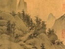

  
[Intangible Textual Heritage](../../index)  [Confucianism](../index) 
[Index](index)  [Previous](mtc35)  [Next](mtc37) 

------------------------------------------------------------------------

  
*More Translations from the Chinese*, by Arthur Waley, \[1919\], at
Intangible Textual Heritage

------------------------------------------------------------------------

p. 66

### \[35\] DREAMING THAT I WENT WITH LU AND YU TO VISIT YÜAN CHĒN

#### *(Written in exile)*

At night I dreamt I was back in
Ch‘ang-an;  
I saw again the faces of old friends.  
And in my dreams, under an April sky,  
They led me by the hand to wander in the spring winds.  
Together we came to the village of Peace and Quiet;  
We stopped our horses at the gate of Yüan Chēn.  
Yüan Chēn was sitting all alone;  
When he saw me coming, a smile came to his face.  
He pointed back at the flowers in the western court;  
Then opened wine in the northern summer-house.  
He seemed to be saying that neither of us had changed;  
He seemed to be regretting that joy will not stay;  
That our souls had met only for a little while,  
To part again with hardly time for greeting.  
I woke up and thought him still at my side;  
I put out my hand; there was nothing there at all.

------------------------------------------------------------------------

[Next: The Fifteenth Volume](mtc37)

