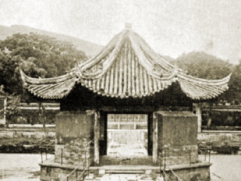

  
[Intangible Textual Heritage](../../index)  [Confucianism](../index.md) 

------------------------------------------------------------------------

<table width="75%">
<colgroup>
<col style="width: 50%" />
<col style="width: 50%" />
</colgroup>
<tbody>
<tr class="odd">
<td width="50%" data-valign="TOP"></td>
<td width="50%" data-valign="CENTER"><h1 id="sacred-places-in-china" data-align="CENTER">Sacred Places in China</h1>
<h2 id="by-carl-f.-kupfer" data-align="CENTER">by Carl F. Kupfer</h2>
<h4 id="section" data-align="CENTER">[1911]</h4></td>
</tr>
</tbody>
</table>

------------------------------------------------------------------------

[Contents](#contents)    [Start Reading](spc00.md)    [Page
Index](pageidx)    [Text \[Zipped\]](spc.txt.gz.md)

------------------------------------------------------------------------

This is a travelogue by a 19th century Christian missionary who visited
several sacred locations in China, including places holy to all three of
China's principal religions: Taoism, Confucianism and Buddhism. The
writer is not exactly neutral, but he is appreciative and knowledgeable.
Kupfer brings an understanding of the deep time horizons and cultural
context of Chinese traditional religion. He relates many fantastic
stories of visions of Gods and Goddesses which manifested around these
locations. He calls on religious leaders who live at these sites,
including an audience with the 'Taoist Pope.' At the time of his visit,
most of these temples were in disrepair, and given the successive
history, that probably continued. This makes this little survey an
important baseline inventory of Chinese religious centers prior to the
upheavals of the Chinese revolution. This book is hard to find, and has
not been reprinted since it was first published, as far as I can
tell.--*J. Lelievre*, August 27th, 2008.

------------------------------------------------------------------------

 [Title Page](spc00.md)  
[Preface](spc01.md)  
[Contents](spc02.md)  
[Early Buddhism in Hwang Mei](spc03.md)  
[Ngn Ren Tsz—The Monastery of Benevolence](spc04.md)  
[Kiu Hua Shan—Or The Nine-Lotus-Flower Mountain](spc05.md)  
[Poot’oo: China's Sacred Island](spc06.md)  
[The White Deer Grotto University](spc07.md)  
[The Mandarin's Grave](spc08.md)  
[Lung-Hu Shan—The Dragon-Tiger Mountain](spc09.md)  
[Conclusions](spc10.md)  
