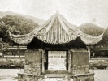
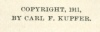

  
[Intangible Textual Heritage](../../index)  [Confucianism](../index) 
[Index](index)  [Next](spc01) 

------------------------------------------------------------------------

  
*Sacred Places in China*, by Carl F. Kupfer, \[1911\], at Intangible
Textual Heritage

------------------------------------------------------------------------

# SACRED PLACES IN CHINA

###### BY

## CARL F. KUPFER, A. M., Ph. D.

##### *President of William Nast College, Kiukiang, China, Kiangsi Province*.

#### CINCINNATI:

#### PRESS OF THE WESTERN METHODIST BOOK CONCERN

#### \[1911\]

  [  
Click to enlarge](img/front.jpg)  
Frontispiece: HO SHANG FEN—SEPARATION OF THE PRIESTS.  

In the early centuries of the Christian Era, when Buddhism was well
established in China, the priests held a conference here and concluded
that the Old Patriarch should be appointed as the last of the
patriarchs, and they separated into the Provinces.

This historic spot is about five miles south of Kiukiang, near the foot
of the lofty *Lii* Mountains, close by the road that leads to Kuling.

  [  
Click to enlarge](img/title.jpg)  
Title Page  

 
[  
Click to enlarge](img/verso.jpg)  
Verso  

Scanned, proofed and formatted by John Bruno Hare at Intangible Textual
Heritage, August 2008. This text is in the public domain in the US
because it was published prior to 1923.

------------------------------------------------------------------------

[Next: Preface](spc01)
