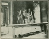

  
[Intangible Textual Heritage](../../index)  [Confucianism](../index.md) 
[Index](index)  [Previous](spc06)  [Next](spc08.md) 

------------------------------------------------------------------------

  
*Sacred Places in China*, by Carl F. Kupfer, \[1911\], at Intangible
Textual Heritage

------------------------------------------------------------------------

p. 70

### The White Deer Grotto University.

On the southeastern slope of the Lü
Mountains, in a little valley at the junction of the two rippling
brooks, one flowing east and the other south, stands one of the oldest
universities of which we have any knowledge; Salerno, the oldest
European university, not excepted. With *Wu lao fung*, "five old peaks,"
standing like parapets on a rampart for the background, and the *Poyang*
Lake winding up the valley beyond the lower undulating hills, it can
claim a situation at once attractive and grand. The grotto shows no sign
of ever having been a natural cave, being dug into the hillside and
arched over with masonry work. It contains the image of a deer hewn out
of stone placed there by *Ho Tsing* in the fourteenth century. According
to historical statements it was the studio and home of the illustrious
poet *Li P’u*, who flourished during the T’ang Dynasty in the reign of
*Chêu Yuan*, the latter part of the ninth century. He and his elder
brother *Shê* made this cave their private home. *P’u* had a tame white
deer which always accompanied his master in his walks over the hills;
and thus he was called *peh lu sien-seng*, "the white deer gentleman,"
and his residence the cave of the white deer.

During the reign of *Pao Li*, A.D. 825, P’u was promoted to be
sub-prefect at *Kiang-chou*, now *Kiukiang*. To perpetuate the memory of
his old sequestered-home, he built a kiosk over it, from which time the
cave of the white deer became famous. At the end of the *T’ang* Dynasty,
when there was great confusion in the Empire, the scholars from far and
near assembled in the cave for research. During these troublous times
when five successive dynasties rose and fell in two

p. 71

  [  
Click to enlarge](img/07100.jpg.md)  
THE FAIRY BRIDGE-ENTRANCE TO THE UNIVERSITY CAMPUS  

p. 72

years (A.D. 805–807), a school was opened here, fields bought, buildings
erected, and students gathered. The scholarly *Si Shan-tao*, who had
thoroughly mastered the Nine Canonical Books, was chosen from the
Imperial Academy of Learning to be the president of this institution,
and it was called the Government School of the *Lü* Mountains. The
institution soon increased in number and influence, and many of the
early students became famous in public life. In the year A.D. 960, the
institution was raised to the grade of a university, and stood equal in
rank and influence with *Chi Yong*, *Shih Ku*, and *Yo Lao*
Universities. The attendance of over one hundred students is mentioned
at this time.

In the cyclical year *Ting-cheo* (A.D. 976), during the reign of the two
Emperors, *T’ai Ping* and *Hsin Kuah*, the sub-prefect of *Kiukiang*
begged the Emperor to present a set of the Nine Canonical Books of the
Imperial Academy of Learning Edition; this modest request was granted,
and the books were sent to the cave by the government postal service.

The institution passed through various changes, more failures than
successes following each other, until the cyclical year *Chi-hai* (1174)
in the *Sung* Dynasty, and the reign of *Shun Hsi*, when the great
philosopher and expositor of the Confucian Canon, *Chü Hui-ngan*, became
the prefect of *Nang-k’angfu*. No sooner had he arrived than he ordered
the official director of students to proceed at once to the cave and
investigate conditions. Later he personally went there and carefully
looked all the property over, whereupon he sent a message to the
President of the Board of Works, informing him that the building might
be repaired, and also reminded. him that the White Deer Grotto was a
place where the former worthies had concealed themselves, and where
students had been supported by previous dynasties, which favors should
not be forgotten. In pathetic terms he appealed for help: "The buildings
are falling down, and the prefect can not but take the burden of repairs
upon himself; he has measured

p. 73

the place and calculated the expenses. Why should he do this? Because
the name of this institution is recorded in the national annals."

After a lapse of time he sent another message to the Senior Secretary of
the Board and to the Minister of State, begging to be appointed
President of University, and to ask for some grants to be bestowed. If
this could be done, he would be asking for no other favor in his life
than to be allowed to study with his students until death. He also
pointed out how much better this would be than to add glory to the
heterodox priests who only burn incense and do nothing for the good of
mankind nor for their food and clothing. And he further pleads that this
institution receive recognition as well as *Yu Lao* University and a
tablet be bestowed naming it the White Deer Grotto University, and that
some parts of the classics be written upon this stone tablet by the
Emperor *Kow Tsun* himself. It is well known that at this time the
publication of the Classics of Confucius and Mencius was forbidden, in
consequence of which education had also fallen to a low ebb, and all
classes, the officials and common people, complained of this, feeling
deeply chagrined. When *Chü Hui-ngan* was acting as Inspector of the
State Department, he had an audience with the Emperor, and he again made
a plea for more liberal education. Said he: "The Taoist and Buddhist
temples are built everywhere. In the provincial capital there are more
than one hundred, in every prefecture several tens, all well established
publicly and privately, and yet there is desire for more; while there is
only one school or college open in a prefecture, and small districts
have none. Thus temples are prosperous, while schools and colleges are
neglected; temples are numerous, while schools and colleges are few. Why
this inequality? Is it not wrong that the civil authorities do not make
this right, and that they even look upon any information with suspicion?
If this continues the Grotto University will soon be despised

p. 74

by the common people, and not be kept open unless an Imperial Tablet be
bestowed. Is it not the way by which your Majesty can praise your
meritorious predecessors and do the scholars a favor? This I venture to
beg at the hazard of my life." When the Emperor *Hsiao Tsung* heard this
he granted the request; but the tablet did not assure the institution
perpetual peace and blessings. At the end of the following dynasty—the
Yuan—it was cast out into the brushwood during a commotion, and not
until the sixth Emperor of the Ming Dynasty was it found and replaced.

History does not clearly state how long *Chü Fu-tsz* labored here, but
hereditary legend claims that he spent the rest of his life in this
institution, and was buried in the shady grove back of the college. The
legend also pretends to know the origin of his superhuman wisdom. When
he came to live at the grotto, a *hu li sien*, "fox-fairy," in the
likeness of a young woman, came to live with him and serve him. She
brought with her a pearl of great value, and insisted upon *Chü*
swallowing it. After long persuasion he yielded to her entreaties, and
the pearl became in him the fountain of wisdom, such as is not possessed
by mortal man. Soon after this a *ka ma sien*," frog-fairy," also in the
likeness of a young woman, came to dwell with him. But alas, the women
did not live together long in peace. In an altercation the last arrival
said, "And who are you but a fox?" Replied the other, "And what are you
but a frog?" The next day the two fairies were missing, and a dead fox
and a dead frog were found lying under the old bridge below the college.
They were buried with due ceremony in the college grove, where a little
stone marks their resting place, to the credulous belief of the student
and admirer of *Chü Fu-tsz*.

A visit to this historical spot is least desirable in summer, when the
students are here from all parts of the central provinces; during the
Chinese New Year vacation it is a pleasure and profit. If a
well-informed student can be secured

p. 75

  [  
Click to enlarge](img/07500.jpg.md)  
UNIVERSITY BUILDINGS.  

p. 76

as guide, much that seems to have no significance becomes interesting.
Being thus provided, we left *Kiukiang* two days before the New Year,
early in the morning, and arrived there late in the evening. A young man
from *Fou lan hsien*, an unsophisticated youth, who had never seen a
foreigner, was the only dweller within these walls. He had come here to
spend the holidays, having heard that a man having done so the year
before, worshiping Confucius on New Year's Day, took his degree at the
next competitive examination. On the morning of the last day of the old
year he walked five miles to *Nank’ang* to buy candles and incense, and
that night and the following one he kept them burning upon all the
altars in those labyrinthian rooms. He was radiant with hope.

If the present condition of this institution is a criterion of the state
of the religion it stands for, then Confucianism is in a most hopeless
and woeful plight. It is an institution without a recognized president
or faculty, without a Board of Trustees, or even a janitor. The *tipao*
was said to be in charge, but during three days’ stay we did not see
him. The director of the literary class of *Nank’ang*, having heard of
our arrival, called upon us, but he did not assume any responsibility.
The students seem to be a law unto themselves. They bring their own
cooking utensils with them and build a little hearth for their private
use; some unite in clubs. This explains the dilapidated condition of the
buildings; whole sections of the wooden partition being broken out and
used for fuel. Over some parts the roof is crushed in, and weeds are
flourishing in the rooms. The memorial tablets, of which there are many,
have sagged in all directions, and many have fallen down and are broken.
It is now nothing more than a quiet place for students to hide away from
the disturbances of home life, and so be better able to prosecute their
private studies.

The Literary Assembly Hall is a large, substantial building, but
entirely void of all furniture, there being not even a scroll to
decorate the black walls. But the learner here

p. 77

  [  
Click to enlarge](img/07700.jpg.md)  
THE CONFUCIAN ALTAR.  

The Image of Confucius, veiled with red curtains, is
here dimly seen. In front is the altar where all professors and students
of this institution have worshiped. The curtains are moth-eaten and the
altar is a rendezvous for bats.

  [  
Click to enlarge](img/07701.jpg.md)  
THE CHIEF DISCIPLES OF CONFUCIUS.  

 
[  
Click to enlarge](img/07702.jpg.md)  
MENCIUS.  

p. 78

stands face to face with the eight virtues which are indelibly inscribed
in large, bold characters upon stone slabs set in the walls:

*Hsiao*—Filial Piety.

*Ti*—Respect of younger brothers.

*Chung*—Loyalty.

*Hsin*—Sincerity.

*Li*—Propriety.

*I*—Righteousness.

*Lien*—Purity.

*Chih*—The feeling of shame.

On the inside of the back door of this hall is written an amplification
by *Chü Fu-tsz* on the Five Relations as taught by Mencius; upon these
*Chü* based his Rules of Order: "Between father and son there should be
affection; between sovereign and minister righteousness; between husband
and wife attention to their separate duties; and between old and young
respect; and between friends fidelity." These are the instructions
regarding the five relations, and the observing of them was also
enforced by Yao and Shun, who appointed Su to be the minister of
instruction and to teach carefully the relations of humanity. The
students should learn them in the following regular order: Study them
extensively, enquire about them accurately, reflect upon them carefully,
discriminate clearly, and practice earnestly; such is the order of
learning: study, enquire, reflect, and discriminate thoroughly by
examining the principles. To practice earnestly refers to the
cultivation of moral conduct, the managing of business affairs, and the
making acquaintance with others.

"In regard to the cultivation of moral conduct, the most important
thoughts are: let the words be sincere and truthful, the actions
honorable and careful, the anger restrained, and the lust chastened.
Reform and be good.

"In regard to the managing of business affairs two things are necessary,
the action must be orderly without scheming

p. 79

to gain profit, and the doctrine must be thoroughly understood without
counting too much the toil in getting the mastery of it.

"In regard to making acquaintance with others, the important part to be
remembered is: not to do to others as you would not wish others to do to
you; and when you do not realize what you need, then turn inward and
examine yourselves in every point.

"We learn that ancient worthies instructed men to investigate the
principles of righteousness and to cultivate a moral conduct by which
they might influence others. They did not merely wish men to commit to
memory, write compositions, by which they might gain fame,' vaunt
themselves and gain profit. But the student of the present time (the
days of *Chü Fu-tsz*) do not follow the methods of instruction as taught
by the ancient worthies. Let the students who have earnest thoughts give
due attention, inquire and discriminate. If one knows what ought to be
done and forces himself to do it, will he not eventually know
intuitively what his duties are without rules of order? The rules which
have been established are for students of a lower grade than those of
ancient times. And as the methods of the present day students do not
agree with those of the ancients, I do not put the rules of ancient
methods in this hall, but on the lintels of the door. Those important
subjects which the ancient worthies taught, I myself will investigate
and follow with all the students, and we will force ourselves to
practice them. Moreover, we will endeavor to be even more rigid and
careful what we are thinking, speaking, and doing, than these subjects
require of us. And those who are inclined to abrogate and neglect these
regulations should at least try to follow them. May all think of my
words over and over again!"

Among the numerous other inscriptions upon walls, lintels, and tablets,
we would only mention one. It is composed of four characters, but when
verbally translated it teaches

p. 80

volumes of truth in practical life: *Yü T’ien Ti T’san*, "with the
heavenly earthly is mixed." However, the Confucianist sees a very
different meaning in this inscription. He reads from it: "The virtue of
Confucius is equal to heaven and earth."

In a little room in front of the Confucian Temple is enshrined a tutelar
god. Upon inquiring why this wayside shrine was in this unusual place,
we were informed that this room had become noted for the remarkable
success which all students who had studied here had met with in their
examinations—all having taken high degrees. In consequence of this
inexplicable favor conferred upon all who studied here, there was a
great rush every season for its occupancy, and when quarreling and even
murder ensued, it was relegated to an idol, and no student was allowed
to study there. The propitiousness of this room is ascribed to an idol—a
literary god—standing in a little pavilion across the brook. This idol
is facing the college and is holding a pencil in his right hand, and
this pencil points directly to that room, and guides the pen of the
favored student to supernatural success.

Another evidence that these Confucian scholars are far from being free
of the belief in idols and images is clearly seen in the Confucian
Temple located in the midst of the college buildings. In the main hall
of this building are large images of Confucius, Mencius, and fifteen of
the most famous disciples of Confucius. And what is not seen even at a
Buddhist temple there are here four gods standing on the top of the
roof, two looking northward, and two southward. In the room in front of
the grotto is also a large image of *Chü Fu-tsz*.

"Scarce can the classic pilgrim sweep free  
   From fallen architrave the desert vine,  
 Trace the dim names of their divinity;  
   Gods of the ruined temples, where, O where are ye?"

------------------------------------------------------------------------

[Next: The Mandarin's Grave](spc08.md)
