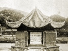

  
[Intangible Textual Heritage](../../index)  [Confucianism](../index.md) 
[Index](index)  [Previous](spc07)  [Next](spc09.md) 

------------------------------------------------------------------------

  
*Sacred Places in China*, by Carl F. Kupfer, \[1911\], at Intangible
Textual Heritage

------------------------------------------------------------------------

p. 81

### The Mandarin's Grave.

Fifteen *li*, or about five English
miles, southeast of Kiukiang, near the foot of the *Lü* Mountains, and
on the southwestern slope of the Oak Tree Hill, is the grave of the
celebrated *Chou Fu Tsz*, called in Chinese *Lien Chi Mu*, *Lienchi*
being the name of his birthplace. To foreigners this place has become a
beautiful spot for an afternoon excursion; but to the more devout
Chinese it is a sacred sanctuary. If beauty of scenery and balmy air can
add anything to the peaceful repose of departed spirits when they see
their "mortal coil" surrounded by such lavish gifts of nature, then
*Chou Fu Tsz* can certainly have nothing to regret for having chosen
this location. Sheltered from the northern winds, nestled in a little
amphitheater-like valley, surrounded by huge trees of many centuries'
growth, with the five thousand feet mountain peaks looming up into the
clouds, and the Lotus Flower Peak near by, what more could immortal
shades desire? Beautiful as it is by nature, the æsthetic taste of man
has added much to its picturesque harmony.

*Chou Fu Tsz* was a native of Hunan, born in *Lienchi* in the *Sung*
Dynasty in the year 1017 A.D. He was commonly known as *Chou Tsz* and
spoken of as *Lien Chi Sienseng*, the gentleman from Lienchi. When he
was but a child his father died, and his mother was so poor that she
brought him to her brothers, whose family name was *Chen*. When his
mother died, she was buried by the side of her brothers’ graves.
Forty-four years later these graves were destroyed by a flood, and *Chou
Fu Tsz* removed his mother's remains to their present resting place. Two
years after this he died, and was buried on the left side of his
mother's grave.

p. 82

In the year 1488 a prefect of *Kiukiang* named *Tung* built an ancestral
hall near by and endowed it with real estate property. Fourteen years
later a Literary Chancellor named *Shao Pao* invited the members of the
*Chou* family to worship at this hall.

Within the amphitheater a mound is raised. On top of this mound are the
graves, apparently under one cover, shaped like a tortoise. In front of
this tortoise-shaped cover five tablets are erected. The middle and
largest one is dedicated to his mother, who received the posthumous
title usually conferred upon native women of "*Taichün*." At the upper
end of this tablet the two words *Tao Ma* are engraved (The Source of
the Doctrine).

To his mother's left is a tablet containing an inscription written by
*Peng Yü-lin*, the celebrated admiral of the *Yangtze:* "This is the
grave of the Ancient Worthy *Lien Chi Chou Tsz* of the *Sung* Dynasty,
who received posthumous honors and was named *Yuen Kung*."

To the left of this is another tablet containing an engraving of *Chou
Fu Tsz*, without date or name of author. How near it resembles the
worthy sage no one can tell.

The tablet to his mother's right is in honor of his two wives. His first
wife was of the family *Leo*, the second of the family *Chih*. It is,
however, worthy of mention that they were not his wives
contemporaneously. It is believed that polygamy was less popular in
those dark mediæval days than it is now.

On the tablet to the extreme right a beautiful vine is artistically
carved into the side and upper part of the stone. Under the vine a boy
and girl are standing. They are called *Chin Tung* and *Yü Nü*, and are
supposed to be the beings who serve as guides to departed spirits over
the No-Alternative Bridge—in Purgatory—which all spirits must cross.

Back of the grave is a wall built in the [shape](errata.htm#3.md) of a
horseshoe, reaching round to the front. In this wall three stone

p. 83

  [  
Click to enlarge](img/08300.jpg.md)  
CHOU FU TSZ.  

p. 84

tablets are set. The middle and larger one was erected by *Peng Yü-lin*,
and contains the following inscription: "Southeast of *Kinkiang*, below
the Lotus Flower Peak, is the grave of *Lien Chi Sienseng*. In the
spring of the fifth year of *Hsien Fêng* (1856 A.D.), I, with *Li
Se-ping*, brought soldiers to *Kiukiang*. When we had time we came to
this grave to worship. This place was *Chou's* own choice, and his
mother's grave is in the middle. When he died he was buried to his
mother's left, and his wives to her right. We found their graves badly
dilapidated, so we bought stones and had them repaired. A government
student, a corporal, and a descendant of the twenty-second generation of
*Chou's* family managed the repairs. In one month the work was
completed.

"That we have had such men as *Chou* is proof that the doctrine of the
ancient Sages still flourishes. If after Confucius and Mencius no other
holy men had come, the people under heaven would have followed after
temporal honors and riches, and have become idlers like Buddhist
priests, none searching the Doctrine of the Ancient Worthies. During the
two turbulent periods (from 420 to 554 A.D.) when six dynasties rose and
fell (and from 907 to 960) when five dynasties followed in rapid
succession, the calamities of the people were great. All because the
people of those times did not know or follow the Doctrine of the
Ancients. But at last a holy man was born in *Hunan*—*Chou Fu Tsz* came.
Having no one to instruct him, he devoted himself to private study and
meditation, and then wrote the *Ting Shu*, a calendar advising the
people how to do and act according to the Doctrine of the Ancients. Then
the people began to understand the teaching of Confucius and Mencius.
His instruction was profoundly deep, and also practical for the moral
improvement of the people. As he understood the doctrine, others also
were kept from error. The teaching in the Kingdom was corrected, the
Government again began to flourish, and the evil in the land ceased to
prevail. If all would practice the doctrine of benevolence

p. 85

  [  
Click to enlarge](img/08500.jpg.md)  
CROSSING THE BRIDGE OF FATE—NO ALTERNATIVE.  

p. 86

and righteousness as *Chou* did, applying it to their person, virtue
would be secured, and in the affairs of life peace assured, and there
would be culture among the officials and prosperity among the people. To
save from calamity is as if saving from disease. If the constitution is
sound and healthy the evil influences of disease can not come upon man.
Thus *Chou's* doctrine was more and more appreciated, as he influenced
his times by thinking of and teaching refinement."

On the tablet to the left of this is the following inscription in bold
characters: "The Grave of the *Nankang* Prefect *Lien Chi Sienseng*.
Erected first year of *Chia Ching* (1522 A.D.) by *Kao Yao-ching*,
Prefect of *Nank’angfu*."

But the tablet to the right attracts the attention of the visitor above
everything else to be seen here. It is called the "*T’ai Kih Tao*" (the
Chart of the Absolute). This inscription is intended to set forth in
picture and word the cosmogony of *Chou Fu Tsz*. A satisfactory
translation of this inscription is not an easy task. As very few of the
native scholars know anything of the philosophy it purports to advance,
a foreigner is sometimes obliged to resort to conjecture, hence we can
not claim this to be more than a free translation: "From the *U-kih* the
Infinite to the *T’ai kih* the Absolute. The Absolute moved and brought
forth light, the male principle. Again it moved with greater rapidity
and then stood quiet, which brought forth darkness, the female
principle. Then the Absolute again moved and the movement and repose
were denominated '*Yang*' (light) and 'Ying' (darkness). In the Eight
Diagrams the symbol of light, or positive principle, consists of a
single line, thus —. The symbol of darkness; negative principle consists
of a broken line, thus – –. Then light united with darkness and brought
forth the five elements: fire, water, earth, metal, and wood. The five
vapors—rain, sunshine, heat, cold, and wind—appeared and kept in harmony
with the seasons. These elements contained darkness and light caused by
the Absolute; and the Absolute

p. 87

also contained the five vapors. The Infinite united in deepest mystery
with the five elements and the five vapors, and they firmly congealed.

"The Way of Heaven caused the male principle. The Way of Earth caused
the female principle. These two acted upon each other and produced the
innumerable living creatures. But man endowed by the grace of heaven,
the most sagacious, has received a body that contains the functions of
five senses and wisdom that enables him to distinguish good from evil.
The holy man controls all these in himself and can not be easily
disturbed, thus establishing a perfect man. Hence the virtue of the holy
man is as great as heaven and earth, and his wisdom as clear as the sun
and moon; and as the seasons are regular in their succession, so there
is order in all that he does. He knows as if by intuition how to conform
his actions so as to obtain the good and avoid the evil. He practices
the doctrines in all benevolence and righteousness. As it has been said,
if one gives thought to his beginning and end, he can know of life and
death. Thus the Doctrine of the Changes is perfect above all other
doctrines."

The Doctrine of the Changes referred to in this inscription is the "*I
King*" (Canon of Changes), containing a fanciful system of divination
from the combination of diagrams, mysterious in the extreme, called the
Eight Diagrams. That this book was extant as far back as history can
lead us, there can be no doubt. In the Confucian Analects VII, 14,
Confucius says: "If some years were added to my life I would give fifty
to the study of the ‘*I*’ (Canon of Changes), and might then escape
falling into a great error." Such was the faith of the great Sage in the
Doctrine of Changes. Hearing of a man here in Kiukiang who is reported
to understand the mysteries of the “*I*,” I sent word to him for a
little explanation of the Chart of the Absolute, and he replied, "If the
gentleman who desires this information is willing to spend a lifetime in
studying the ‘*I*,’ then he will understand it." As

p. 88

the prime of my days is passed, I will not try to master this mysterious
monument of antiquity.

Approaching the grave from the entrance, there are two tablets standing
below the mound, one to the right and the other to the left. The one to
the right is a small moss-covered slab containing the following
inscription:

"*Chou Fu Tsz* deduced his philosophy from the Eight Diagrams, which the
Emperor *Fu Hsi* discovered on the back of a tortoise. The philosopher
*I Loh* is said to have perfected this doctrine. The hills are bare, and
man is dead. So the stream vainly flows. For whom is the grass over the
grave so beautiful? In the evening it spreads over the ground, and the
chilly air makes us sad. (Signed) *Li Pa-yang*, Prefect of Kiukiang,
1573 A.D." The Emperor *Fu Hsi* mentioned in this inscription is
supposed to have lived 2838 B.C., being the first of the Five Legendary
Emperors. He is claimed to have been of miraculous birth, a native of
*Shan si*.

To the left stands a larger tablet, erected by *Peng Yu-lin*, Admiral of
the *Yangtze*, with this inscription:

"*Lienchi Chou Tsz* is our *Hunan*, *Taochou* man. His grave is below
the Oak Tree Hill. In the seventh year of *Kwang Hsü* (1882), when I was
Admiral of the *Yangtze*, I came to *Kiukiang* with the *Chentai* and
magistrate of *Hu-kou*, and we worshiped at the grave. When I saw that
our previous repairs were not substantial, I gave money and ordered the
*Chentai* to repair it and build the horseshoe-shaped wall back of the
grave, and make a broader entrance. I examined the historic annals of
the *Sung* Dynasty, and found that *Chou Fu Tsz's* mother's grave,
originally at *Renchou* in *Hunan*, had been destroyed by a flood, and
*Chou Fu Tsz* had begged the Prefect of *Nank’ang* to have his mother's
grave removed to this place. After this he himself became Prefect of
*Nankang*, and built a home at *Lien hwa fung*. Two years later he died
and was buried to his mother's left. His wives

p. 89

  [  
Click to enlarge](img/08900.jpg.md)  
CHART OF THE ABSOLUTE.  

p. 90

are to her right. This can be seen in the official annals of *K’anghsi*.

"During the *Sung* Dynasty this place was called *Tehhwa* Village, with
an altar called the Clear Water Shrine. In the year 1215, eighth year of
the Emperor *Chia Ting* of the Southern *Sung* Dynasty, a minister of
state named *Wei Liao-wang*, passed here and worshiped. When he arrived
at the palace in Peking he begged of the Emperor to grant *Chou*
posthumous honors. This was done, and *Chou* received the name *Yuen
Kung*. In the *Ming* Dynasty, during the reign of *Hung Chih* (1490
A.D.), the Prefect of *Kiukiang* built an ancestral hall near the grave,
and named it *Yuen Kung Chou Siensing.* So I now write with due honors:
\`The Ancient Worthy *Yuen Kung Lienchi Chou Fu Tsz Mu*.' This is in
accord with ancient propriety. But to repair his grave and worship him
is of no benefit to any one, if he does not receive his doctrine. If all
who pass here will honor him and follow his example, then his teaching
will not have been in vain.

"Now, since the work of repairs is completed, I write these words of
commendation, that the chief points of his life may be held in
remembrance. All who have aided in these repairs shall have their names
inscribed on the opposite of this tablet.

"Done in the tenth year, third moon of *Kwang Hsü* (April, 1885). *Peng
Yu-lin*."

About two miles northwest of the grave there was a school. *Lienchi Chou
Fu Tsz* loving the sight of the mountains and the fresh water, had a
home here. In the year 1850 there was a great flood in the *Yangtze*
Valley, and this home perished, and with it the last material
remembrance of this noted man disappeared; but his name will be held in
high esteem by his countrymen for ages to come.

The classic pilgrim who desires to visit this shrine will find it on his
way to *Kuling*, five *li* from *Shihlipu*, turning to the left at this
village.

p. 91

  [  
Click to enlarge](img/09100.jpg.md)  
CHANG TIENSZ LXII, POPE OF THE TAOIST RELIGION.  

  [  
Click to enlarge](img/09101.jpg.md)  
SHANG TSING KUNG—RESIDENCE CITY OF THE POPE.  

------------------------------------------------------------------------

[Next: Lung-Hu Shan—The Dragon-Tiger Mountain](spc09.md)
