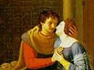

  
[Intangible Textual Heritage](../../index)  [Christianity](../index.md) 
[Index](index)  [Previous](aah10.md) 

------------------------------------------------------------------------

[Buy this Book at
Amazon.com](https://www.amazon.com/exec/obidos/ASIN/B0026L7H7K/internetsacredte.md)

------------------------------------------------------------------------

  
*The Love Letters of Abelard and Heloise*, \[1901\], at Intangible
Textual Heritage

------------------------------------------------------------------------

p. 111

# EDITORIAL APPENDIX

p. 112

*This edition of* 'The Letters of Abelard and Heloise' *has been edited
by* Miss Honnor Morten. *The translation bas been re-printed from*
Watt's *edition of* 1722.

*In the accompanying Notes* Miss Morten *has epitomised much valuable
research, elucidating the text of the Letters*.

I. G.

May 8*th*, 1901.

p. 113

# Notes

*Former Editions*.--There have been between fifty and sixty editions of
these 'Letters' published; all founded on the Latin edition printed in
Paris in 1616. This first edition is now very rare, but there is a
beautiful specimen in the British Museum only mutilated by one little
bookworm, which luckily has chosen the driest of Abelard's dissertations
on the monastic life through which to eat its wandering way. The title
page is as follows:--

PETRI ABAILARDI  
SANCTA GILDASSI  
IN BRITANNIA ABBATIS  
ET  
HELOISAE CONGUGIS EIUS  
QUOE POSTMODUM PRIMA CŒNOBII  
PARACLITENSIS ABBATISSA FUIT  
OPERA  
NUNC PRIMA EX MMS. CODD. ERUTA ET  
IN LUCEM EDITA STUDIO AC DILIGENTIA  
ANDREAE QUERCETANI, TURONENSIS.  
PARISIIS  
SUMPTIBUS NICOLAI BUON VIA JACOBAE  
SUB SIGNIS SANCTI CLAUDII ET HOMINIS  
SILUISTRIS.  
MDCXVI.

The best English edition was published in

p. 114

\[paragraph continues\] 1718--*Petri
Abaelardi et Heloissae Epistolae*, and shortly after the Rev. Jos.
Beringer of Birmingham published a translation of the letters together
with a life of the lovers. But for many years it has been impossible to
secure an English or Latin version of the letters. In 1782, in Paris,
appeared *Lettres* *D’Abelard et D’Heloise. Nouvelle Traduction, avec le
texte a coté. Par J. Fr. Bastien*. In 1836 Cousin issued his *Ouvrages*
*indits D’Abelard*, and thereafter in France editions were common. The
best one, which is still procurable, is *Lettres* *D'Heloise et D'
Abelard. Traduction Nouvelle par le Bibliophile Jacob. Paris.
Charpentier*. 1865. It is complete, down to the least interesting of the
Abelard fragments, but is in the paper covers of the Charpentier
library.

Of course the authenticity of the letters has been questioned, but no
human being can read them and not know them to be genuine.

LETTER I

[1](aah03.htm#page_1.md). Philintus.--In the original Latin the name of
'Philintus' does not appear--the friend is addressed only as
'delectissime frater.' This gives at once the tone of this
translation--the desire to give a lively and readable reproduction of
the letters rather than an exact one. The reader will probably not
regard this as a fault if he turn to some of the clumsy and graceless
renderings of the letters that have appeared.

p. 115

Also the frequent and lengthy quotations from Scripture and the fathers
are here omitted:--in one of her letters Heloise quotes no less than
ninety-eight separate passages; and one of Abelard's letters is entirely
taken up with a history of the origin of monastic institutions. The
author of this translation has ignored all but the love passages of the
letters; he has written for the littérateur, and left the dreary
disquisitions for the historian.

[2](aah03.htm#page_2.md). *Palais*.--They still show at Palais or Palet,
eight miles from Nantes, some ruins supposed to be those of the house
where Abelard was born. His family was of noble origin.

[3](aah03.htm#page_3.md). *Paris University*.--'About the latter part of
the eleventh century a greater ardour for intellectual pursuits began to
show itself in Europe, which in the twelfth broke out into a flame. This
was manifested in the numbers who repaired to the public academies, or
schools of philosophy. None of these grew so early into reputation as
that of Paris. In the year 1100 we find William of Champeaux teaching
logic, and apparently some higher parts of philosophy, with much credit.
But this preceptor was eclipsed by his disciple, afterwards his rival
and adversary, Peter Abelard, to whose brilliant and hardy genius the
University of Paris appears to be indebted for its rapid advancement.

p. 116

\[paragraph continues\] Abelard was almost
the first who awakened mankind in the ages of darkness to a sympathy
with intellectual excellence. His bold theories, his imprudent vanities,
that scorned the regularly acquired reputation of older men, allured a
multitude of disciples. It is said that twenty cardinals and fifty
bishops had been among his hearers.'--*Europe during the Middle Ages*
(HALLAM) .

[5](aah03.htm#page_5.md). *Beranger turns Monk*.--The glimpses of the
cloister given throughout these letters are instructive and quaint; as a
place of retirement for elderly couples and widows they were in frequent
use. The remnants of a useless life seem to have been a favourite
offering. Compare Kingsley's *Ugly Princess*--

'I am not good enough for man,  
And so am given to God.'

[5](aah03.htm#page_5.md). *Lucan's Oak*.--'Stat magni nomimis
umbra.'--*Pharsale*.

[6](aah03.htm#page_6.md). '*An aversion for light women*.'--In the
original, 'Scortorum immunditiam semper abhorrebam.' And Villenave says
'Jusqu’à l’époque de ses liaisons avec Héloïse il avait eu horreur des
vices du libertinage et que de profondes études l’avaient tenu
constamment éloigné du commerce des femmes.' This is worth noting, as
Boyle and others, without any grounds, have asserted that Abelard had
always lived a loose life. Abelard does

p. 117

not spare himself in his confessions, and there is no reason why he
should have made the above statement if untrue. The very force of his
love for Heloise points to its being the one great passion of a
scholar's life. Jacob, in his translation, makes Abelard give as a
reason for Fulbert's trust in making him tutor to Heloise 'la réputation
si bien établié de ma continence.'

[7](aah03.htm#page_7.md). *Her Wit and her Beauty*.--Abelard insists rather
on the learning than the beauty of Heloise--'Per faciem non infima; per
abundantiam litterarum erat suprema.' When the bones of the illustrious
lovers were moved from the Paraclete they were inspected by Delaunage,
who published a life of Abelard in 1795. In this book he says he found
that Heloise must have been of noble stature and beautiful proportions.
Of her learning we have the testimony not only of Abelard but of the
Abbé de Cluny and St. Bernard. The first wrote to her--'You have
vanquished in knowledge all the women and surpassed in wisdom most of
the men.' In the calendar of Paraclete she is recorded in these
words--'Heloise, Mother and first Abbess of this place, famous for her
learning and her religion.' And Boyle says' I must not here pass by the
custom the religious of the Paraclete now have to commemorate how
learned their first Abbess was in the

p. 118

Greek, which is, that every year on the day of Pentecost they perform
divine service in the Greek tongue. What a ridiculous vanity! 'M.
Villenave, after studying the constitution of the Paraclete, says--Le
xiie siècle n’a eu aucun théologien plus profond, aucun
écrivain plus érudit et plus éloquent qu’Héloïse.'

[8](aah03.htm#page_8.md). '*Fulbert* *desired me to instruct her in
philosophy*.'--Fulbert gave Abelard complete control as tutor over
Heloise, even to the point of personal chastisement--'minis et
verberibus'; and Abelard says that in order to avoid suspicion gentle
blows were often given--'verbera quondoque dabat amor, non furor;
gratia, non ira.'

[11](aah03.htm#page_11.md). '*Agaton*.'--Again imagination supplies the
name. Luckily it is the letters of Abelard that are most freely
paraphrased. The first letter of Heloise--the gem of all love
letters--is most exquisitely rendered, so that it can be said that the
translator may not have known how to read Latin, but she certainly knew
how to write English. The 'she' is implied by the inaccuracy in the
learning and the excellence of the love passages.

[13](aah03.htm#page_13.md). *Abelard's Son*.--It is strange that of the
child of Abelard and Heloise so little is known; there are only two
references to him. In one of her letters to the Abbé de Cluny, Heloise
begs him to remember 'Astralabe' and procure him a benefice,

p. 119

and in his reply Pierre de Cluny says--'I will willingly try and get a
benefice in some great church for your Astralabe (Astrabis vestro).'
Thereafter there is only the notice in the death list of the Paraclete
that on the 4th of November died Peter Astralabe, son of our master
Peter. (Obiit Petrus Astralabius, magistri nostri Petri filius.) The
year is not given, but it is subsequent to his father's death. Some
verses addressed to his son by Abelard are included amongst the
*Fragments* edited by M. Cousin.

[14](aah03.htm#page_14.md). *Heloise refuses Marriage*.--It seems that in
the eleventh and twelfth centuries marriage was common among priests.
Pope Leo, who died in 1054, in his Parmenien epistle says--'We profess
openly that it is not permitted to a bishop, priest or deacon to neglect
his wife for his religion, or to refuse to provide her with food and
clothing; but it is his duty to abstain from living carnally with her.'
Marriage, apparently, was allowed but not approved, and was a bar to
advancement in the Church.

[16](aah03.htm#page_16.md). *Fulbert's* *Revenge*.---' Corporis mei
partibus amputatis quibus ad quod plangebant, commiseram.' In M.
Gréard's translation Abelard says--'Ce qui contribuait encore à
m’atterrer, c’était la pensée que, selon la lettre meurtrière de la loi,
les eunuques sont en telle abomination devant Dieu, et que les animaux
eux-mêmes,

p. 120

lorsqu’ils sont ainsi mutilés, sont rejetés du sacrifice'--and he quotes
from Deuteronomy and Leviticus.

[16](aah03.htm#page_16.md). '*So cruel an action escaped not
unpunished*.'--As usual, the chief sinner and instigator, Fulbert,
escaped punishment, whilst those who for money carried out his evil
intent suffered the loss of their eyes and other mutilation. Abelard
meditated going to Rome to accuse Fulbert, but his friend, Foulques,
Prior of Deuil, wrote and told him that to appeal to the Pope without
taking an immense sum of money was useless. 'Nothing can satisfy the
infinite avarice and luxury of the Romans. I question if you have enough
for the undertaking, and then nothing will be gained but vexation for
having wasted your wealth. They who go to Rome without large sums of
money to squander will return just as they went, the expense of their
journey only excepted.' This letter of Foulques is included in Abelard's
'Opera.'

[17](aah03.htm#page_17.md). 'O Conjux.'--Lucan's *Pharsal*, liv. viii.

[18](aah03.htm#page_18.md). 'A Council.'--The Council of Soissons, 1121.
Abelard had opened a school at the Priory of Maisoncielle in 1120, and
delivered some theological lectures on the 'tangled trinities,' which
drew, as usual, large crowds of students--'Ad quas Scholas tanta
Scholarium multitudo confluxit, ut nec locus Hospitiis, nec terra

p. 121

sufficerit Alimentis.' Unfortunately he put in writing his doctrines in
the *Introductio* *ad Theologiam*, and his enemies, Alberic of Rheims,
and Lotulf of Lombardy, prevailed upon Conan, the Pope's Legate, to
summon a Council, and to cause Abelard to appear before it with the
'great work I had composed upon the Trinity.' Abelard says the book was
condemned without being examined, on the ground that he had no right to
have read it or presented it to others without the permission of the
Pope or the Church:--'Called by the Council, I presented myself on the
field, and then, without discussion, without examination, I was forced
with my own hand to throw my book in the fire. It was burnt in the midst
of silence, my enemies only feebly murmuring that it contained a
proposition that God the Father was the only omnipotent. A certain Dr
Terriere replied ironically, in the words of St. Ambrose, "There are not
three Almighties, but one Almighty." Then the Archbishop arose and
confirmed the sentence, saying, "The Father is Almighty, the Son
Almighty, and the Holy Ghost Almighty." They then called on me to
confess and retract my heresy by repeating the symbol of Athanasius, and
in order to humiliate me fetched a book for me to read it from, as
though I did not know it by heart! Half

p. 122

stifled by sobs and tears I said the words, and then the Abbé of St.
Médard dragged me off to his cloister as to a prison. God, who knows the
bitterness of all hearts, alone felt for the pain that devoured me, as
without cease I cried again and again, "Jesus, my Saviour, where art
Thou?" The mutilation of my body I had deserved, but this tarnishing of
my name and reputation was a cruel injustice, and struck me to the
soul.' Abelard had only been a few months in his new retreat when he
again fell into 'heresy,' saying that Denis the Areopagite was Bishop of
Corinth and not of Athens. This time, instead of facing the storm, he
fled by night to a 'desert' near Nogent-sur-Seine (1131).

[18](aah03.htm#page_18.md). 'My enemies,' St. Norbert and St. Bernard, now
joined Alberic and Lotulf in attacking this teacher who could attract
such enormous crowds of students to the most out-of-the-way spots. The
students had built Abelard a chapel, and he, having found comfort in
that solitary place, dedicated the chapel to the Holy Ghost, under the
name of the Paraclete or Comforter. His enemies said this title was a
subtle recrudescence of the Trinity scandal, and that it was heresy to
dedicate a chapel to the Paraclete. So once more Abelard had to flee;
for some time, he says, he even hesitated whether he should not forsake
'Christian' lands and go across the

p. 123

seas and dwell with the heathen; but being offered the Abbey of St
Gildas-de-Ruys, he accepted it, only to find himself in worse plight
than before.

[18](aah03.htm#page_18.md). *St. Gildas*.--A promontory on the coast of
Brittany, between Loire Inférieure and La Vendée.

[19](aah03.htm#page_19.md). '*My dissolute Monks*.'--'Les moins
m’obsédaient pour leurs besoins journaliers, car la communauté ne
possédait rien que je pusse distribuer, et chacun prenait sur son propre
patrimoine pour se soutenir lui et sa femme, et ses fils et ses
filles.'--*Gréard's* *Translatio*n.

LETTER II

Lord Lyttelton, in his *Life of Henry II*., says that had Heloise not
been compelled to study the fathers in a nunnery, but had been allowed
to improve her genius by application to polite literature, from what
appears in her letters, she would have excelled any man of that age. It
may be worth while to give a few sentences of Heloise's Latin:--'Duo
autem, fateor, tibi specialiter inerant, quibus feminarum quarumlibet
animos statim allicere poteras, dictandi videlicit et cantandi gratia;
quae caetoros minimè philosophos assecutos esse novimus. Quibus quidem
quasi ludo quodam laborem exercitii recreans philosophici pleraque
amatorio metro vel rithmo composita reliquisti carmina, quae prae nimiâ

p. 124

suavitate tam dictaminis quam cantûs saepius frequentata tuum in ore
omnium nomen incessanter tenebant, ut etiam illiteratos melodiae dulcedo
tui non sineret immemores esse. Atque hinc maxime in amorem tui feminae
suspirabant.'--See page [32](aah04.htm#page_32.md).

[32](aah04.htm#page_32.md). *The Smallest Song*.--Of the love songs of
Abelard no authentic vestige remains, though they lived as folk-songs
for many years, and are referred to as late as 1722. In the *Chants
Populaires de la Bretagne*, published in Paris in 1846, there is a
ballad crediting Heloise with being a sorceress: doubtless her learning
led her to practise the healing art amongst the ignorant Bretons.

[40](aah04.htm#page_40.md). '*Your Rigorous Rule*.'--The rules of the
Paraclete, drawn up by Abelard and modified and adopted by Heloise, are
exceedingly lengthy, but of great interest to those who study the
history of religious houses. The dress was a chemise, a lamb's skin, a
robe, sandals, veil, and a rope girdle, and for the winter a mantle was
allowed, which could also be used as an extra bed covering. The nuns
slept in their habit, but Heloise insists to Abelard that they must be
allowed two sets of clothing, in order that the garments may be washed
and vermin kept at bay! No meat was eaten--the chief food was
vegetables,--but on feast days milk, eggs and fish were occasionally
allowed. Wine

p. 125

was permitted only for those who were ill, and was apparently made at
the Paraclete and doctored with herbs. A Sister who went outside the
cloister was to be punished by one day on bread and water in every week
for a year. A Sister guilty of breaking her vow of chastity is to be
severely beaten and not again allowed to wear the veil, but made to act
as a servant. All the offices were said regularly, night and day. The
Paraclete existed as a cloister, and kept its rule under twenty-six
abbesses after Heloise, the last being Charlotte de La Rochefoucauld.
After her death the Paraclete was sold (1792) and turned into a factory.

LETTER III

Abelard to Heloise.--This letter is slightly abbreviated, some of
Abelard's confessions evidently not being deemed suitable for print.

[56](aah05.htm#page_56.md). '*Our former irregularities require tears,
shame and sorrow to expiate them*.'--'Cependant, pour adoucir l’amertume
de ta douleur, je voudrais encore demontrer que ce qui nous est arrivé
est aussi juste qu’utile, et qu’en nous punissant après notre union et
non pendant que nous vivions dans le désordre, Dieu a bien fait. Après
notre marriage,

p. 126

tu le sais, et pendant ta retraite à Argenteuil au convent des
religieuses, je vins secrètement te rendre visite, et tu te rappelles à
quels excès la passion me porta sur toi dans un coin même du réfectoire.
Tu sais, dis-je, que notre impudicité ne fut pas arrêtée par le respect
d’un lieu consacré a la Vierge. Fussions-nous innocents de tout autre
crime, celui là ne méritait-il pas le plus terrible des châtiments ?
Rappellerai-je maintenant nos anciennes souillures et les honteux
désordres qui ont précédé notre marriage, l’indigne trahison enfin dont
je me suis rendu coupable envers ton oncle, moi son hôte et son
commensal, en te séduisant si impudemment ? La trahison n’était-elle pas
juste? Qui pourrait en juger autrement, de la part de celui que j’avais
le premier si outrageusement trahi? Penses-tu qu’une blessure, une
souffrance d’un moment ait suffi à la punition de si grands crimes? Que
dis-je? De tels péchés méritaient-ils une telle grâce? Quelle blessure
pouvait expier aux yeux de la justice divine la profonation d’un lieu
consacré à sa sainte mère? Certes je me trompe bien, ou une blessure si
salutaire compte moins pour l’expiation de ces fautes, que les épreuves
sans relâche auxquelles je suis soumis aujourd’hui. Tu sais aussi qu’au
moment de ta grossesse, quand je t’ai fait passer dans mon pays, tu as
revêtu l’habit sacré, pris le rôle de religieuse, et que, par cet
irreverencieux

p. 127

déguisement, tu tes jouée de la profession a laquelle tu appartiens
aujourd’hui ? Vois, après cela, si la justice, si la grâce divine a eu
raison de te pousser malgré toi dans l’état monastique; elle a voulu que
l’habit que tu avais profané servit à expier la profanation.

Tu sais à quelles turpitudes les emportements de ma passion avaient veué
nos corps; ni le respect de la décence, ni le respect de Dieu, même dans
les jours de la passion de Notre-Seigneur et des plus grandes
solemnités, ne pouvaient m’arracher du bourbier où je voulais. Toi-même
tu ne voulais pas, tu résistais de toutes les forces, tu me faisais des
remontrances, et quand la faibleose de ton sexe eût dû te protéger, que
de fois n’ai-je pas usé de menaces et de rigueurs pour forcer ton
consentement! Je brûlais pour toi d’une telle ardeur de désirs, que,
pour ces voluptés infâmes dont le nom seul me fait rougir, j’oublais
tout, Dieu, moi-même: la clémence divine pouvait-elle me sauver
autrement qu’en m’interdisant à jamais ces voluptés? Compare la maladie
et le remède. Compare le danger et la délivrance.'--*Gréard's*
*Translation*.

LETTER IV

The passion of Heloise is only increased by the letter from Abelard; she
has succeeded in

p. 128

making him write to her, and now craves his presence or further news of
him.

[62](aah06.htm#page_62.md). 'How void of reason.'--Seneca. Marhob, 34

[65](aah06.htm#page_65.md). 'Hearken, my son.'--Prov. vii. 24. Eccles. vii.
26.

[68](aah06.htm#page_68.md). 'How many persons.'--St. Gregory. Lib. de
Pænit. c. 10.

[70](aah06.htm#page_70.md). 'I preside over others but cannot rule
myself.'--Compare Nietzsche's 'Many a one cannot loose his own chains,
and yet is a saviour unto his friend.'

[72](aah06.htm#page_72.md). 'I seek not to conquer,' etc.--This is a
quotation from St. Jerome's *Adverns* *Vigilantum* and runs in the
original--'Fateor imbecellitatem: nolo spe victoriae pugnare, ne perdam
aliquando victoriam.'

LETTER V

Heloise to Abelard.--Not having received the desired letter, Heloise
feigns to have conquered her love and writes to demand spiritual help,
and rules for the Paraclete. She would do anything to bring herself into
closer touch with Abelard. He meanwhile is becoming less the lover and
more the priest.

[83](aah07.htm#page_83.md). '*I give myself up at night*.'--It is
impossible not to recall Mrs Meynell's beautiful sonnet, 'Renouncement,'
though the likeness is accidental:--

p. 129

'I must not think of thee ; and, tired, yet strong,  
  I shun the thought that lurks in all delight--  
  The thought of thee--and in the blue heaven's height,  
And in the sweetest passage of a song.

Oh, just beyond the fairest thoughts that throng  
  This breast, the thought of thee waits, hidden, yet bright;  
  But it must never, never, come in sight;  
I must stop short of thee the whole day long,

But when sleep comes to close each difficult day,  
  When night gives pause to the long watch I keep,  
And all my bonds I needs must loose apart,  
Must doff my will as raiment laid away,--  
  With the first dream that comes with the first sleep  
I run, I run, I am gathered to thy heart.'  
            From 'Poems.' (Mathews and Lane.)

LETTER VI

Abelard ceases the correspondence so far as personal thoughts or desires
go; he sends Heloise a prayer not given in the 5722 translation, of
which the following is an abbreviated rendering:--

'Grant us pardon, Great God, for you are merciful; pardon our sins
though they are many; O let the immensity of your mercy equal the
multitude of our faults! Punish the wicked in this world and not in the
next, punish us now but not in eternity. Take against your servants the
rod of correction and not the weapon of vengeance; strike the body but
preserve the soul; be our merciful father rather than our severe master.

'You, Lord, joined us and then separated us at

p. 130

your pleasure; we pray Lord that having separated us in this world, you
will unite us again in eternity.'

Two further letters passed between Heloise and Abelard, but both dealing
entirely with the affairs of the Paraclete and containing no personal
matter whatever. Then, so far as we know, the correspondence ceased.

CONCLUSION

The troubles of Abelard did not end with the conquering of his love for
Heloise. Once more his foe, Bernard of Clairvaux, arraigned him for
heresy, and he was summoned before the Council of Sens. Abelard
determined this time on the bold stroke of appealing to Rome, but he was
an old man now, and broken by persecution and continual trouble; on his
way to Rome he was taken ill, and took refuge at the Abbey of Cluni,
which was presided over by the Venerable Peter, the friend and admirer
of Heloise. Here he lingered for some months, getting steadily worse; he
was removed to the Priory of St. Marcel for better treatment, but died
there on the 21st of April 1142. The Abbot of Cluni sent his remains to
Heloise at the Paraclete.

Bernard's letters condemning Abelard's *Theologia*, *Sententiae*,
*Scito* *teipsum*, and *Epistola* *ad Romanos* are given in brief in
Dupin's *History of Ecclesiastical Writers*. He also inserts the
collection of propositions condemned by the Council of Soissons. An
account of Abelard's heresies is also given in

p. 131

\[paragraph continues\] Ranken's *History
of France*. The writer of the article 'Abelard' in the *Encyclopædia
Britannica* says:--'The general importance of Abelard lies in his having
fixed more decisively than any one before him the scholastic method of
philosophising, with its object of giving a formally rational expression
to the received ecclesiastical doctrine. Through him was prepared in the
Middle Age the ascendency of the philosophical authority of Aristotle
which became firmly established in the half century after his death.'

'It is related that the prelates assembled at the Council of Sens, which
condemned Abelard, went to sleep, one and all, over their cups after
dinner, during the reading of the offensive volume. Upon the occurrence
of an objectionable passage the reader interrogated the somnolent
judges, "Damnatis?" to which a drowsy voice answered, "Damnamus"; and
the remainder, aroused by the noise, responded in half articulate but
appropriate chorus, "Namus," i.e., "we swim" (in debauchery). Thus the
man who night and day exercised himself in the Lord was condemned by the
satellites of Bacchus.'--*Rise and Progress of Christianity* (MACKAY).

'Simple in his food as in his vestments, he condemned by his discourse
and his example not only all superfluities, but all that was not
absolutely necessary to retain life. He read continually; he prayed
often; he kept perpetual silence. Never saw I so great a man so
completely abase himself. It was thus that the great Pierre finished his
days.'--PIERRE-LE-VENERABLE (Abbé de Cluny). Liv. iv. ep. 21.

p. 132

Heloise lived twenty years after Abelard, ruling her convent well, till
it became the most famous religious house in France. She was in constant
communication with the Pope, with St. Bernard, with the Abbot of Cluni,
and all the great ecclesiastics of the day, who all held her in high
repute.

'It appears by a letter of Peter de Cluny to Eloisa that she had
solicited for Abelard's absolution. The Abbot gave it to her. It runs
thus:--"Ego Petrus Cluniacensis Abbas, qui Petrum Abaelardum in monachum
Cluniacensem recepi, et corpus ejus furtim delatum Heloissae abbatessae
et moniali Parecleti concessi, auctoritate omnipotentis Dei et omnum
sanctorem absolvo eum pro officio ob omnibus peccatis
suis."'--*Curiosities of Literature* (DISRAELI).

The Abbot of Cluni also wrote an extravagant Latin epitaph comparing
Abelard to Socrates, Plato and Aristotle, and interesting only as
showing in what high esteem the lost learning of Abelard was held.

'An ancient chronicle of Tours records that when they deposited the body
of the Abbess Eloisa in the tomb of her lover, Peter Abelard, who had
been there interred twenty years, this faithful husband raised his arms,
stretched them, and closely embraced his beloved Eloisa. Du Chesne, the
father of French history, not only relates this legendary tale of the
ancient chroniclers, but gives it as an incident well
authenticated.'--*Curiosities of Literature* (DISRAELI).

H. M.

 

 

 
