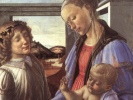

  
[Intangible Textual Heritage](../../index)  [Christianity](../index.md) 
[Index](index)  [Previous](agjc137)  [Next](agjc139.md) 

------------------------------------------------------------------------

[Buy this Book on
Kindle](https://www.amazon.com/exec/obidos/ASIN/B002RHONOS/internetsacredte.md)

------------------------------------------------------------------------

  
*The Aquarian Gospel of Jesus Christ*, by Levi H. Dowling, \[1920\], at
Intangible Textual Heritage

------------------------------------------------------------------------

#### Chapter 135

Jesus teaches in the temple. He reveals some of the deeper meanings of
the Christine ministry. The rulers are greatly enraged and attempt to
stone him, but he disappears.  
  
**1.** The feast was done and Jesus, Peter, James and John were sitting
in the temple treasury.  
**2.** The nine had gone back to Capernaum.  
**3.** The people thronged the temple courts and Jesus said,  
**4.** I am the lamp; Christ is the oil of life; the Holy Breath the
fire. Behold the light! and he who follows me shall not walk in the
dark, but he shall have the light of life.  
**5.** A lawyer said, You witness for yourself, your witness is not
true.  
**6.** and Jesus said, If I do witness for myself I speak that which is
true, for I know whence I came and where I go.  
**7.** And no one else in flesh can testify for me, for none know whence
I came, nor where I go.  
**8.** My works bear witness to the truth I speak. As man I could not
speak the words of Holy Breath; and then my Father testifies for me.  
**9.** The lawyer said, Where does your father live?  
**10.** And Jesus said, You know me not or you would know my Father, and
if you knew the Father you would know the son, because the Father and
the son are one.  
**11.** I go my way and you shall find me not; for where I go you cannot
come, because you do not know the way.  
**12.** You cannot find the way because your hearts are gross, your ears
are dull, your eyes are closed.  
**13.** The light of life cannot shine through the murky veil that you
have drawn about your hearts.  
**14.** You do not know the Christ and if the Christ be not within the
heart there is no light.  
**15.** I come to manifest the Christ to men and you receive me not, and
you will dwell in darkness and in the shadow of the grave till you
believe the words I speak.  
**16.** But you will vilify the son of man, and lift him up and laugh to
see him die.  
**17.** But then a little light will come and you will know that I am
what I am.  
**18.** The people did not comprehend the meaning of the words he
spoke.  
**19.** And then he spoke unto the people who believed in him and said,
If you abide in Christ, and Christ abide in you, and if you keep my
words within your heart,  
**20.** You are the way, you are disciples in the way, and you shall
know what is the truth, and truth shall make you free.  
**21.** And still the people did not understand; they said, We are the
seed of Abraham and are already free; we never were the slaves of any
man; why do you say, We shall be free?  
**22.** And Jesus said, Do you not know that every one committing sin is
slave of sin? abides in bondage unto sin?  
**23.** If you sin not then you are free; but if you sin in thought, or
word, or deed, then you are slaves, and naught but truth can set you
free; if you are free through Christ, then you are free indeed.  
**24.** You are the seed of Abraham, and yet you seek to kill me just
because I speak the truth of Abraham.  
**25.** You are the children of the flesh of Abraham; but, lo, I say,
There is a spiritual Abraham whom you know not.  
**26.** In spirit you are children of your father, and your father is
Diabolus; you hang upon his words and do his will.  
**27.** He was a murderer from the first; he cannot tell the truth, and
when he tells a lie he speaks his own; he is himself a lie, and he is
father of himself.  
**28.** If you were children of my Father-God, then you could hear the
words of God; I speak the words of God, but you can bear them not.  
**29.** A Pharisee stood forth and said, This fellow is not one of us he
is a curst Samaritan and is obsessed.  
**30.** But Jesus heeded not the words of Pharisee or scribe; he knew
that all the people knew he was a Jew.  
**31.** And then he said, Whoever keeps my words shall never die.  
**32.** A lawyer said, And now we know he is obsessed. Our father
Abraham is dead; the prophets all are dead, and yet this fellow says,
Whoever keeps my words shall never die.  
**33.** Is this man greater than our Father Abraham? Is he above the
prophets? and all of them are dead.  
**34.** And Jesus said, Your father Abraham rejoiced to see my day; he
saw it and was glad.  
**35.** The lawyer said, You simple man; you are not fifty years of age;
have you seen Abraham?  
**36.** And Jesus said, Before the days of Abraham I am.  
**37.** Again the scribes and Pharisees were in a rage; they took up
stones to cast at him, but, like a phantom of the night, he disappeared;
the people knew not where he went.

------------------------------------------------------------------------

[Next: Chapter 136](agjc139.md)

