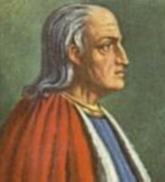

  
[Intangible Textual Heritage](../../index)  [Christianity](../index.md) 

------------------------------------------------------------------------

[Buy this Book at
Amazon.com](https://www.amazon.com/exec/obidos/ASIN/0875481094/internetsacredte.md)

------------------------------------------------------------------------

<table width="75%">
<colgroup>
<col style="width: 50%" />
<col style="width: 50%" />
</colgroup>
<tbody>
<tr class="odd">
<td width="50%" data-valign="TOP"></td>
<td width="50%" data-valign="CENTER"><h1 id="works-of-st.-anselm" data-align="CENTER">Works of St. Anselm</h1>
<h2 id="tr.-by-sidney-norton-deane" data-align="CENTER">tr. by Sidney Norton Deane</h2>
<h4 id="section" data-align="CENTER">[1903]</h4></td>
</tr>
</tbody>
</table>

------------------------------------------------------------------------

[Contents](#contents)    [Start Reading](ans000.md)

------------------------------------------------------------------------

|                                                                                                                           |
|---------------------------------------------------------------------------------------------------------------------------|
|  |

St. Anselm of Canterbury (b. 1033 d. 1099) was a medieval Italian
cleric, philosopher and theologian. He originated the ontological
argument for the existence of God in his treatise [Proslogium](ans006.md)
(or Proslogion). Anselm held the post of the Archbishop of Canterbury
from 1093 to 1109.

------------------------------------------------------------------------

 [Title Page](ans000.md)  
[Introduction](ans001.md)  
[Anselm's Philosophy (After Weber.)](ans002.md)  
[Criticisms of Anselm's Ontological Argument for the Being of
God](ans003.md)  
[Bibliography](ans004.md)  
[Table of Contents](ans005.md)  

### Proslogium

[Preface](ans006.md)  
[Chapter I.](ans007.md)  
[Chapter II.](ans008.md)  
[Chapter III.](ans009.md)  
[Chapter IV](ans010.md)  
[Chapter V](ans011.md)  
[Chapter VI](ans012.md)  
[Chapter VII.](ans013.md)  
[Chapter VIII](ans014.md)  
[Chapter IX](ans015.md)  
[Chapter X](ans016.md)  
[Chapter XI.](ans017.md)  
[Chapter XII](ans018.md)  
[Chapter XIII](ans019.md)  
[Chapter XIV.](ans020.md)  
[Chapter XV](ans021.md)  
[Chapter XVI](ans022.md)  
[Chapter XVII](ans023.md)  
[Chapter XVIII](ans024.md)  
[Chapter XIX](ans025.md)  
[Chapter XX.](ans026.md)  
[Chapter XXI.](ans027.md)  
[Chapter XXII](ans028.md)  
[Chapter XXIII](ans029.md)  
[Chapter XXIV](ans030.md)  
[Chapter XXV.](ans031.md)  
[Chapter XXVI.](ans032.md)  

### Monologium

[Preface](ans033.md)  
[Chapter I.](ans034.md)  
[Chapter II.](ans035.md)  
[Chapter III.](ans036.md)  
[Chapter IV.](ans037.md)  
[Chapter V.](ans038.md)  
[Chapter VI.](ans039.md)  
[Chapter VII.](ans040.md)  
[Chapter VIII.](ans041.md)  
[Chapter IX.](ans042.md)  
[Chapter X.](ans043.md)  
[Chapter XI.](ans044.md)  
[Chapter XII.](ans045.md)  
[Chapter XIII.](ans046.md)  
[Chapter XIV.](ans047.md)  
[Chapter XV.](ans048.md)  
[Chapter XVI.](ans049.md)  
[Chapter XVII.](ans050.md)  
[Chapter XVIII.](ans051.md)  
[Chapter XIX.](ans052.md)  
[Chapter XX.](ans053.md)  
[Chapter XXI.](ans054.md)  
[Chapter XXII.](ans055.md)  
[Chapter XXIII.](ans056.md)  
[Chapter XXIV.](ans057.md)  
[Chapter XXV.](ans058.md)  
[Chapter XXVI.](ans059.md)  
[Chapter XXVII.](ans060.md)  
[Chapter XXVIII.](ans061.md)  
[Chapter XXIX.](ans062.md)  
[Chapter XXX.](ans063.md)  
[Chapter XXXI](ans064.md)  
[Chapter XXXII](ans065.md)  
[Chapter XXXIII](ans066.md)  
[Chapter XXXIV](ans067.md)  
[Chapter XXXV](ans068.md)  
[Chapter XXXVI](ans069.md)  
[Chapter XXXVII](ans070.md)  
[Chapter XXXVIII](ans071.md)  
[Chapter XXXIX](ans072.md)  
[Chapter XL](ans073.md)  
[Chapter XLI](ans074.md)  
[Chapter XLII](ans075.md)  
[Chapter XLIII](ans076.md)  
[Chapter XLIV](ans077.md)  
[Chapter XLV](ans078.md)  
[Chapter XLVI](ans079.md)  
[Chapter XLVII](ans080.md)  
[Chapter XLVIII](ans081.md)  
[Chapter XLIX](ans082.md)  
[Chapter L](ans083.md)  
[Chapter LI](ans084.md)  
[Chapter LII](ans085.md)  
[Chapter LIII](ans086.md)  
[Chapter LIV](ans087.md)  
[Chapter LV](ans088.md)  
[Chapter LVI](ans089.md)  
[Chapter LVII](ans090.md)  
[Chapter LVIII](ans091.md)  
[Chapter LIX](ans092.md)  
[Chapter LX](ans093.md)  
[Chapter LXI](ans094.md)  
[Chapter LXII](ans095.md)  
[Chapter LXIII](ans096.md)  
[Chapter LXIV](ans097.md)  
[Chapter LXV](ans098.md)  
[Chapter LXVI](ans099.md)  
[Chapter LXVII](ans100.md)  
[Chapter LXVIII](ans101.md)  
[Chapter LXIX](ans102.md)  
[Chapter LXX](ans103.md)  
[Chapter LXXI](ans104.md)  
[Chapter LXXII](ans105.md)  
[Chapter LXXIII](ans106.md)  
[Chapter LXXIV](ans107.md)  
[Chapter LXXV](ans108.md)  
[Chapter LXXVI](ans109.md)  
[Chapter LXXVII](ans110.md)  
[Chapter LXXVIII](ans111.md)  
[Chapter LXXIX](ans112.md)  

### Appendix

[In Behalf of the Fool](ans113.md)  
[Anselm's Apologetic](ans114.md)  

### Cur Deus Homo

[Table of Contents](ans115.md)  
[Preface](ans116.md)  
[Book First](ans117.md)  
[Book Second](ans118.md)  

### Indexes

[Index of Scripture References](ans119.md)  
[Index of Citations](ans120.md)  
[Index of Names](ans121.md)  
[Latin Words and Phrases](ans122.md)  
[Index of Pages of the Print Edition](ans123.md)  
