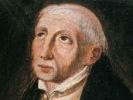

  
[Intangible Textual Heritage](../../index)  [Christianity](../index) 
[Index](index)  [Previous](asm010)  [Next](asm012) 

------------------------------------------------------------------------

[Buy this Book at
Amazon.com](https://www.amazon.com/exec/obidos/ASIN/B002BDV8D2/internetsacredte)

------------------------------------------------------------------------

  
*The Adornment of the Spiritual Marriage*, by Jan van Ruysbroeck,
\[1916\], at Intangible Textual Heritage

------------------------------------------------------------------------

## CHAPTER VIII

 

### OF THE THIRD COMING OF CHRIST

 

The third coming, which is yet to be, will take place at the Judgment,
or in the hour of death. The wherefore of this coming is the fitting
time, the due cause, and the righteousness of the Judge.

The time which is fitting for this coming is the hour of death, and the
Last Judgment of all men. When God created the soul out of nothing and
united it with the body, He set a fixed day and a fixed hour known only
of Him, when it should have to give up temporal things and to appear in
His presence.

The due cause: for the soul must then account for every word spoken and
for every deed done, before the Eternal Truth.

The righteousness of the Judge, for it is to Christ that this Judgment
and this Verdict belong; for He is the Son of Man and the Wisdom of the
Father, and to this Wisdom all judgment is given, since all hearts, in
heaven, and on earth, and in hell, are clear and open to It. And
therefore these three points are the occasions of the general coming in
the Day of Doom, and of the particular coming to each man in the hour of
his death.

------------------------------------------------------------------------

[Next: Chapter IX. Showing What Christ Will Do in the Day of
Doom](asm012)
