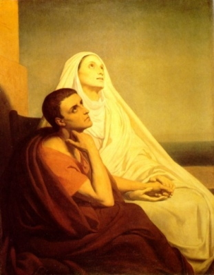

  
[Intangible Textual Heritage](../../index)  [Christianity](../index.md) 

------------------------------------------------------------------------

[Buy this Book on
Kindle](https://www.amazon.com/exec/obidos/ASIN/B002IVU4S2/internetsacredte.md)

------------------------------------------------------------------------

<table width="75%">
<colgroup>
<col style="width: 50%" />
<col style="width: 50%" />
</colgroup>
<tbody>
<tr class="odd">
<td width="50%" data-valign="TOP"> 
St. Augustine and Monica, Ary Scheffer [1846] (Public Domain Image)</td>
<td width="50%" data-valign="CENTER"><h1 id="the-confessions-of-saint-augustine" data-align="CENTER">The Confessions of Saint Augustine</h1>
<h2 id="tr.-by-edward-bouverie-pusey" data-align="CENTER">tr. by Edward Bouverie Pusey</h2>
<h4 id="section" data-align="CENTER">[1909-14]</h4></td>
</tr>
</tbody>
</table>

------------------------------------------------------------------------

[Contents](#contents)    [Start Reading](aug01.md)    [Text
\[Zipped\]](ac.txt.gz.md)

------------------------------------------------------------------------

|                                                                                                                           |
|---------------------------------------------------------------------------------------------------------------------------|
|  |

Written between 397 and 398 CE, the Confessions of St. Augustine
describes the author's spiritual journey to Christianity. It is the
first Western autobiography, and has influenced Christian writers
throughout the Middle Ages. Augustine tells of his youthful sexual
improprieties, and tells why he rejected Manichaenism and Astrology,
leading to his conversion to Christianity at age 32. The book also
includes some important theological discussions, particularly the later
chapters.

------------------------------------------------------------------------

 [Book I](aug01.md)  
[Book II](aug02.md)  
[Book III](aug03.md)  
[Book IV](aug04.md)  
[Book V](aug05.md)  
[Book VI](aug06.md)  
[Book VII](aug07.md)  
[Book VIII](aug08.md)  
[Book IX](aug09.md)  
[Book X](aug10.md)  
[Book XI](aug11.md)  
[Book XII](aug12.md)  
[Book XIII](aug13.md)  
