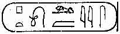
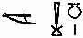

[Sacred-Texts](../../index) [Christianity](../index) [Index](index) [Previous](bct10) [Next](bct12)

------------------------------------------------------------------------

p. 249

 

# SUPPLEMENTARY TRANSLATIONS FROM THE "BOOK OF THE BEE."

 

> THE ASSUMPTION OF THE VIRGIN. OUR LORD'S APPEARANCES AFTER THE
> RESURRECTION. THE LAST SUPPER. THE NAMES OF THE APOSTLES AND
> DISCIPLES. CHRONOLOGY. GOG AND MAGOG. ANTI-CHRIST. THE GREEK
> TRANSLATION OF THE HEBREW BIBLE.

   The extracts quoted in the preceding pages show how largely Solomon,
Bishop of Al-Ba<u>s</u>rah, borrowed from the "Cave of Treasures" when
compiling his work, "The Book of the Bee," especially when he was
dealing with the history of the early Patriarchs. But he did not bring
his book to a close with the narrative of the Crucifixion, for his aim
was to describe briefly the progress of Christianity after the death of
Christ; and in doing this he collected and set down in writing a
considerable amount of information regarding the Apostles and disciples,
and their lives and deaths, and a number of facts and legends which he
accepted and wished the p. 250 Nestorians in
his diocese especially to believe. In fact, the "Book of the Bee,"
though written by a Nestorian bishop, may be regarded as a supplement or
continuation of the "Cave of Treasures," which, according to ancient
tradition, was written by a Jacobite bishop. Both works are included in
the collection of texts which the learned priest Hômô copied in the
British Museum MS. Add. 25875, and both were so highly esteemed that
copies of them were made for the library of the church of the Virgin
Mary in \`Amedîa. The following summary is based on my translation of
the Syriac text published at Oxford in 1886.

 

\[THE DEATH AND ASSUMPTION OF THE VIRGIN MARY.\]

   Mary lived twelve years after our Lord's Ascension; the sum of the
years which she lived in the world was fifty-eight years, but others say
sixty-one years. She was not buried on earth, but the angels carried her
to Paradise, and angels bore her bier. On the other hand, we read in the
*History of the Virgin*, "And the blessed Mary departed this life in the
year of Alexander, 394 (*i.e.* A.D. 82-83).
At the Annunciation she was thirty years old, and she lived also the
thirty-three years of the Dispensation; and after the Crucifixion she
lived fifty-eight p. 251 years. The years
which she lived were one hundred and twenty-one." In the same book we
have: "And Mary remained in Jerusalem, and grieved because of her
separation from our Lord Jesus Christ, and the absence of the apostles
from her. And she prayed and cast frankincense into the fire, and lifted
up her eyes and spread out her hands to heaven, and said, 'O Christ, the
Son of the living God, hearken unto the voice of Thy handmaiden, and
send unto me Thy friend John the Young with his fellow-apostles, that I
may see them and be comforted by the sight of them before the day of my
death; and I will praise and adore Thy goodness.'" And straightway it
was revealed by the Holy Spirit to each one of the apostles, in whatever
country he was in, that the blessed Mary was about to depart from this
world into the never-ending life. And the Spirit summoned them, along
with those of them who were dead, to be gathered together at daybreak to
the blessed Mary for her to see them: and each one of them came to her
from his own land at dawn by the agency of the Holy Spirit, and they
saluted Mary and each other, and adored her. Thomas was in India, and an
angel took him up and brought him. And he found the angels carrying her
bier through the air; and they brought it nigh to Thomas, and he also
prayed and was blessed by her.

p. 252

 

\[OUR LORD'S APPEARANCES AFTER HIS RESURRECTION.\]

   He appeared ten times: 1. To Mary Magdalene ([John xx.
11](../../bib/kjv/joh.htm#20:11), 18). 2. To the women at the grave
([Matt. xxviii. 9](../../bib/kjv/mat.htm#28:9), 10). 3. To Cleophas
([Luke xxiv. 18](../../bib/kjv/luk.htm#24:18)). 4. To Simon Peter ([Luke
xxiv. 34](../../bib/kjv/luk.htm#24:34)). 5. To all the disciples except
Thomas ([Luke xxiv. 36](../../bib/kjv/luk.htm#24:36)-49; [John xx.
19](../../bib/kjv/joh.htm#20:19)-23). 6. To the disciples, Thomas being
with them ([John xx. 24](../../bib/kjv/joh.htm#20:24)-29). 7. On the
Mount ([Matt. xxviii. 16](../../bib/kjv/mat.htm#28:16)-20). 8. On the
Sea of Tiberias ([John xxi. 1](../../bib/kjv/joh.htm#21:1)-24). 9. At
His Ascension ([Mark xvi. 19](../../bib/kjv/mar.htm#16:19); [Luke xxiv.
50](../../bib/kjv/luk.htm#24:50)-53). 10. To the Five Hundred at once
([I Cor. xv. 6](../../bib/kjv/co1.htm#15:6)). After His Ascension he
appeared to Paul ([Acts ix. 3](../../bib/kjv/act.htm#9:3)-9; [I Cor. xv.
3](../../bib/kjv/co1.htm#15:3)), and to Stephen ([Acts vii.
55](../../bib/kjv/act.htm#7:55)-60).

 

\[THE LAST SUPPER.\]

   Some men have a tradition that when our Lord broke His body in the
Upper Chamber, John, the son of Zebedee, hid a part of his portion until
our Lord rose from the dead. When Thomas put his finger near to our
Lord's side, and it rested on the mark of the spear, the disciples saw
the blood. And John took that piece of consecrated bread, and wiped up
that blood with it; and the Easterns Mâr Addai and Mâr Mârî took that
piece, and sanctified this p. 253 unleavened
bread which has been handed down among us. Others say that when John
took that piece of consecrated bread in his hand, it burst into flame,
and burnt in the palm of his hand, and the palm of his hand sweated, and
he took that sweat and hid it for the sign of the Cross of baptism.

 

\[THE APOSTLES.\]

   The Apostles were Twelve and Seventy; their names are:--

   SIMON, the chief of the Apostles, was from
Bethsaida, of the tribe of Naphtali. He preached for one year in
Antioch, where the disciples were \[first\] called Christians, and he
built there the first church, in the house of Cassianus, whose son he
restored to life. He lived in Rome twenty-seven years. He was crucified,
head downwards, by Nero, in the 376th year of the Greeks (65-64 B.C.).

   ANDREW, his brother, preached in Scythia,
Nicomedia, and Achaia. He died in Byzantium and was buried in the church
which he built there.

   JOHN, the son of Zabhdai (Zebedee), was
from Bethsaida, of the tribe of Zebulon. He preached in Ephesus, was
exiled to Patmos, and then returned to Ephesus, where he built a church.
Three of his disciples went with him:--IGNATIUS, p. 254 later
bishop of Antioch, who was thrown to the beasts in Rome; POLYCARP, later bishop of Smyrna who was burnt to
death; and JOHN, who succeeded him as bishop.
John, the son of Zebedee, was buried by John, his disciple, at Ephesus,
and his grave is unknown. John, his disciple, was also buried at
Ephesus. He wrote the Revelation, and said that all he had written in
that book he had received from John the Evangelist.

   JAMES, the brother of John, preached in
Bethsaida and built a church there. Herod Agrippa slew him with the
sword in the year following the Ascension of our Lord. He was buried at
Â<u>k</u>âr, a city of Marmârî<u>k</u>â.

   PHILIP, from Bethsaida, was of the tribe
of Asher. He preached in Phrygia, Pamphylia and Pisidia; he died in
Pisidia, and was buried in the church which he built there. He lived as
an apostle 27 years.

   THOMAS, from Jerusalem, was of the tribe
of Judah. He taught the Parthians, Medes and Indians; he baptized the
daughter of the Indian king, who had him speared to death. <u>H</u>abbân
the merchant brought his body to Edessa and buried it there. Some say he
was buried in Ma<u>h</u>lûph in India.

   MATTHEW, from Nazareth, was of the tribe
of Issachar. He preached in Palestine, Tyre and p.
255 Sidon, and went as far as Gabbûlâ (*i.e.* al-Jabbâl, a town
in Coelesyria). He died, and was buried in Antioch.

   BARTHOLOMEW, from Endor, was of the tribe
of Issachar. He preached in Armenia, Ardeshîr, <u>K</u>e<u>t</u>arbôl,
Radbîn and Prûharmân. He first went to Golthon in Armenia, came back to
Artaschu, and then went on to Her, Zarevant and Urbianos. He lived as an
apostle for 30 years, and then Hûrs<u>t</u>î (Rhûs<u>t</u>nî or
Hêrôs<u>t</u>mî), king of Armenia, crucified him in Urbianos. He was
buried in the church which he had built in Armenia. The king of Armenia
in the time of Bartholomew was called Sanadrog (Sanatruk).

   JUDE, the son of James, surnamed THADDAEUS (TADDAI), who
is also LEBBAEUS (Lebbai), from Jerusalem,
was of the tribe of Judah. He preached in Laodicea, and in Antaradus and
Arwâd (Ruwâd). He was stoned in Arwâd, and died and was buried there.

   SIMON ZELÔTES,
from Galilee, was of the tribe of Ephraim. He preached in Shêmêshât
(Samosata), Pârîn (Perrhê), Zeugma, <u>H</u>âlâb (Aleppo), Mabbôg
(Manbig), and Kenneshrîn (<u>K</u>innesrîn). He built a church in
Kyrrhos, and died and was buried there.

   JAMES, the son of Alphaeus
(<u>H</u>alphai), was from the Jordan, and of the tribe of Manasseh. He
preached in Tadmor (Palmyra), Kirkêsion p.
256 (<u>K</u>îr<u>k</u>îsîyâ), and Callinicos (ar-Ra<u>kk</u>ah),
and came to Bâ<u>t</u>nân of Serûg (Sarug), where he built a church, and
died and was buried there.

   JUDAS ISCARIOT,
the Betrayer, from Sekharyût, was of the tribe of Gad or Dan. MATTHIAS, of the tribe of Reuben, came in his stead.
He preached in Hellas and in Sicily, where he built a church, and died,
and was buried in it.

   JAMES, the brother of our Lord, was cast
down from a pinnacle of the Temple whilst preaching in Jerusalem; then a
fuller of cloth smashed in his skull with a club, and afterwards they
stoned him.

   JOHN THE BAPTIST was of the tribe of Levi. Herod the tetrarch
slew him, and his body was buried in Sebastia.

   ANANIAS (<u>H</u>ANANYÂ), John's disciple, taught in Damascus and
Arbîl. Pôl, the general of Aretas (Aristus) slew him, and he was buried
in his church at Arbil.

   PAUL, of Tarsus, was a Pharisee and of the
tribe of Ephraim (or, Benjamin ?). He went to Peter at Rome, and Nero
ordered them to be slain. On their way to the place of slaughter they
gave the laying on of hands of the priesthood to their disciples, Peter
to Mark, and Paul to Luke. Peter was crucified and Paul was beheaded,
and Mark and Luke brought their p. 257 bodies
into the city. But Paul's head could not be found. At length a shepherd
found it, and he laid it by his sheep-fold. At night a fire blazed over
it, and the shepherd went and told bishop Xystus and the clergy, and
when they saw the head they recognized it as Paul's head. They laid the
head at the feet of Paul's body, and, having prayed the whole night, the
head was found to have joined itself to the body. From his call to the
end of his life was 35 years; he travelled for 31 years, and he was in
prison at Caesarea for two years, and for two years in Rome. He was
martyred in the thirty-sixth year after the Passion of our Lord, and was
buried in the royal catacombs in Rome.

   LUKE, the physician and Evangelist, was a
disciple of Lazarus, and was baptized by Philip in the city of Beroea.
He was beheaded by <u>H</u>ôros, the governor of Alexandria under
Tiberius, whilst preaching there; he was buried in that city.

   MARK the Evangelist preached in Rome, and
died and was buried there. He was either the son of Simon Peter's wife
or the son of Simon; and Rhoda was his sister. He was first called John,
but the Apostles changed his name to Mark.

   ADDAI, from Paneas, preached in Edessa and
Mesopotamia in the days of Abhgar the king; he p.
258 built a church in Edessa. Herod, son of Abhgar, slew him in
the fortress of Aggêl, or Engîl, north of Amid. He was buried either in
Edessa or Rome.

   AGGAI, the disciple of Addai, was a silk
weaver; because he refused to give up his preaching, Herod, son of
Abhgar, broke his legs with a club and he killed him.

   THADDAEUS was slain by Herod, son of
Abhgar, and was buried in Edessa.

   ZACCHAEUS (Zaccai), the publican, was
slain whilst preaching in Mount <u>H</u>ôrôn.

   SIMON, the leper, taught in Ramah, and the
Jews slew him there.

   JOSEPH, the Senator, taught in Galilee and
Decapolis, and was buried in Ramah.

   NICODEMUS, the Pharisee, the friend of our
Lord, died in Jerusalem, and was buried there. Some say that he was
buried by his brother Gamaliel in Kephar Gamlâ.

   NATHANIEL was stoned whilst preaching in
Mount <u>H</u>ôrôn (or, Mount Hebron), and died.

   SIMON, the Cyrenian, was slain in the
island of Chios.

   SIMON, son of Cleopas, was bishop of
Jerusalem. At the age of one hundred years he was crucified by Irenaeus
(or, <u>H</u>ereôs?), the chiliarch.

   STEPHEN was stoned to death in Jerusalem,
and was buried in Kephar Gamlâ.

p. 260

   MARK (sumamed John) taught at Nyssa and
Nazianzus; he built a church at the latter place, and died and was
buried there.

   GEPHAS ([Gal. ii.
9](../../bib/kjv/gal.htm#2:9); [I Cor. i.
12](../../bib/kjv/co1.htm#1:12)) taught in Baalbec, <u>H</u>im<u>s</u>
(Emesa), and Nathrôn (Batharûn); he died and was buried in Shîrâz
(Shaizar ?).

   BARNABAS, a native of Cyprus or a member
of a family of Cyprians settled in Antioch, undertook two preaching
missions in that Island, and then went and preached in Northern Italy
and Kûrâ for some time. Later he returned to Cyprus, where, according to
one tradition, he suffered martyrdom. The various accounts of his life
and preaching are described by Lipsius in his *Apostelgeschichte* (Bd.
ii. Heft 2, pp. 276-320).

   TITUS taught in Crete, and died and was
buried there.

   SOSTHENES taught in Pontus and Asia, and
was cast into the sea by Nonnus, the prefect.

   CRISCUS (CRESCENS) taught in Dalmatia; he died of hunger in
Alexandria.

   JUSTUS taught in Tiberias and Caesarea,
where he died and was buried.

   ANDRONICUS taught in Illyricum, where he
died and was buried.

   RUFUS was slain whilst teaching in Zeugma.

   PATROBAS taught in Chalcedon, and died
there.

p. 260

   HERMAS, the shepherd, taught in Antioch
and died there.

   NARCISSUS taught in Hellas, and died
there.

   ASYNCRITUS went to Bêth-Hûzâyê (Ahwâz,
Khûzistân), and died there.

   ARISTOBULUS taught in Isauria, and died
there.

   ONESIMUS, the slave of Philemon, fled to
Paul in Rome, where his legs were broken, and he died.

   APOLLOS was burned to death by Sparacleus
(?), governor of Gangra.

   OLYMPAS, STACHYS and STEPHEN died
in prison in Tarsus.

   JUNIAS was slain in Samos.

   THEOCRITUS died in Ilios.

   MARTALUS (I) was slain by the Barbarians.

   NIGER taught in Antioch, and died there.

   LUCIUS was dragged behind a horse and
died.

   ALEXANDER was thrown into a pit in
Heracleôpolis (Hierapolis ?) and died.

   MILUS was drowned at Rhodes.

   SILVANUS and HERÔDIÔN (Rhôdiôn) were slain at Accô.

   SILAS taught at Sarapolis (Hierapolis ?),
and died there.

   TIMOTHY taught in Ephesus, and died there.

   MANAEL was burned to death in Accô.

   The EUNUCH of Candace was strangled on the
island of Parparchia.

p. 261

   JASON and SOSIPATRUS were thrown to the beasts in Olmius.

   DEMAS taught in Thessalonica, and died
there.

   OMIUS (HYMENAEUS) taught in Melitene, and died there.

   THRASEUS was thrown into a fiery furnace
at Laodicea.

   BISTORIUS (ARISTARCHUS) taught in the island of Kâ, and died
there.

   ABRIOS and MÔ<u>T</u>OS died in Ethiopia.

   LEVI was slain in Paneas by Charmus.

   NICETIANUS (NICETAS) was sawn in twain in Tiberias.

   JOHN and THEODORUS were thrown to the beasts at Baalbec.

   EUCHESTION (?) and SIMON were slain by Methalius in Byzantium.

   EPHRAIM (APHREM) taught in Baishân, and died there.

   JUSTUS was slain at Corinth.

   JAMES taught in Nicomedia, and died there.

 

\[THE NAMES OF THE APOSTLES.\]

The TWELVE ([Matt.
x.](../../bib/kjv/mat.htm#10:1) [Mark iii.](../../bib/kjv/mar.htm#3:1)
[Luke vi.](../../bib/kjv/luk.htm#6:1) [Acts
i.](../../bib/kjv/act.htm#1:1)).

   1.

Simon Peter.

   2.

Andrew, his brother.

   3.

James, the son of Zebedee.

   4.

John, his brother.

p. 262

   5.

Philip.

   6.

Bartholomew.

   7.

Thomas.

   8.

Matthew.

   9.

James, the son of Alphaeus.

   10.

Labbaeus (Thaddaeus).

   11.

Simon the Canaanite.

   12.

Judas Iscariot (in whose stead came Matthias).

The SEVENTY.

   1.

James, the son of Joseph.

   2.

Simon, the son of Cleopas.

   3.

Cleopas, his father.

   4-8.

Joses; Simon; Judah; Barnabas; Manaeus (?).

   9.

Ananias, who baptized Paul.

   10.

Cephas, who preached at Antioch.

   11.

Joseph, the senator.

   12.

Nicodemus, the Archon.

   13.

Nathaniel, the chief scribe.

   14.

Justus (*i.e.* Joseph, called Barshabbâ).

   15-17.

Silas; Judah; John (Mark).

   18.

Mnason, who received Paul.

   19.

Manael, foster-brother of Herod.

   20.

Simon, called Niger.

   21.

Jason (*see* [Acts xvii. 5](../../bib/kjv/act.htm#17:5)-9).

   22.

Rufus (*see* [Rom. xvi. 13](../../bib/kjv/rom.htm#16:13)).

   23.

Alexander.

   24.

Simon, the Cyrenian, their father.

p. 263

   25.

Lucius, the Cyrenian.

   26.

Judah (mentioned in the Acts).

   27.

Judah, who is called Simon.

   28.

Eurion (Orion), the splay-footed.

   29-32.

Thorus; Thorisus; Zabdon; Zakron.

The following were chosen with Stephen:--

   33.

Philip, whose three (*sic*) daughters prophesied (*see* [Acts xxi.
9](../../bib/kjv/act.htm#21:9)).

   34-36.

Stephen; Prochorus; Nicanor.

   37-39.

Timon; Parmenas; Nicolaus ([Acts vi. 5](../../bib/kjv/act.htm#6:5)).

   40.

Andronicus, the Greek ([Rom. xvi. 7](../../bib/kjv/rom.htm#16:7)).

   41, 42.

Titus; Timothy.

The following were with Peter in Rome:--

   43, 44.

Hermas; Pligh<u>t</u>â.

   45-47.

Patrobas; Asyncritus; Hermas.

The following came with Peter to Cornelius:--

   48, 49.

Criscus ([II Tim. iv. 10](../../bib/kjv/ti2.htm#4:10)); Milichus.

   50, 51.

Kîrîtôn (Crito); Simon.

   52.

Gaius, who received Paul.

   53, 54.

Abrazon (?); Apollos.

The following were rejected from among the Seventy, for they were
followers of Cerinthus, and denied our Lord's divinity:--

   55-57.

Simon; Levi; Bar-<u>K</u>ubbâ.

   58-60.

Cleon; Hymenaeus; Candarus.

   61-63.

Clithon (?); Demas; Narcissus.

   64-66.

Slîkîspus; Thaddaeus; Mârûthâ.

p. 264

<table data-align="center">
<colgroup>
<col style="width: 100%" />
</colgroup>
<tbody>
<tr class="odd">
<td>In their stead there came in:-- 
      Luke, the Physician. 
      Apollos, the elect. 
      Ampelius; Urbanus; Stachys. 
      Popillius (Publius); Aristobulus. 
      Stephen; Herodion, the son of Narcissus. 
      Olympas; Mark, the Evangelist. 
      Addai; Aggai; Mâr Mârî.</td>
</tr>
</tbody>
</table>

 

\[CHRONOLOGY\]

|                                                                                                 |                 |        |
|-------------------------------------------------------------------------------------------------|----------------:|:------:|
|    From Adam to the Flood was                                                                   |            2262 | years. |
|    From the Flood to Abraham was                                                                |            1015 |   "    |
|    From Abraham to the Exodus from Egypt was                                                    |             430 |   "    |
|    From the Exodus to Solomon and the building of the Temple was                                |             400 |   "    |
|    From Solomon to the First Captivity, which Nebuchadnezzar led away captive                   |             495 |   "    |
|    From the First Captivity to the prophesying of Daniel was                                    |             180 |   "    |
|    From the prophesying of Daniel to the Birth of our Lord was                                  |   <u>   483</u> |   "    |
|                                                                                                 | \[<u>5265</u>\] |   "    |
|    All these make 5345 years (*sic*).                                                           |                 |        |
| p. 265                                                               |                 |        |
|    From Alexander to our Lord was                                                               |             303 | years. |
|    From our Lord to Constantine was                                                             |             341 |   "    |
|    In the year 438 of Alexander, the Macedonian, the kingdom of the Persians had its beginning. |                 |        |

   \[For 438 read 538, as the Sasanian dynasty was founded by Ardashîr I
in A.D. 226.\]

   Know, O my brother readers, that from the beginning of the creation
of Adam to Alexander was 5180 years.

 

\[OF GOG AND MAGOG.\]

   When Alexander was king, and had subdued countries and cities, and
had arrived in the East, he saw in the confines of the East those men
who are of the children of Japhet. They were more wicked and unclean
than all \[other\] dwellers in the world; filthy people of hideous
appearance, who ate mice and the creeping things of the earth, and
snakes and scorpions. They never buried the bodies of their dead \[but
ate them\]. People ignorant of God, and unacquainted with the power of
reason, but who lived in this world without understanding like ravening
beasts. When Alexander saw their wickedness, he called God to his aid,
and he gathered together and brought them and their wives and children,
and made them go in, and p. 266 shut them up
within the confines of the North. This is the gate of the world on the
north, and there is no other entrance or exit from the confines of the
world from the east to the north. And Alexander prayed to God with
tears, and God heard his prayer and commanded those two lofty mountains
which are called "the children of the north," and they drew nigh to one
another until there remained between them about twelve cubits. Then he
built in front of them a strong building, and he made for it a door of
brass, and anointed it within and without with oil of Thesna<u>k</u>tîs
(*i.e.* an oil which cannot be burnt off with fire or scraped off with
an iron tool), so that if they should bring iron implements near it to
force it to open, they would be unable to move it; and if they wished to
melt it with fire, it would quench it; and it feared neither the
operations of devils nor of sorcerers, and was not to be overcome \[by
them\]. Now there were twenty-two kingdoms imprisoned within the
northern gate, and their names are these:--

   Gôg, Mâgôg.  
   Nâwâl, Eshk<u>e</u>nâz (Eshkîn).  
   Denâphâr (Dîfâr).  
   Pa<u>kt</u>âyê (the people of Paktuê in the Thracian Chersonesus).  
   Welôtâyê (Lûdâyê).  
   Humnâyê (the Huns), Parzâyê.  
p. 267  
   Da<u>k</u>lâyê, Thaubelâyê (Tuklâyê).  
   Darme<u>t</u>âyê, Kawkebâyê.  
   Dog-men (Cynocephali).  
   Emderâthâ, Garmîdô.  
   Cannibals, Ther<u>k</u>âyê (Thracians).  
   Âlânâyê (the Allani), Pisilôn.  
   Den<u>k</u>âyê (Dun<u>k</u>âyê).  
   Sal<u>t</u>râyê (Saltâyê).  

   At the end of the world and at the final consummation, when men are
eating and drinking and marrying wives; and women are given to husbands;
when they are planting vineyards and building buildings, and there is
neither wicked man nor adversary, on account of the assured tranquillity
and certain peace; suddenly the gates of the north shall be opened, and
the hosts of the nations that are imprisoned there shall go forth. The
whole earth shall tremble before them, and men shall flee and take
refuge in the mountains and in caves and in burial places, and in clefts
of the earth; and they shall die of hunger, and there will be none to
bury them, by reason of the multitude of afflictions which they will
make men suffer. They will eat dead dogs and cats; they will give
mothers the bodies of their children to cook, and they will eat them
before them without shame. They will destroy the earth, and there will
be none able to stand before them. After one week of p. 268 that sore affliction, they will all be
destroyed in the plain of Joppa, for thither will all those \[people\]
be gathered together, with their wives and their sons and their
daughters.

 

\[OF THE COMING OF ANTI-CHRIST.\]

   In a week and half a week after the destruction of these wretches
shall the son of destruction appear. He shall be conceived in Chorazin,
born in Bethsaida, and reared in Capernaum. Chorazin shall exult because
he was conceived in her, Bethsaida because he was born in her, and
Capernaum because he was brought up in her; for this reason our Lord
proclaimed Woe to these three \[cities\] in the Gospel ([Matt. xi.
21](../../bib/kjv/mat.htm#11:21)). As soon as the son of perdition is
revealed the king of the Greeks will go up and stand upon Golgotha,
where our Lord was crucified; and he will set the royal crown upon the
top of the holy Cross, upon which our Lord was crucified; and he will
stretch out his two hands to heaven, and will deliver over the kingdom
to God the Father. The holy Cross shall be taken up to heaven, and the
royal crown with it; and the king will die immediately. The king who
shall deliver over the kingdom to God will be descended from the seed of
Kûshath, the daughter of Pîl, the king of the Ethiopians; for Armelaus
(Romulus), the king of the Greeks, took Kûshath to p. 269 wife, and the seed of the Ethiopians was
mingled with that of the Greeks. From this seed shall a king arise who
shall deliver the kingdom over to God, as the blessed David hath said,
"Cush will deliver the power to God" ([Ps. lxviii.
31](../../bib/kjv/psa.htm#68:31)).

   When the Cross is raised up to heaven straightway shall every head
and every ruler and all powers be brought to nought, and God will
withdraw His providential care from the earth. The heavens will be
prevented from letting fall rain, and the earth from producing germs and
plants; and the earth shall remain like iron through drought, and the
heavens like brass. Then will the son of perdition appear, of the seed
and of the tribe of Dan; and he will show deluding phantasms, and lead
astray the world, for the simple will see the lepers cleansed, the blind
with their eyes opened, the paralytic walking, the devils cast out, the
sun when he looks upon it becoming black, the moon when he commands it
becoming changed, the trees putting forth fruit from their branches, and
the earth making roots to grow. He will show deluding phantasms \[of
this kind\], but he will not be able to raise the dead. He will go into
Jerusalem and will sit upon a throne in the Temple, saying, "I am the
Christ," and he will be borne aloft by legions of devils like a king and
a lawgiver, naming himself God, and p. 270
saying, "I am the fulfilment of the types and the parables." He will put
an end to prayers and offerings, as if at his appearance prayers are to
be abolished and men will not need sacrifices and offerings along with
him. He becomes a man incarnate by a married woman of the tribe of Dan.
When this son of destruction becomes a man, he will be made a dwelling
place for devils, and all Satanic workings will be perfected in him.
There will be gathered together with him all the devils and all the
hosts of the Indians; and before all the Indians and before all men will
the mad Jewish nation believe in him, saying, "This is the Christ, the
expectation of the world." The time of the error of the Anti-christ will
last two years and a half, but others say three years and six months.
And when everyone is standing in despair, then will Elijah (Elias) come
from Paradise, and convict the deceiver, and turn the heart of the
fathers to the children and the heart of the children to the fathers;
and he will encourage and strengthen the hearts of the believers.

 

\[THE HEBREW BIBLE TRANSLATED INTO GREEK.\]

   Ptolemy Philadelphus reigned 38 years. In the third (or, sixth) year
of his reign the fifth millennium from the creation of the world ended.
This king asked the Jews who were captives in Egypt, and seventy (or,
seventy-two) old men p. 271 translated the
Scriptures for him, from Hebrew into Greek, in the Island of Pharos. In
return for this he set them free, and gave back to them also the vessels
of their temple. Their names were:--

<table data-align="center" data-border="">
<colgroup>
<col style="width: 33%" />
<col style="width: 33%" />
<col style="width: 33%" />
</colgroup>
<tbody>
<tr class="odd" data-valign="center">
<td>1.</td>
<td>Josephus 
Hezekiah 
Zechariah 
John 
Ezekiel 
Elisha</td>
<td>Of the tribe of Reuben.</td>
</tr>
<tr class="even" data-valign="center">
<td>2.</td>
<td>Judah 
Simon 
Samuel 
Addai 
Mattathias 
Shalmi</td>
<td>Of the tribe of Simeon.</td>
</tr>
<tr class="odd" data-valign="center">
<td>3.</td>
<td>Nehemiah 
Joseph 
Theodosius 
Bâsâ 
Adonijah 
Dâ<u>k</u>î</td>
<td>Of the tribe of Levi.</td>
</tr>
<tr class="even" data-valign="center">
<td>4.</td>
<td>Jothan 
Abdî 
Elisha 
Ananias 
Zechariah 
Hilkiah</td>
<td>Of the tribe of Judah.</td>
</tr>
<tr class="odd" data-valign="center">
<td>5.</td>
<td>Isaac 
Jacob 
Jesus 
Sambâ<u>t</u> 
   (Sabbateus) 
Simon 
Levi</td>
<td>Of the tribe of Issachar.</td>
</tr>
<tr class="even" data-valign="center">
<td>6.</td>
<td>Judah 
Joseph 
Simon 
Zechariah 
Samuel 
Shamlî</td>
<td>Of the tribe of Zebulon.</td>
</tr>
<tr class="odd" data-valign="center">
<td>7.</td>
<td>Sambâ<u>t</u> 
Zedekiah 
Jacob 
Isaac 
Jesse 
Matthias</td>
<td>Of the tribe of Gad.</td>
</tr>
<tr class="even" data-valign="center">
<td>8.</td>
<td>Theodosius 
Jason 
Joshua 
John 
Theodotus 
Jothan</td>
<td>Of the tribe of Asher.</td>
</tr>
</tbody>
</table>

p. 272

<table data-align="center" data-border="">
<colgroup>
<col style="width: 33%" />
<col style="width: 33%" />
<col style="width: 33%" />
</colgroup>
<tbody>
<tr class="odd" data-valign="center">
<td>9.</td>
<td>Abraham 
Theophilus 
Arsam 
Jason 
Jeremiah 
Daniel</td>
<td>Of the tribe of Dan.</td>
</tr>
<tr class="even" data-valign="center">
<td>10.</td>
<td>Jeremiah 
Eliezer 
Zechariah 
Benaiah 
Elisha 
Dathî</td>
<td>Of the tribe of Naphtali.</td>
</tr>
<tr class="odd" data-valign="center">
<td>11.</td>
<td>Samuel 
Josephus 
Judah 
Jonathan 
Dositheus 
Caleb</td>
<td>Of the tribe of Joseph.</td>
</tr>
<tr class="even" data-valign="center">
<td>12.</td>
<td>Isalus 
John 
Theodosius 
Arsam 
Abijah 
Ezekiel</td>
<td>Of the tribe of Benjamin.</td>
</tr>
</tbody>
</table>

   \[Ptolemy II, surnamed Philadelphus, was the son of Ptolemy I, Soter,
by Beremce, and was born 308 B.C.; he reigned
as sole king from 283 to 247 B.C., when he
died. His name was transcribed by the Egyptian annalists thus:--

 PTU\[O\]LMIS

and his title Philadelphus by  *meri sen*
(*i.e.* "brother-loving"). He enlarged the great Alexandrian Library,
which was founded by his father, and in his day it is said to have
contained as many as 400,000 books, (*i.e.* rolls of papyrus). It was by
his orders that Manetho, a priest of Sebennytus in the Delta compiled
his History of Egypt.\]

------------------------------------------------------------------------

[Next](bct12)
