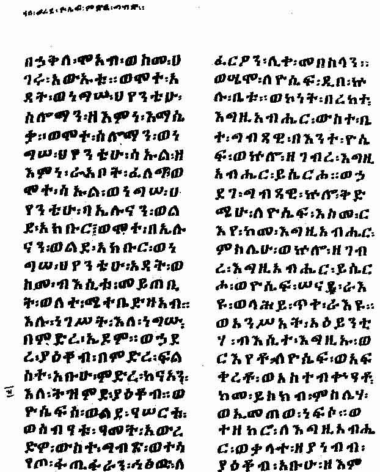

[Sacred-Texts](../../index) [Christianity](../index) [Index](index) [Return
to text](bct03.htm#p003)

------------------------------------------------------------------------

A page of the Ethiopic version of the apocryphal
work known to ecclesiastical writers as the "Lesser Genesis," and the
"Apocalypse of Moses" (British Museum MS. Orient. No. 485, Fol. 83*b*).
Because each of the periods of time described in the book contains
forty-nine to fifty years, the Ethiopians called it MAZ<u>H</u>AFA KÛFÂLÊ, i.e. the "Book of Jubilees."
The passage here reproducted describes the tale of Joseph in the 17th
year of his age, his going down to Egypt, and his life in that
country.

------------------------------------------------------------------------

[Return to text](bct03.htm#p003)
