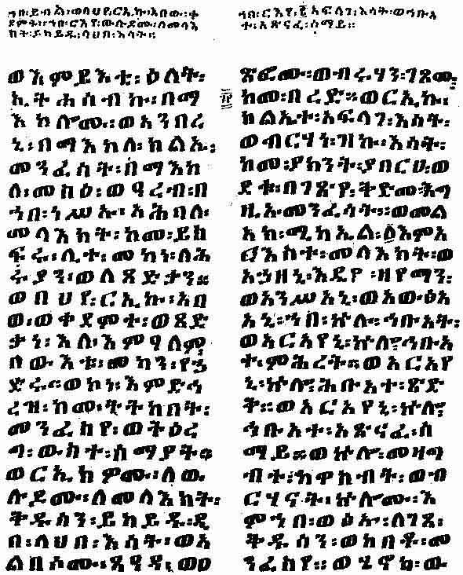

[Sacred-Texts](../../index) [Christianity](../index) [Index](index) [Return
to text](bct03.htm#p005)

------------------------------------------------------------------------

A page of the Ethiopic text of the "Book of Enoch"
(British Museum MS. Orient. No. 485, Fol. 83*b*) containing a
description of one of Enoch's visits to heaven, and how the archangel
Michael took him by the hand and showed him the mysteries of
heaven.

------------------------------------------------------------------------

[Return to text](bct03.htm#p005)
