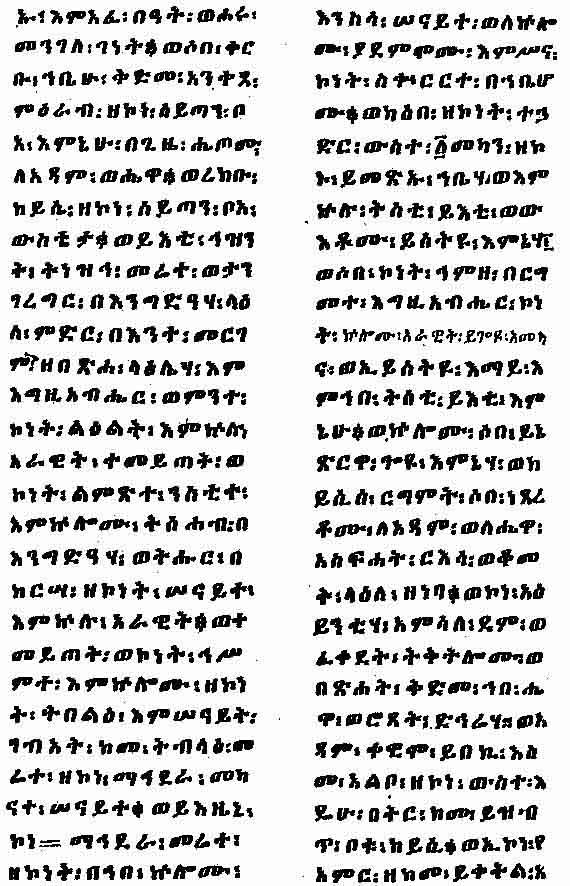

[Sacred-Texts](../../index) [Christianity](../index) [Index](index) [Return
to text](bct03.htm#p009)

------------------------------------------------------------------------

A page of the Ethiopic text of the "Book of Adam and
Eve" (British Museum MS. Orient. No. 751, Fol. 110*b*) containing a
description of the horrible appearance of the snake into which Satan
entered when he went into the presence of Eve.

------------------------------------------------------------------------

[Return to text](bct03.htm#p009)
