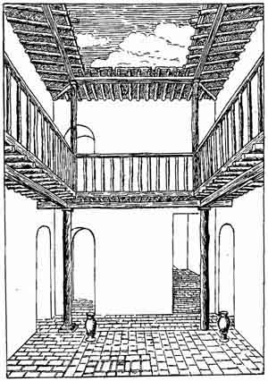

[Sacred-Texts](../../index) [Christianity](../index) [Index](index) [Return
to text](bct12.htm#p283)

------------------------------------------------------------------------

**Interior of a private house** of a citizen of "Ur
of the Chaldees" at the time of Abraham. The walls were built of clay
bricks, and the floor of the courtyard was paved with flat tile-like
bricks. The gallery and its roofs were supported on wooden pillars. The
beasts were stabled and stores were kept in the rooms on the ground
floor which were entered through arched doorways, and the sleeping and
sitting rooms were entered from the gallery. A stairway led from the
ground floor to the gallery and the roof. The water supply was kept in
large porous pots on the ground floor. About 2100 B.C.

------------------------------------------------------------------------

[Return to text](bct12.htm#p283)
