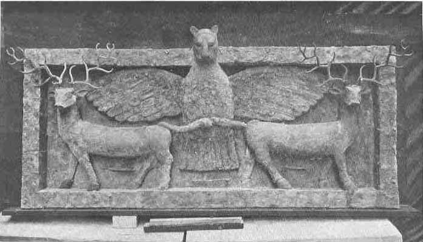

[Sacred-Texts](../../index) [Christianity](../index) [Index](index) [List
of Plates](bct01.htm#page_vii) [Title Page](bct00) [Next
Plate](bct_pl01)

------------------------------------------------------------------------

*Frontespiece*

Sumerian relief in copper on wood representing
**Imdugud**, or **Imgig**, the lion-headed eagle of Ningirsu, the great
god of Lagash, grasping two stags by their tails. It is probable that it
was originally placed over the door of the temple of Nin-khursag or
Damgalnun at the head of the stairway leading on to the temple platform.
This remarkable monument was made about 3100 B.C., and was discovered by Dr. H. R. Hall in 1919
at **Tall al-\`Ubêd**, a sanctuary at "Ur of the Chaldees" in Lower
Babylonia. It is now in the British Museum (No. 114308).

------------------------------------------------------------------------

[Next Plate](bct_pl01)
