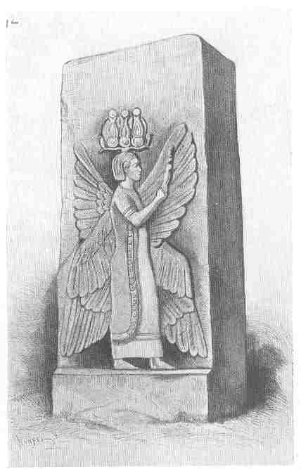

[Sacred-Texts](../../index) [Christianity](../index) [Index](index.md) [List
of Plates](bct01.htm#page_vii) [Previous Plate](bct_pl00.md) [Next
Plate](bct_pl02.md)

------------------------------------------------------------------------

PLATE I

{facing [page 48](bct04.htm#page_48.md)}

Limestone monolith at Pasargadae in Persia sculpured
in low relief with a portrait figure of the Fravashi or "genius" of
**Cyrus the Great**, the friend of the Jews. The figure of Cyrus is
rather larger than life-size, and is winged after the manner of gods and
kings on the Assyrian bas-reliefs; and the decoration of the hem of his
garment is Assyrian in character. His crown was copied from some
Egyptian bas-relief sculptured with the figure of a king, and represents
the horus Khnemu or Amen, the two cobras of the Upper and Lower Country,
and the triple symbol of royalty resting on solar disks and terminating
in disks. The inscription "I \[am\] Cyrus, the King, the Achaemenian"
has been broken off. (*See* [page 190](bct08.htm#pl01)..md)

\[From Perrot and Chipiez, *History of Art in
Ancient Egypt*, Vol V.\]

------------------------------------------------------------------------

[Next Plate](bct_pl02.md)
