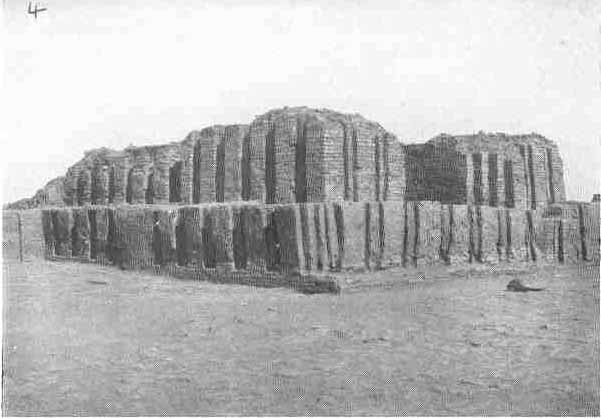

[Sacred-Texts](../../index) [Christianity](../index) [Index](index.md) [List
of Plates](bct01.htm#page_vii) [Previous Plate](bct_pl04.md) [Next
Plate](bct_pl06.md)

------------------------------------------------------------------------

PLATE V

{facing [page 112](bct06.htm#page_112.md)}

The ruins of the great Hall of justice (E-Dubal-maḫ)
at "Ur of the Chaldees," as seen from the south corner. (*See* [page
277](bct12.htm#pl05)..md)

------------------------------------------------------------------------

[Next Plate](bct_pl06.md)
