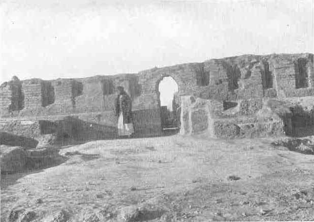

[Sacred-Texts](../../index) [Christianity](../index) [Index](index) [List
of Plates](bct01.htm#page_vii) [Previous Plate](bct_pl05) [Next
Plate](bct_pl07)

------------------------------------------------------------------------

PLATE VI

{facing [page 128](bct06.htm#page_128)}

The E-Dubal-maḫ, or Hall of Justice, at "Ur of the
Chaldees" as it was incorporated in the E-Gig-Par of Nabonidus; the
north-east side. (*See* [page 277](bct12.htm#pl06).)

------------------------------------------------------------------------

[Next Plate](bct_pl07)
