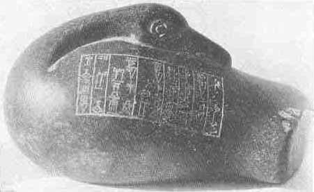
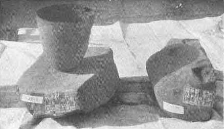

[Sacred-Texts](../../index) [Christianity](../index) [Index](index.md) [List
of Plates](bct01.htm#page_vii) [Previous Plate](bct_pl06.md) [Next
Plate](bct_pl08.md)

------------------------------------------------------------------------

PLATE VII

{facing [page 144](bct07.htm#page_144.md)}

|                              |                 |                              |
|------------------------------|:---------------:|------------------------------|
| 1 |  |                              |
| 2 |  | 3 |

|                               |                                                                                                                                                                                                   |
|-------------------------------|---------------------------------------------------------------------------------------------------------------------------------------------------------------------------------------------------|
| 1. | Stone duck weight of Shulgi, King of Ur, about 2200 B.C. (*See* [page 285](bct12.htm#pl07-1)..md)                                              |
| 2. | Bronze shoe of a door pivot and its stone socket inscribed with the name of Ur-Nammu, about 2600 B.C. (*See* [page 279](bct12.htm#pl07-2)..md) |
| 3. | Hard stone fragment with an inscription of Ur-Nammu. (*See* [page 279](bct12.htm#pl07-2)..md)                                                                             |

------------------------------------------------------------------------

[Next Plate](bct_pl08.md)
