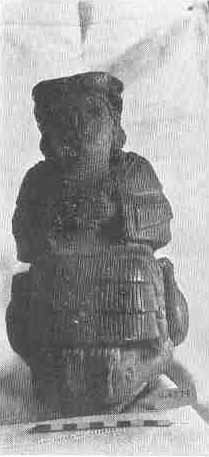
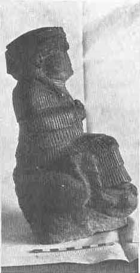

[Sacred-Texts](../../index) [Christianity](../index) [Index](index) [List
of Plates](bct01.htm#page_vii) [Previous Plate](bct_pl09) [Next
Plate](bct_pl11)

------------------------------------------------------------------------

PLATE X

{facing [page 192](bct09.htm#page_192)}

|                                        |                                       |
|----------------------------------------|---------------------------------------|
|                         |                        |
| Front view. | Side view. |

Diorite statue of Bau, the goddess of fertility. She
sits on a throne set upon water, and her supports and footstool are
geese. (*See* [page 280](bct12.htm#pl10).)

------------------------------------------------------------------------

[Next Plate](bct_pl11)
